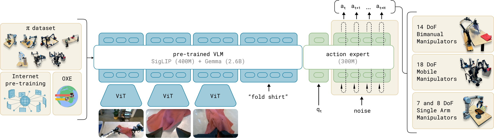
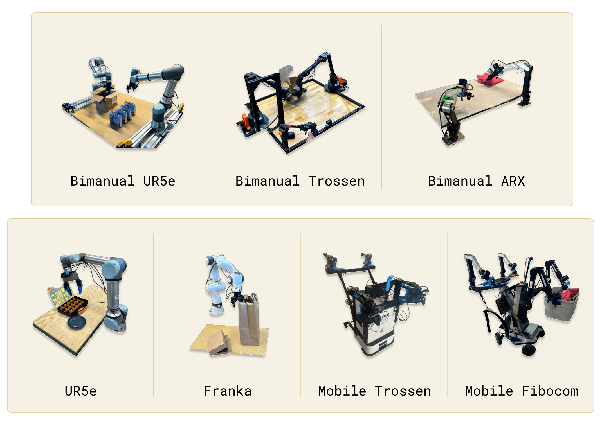
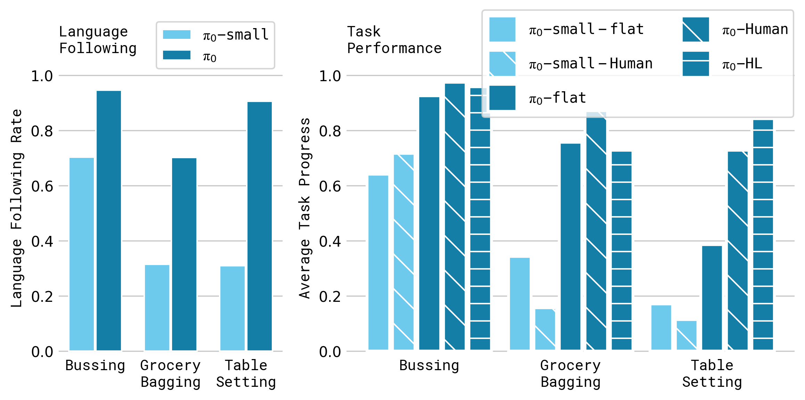
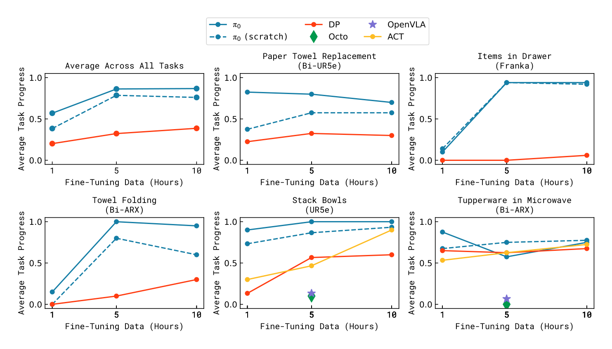
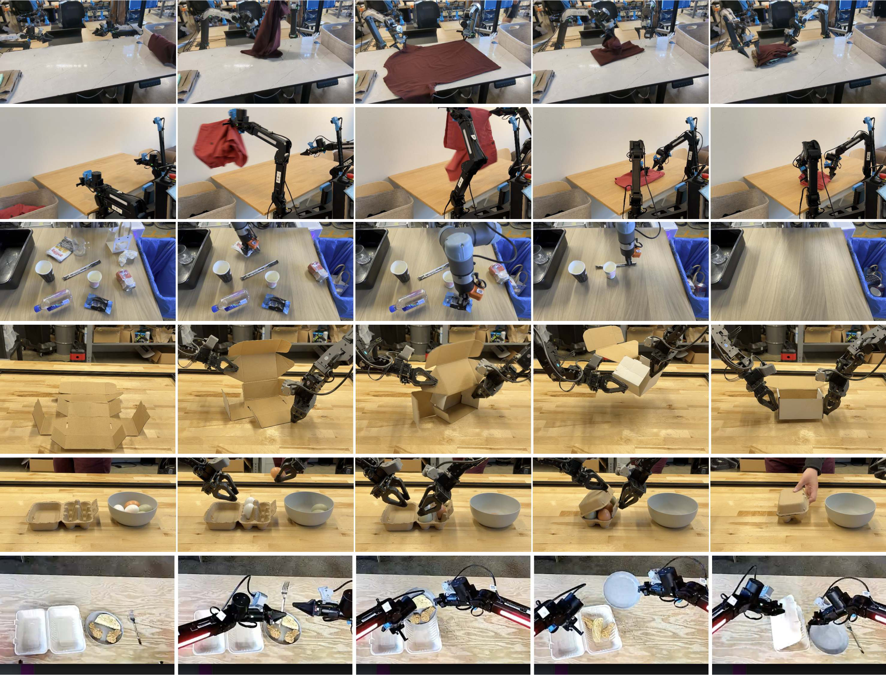

# P4. pi0: A Vision-Language-Action Flow Model for General Robot Control

## 0. 읽기 전 약어 및 핵심 용어

이 문서를 읽기 전에 아래 약어와 용어를 먼저 정리한다. 이후 본문에서는 괄호 안의 약어를 사용한다.

- Artificial Intelligence (AI): 사람의 지각, 추론, 학습, 의사결정 능력을 기계가 수행하도록 만드는 인공지능 분야를 뜻한다.
- Data Science and Business Analytics (DSBA): 데이터 과학, 비즈니스 분석, AI 기반 의사결정을 다루는 연구실/전공 맥락을 뜻한다.
- Large Language Model (LLM): 대규모 텍스트 데이터로 학습되어 언어 이해, 생성, 추론, 계획에 쓰이는 foundation model이다.
- Vision-Language Model (VLM): 이미지와 텍스트를 함께 입력받아 시각-언어 이해나 생성 작업을 수행하는 모델이다.
- Vision-Language-Action (VLA): 시각 관측과 언어 명령을 함께 받아 로봇 action까지 생성하는 모델 또는 학습 패러다임이다.
- Red-Green-Blue image (RGB): 색상을 red, green, blue 세 채널로 표현하는 일반 image format이다.
- Robotics Transformer (RT): robot observation을 입력받아 action을 예측하는 transformer 기반 robot policy 계열을 뜻한다.
- Robotics Transformer 2 (RT-2): web-scale vision-language knowledge와 robot trajectory를 함께 학습해 action token을 생성하는 VLA 모델이다.
- Robotics Transformer-X model family (RT-X): Open X-Embodiment 데이터 위에서 여러 robot embodiment로 확장한 RT 계열 policy family를 뜻한다.
- Open X-Embodiment (OXE): 여러 기관, 로봇, task의 demonstration을 묶은 대규모 cross-embodiment robot dataset이다.
- Distributed Robot Interaction Dataset (DROID): 여러 장소에서 수집한 in-the-wild robot manipulation demonstration dataset이다.
- A Low-cost Open-source Hardware System for Bimanual Teleoperation (ALOHA): 저비용 양팔 teleoperation hardware와 imitation learning setup을 뜻한다.
- Action Chunking with Transformers (ACT): 여러 timestep의 action chunk를 한 번에 예측해 fine-grained robot manipulation을 학습하는 transformer policy이다.
- Physical Intelligence pi-zero model (pi0): Physical Intelligence가 제안한 general robot control용 vision-language-action flow model이다.
- Physical Artificial Intelligence (Physical AI): 디지털 공간의 예측을 넘어 물리 세계에서 지각, 예측, 계획, 행동, 안전 검사를 수행하는 AI 시스템을 뜻한다.

## 1. Metadata

| Field | 내용 |
|---|---|
| ID | `P4` |
| Title | pi0: A Vision-Language-Action Flow Model for General Robot Control |
| Authors | Kevin Black, Noah Brown, Danny Driess, Adnan Esmail et al. |
| Affiliation / Team | Physical Intelligence |
| Venue / Status | RSS 2025 |
| Date | 2024-10-31 |
| Link | https://arxiv.org/abs/2410.24164 |
| Local source | `paper_corpus/sources/P4` |
| Source figures | `paper_corpus/figures_source/P4/manifest.md` |

## 2. 핵심 요약

pi0는 pretrained VLM backbone에 continuous action generation을 위한 flow matching action expert를 붙인 robot foundation model이다. 핵심 목표는 language/vision semantic knowledge를 VLM에서 가져오면서도, 실제 로봇 제어에 필요한 high-frequency continuous action chunk를 안정적으로 생성하는 것이다.

이 논문은 VLA를 단순히 "language model이 action token을 autoregressive하게 출력하는 모델"로 보지 않고, VLM semantic backbone과 diffusion/flow 계열 action generator를 결합한 형태로 재정의한다. 따라서 RT-2/OpenVLA 계열의 discrete action-token 접근과 Diffusion Policy 계열의 continuous action distribution modeling을 연결하는 중요한 논문이다.

## 3. 왜 중요한가?

- PaliGemma 기반 VLM에 300M parameter action expert를 추가하여 총 3.3B parameter VLA를 구성했다.
- action을 discrete token이 아니라 flow matching으로 생성해 dexterous, high-frequency, multimodal control에 대응했다.
- single-arm, dual-arm, mobile manipulator를 포함한 7개 robot configuration과 68개 task의 cross-embodiment 데이터를 사용했다.
- pre-training과 post-training을 분리해, LLM 학습 recipe와 유사한 robot foundation model 학습 흐름을 제안했다.
- OpenVLA, Octo, ACT, Diffusion Policy와 비교하면서 VLM pretraining, action chunking, flow matching의 결합이 왜 필요한지 실험적으로 보여준다.

## 4. 전체 아이디어

논문의 핵심 그림은 "semantic VLM backbone + robotics action expert + flow matching action chunk"라는 구조를 한 장으로 요약한다.

  

<em>Figure 1. pi0는 pretrained VLM backbone과 cross-embodiment dexterous manipulation dataset을 사용하고, 별도의 action expert가 flow matching으로 continuous action을 생성한다. 모델은 prompt만으로 바로 사용할 수도 있고, 복잡한 multi-stage task에 fine-tuning할 수도 있다. Source figure: <code>figures/teaser_fig.pdf</code>.</em>

발표에서는 이 그림을 기준으로 다음 대비를 잡으면 좋다.

| 관점 | 기존 autoregressive VLA | pi0 |
|---|---|---|
| action 표현 | discrete action token | continuous action chunk |
| 생성 방식 | next-token prediction | conditional flow matching |
| 강점 | VLM/LLM recipe와 자연스럽게 결합 | dexterous/high-frequency control에 유리 |
| 약점 | action chunk, continuous precision이 어려움 | flow inference cost와 data recipe가 중요 |

## 5. Framework Overview

pi0의 학습은 크게 pre-training과 post-training으로 나뉜다. pre-training은 다양한 robot embodiment와 task를 통해 general capability를 만들고, post-training은 특정 downstream task에 대해 fluent하고 consistent한 전략을 학습한다.

  

<em>Figure 2. pi0 framework overview. OXE와 Physical Intelligence 자체 dexterous manipulation dataset을 섞어 flow matching VLA를 학습한다. VLM backbone은 PaliGemma에서 초기화하고, robot state/action 처리는 별도 action expert가 맡는다. Source figure: <code>figures/overview.pdf</code>.</em>

여기서 중요한 설계 선택은 두 가지다.

- VLM backbone은 image/text semantic representation을 담당한다.
- action expert는 proprioception과 noisy action chunk를 처리하며, flow matching vector field를 예측한다.

## 6. Observation과 Action Chunk Formulation

pi0가 모델링하려는 분포는 observation이 주어졌을 때 future action chunk가 나올 조건부분포다.

$$
p(\mathbf{A}_t \mid \mathbf{o}_t)
$$

$$
\mathbf{A}_t = [\mathbf{a}_{t}, \mathbf{a}_{t+1}, \ldots, \mathbf{a}_{t+H-1}],
\quad H = 50
$$

$$
\mathbf{o}_t =
[\mathbf{I}^{1}_{t}, \ldots, \mathbf{I}^{n}_{t}, \ell_t, \mathbf{q}_t]
$$

| Notation | 의미 |
|---|---|
| $p(\mathbf{A}_t \mid \mathbf{o}_t)$ | 현재 observation이 주어졌을 때 future action chunk의 조건부분포 |
| $\mathbf{A}_t$ | timestep $t$에서 예측하는 future action sequence |
| $\mathbf{a}_{t}$ | timestep $t$의 robot action vector |
| $H$ | action horizon; 논문 실험에서는 $H=50$ |
| $\mathbf{o}_t$ | robot observation |
| $\mathbf{I}^{i}_{t}$ | $i$번째 RGB camera image; robot에 따라 2개 또는 3개 image 사용 |
| $n$ | camera image 개수 |
| $\ell_t$ | language command token sequence |
| $\mathbf{q}_t$ | proprioceptive state; joint angle 등 robot state vector |

이 formulation의 포인트는 action을 single-step prediction이 아니라 horizon 길이의 chunk로 생성한다는 점이다. 이는 Diffusion Policy의 receding horizon idea와 연결되지만, pi0는 이를 VLM 기반 cross-embodiment foundation model에 통합한다.

## 7. Flow Matching Training Objective

pi0는 action token을 conditional flow matching loss로 학습한다.

$$
L^\tau(\theta)
=
\mathbb{E}_{p(\mathbf{A}_t \mid \mathbf{o}_t), q(\mathbf{A}_t^\tau \mid \mathbf{A}_t)}
\left[
\left\|
\mathbf{v}_{\theta}(\mathbf{A}_t^\tau, \mathbf{o}_t)
-
\mathbf{u}(\mathbf{A}_t^\tau \mid \mathbf{A}_t)
\right\|^2
\right]
$$

| Notation | 의미 |
|---|---|
| $L^\tau(\theta)$ | flow timestep $\tau$에서의 conditional flow matching loss |
| $\theta$ | pi0 model parameter |
| $\mathbf{A}_t$ | clean expert action chunk |
| $\mathbf{o}_t$ | observation condition |
| $\mathbf{A}_t^\tau$ | flow timestep $\tau$에서의 noisy action chunk |
| $q(\mathbf{A}_t^\tau \mid \mathbf{A}_t)$ | clean action에서 noisy action으로 가는 probability path |
| $\mathbf{v}_{\theta}(\mathbf{A}_t^\tau, \mathbf{o}_t)$ | model이 예측하는 vector field |
| $\mathbf{u}(\mathbf{A}_t^\tau \mid \mathbf{A}_t)$ | target denoising vector field |
| $\tau$ | flow matching timestep; $[0,1]$ 범위 |

이 loss는 "noisy action chunk가 주어졌을 때 clean action 쪽으로 어떤 방향으로 이동해야 하는가"를 학습한다. 즉, action을 classification token으로 맞히는 것이 아니라 continuous action space의 vector field를 학습한다.

## 8. Probability Path와 Noisy Action

논문은 linear-Gaussian probability path를 사용한다.

$$
q(\mathbf{A}_t^\tau \mid \mathbf{A}_t)
=
\mathcal{N}(\tau \mathbf{A}_t, (1-\tau)\mathbf{I})
$$

$$
\boldsymbol{\epsilon} \sim \mathcal{N}(\mathbf{0}, \mathbf{I})
$$

$$
\mathbf{A}_t^\tau
=
\tau \mathbf{A}_t + (1-\tau)\boldsymbol{\epsilon}
$$

$$
\mathbf{u}(\mathbf{A}_t^\tau \mid \mathbf{A}_t)
=
\mathbf{A}_t - \boldsymbol{\epsilon}
$$

| Notation | 의미 |
|---|---|
| $q(\mathbf{A}_t^\tau \mid \mathbf{A}_t)$ | clean action chunk에서 noisy action chunk를 sampling하는 분포 |
| $\mathcal{N}$ | Gaussian distribution |
| $\mathbf{I}$ | identity covariance matrix |
| $\boldsymbol{\epsilon}$ | standard Gaussian noise |
| $\mathbf{A}_t^\tau$ | clean action과 noise를 $\tau$로 interpolation한 noisy action |
| $\mathbf{u}(\mathbf{A}_t^\tau \mid \mathbf{A}_t)$ | noisy action에서 clean action으로 가기 위한 target vector field |

이 식은 flow matching을 diffusion-style denoising으로 이해하게 해준다. $\tau=0$ 근처에서는 거의 noise이고, $\tau=1$ 근처에서는 clean action에 가까워진다.

## 9. Inference: Euler Integration

inference에서는 random noise에서 시작해 learned vector field를 따라 $\tau=0$에서 $\tau=1$까지 적분한다.

$$
\mathbf{A}_{t}^{\tau+\delta}
=
\mathbf{A}_{t}^{\tau}
+
\delta \mathbf{v}_{\theta}(\mathbf{A}_{t}^{\tau}, \mathbf{o}_t)
$$

| Notation | 의미 |
|---|---|
| $\mathbf{A}_{t}^{\tau}$ | 현재 flow timestep의 action chunk sample |
| $\mathbf{A}_{t}^{\tau+\delta}$ | Euler step 이후 action chunk sample |
| $\delta$ | integration step size |
| $\mathbf{v}_{\theta}$ | 학습된 vector field |
| $\mathbf{o}_t$ | 현재 robot observation |

논문에서는 10번의 integration step을 사용하며, 이에 해당하는 step size는 $\delta=0.1$이다. observation prefix의 key/value를 cache하고 action token 부분만 반복 계산함으로써 inference 효율을 확보한다.

## 10. Flow Timestep Sampling

pi0는 uniform timestep sampling 대신 lower timestep, 즉 더 noisy한 action에 더 많은 weight를 주는 shifted beta distribution을 사용한다.

$$
p(\tau)
=
\mathrm{Beta}\left(\frac{s-\tau}{s}; 1.5, 1\right)
$$

| Notation | 의미 |
|---|---|
| $p(\tau)$ | flow timestep sampling distribution |
| $\tau$ | flow matching timestep |
| $s$ | upper cutoff value; 논문에서는 $s=0.999$ |
| $\mathrm{Beta}(\cdot;1.5,1)$ | low timestep 쪽에 더 많은 sample을 배정하는 beta distribution |

저자들은 robot observation이 action distribution을 강하게 constrain하기 때문에, noisy action에서 mean action 방향을 잡는 문제가 이미지 생성보다 더 중요하다고 본다. 그래서 high-noise region을 더 많이 학습하도록 timestep sampling을 설계했다.

  

<em>Figure 3. Flow matching timestep sampling distribution. 낮은 timestep, 즉 더 noisy한 action에 sample을 집중하고 cutoff $s$ 이후 timestep은 sampling하지 않는다. Source figure: <code>figures/timestep_sampling.pdf</code>.</em>

## 11. Dataset Recipe

pre-training mixture는 OXE subset인 OXE Magic Soup와 Physical Intelligence의 자체 $\pi$ dataset으로 구성된다.

  

<em>Figure 4. Dataset overview. 왼쪽은 dataset별 timestep 규모, 오른쪽은 pre-training mixture에서의 weight를 보여준다. Source figure: <code>figures/combined-robot-allocation-chart.png</code>.</em>

논문에서 확인되는 핵심 수치는 다음과 같다.

| 항목 | 내용 |
|---|---|
| open-source data 비중 | pre-training mixture의 9.1% |
| open-source source | OXE, Bridge v2, DROID 등 |
| 자체 dataset 규모 | 903M timesteps |
| single-arm data | 106M timesteps |
| dual-arm data | 797M timesteps |
| robot/task 범위 | 7 robot configurations, 68 tasks |

dataset imbalance를 줄이기 위해 task-robot combination의 sample 수 $n$에 대해 다음 weighting을 사용한다.

$$
w(n) = n^{0.43}
$$

| Notation | 의미 |
|---|---|
| $w(n)$ | 해당 task-robot combination에 부여되는 sampling weight |
| $n$ | 해당 combination의 sample 수 |
| $0.43$ | overrepresented combination의 영향력을 줄이기 위한 exponent |

$n$에 비례해 그대로 sampling하면 laundry folding처럼 많이 수집된 어려운 task가 과도하게 지배할 수 있다. $n^{0.43}$은 데이터가 많은 combination을 완전히 무시하지 않으면서도 상대적 비중을 낮춘다.

## 12. Cross-Embodiment Robot Setups

pi0는 서로 다른 action/state dimensionality를 가진 robot을 하나의 모델에서 처리한다. 가장 큰 robot의 state/action dimension인 18에 맞춰 vector를 구성하고, 더 낮은 차원의 robot은 zero-padding한다.

  

<em>Figure 5. Robots used in experiments. single-arm, dual-arm, holonomic/nonholonomic mobile manipulator가 모두 포함되며, pi0는 이 platform들을 joint training한다. Source figure: <code>figures/robots_compressed.pdf</code>.</em>

cross-embodiment 관점에서 중요한 점은 action space를 통일하는 방식이다.

- robot마다 camera 개수가 다르면 missing image slot을 mask한다.
- action/state vector 차원이 다르면 최대 차원에 맞춰 zero-padding한다.
- 동일 모델이 UR5e, Franka, bimanual ALOHA-style robot, mobile manipulator를 모두 처리한다.

## 13. Out-of-Box Evaluation

base model은 post-training 없이 language command만으로 5개 task에서 평가된다.

  

<em>Figure 6. Out-of-box evaluation results. pi0 full 700k, compute-parity 160k, pi0-small, OpenVLA, Octo, UR5e-only OpenVLA를 비교한다. pi0 full이 전반적으로 가장 높고, compute-parity version도 baseline을 상회한다. Source figure: <code>figures/pretrain_tasks.pdf</code>.</em>

결과 해석에서 핵심은 다음이다.

| 비교 대상 | 논문 해석 |
|---|---|
| OpenVLA | autoregressive discretization이라 action chunk와 high-frequency control에 불리 |
| Octo | action chunk/diffusion은 가능하지만 model capacity가 작음 |
| pi0-small | VLM pretraining이 없는 smaller model; OpenVLA/Octo보다 강한 경우가 있지만 full pi0보다 낮음 |
| pi0 compute parity | baseline과 유사한 update 수에서도 baseline보다 좋음 |
| pi0 full | full training에서 가장 높은 성능 |

이 실험은 "VLM pretraining만 있으면 충분한가?"가 아니라 "VLM pretraining과 continuous action generator가 함께 필요하다"는 메시지를 만든다.

## 14. Language Following과 High-Level Policy

pi0는 flat command만 받는 방식뿐 아니라, human expert 또는 high-level VLM policy가 intermediate language command를 제공하는 방식으로도 평가된다.

  

<em>Figure 7. Language evaluation. flat command, human intermediate command, high-level VLM policy command를 비교한다. intermediate command는 pi0의 language following과 long-horizon execution을 개선하지만, pi0-small은 language following 능력이 제한적이라 같은 이득을 얻지 못한다. Source figure: <code>figures/language_tasks.png</code>.</em>

이 부분은 SayCan과 직접 연결된다. SayCan은 LLM이 high-level skill을 선택하고 low-level affordance가 실행 가능성을 평가한다면, pi0는 low-level policy 자체가 language-conditioned VLA이고 high-level VLM이 subtask command를 제공할 수 있다.

## 15. Fine-Tuning Evaluation

post-training에서는 pre-trained pi0를 downstream task에 fine-tuning한다. 논문은 stack bowls, towel folding, microwave, drawer, paper towel replacement 등 pre-training과 유사도와 난이도가 다른 task를 사용한다.

  

<em>Figure 8. Fine-tuning with varying amounts of data. pre-trained pi0는 scratch training보다 데이터 효율적으로 downstream task를 학습하며, 쉬운 task에서는 적은 데이터로도 성능이 올라간다. Source figure: <code>figures/finetune_tasks_over_time.pdf</code>.</em>

fine-tuning 실험에서 읽어야 할 포인트는 task similarity다. pre-training과 가까운 task에서는 transfer가 잘 보이고, 완전히 새로운 dynamics나 object가 포함될수록 post-training data의 품질과 양이 중요해진다.

## 16. Complex Multi-Stage Tasks

논문은 5분에서 20분에 이르는 complex task도 다룬다. laundry folding, mobile laundry, real lunch table bussing, box assembly, egg packing, food packing 등이 포함된다.

  

<em>Figure 9. Complex temporally extended tasks. laundry, table bussing, box assembly, egg packing, food packing 등은 grasping, stacking, folding, flattening, semantic sorting, deformable object handling을 조합해야 한다. Source figure: <code>figures/multi_stage_filmstrip_compressed.pdf</code>.</em>

이 결과는 Physical AI 관점에서 특히 중요하다. 여기서의 난점은 단순 recognition이나 single-step manipulation이 아니라, 물체 상태가 행동에 의해 계속 바뀌는 long-horizon physical interaction이다. 논문은 일부 task에서 high-level policy를 사용해 semantic decomposition을 보조한다.

## 17. World Model 관점에서의 해석

pi0는 명시적인 world model을 학습하지 않는다. 즉, future observation이나 latent dynamics를 rollout하는 모델은 아니다. 그러나 다음 이유로 world model 연구와 강하게 연결된다.

| World Model 질문 | pi0에서의 대응 |
|---|---|
| 환경 상태를 어떻게 이해하는가? | VLM backbone이 image/language semantic representation을 제공 |
| physical dynamics를 어떻게 반영하는가? | action expert가 demonstration distribution의 action vector field를 학습 |
| long-horizon planning은 어떻게 하는가? | high-level VLM policy 또는 task-specific post-training으로 보조 |
| embodiment 차이는 어떻게 처리하는가? | zero-padding, missing image masking, cross-embodiment training |

따라서 pi0는 "latent dynamics를 예측하는 world model"이라기보다, web-scale semantic prior와 robot action prior를 결합한 implicit physical policy model에 가깝다.

## 18. 기존 논문들과의 연결

| 연결 논문 | 연결 포인트 |
|---|---|
| RT-2 (`G6`) | VLM/VLA를 통해 web knowledge를 robot action으로 transfer한다는 흐름을 계승 |
| Open X-Embodiment (`D1`) | cross-embodiment dataset과 RT-X recipe의 확장판 |
| OpenVLA (`D5`) | open-source VLA baseline; pi0는 discrete action token 대신 flow matching 사용 |
| Diffusion Policy (`P1`) | continuous action distribution과 action chunk generation을 robot control에 적용한 선행 흐름 |
| ACT / ALOHA | action chunking과 dexterous manipulation setting의 기반 |
| SayCan (`G2`) | high-level language decomposition을 low-level policy와 결합하는 관점 |

## 19. 한계와 주의점

- pre-training dataset composition이 성능에 미치는 영향은 아직 완전히 이해되지 않았다.
- 모든 task에서 near-perfect reliability를 보장하지 못하며, 필요한 data 양을 예측하기 어렵다.
- 매우 다양한 domain 간 positive transfer가 언제 발생하는지 명확하지 않다.
- autonomous driving, navigation, legged locomotion 등 다른 Physical AI domain으로 확장하려면 embodiment와 dynamics 차이를 다시 검토해야 한다.
- source 공개와 재현성 측면에서는 dataset/model 규모가 매우 커서 일반 연구실이 그대로 재현하기 어렵다.

## 20. 발표 구성 제안

1. RT-2/OpenVLA의 discrete VLA 흐름과 Diffusion Policy의 continuous action 흐름을 먼저 대비한다.
2. pi0가 두 흐름을 VLM backbone + flow matching action expert로 결합한다고 소개한다.
3. Figure 2로 architecture와 pre-training/post-training recipe를 설명한다.
4. action chunk formulation과 flow matching loss를 수식으로 설명한다.
5. dataset mixture와 cross-embodiment robot setup을 통해 scaling recipe를 설명한다.
6. out-of-box, language, fine-tuning, complex multi-stage task 순서로 결과를 해석한다.
7. 마지막에 "pi0는 world model인가?"라는 질문을 던지고 implicit physical policy model로 정리한다.

## 21. 토론 질문

- VLA에서 action을 discrete token으로 표현하는 방식과 flow/diffusion으로 표현하는 방식은 어떤 task에서 갈라질까?
- pi0의 성능 향상은 VLM pretraining, dataset scale, flow matching, action chunking 중 무엇이 가장 큰 요인일까?
- cross-embodiment zero-padding은 장기적으로 충분한가, 아니면 morphology-aware representation이 필요할까?
- world model 없이 policy만 scaling하는 접근은 long-horizon physical reasoning에 어디까지 대응할 수 있을까?
- DSBA/산업공학 관점에서는 dataset mixture weighting, task allocation, robot fleet learning을 어떤 연구 문제로 만들 수 있을까?

## 22. 한 문장 정리

pi0는 pretrained VLM의 semantic knowledge와 flow matching 기반 continuous action chunk generation을 결합해, dexterous manipulation과 cross-embodiment robot foundation model 연구를 하나의 실험적 framework로 제시한 논문이다.
