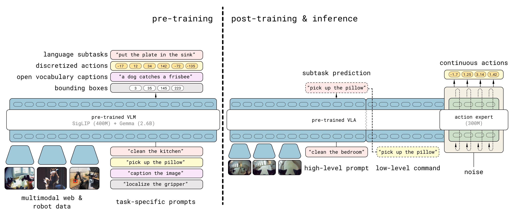
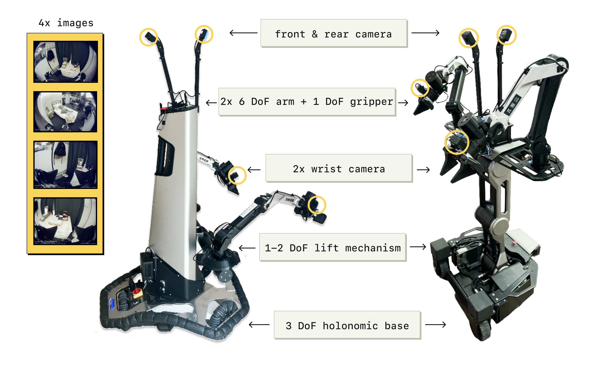
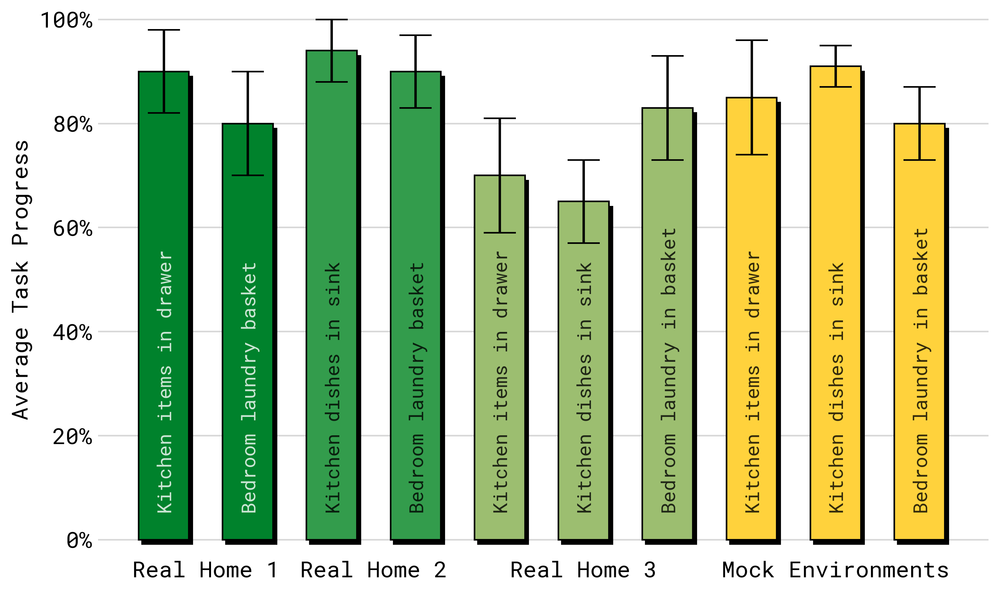
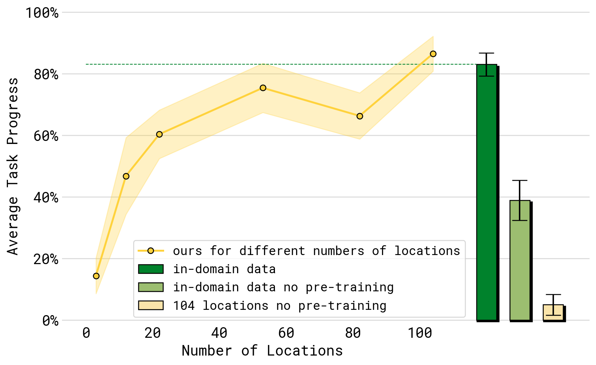
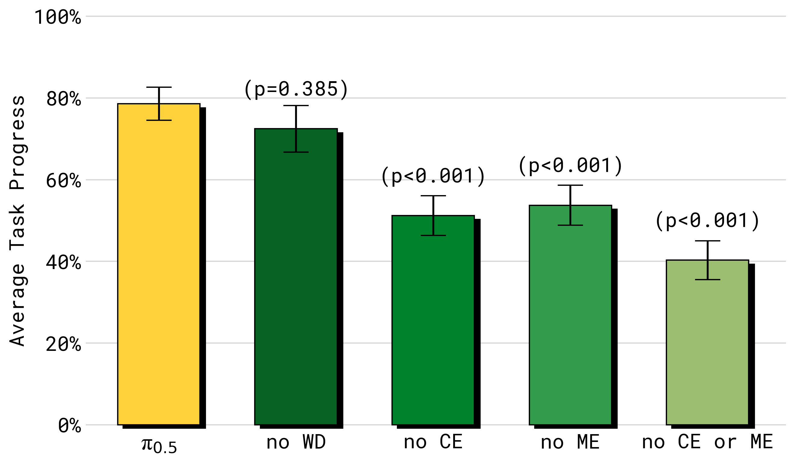
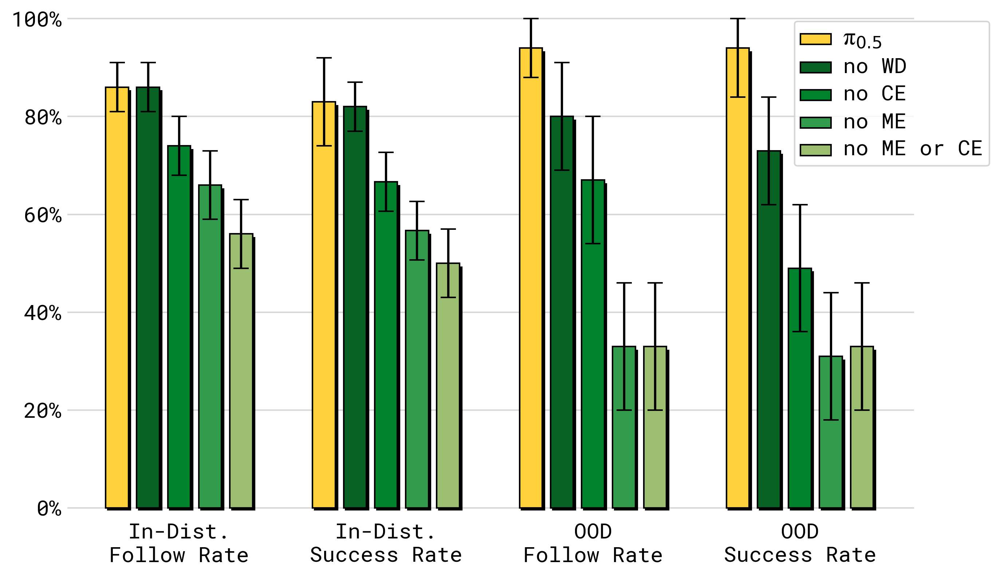

# P5. pi0.5: a Vision-Language-Action Model with Open-World Generalization

## 0. 읽기 전 약어 및 핵심 용어

이 문서를 읽기 전에 아래 약어와 용어를 먼저 정리한다. 이후 본문에서는 괄호 안의 약어를 사용한다.

- Data Science and Business Analytics (DSBA): 데이터 과학, 비즈니스 분석, AI 기반 의사결정을 다루는 연구실/전공 맥락을 뜻한다.
- Large Language Model (LLM): 대규모 텍스트 데이터로 학습되어 언어 이해, 생성, 추론, 계획에 쓰이는 foundation model이다.
- Vision-Language Model (VLM): 이미지와 텍스트를 함께 입력받아 시각-언어 이해나 생성 작업을 수행하는 모델이다.
- Vision-Language-Action (VLA): 시각 관측과 언어 명령을 함께 받아 로봇 action까지 생성하는 모델 또는 학습 패러다임이다.
- Visual Question Answering (VQA): 이미지나 비디오를 보고 자연어 질문에 답하는 vision-language task이다.
- Question Answering (QA): 질문에 대해 정답이나 설명을 생성하는 자연어 처리 task이다.
- Out-of-Distribution (OOD): 학습 데이터 분포와 다른 object, scene, task, embodiment, environment 조건을 뜻한다.
- Cross-Entropy (CE): 분류나 next-token prediction에서 target distribution과 predicted distribution의 차이를 측정하는 loss이다.
- Robotics Transformer (RT): robot observation을 입력받아 action을 예측하는 transformer 기반 robot policy 계열을 뜻한다.
- Robotics Transformer 2 (RT-2): web-scale vision-language knowledge와 robot trajectory를 함께 학습해 action token을 생성하는 VLA 모델이다.
- Open X-Embodiment (OXE): 여러 기관, 로봇, task의 demonstration을 묶은 대규모 cross-embodiment robot dataset이다.
- Frequency-space Action Sequence Tokenization (FAST): robot action chunk를 frequency-domain representation으로 압축해 discrete token으로 만드는 action tokenizer이다.
- Physical Intelligence pi-zero model (pi0): Physical Intelligence가 제안한 general robot control용 vision-language-action flow model이다.
- Physical Intelligence pi-zero-point-five model (pi0.5): pi0를 open-world household manipulation으로 확장한 VLA model이다.
- pi-zero FAST model (pi0-FAST): FAST tokenizer를 이용해 continuous robot action을 autoregressive discrete token prediction으로 다루는 pi0 변형이다.

## 1. Metadata

| Field | 내용 |
|---|---|
| ID | `P5` |
| Title | pi0.5: a Vision-Language-Action Model with Open-World Generalization |
| Authors | Physical Intelligence, Kevin Black, Noah Brown, James Darpinian et al. |
| Affiliation / Team | Physical Intelligence |
| Venue / Status | CoRL / arXiv |
| Date | 2025-04-22 |
| Link | https://arxiv.org/abs/2504.16054 |
| Local source | `paper_corpus/sources/P5` |
| Source figures | `paper_corpus/figures_source/P5/manifest.md` |

## 2. 핵심 요약

pi0.5는 pi0를 기반으로, 실험실이나 training environment와 다른 실제 가정 환경에서 mobile manipulator가 kitchen/bedroom cleaning 같은 long-horizon task를 수행하도록 만든 VLA model이다. 핵심 질문은 "VLA가 정말 open-world generalization을 할 수 있는가?"이고, 답으로 heterogeneous co-training recipe를 제안한다.

이 논문은 robot action data만 더 많이 모으는 접근을 넘어서, 다른 로봇의 데이터, high-level semantic subtask prediction, verbal instruction, web image-language data를 하나의 VLA sequence modeling framework 안에서 함께 학습한다. runtime에는 같은 모델이 먼저 high-level subtask를 예측하고, 그 subtask를 조건으로 low-level action chunk를 생성한다.

## 3. 왜 중요한가?

- pi0의 flow matching VLA를 open-world household manipulation으로 확장한다.
- 약 400시간의 target mobile manipulation data만으로, 완전히 새로운 실제 가정에서 kitchen/bedroom cleanup을 수행한다.
- pre-training example의 대부분은 target mobile manipulation이 아니라 web data, other robot data, high-level semantic data 등 heterogeneous source에서 온다.
- discrete FAST token pretraining과 continuous flow matching post-training을 결합해 training efficiency와 real-time control을 동시에 노린다.
- high-level subtask prediction을 별도 planner가 아니라 같은 VLA 안에 통합한다.

## 4. 전체 아이디어

pi0.5는 "새 집을 청소하는 로봇"이라는 매우 직관적인 demo를 통해 open-world generalization을 보여준다.

  

<em>Figure 1. pi0.5는 다른 로봇, high-level subtask prediction, verbal instruction, web data에서 knowledge를 transfer하여 training data에 없던 새 집의 bedroom/kitchen을 청소한다. task duration은 10-15분까지 이어진다. Source figure: <code>figures/pibnb-teaser-bedroom.pdf</code>.</em>

이 논문의 메시지는 단순하다. 새 환경에서 집안일을 하려면 action skill뿐 아니라 object semantics, scene semantics, subtask decomposition, embodiment transfer가 모두 필요하다. pi0.5는 이들을 모두 data mixture 문제로 다룬다.

## 5. New Kitchen Example

논문은 training data에 없던 kitchen에서 cabinet closing, drawer organization, spill wiping, dishes in sink 등을 수행하는 예시를 제시한다.

  

<em>Figure 2. pi0.5 cleaning a new kitchen. robot은 general task prompt를 받고, "pick up the plate" 같은 subtask를 예측하면서 low-level action을 함께 생성한다. Source figure: <code>figures/final_fig2.pdf</code>.</em>

발표에서는 이 그림을 통해 pi0.5의 inference loop를 설명하면 좋다.

1. 사용자가 "put the dishes in the sink" 같은 high-level prompt를 준다.
2. 모델이 현재 scene에서 다음 subtask text를 예측한다.
3. 같은 모델의 action expert가 subtask를 조건으로 action chunk를 생성한다.
4. 행동 후 observation이 바뀌면 다시 subtask/action을 예측한다.

## 6. Model Overview

pi0.5는 two-stage training과 two-level inference를 함께 사용한다.

  

<em>Figure 3. Model overview. pre-training에서는 diverse robot platforms, high-level semantic action prediction, web data를 discrete token 기반으로 학습한다. post-training에서는 mobile manipulation에 특화하고 flow matching action expert를 추가한다. inference에서는 먼저 high-level subtask를 예측하고, 그 subtask를 조건으로 low-level action을 생성한다. Source figure: <code>figures/Figure_3.pdf</code>.</em>

| 구성 | 역할 |
|---|---|
| VLM backbone | image/language/text token sequence modeling |
| FAST action tokenizer | pre-training에서 action chunk를 discrete token으로 압축 |
| action expert | post-training에서 continuous action chunk를 flow matching으로 생성 |
| high-level subtask output | "pick up the plate" 같은 semantic action text |
| low-level action output | robot arm, gripper, base, torso lift control |

## 7. VLA Imitation Learning Formulation

논문은 일반적인 VLA imitation learning을 다음 likelihood maximization으로 정리한다.

$$
\max_{\theta}\ \mathbb{E}_{(\mathbf{a}_{t:t+H}, \mathbf{o}_t, \ell)\sim\mathcal{D}}\log \pi_{\theta}(\mathbf{a}_{t:t+H}\mid\mathbf{o}_t,\ell)
$$

| Notation | 의미 |
|---|---|
| $\theta$ | VLA model parameter |
| $\mathcal{D}$ | robot demonstration dataset |
| $\mathbf{a}_{t:t+H}$ | timestep $t$부터 $t+H$까지의 action chunk |
| $\mathbf{o}_t$ | 현재 observation |
| $\ell$ | natural language task instruction |
| $\pi_{\theta}$ | observation과 instruction을 조건으로 action chunk를 생성하는 policy |

이 식은 RT-2/OpenVLA/pi0 계열이 모두 공유하는 imitation learning 출발점이다. pi0.5의 차별점은 여기에 text output과 action output을 동시에 두고, high-level inference와 low-level control을 같은 모델 안에서 분해한다는 점이다.

## 8. High-Level / Low-Level Decomposition

pi0.5는 action chunk와 textual output을 함께 모델링한다.

$$
\pi_{\theta}(\mathbf{a}_{t:t+H},\hat{\ell}\mid\mathbf{o}_t,\ell)=\pi_{\theta}(\mathbf{a}_{t:t+H}\mid\mathbf{o}_t,\hat{\ell})\pi_{\theta}(\hat{\ell}\mid\mathbf{o}_t,\ell)
$$

| Notation | 의미 |
|---|---|
| $\hat{\ell}$ | model의 textual output; high-level subtask 또는 web QA/caption answer |
| $\ell$ | user가 준 overall task prompt |
| $\pi_{\theta}(\hat{\ell} \mid \mathbf{o}_t,\ell)$ | 현재 scene과 task prompt에서 다음 semantic subtask를 예측하는 high-level inference |
| $\pi_{\theta}(\mathbf{a}_{t:t+H} \mid \mathbf{o}_t,\hat{\ell})$ | subtask를 조건으로 low-level action chunk를 생성하는 inference |
| $\mathbf{o}_t$ | image와 proprioception을 포함한 observation |

이 decomposition은 SayCan류의 "planner + policy" 구조와 닮았지만, pi0.5에서는 두 분포가 같은 VLA model에 의해 표현된다. 따라서 external LLM planner에 의존하는 구조보다 robot-domain data로 high-level inference를 직접 적응시킬 수 있다.

## 9. Token Types와 Transformer Representation

모델은 multimodal token sequence를 입력으로 받아 output token sequence를 생성한다.

$$
\mathbf{y}_{1:N}=f(\mathbf{x}_{1:N},A(\mathbf{x}_{1:N}),\rho(\mathbf{x}_{1:N}))
$$

| Notation | 의미 |
|---|---|
| $\mathbf{x}_{1:N}$ | 입력 token sequence |
| $\mathbf{y}_{1:N}$ | 출력 token sequence |
| $f$ | transformer model |
| $A(\mathbf{x}_{1:N})$ | token 간 attention 가능 여부를 나타내는 attention mask |
| $\rho(\mathbf{x}_{1:N})$ | token type indicator |
| $\mathbf{x}^{w}_i \in \mathbb{N}$ | text token |
| $\mathbf{x}^{I}_i \in \mathbb{R}^{p\times p\times 3}$ | image patch token |
| $\mathbf{x}^{a}_i \in \mathbb{R}^{d}$ | flow matching 중간 단계의 continuous action token |

token type에 따라 text embedding, vision encoder, action projection, action expert weight가 달라진다. 특히 action expert embedding은 prefix와 서로 attend할 수 있지만, FAST action token과는 information leakage를 막기 위해 직접 attend하지 않도록 mask를 둔다.

  

<em>Figure 4. Attention masking pattern. VLM과 action expert는 self-attention을 통해 상호작용하지만, action expert가 FAST action token을 보지 않도록 하여 두 action representation 사이의 leakage를 막는다. Source figure: <code>figures/attention_mask.png</code>.</em>

## 10. Discrete FAST와 Continuous Flow를 결합한 Objective

pi0.5는 pre-training에서는 action을 FAST discrete token으로 다루고, post-training에서는 flow matching action expert를 추가한다. 두 표현을 함께 학습하는 combined objective는 다음과 같다.

$$
\mathbb{E}_{\mathcal{D},\tau,\boldsymbol{\omega}}\left[H(\mathbf{x}_{1:M},f^{\ell}_{\theta}(\mathbf{o}_t,\ell))+\alpha\left\|\boldsymbol{\omega}-\mathbf{a}_{t:t+H}-f^{a}_{\theta}(\mathbf{a}^{\tau,\boldsymbol{\omega}}_{t:t+H},\mathbf{o}_t,\ell)\right\|^2\right]
$$

| Notation | 의미 |
|---|---|
| $\mathcal{D}$ | training data mixture |
| $\tau$ | flow matching timestep |
| $\boldsymbol{\omega}$ | Gaussian noise sample |
| $H(\cdot,\cdot)$ | text token/FAST token에 대한 cross entropy loss |
| $\mathbf{x}_{1:M}$ | target text token sequence; FAST encoded action token도 포함 가능 |
| $f^{\ell}_{\theta}$ | text/FAST token logits를 출력하는 VLM branch |
| $\alpha$ | cross entropy loss와 flow loss 사이의 trade-off parameter |
| $\mathbf{a}_{t:t+H}$ | clean action chunk |
| $\mathbf{a}^{\tau,\boldsymbol{\omega}}_{t:t+H}$ | noisy action chunk |
| $f^{a}_{\theta}$ | action expert가 출력하는 flow vector field |

논문은 pre-training 단계에서는 $\alpha=0$으로 두어 standard VLM transformer처럼 discrete token prediction을 학습하고, post-training 단계에서는 $\alpha=10.0$으로 flow matching action expert를 함께 학습한다. 이 설계는 FAST token의 training efficiency와 flow matching의 real-time continuous control 장점을 결합한다.

## 11. Noisy Action Chunk

flow matching에 쓰이는 noisy action chunk는 다음과 같이 정의된다.

$$
\mathbf{a}_{t:t+H}^{\tau,\boldsymbol{\omega}}=\tau\mathbf{a}_{t:t+H}+(1-\tau)\boldsymbol{\omega},\quad \boldsymbol{\omega}\sim\mathcal{N}(0,\mathbf{I})
$$

| Notation | 의미 |
|---|---|
| $\mathbf{a}_{t:t+H}^{\tau,\boldsymbol{\omega}}$ | flow timestep $\tau$에서의 noisy action chunk |
| $\mathbf{a}_{t:t+H}$ | demonstration의 clean action chunk |
| $\boldsymbol{\omega}$ | standard Gaussian noise |
| $\mathcal{N}(0,\mathbf{I})$ | 평균 0, identity covariance의 Gaussian distribution |
| $\tau$ | clean action과 noise를 섞는 interpolation coefficient |

논문은 이 noisy action을 action expert에 넣고 vector field를 예측하게 한다. pi0와 마찬가지로 lower timestep을 강조하는 timestep sampling을 사용한다.

$$
p(\tau)=\mathrm{Beta}\left(\frac{s-\tau}{s};\alpha=1.5,\beta=1\right)
$$

| Notation | 의미 |
|---|---|
| $p(\tau)$ | timestep sampling distribution |
| $s$ | timestep cutoff |
| $\alpha,\beta$ | beta distribution parameter |

## 12. Training Data Mixture

pi0.5의 가장 중요한 contribution은 data mixture 설계다.

  

<em>Figure 5. Pre-training and post-training tasks. MM, ME, CE, HL, WD, VI가 서로 다른 형태의 supervision을 제공한다. post-training에서는 mobile manipulation과 diverse environment에 초점을 맞추기 위해 CE를 제외하고 VI를 추가한다. Source figure: <code>figures/pretraining-finetuning-tasks.pdf</code>.</em>

| 약어 | 의미 | 역할 |
|---|---|---|
| `MM` | diverse mobile manipulator data | target task와 가장 직접적으로 관련된 약 400시간의 household mobile manipulation data |
| `ME` | multi-environment non-mobile robot data | 더 많은 실제 home environment에서 수집된 static/simpler robot data |
| `CE` | cross-embodiment laboratory data | 다양한 robot/task의 lab data와 OXE 포함 |
| `HL` | high-level subtask prediction | "clean bedroom"을 "pick up pillow" 같은 subtask로 분해하도록 학습 |
| `WD` | web data | captioning, VQA, object localization 등 semantic knowledge 강화 |
| `VI` | verbal instruction demonstrations | human supervisor가 step-by-step language로 robot을 지시한 high-level demonstration |

논문은 pre-training 첫 단계에서 training example의 97.6%가 target mobile manipulator household task가 아니라고 강조한다. 즉, generalization은 target data만의 결과가 아니라 heterogeneous transfer의 결과다.

## 13. Robot System

pi0.5는 두 종류의 mobile manipulator platform에서 평가된다.

  

<em>Figure 6. Robot system overview. robot은 4개 camera, 두 개의 6-DoF arm, parallel jaw gripper, holonomic base, torso lift를 가진다. pi0.5는 arm, gripper, base velocity, lift position을 직접 제어한다. Source figure: <code>figures/robot_system_overview.pdf</code>.</em>

중요한 점은 시스템이 별도의 trajectory planning이나 collision detection 없이 단순 PD controller로 target pose/velocity를 tracking한다는 것이다. 즉, manipulation과 navigation control 대부분이 learned policy에 들어간다.

## 14. Real Home Evaluation

pi0.5는 training에 없던 real home 세 곳에서 kitchen/bedroom task를 수행한다.

  

<em>Figure 7. Real home rollouts. Home 1에서는 drawer에 물건 넣기, Home 2에서는 dishes in sink, Home 3에서는 clothes in laundry basket을 수행하며, 각 frame 아래에는 model이 예측한 high-level subtask가 표시된다. Source figure: <code>figures/final_real_home_eval_filmstrip.pdf</code>.</em>

  

<em>Figure 8. Real home quantitative evaluation. 세 real home에서 items in drawer, laundry basket, dishes in sink task의 progress를 평균 10 trial 기준으로 평가한다. Source figure: <code>figures/real_home_quantitative_eval_plot.png</code>.</em>

논문은 mock setup에서의 성능이 real home 성능과 대체로 representative하다고 보고한다. 여기서 task는 2-5분 길이의 multi-stage task로 설명되며, teaser에서는 더 복잡한 10-15분 behavior도 강조한다.

## 15. Environment Scaling

논문은 mobile manipulation data에서 training location 수를 3, 12, 22, 53, 82, 104개로 바꾸며 generalization scaling을 평가한다.

  

<em>Figure 9. Performance with different numbers of locations. dishes in sink, items in drawer, laundry basket, make bed의 평균 성능은 training environment 수가 늘수록 개선된다. Source figure: <code>figures/env_scaling.png</code>.</em>

  

<em>Figure 10. Language following with different numbers of locations. seen category와 unseen category 모두에서 training location 수가 증가할수록 language following과 placement success가 개선된다. Source figure: <code>figures/env_scaling_results0.png</code>.</em>

DSBA/산업공학 관점에서는 이 실험이 특히 흥미롭다. robot data collection을 "얼마나 많은 episode를 모을 것인가"가 아니라 "얼마나 많은 distinct environment를 커버할 것인가"라는 coverage/allocation 문제로 바꿔준다.

## 16. Co-Training Recipe Ablation

co-training ablation은 어떤 data source가 어떤 일반화에 기여하는지 보여준다.

  

<em>Figure 11. Training recipe ablations in mock homes. ME 또는 CE를 제거하면 end-to-end task performance가 크게 떨어지고, 둘 다 제거하면 더 악화된다. WD 제거는 이 실험에서는 큰 차이가 아니지만 language/object generalization에서 중요해진다. Source figure: <code>figures/performance_vs_ll_data.png</code>.</em>

  

<em>Figure 12. Training recipe ablations for language following. WD는 특히 OOD object language following에 중요하고, ME/CE 역시 ID/OOD 모두에서 큰 영향을 준다. Source figure: <code>figures/data_vs_generalization.png</code>.</em>

핵심 해석은 다음과 같다.

| 제거한 요소 | 주된 영향 |
|---|---|
| no `ME` | 다양한 실제 환경에서 온 non-mobile robot transfer가 사라져 성능 하락 |
| no `CE` | 다양한 task/embodiment에서 온 manipulation prior가 줄어 성능 하락 |
| no `ME` or `CE` | target mobile platform data만으로는 generalization이 크게 부족 |
| no `WD` | end-to-end mock task에서는 영향이 작을 수 있지만 OOD object/language/high-level inference에서 중요 |

## 17. Comparison with pi0 and pi0-FAST+Flow

pi0.5는 pi0 및 pi0-FAST+Flow와 비교된다.

  

<em>Figure 13. Comparison with other models. full pi0.5는 pi0 및 pi0-FAST+Flow보다 mock home test environment에서 높은 성능을 보인다. Source figure: <code>figures/performance_vs_ll_model.png</code>.</em>

pi0-FAST+Flow는 hybrid action representation을 사용하지만 action data만 사용하고 `HL`/`WD`가 없다. 따라서 이 비교는 architecture improvement만으로는 부족하고, high-level semantic data와 web data를 포함한 co-training recipe가 중요하다는 점을 보여준다.

## 18. High-Level Inference Ablation

논문은 high-level inference가 정말 필요한지 여러 baseline으로 평가한다.

  

<em>Figure 14. Evaluation of high-level inference. full pi0.5가 가장 좋고, implicit HL도 좋은 성능을 보인다. no VI, no WD, no HL은 성능이 떨어지며, zero-shot GPT-4 high-level policy는 가장 낮은 성능을 보인다. Source figure: <code>figures/performance_vs_hl_data.png</code>.</em>

흥미로운 점은 full model이 human high-level oracle보다도 높게 나온다는 것이다. 이는 high-level label 자체보다, low-level policy와 high-level prediction이 같은 data distribution 안에서 co-adapt된 것이 중요할 수 있음을 시사한다. 또한 implicit HL이 두 번째로 좋다는 결과는 subtask prediction data를 학습 mixture에 넣는 것만으로도 policy 내부에 useful task structure가 들어갈 수 있음을 보여준다.

## 19. World Model 관점에서의 해석

pi0.5도 explicit dynamics world model을 학습하지는 않는다. 그러나 pi0보다 더 world model 문제에 가까워진다.

| World Model 질문 | pi0.5에서의 대응 |
|---|---|
| 다음에 무엇을 해야 하는가? | high-level subtask text prediction |
| scene/object semantics를 어떻게 가져오는가? | web captioning, VQA, localization data co-training |
| action이 scene을 어떻게 바꾸는가? | low-level action data와 subtask-conditioned policy로 implicit하게 학습 |
| 새 집/새 물체에 어떻게 일반화하는가? | environment diversity, cross-embodiment transfer, WD/HL/VI mixture |
| memory/partial observability는 어떻게 처리하는가? | 아직 제한적이며 논문 limitation에서 future work로 언급 |

따라서 pi0.5는 explicit rollout model이라기보다, heterogeneous supervision으로 scene semantics, task decomposition, physical action prior를 하나의 policy 안에 압축한 implicit open-world physical policy model로 볼 수 있다.

## 20. 기존 논문들과의 연결

| 연결 논문 | 연결 포인트 |
|---|---|
| pi0 (`P4`) | flow matching action expert와 VLM backbone을 계승 |
| FAST / pi0-FAST | discrete action tokenizer를 pre-training efficiency에 활용 |
| SayCan (`G2`) | high-level semantic subtask와 low-level policy를 연결 |
| Open X-Embodiment (`D1`) | cross-embodiment data transfer의 중요성 |
| OpenVLA (`D5`) | VLA sequence modeling framework를 robot control에 적용 |
| Diffusion Policy (`P1`) | continuous action chunk generation과 real-time control |
| household/mobile manipulation datasets | training environment diversity가 generalization에 미치는 영향 |

## 21. 한계와 주의점

- broad generalization은 보이지만 여전히 실패한다.
- unfamiliar drawer/cabinet handle처럼 physical affordance가 다른 object에서 어려움이 있다.
- partial observability 문제가 있다. 예를 들어 robot arm이 spill을 가려 wipe해야 할 대상을 못 볼 수 있다.
- high-level subtask inference가 distract되어 drawer를 반복해서 열고 닫는 등 불안정한 행동이 생길 수 있다.
- prompt complexity는 training data annotation의 복잡도에 제한된다.
- context와 memory가 modest하여 여러 방을 오가거나 object 위치를 기억해야 하는 task에는 추가 연구가 필요하다.

## 22. 발표 구성 제안

1. pi0가 dexterous general robot control을 보여줬다면, pi0.5는 "새 집에서 일반화"가 질문이라고 시작한다.
2. Figure 1과 Figure 2로 새 집 cleaning demo를 보여주며 motivation을 만든다.
3. Figure 3으로 two-stage training과 high-level/low-level inference를 설명한다.
4. decomposition 수식으로 같은 모델이 subtask와 action을 모두 모델링한다는 점을 설명한다.
5. FAST+flow combined objective를 통해 training efficiency와 real-time continuous control의 trade-off를 설명한다.
6. data mixture `MM/ME/CE/HL/WD/VI`를 설명하고, target data만으로는 부족하다는 점을 강조한다.
7. real home evaluation, environment scaling, co-training ablation, high-level ablation 순서로 결과를 정리한다.
8. 마지막에 "open-world generalization은 model architecture만이 아니라 data recipe 문제"라는 메시지로 마무리한다.

## 23. 토론 질문

- open-world robot generalization에서 environment diversity와 object diversity 중 무엇이 더 병목일까?
- high-level subtask prediction을 같은 VLA가 하는 것이 별도 LLM/VLM planner보다 왜 나을 수 있을까?
- web data가 low-level physical skill에는 직접 관여하지 않는데, 어떤 경로로 manipulation performance를 개선할까?
- target mobile manipulation data가 400시간뿐일 때, 어떤 data source를 추가로 수집하는 것이 가장 효율적일까?
- 산업공학 관점에서 robot data collection을 environment/task/object/embodiment coverage optimization 문제로 모델링할 수 있을까?

## 24. 한 문장 정리

pi0.5는 pi0의 VLA/action expert 구조를 heterogeneous co-training과 high-level subtask inference로 확장하여, 실제 새 가정 환경에서 long-horizon household manipulation을 수행하는 open-world generalization 중심의 robot foundation model이다.
