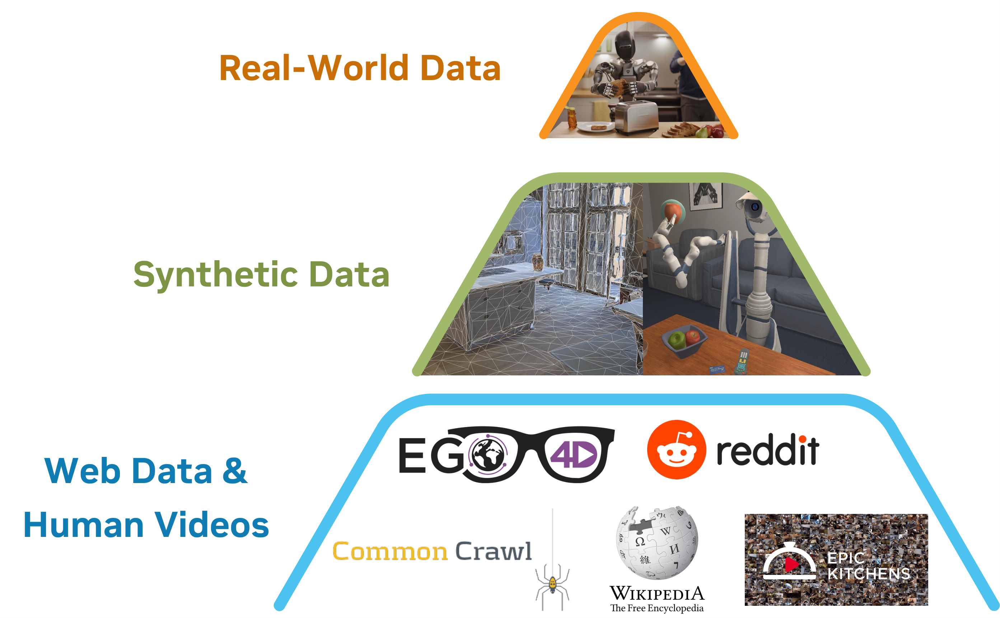
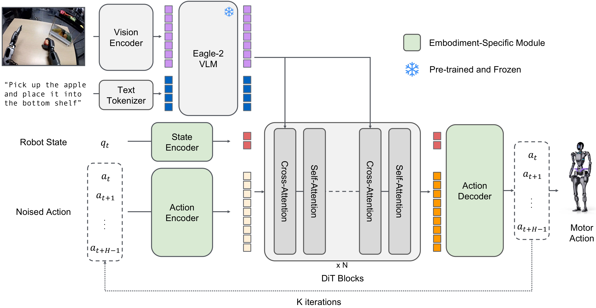
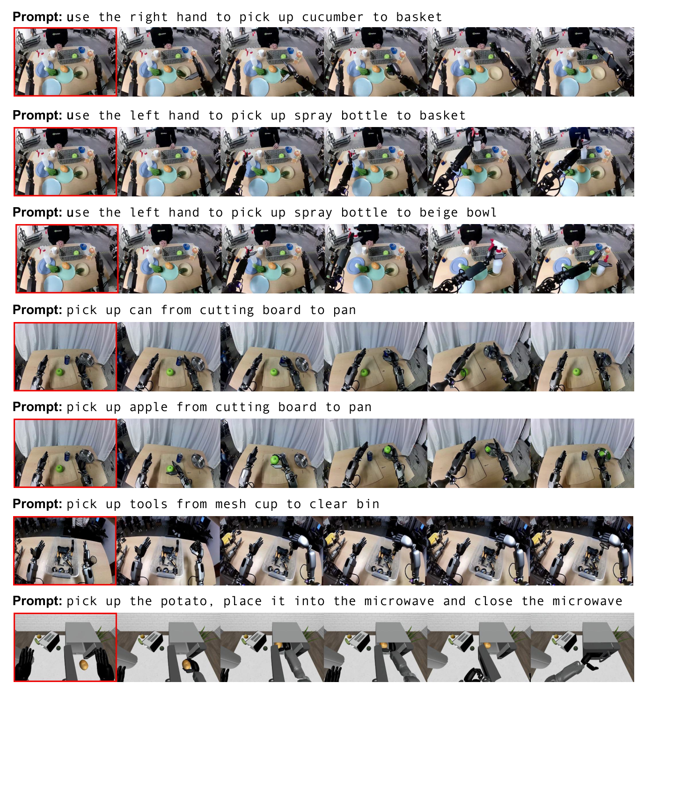

# P6. GR00T N1: An Open Foundation Model for Generalist Humanoid Robots

## 0. 읽기 전 약어 및 핵심 용어

이 문서를 읽기 전에 아래 약어와 용어를 먼저 정리한다. 이후 본문에서는 괄호 안의 약어를 사용한다.

- Artificial Intelligence (AI): 사람의 지각, 추론, 학습, 의사결정 능력을 기계가 수행하도록 만드는 인공지능 분야를 뜻한다.
- Vision-Language Model (VLM): 이미지와 텍스트를 함께 입력받아 시각-언어 이해나 생성 작업을 수행하는 모델이다.
- Vision-Language-Action (VLA): 시각 관측과 언어 명령을 함께 받아 로봇 action까지 생성하는 모델 또는 학습 패러다임이다.
- Behavior Cloning (BC): expert demonstration의 observation-action pair를 supervised learning으로 모방하는 imitation learning 방법이다.
- Multi-Layer Perceptron (MLP): fully connected layer를 여러 층 쌓은 feed-forward neural network이다.
- Variational Autoencoder (VAE): latent variable의 확률분포를 학습해 data를 생성하거나 압축하는 generative model이다.
- Vector Quantization (VQ): continuous representation을 discrete codebook vector로 양자화하는 방법이다.
- Vector-Quantized Variational Autoencoder (VQ-VAE): latent를 discrete codebook으로 양자화하는 variational autoencoder 계열 generative model이다.
- Diffusion Probabilistic Model (DPM): data에 noise를 더하고 이를 되돌리는 denoising process를 학습하는 generative model 계열이다.
- Diffusion Transformer (DiT): U-Net 대신 transformer backbone을 사용해 diffusion denoising이나 flow prediction을 수행하는 architecture이다.
- Robotics Transformer (RT): robot observation을 입력받아 action을 예측하는 transformer 기반 robot policy 계열을 뜻한다.
- Robotics Transformer-X model family (RT-X): Open X-Embodiment 데이터 위에서 여러 robot embodiment로 확장한 RT 계열 policy family를 뜻한다.
- Action Chunking with Transformers (ACT): 여러 timestep의 action chunk를 한 번에 예측해 fine-grained robot manipulation을 학습하는 transformer policy이다.
- Robotics Diffusion Transformer (RDT): diffusion model과 transformer를 결합해 robot action trajectory를 생성하는 robot foundation policy 계열이다.
- Robotics Diffusion Transformer 1B (RDT-1B): 약 1B parameter 규모의 bimanual manipulation diffusion foundation model이다.
- Physical Intelligence pi-zero model (pi0): Physical Intelligence가 제안한 general robot control용 vision-language-action flow model이다.
- Physical Intelligence pi-zero-point-five model (pi0.5): pi0를 open-world household manipulation으로 확장한 VLA model이다.
- Generalist Robot 1 (GR-1): video와 language를 조건으로 humanoid action을 생성하는 generalist robot policy 계열 모델이다.
- Generalist Robot 1 (GR1): GR-1을 하이픈 없이 줄여 쓴 표기이며 humanoid/generalist robot policy 계열을 뜻한다.
- Generalist Robot 00 Technology (GR00T): NVIDIA가 humanoid/generalist robot을 위해 공개한 robot foundation model family 이름이다.
- Inverse Dynamics Model (IDM): 현재와 다음 관측을 보고 그 변화를 만든 action을 추정하는 model이다.
- Latent Action Pretraining from videos (LAPA): video에서 latent action representation을 학습해 downstream robot policy에 활용하는 pretraining 계열 접근이다.
- Graphics Processing Unit (GPU): 대규모 neural network 학습과 병렬 연산을 빠르게 수행하는 processor이다.
- Physical Artificial Intelligence (Physical AI): 디지털 공간의 예측을 넘어 물리 세계에서 지각, 예측, 계획, 행동, 안전 검사를 수행하는 AI 시스템을 뜻한다.

## 1. Metadata

| Field | 내용 |
|---|---|
| ID | `P6` |
| Title | GR00T N1: An Open Foundation Model for Generalist Humanoid Robots |
| Authors | NVIDIA, Johan Bjorck, Fernando Castañeda, Nikita Cherniadev et al. |
| Affiliation / Team | NVIDIA |
| Venue / Status | arXiv technical report |
| Date | 2025-03-18 |
| Link | https://arxiv.org/abs/2503.14734 |
| Local source | `paper_corpus/sources/P6` |
| Source figures | `paper_corpus/figures_source/P6/manifest.md` |

## 2. 핵심 요약

GR00T N1은 generalist humanoid robots를 위한 open Vision-Language-Action foundation model이다. 이 논문은 humanoid robot intelligence를 hardware, model, data의 full-stack 문제로 보고, robot foundation model을 학습하기 위해 human video, simulation/neural synthetic data, real robot trajectories를 data pyramid로 구성한다.

모델은 dual-system architecture를 사용한다. System 2는 Eagle-2 VLM 기반 vision-language reasoning module이고, System 1은 action flow-matching으로 학습되는 Diffusion Transformer action module이다. VLM은 image/language를 token으로 해석하고, DiT는 proprioception과 noised action chunk를 vision-language token에 cross-attention해 high-frequency motor action을 생성한다.

## 3. 왜 중요한가?

- humanoid robot을 대상으로 한 대규모 open foundation model 사례다.
- VLA를 단순 arm manipulation이 아니라 single-arm, bimanual, humanoid embodiments까지 확장한다.
- web/human video, simulation, neural-generated videos, real-robot trajectories를 하나의 training corpus로 묶는 data pyramid 관점을 제시한다.
- action label이 없는 human/neural video를 latent action 또는 IDM pseudo-action으로 policy training에 활용한다.
- pi0/RDT처럼 diffusion/flow 계열 continuous action generation을 foundation model scale에서 사용한다.
- real GR-1 humanoid robot에서 low-data post-training 성능과 data efficiency를 보고한다.

## 4. Data Pyramid

  

<em>Figure 1. Data pyramid for robot foundation model training. 아래로 갈수록 data quantity가 많고 embodiment-specificity가 낮으며, 위로 갈수록 real robot grounding이 강하다. Source figure: <code>assets/data_pyramid.pdf</code>.</em>

GR00T N1의 가장 큰 메시지는 "humanoid robot에는 Internet-scale robot action dataset이 없으므로, data를 계층적으로 만들어야 한다"는 것이다.

| Layer | Data type | 역할 |
|---|---|---|
| base | web data, human egocentric videos | broad visual/behavioral prior |
| middle | simulation trajectories, neural-generated videos | scalable counterfactual robot experience |
| top | real humanoid teleoperation trajectories | embodiment-specific grounding |

이 구조는 Open X-Embodiment식 "robot datasets pooling"에서 한 걸음 더 나아가, action label이 없는 video와 generated trajectory까지 policy training에 끌어들이려는 시도다.

## 5. Model Overview

  

<em>Figure 2. GR00T N1 model overview. Image observation과 language instruction은 VLM backbone을 거치고, VLM output token은 robot state/action encoding과 함께 Diffusion Transformer action module에 들어간다. Source figure: <code>assets/groot_inference_yuke_v2.pdf</code>.</em>

GR00T N1은 두 개의 system으로 나뉜다.

| System | Module | 기능 | Frequency |
|---|---|---|---|
| System 2 | Eagle-2 VLM | vision-language reasoning, task/environment interpretation | 약 10 Hz |
| System 1 | DiT action module | closed-loop motor action generation | 약 120 Hz |

publicly released GR00T N1 model은 총 2.2B parameters이고, 그중 VLM이 1.34B parameters다. 논문은 L40 GPU에서 16-action chunk sampling inference time이 63.9 ms라고 보고한다.

## 6. Model Architecture

  

<em>Figure 3. GR00T N1 model architecture. Embodiment-aware state/action encoders and decoders handle variable state/action dimensions; Eagle-2 VLM tokens condition DiT blocks through cross-attention. Source figure: <code>assets/groot_model_v6.pdf</code>.</em>

architecture의 핵심은 heterogeneous embodiment를 처리하기 위한 compositional design이다.

| Component | 설명 |
|---|---|
| state encoder | embodiment별 MLP가 robot proprioceptive state를 shared embedding으로 projection |
| action encoder | noised action chunk와 diffusion/flow timestep을 embedding |
| VLM backbone | Eagle-2가 image와 language를 vision-language token으로 변환 |
| DiT blocks | noised action/state token에 self-attention, VLM token에 cross-attention |
| action decoder | embodiment별 MLP가 DiT output을 해당 robot action dimension으로 변환 |

이 설계는 RDT의 unified action space와 조금 다르다. RDT는 physical vector coordinate를 공유하고, GR00T N1은 embodiment-specific encoder/decoder로 서로 다른 state/action dimension을 shared latent space에 올린다.

## 7. Action Chunking

GR00T N1도 action chunk를 예측한다.

$$
A_t
=
[a_t,a_{t+1},\ldots,a_{t+H-1}]
$$

$$
H=16
$$

| Notation | 의미 |
|---|---|
| $A_t$ | time $t$에서 예측하는 action chunk |
| $a_t$ | time $t$의 single-step robot action |
| $H$ | action chunk horizon |

action chunking은 ACT, Diffusion Policy, RDT, pi0 계열과 이어지는 공통 설계다. high-frequency control에서 매 순간 완전히 새로 action을 뽑기보다, 짧은 trajectory segment를 생성해 temporal smoothness와 inference efficiency를 얻는다.

## 8. Action Flow Matching Objective

GR00T N1은 diffusion transformer를 사용하지만, training objective는 action flow matching이다. ground-truth action chunk $A_t$, flow-matching timestep $\tau$, Gaussian noise $\epsilon$이 주어졌을 때 noised action chunk는 다음과 같다.

$$
A_t^{\tau}
=
\tau A_t
+
(1-\tau)\epsilon
$$

| Notation | 의미 |
|---|---|
| $A_t$ | clean ground-truth action chunk |
| $A_t^{\tau}$ | timestep $\tau$에서의 noised/interpolated action chunk |
| $\tau$ | flow-matching timestep, $[0,1]$ 범위 |
| $\epsilon$ | Gaussian noise, $\epsilon\sim\mathcal{N}(\mathbf{0},\mathbf{I})$ |

모델 $V_{\theta}$는 denoising vector field를 예측하도록 학습된다.

$$
\mathcal{L}_{\mathrm{fm}}(\theta)
=
\mathbb{E}_{\tau}
\left[
\left\|
V_{\theta}(\phi_t,A_t^{\tau},q_t)
-
(\epsilon-A_t)
\right\|^2
\right]
$$

| Notation | 의미 |
|---|---|
| $\mathcal{L}_{\mathrm{fm}}(\theta)$ | flow-matching loss |
| $\theta$ | action module parameter |
| $V_{\theta}$ | DiT action module이 예측하는 vector field |
| $\phi_t$ | VLM이 출력한 vision-language token embeddings |
| $q_t$ | robot proprioceptive state embedding |
| $\epsilon-A_t$ | noise에서 clean action으로 가기 위한 target vector field |

논문은 pi0와 마찬가지로 $\tau$를 Beta distribution에서 sampling한다고 설명한다.

$$
p(\tau)
=
\mathrm{Beta}\left(\frac{s-\tau}{s};1.5,1\right),
\quad
s=0.999
$$

| Notation | 의미 |
|---|---|
| $p(\tau)$ | flow-matching timestep sampling distribution |
| $s$ | sampling distribution parameter |

## 9. Inference: Euler Denoising

inference에서는 random Gaussian action chunk에서 시작해 $K$ step denoising으로 action을 생성한다.

$$
A_t^0
\sim
\mathcal{N}(\mathbf{0},\mathbf{I})
$$

$$
A_t^{\tau+1/K}
=
A_t^{\tau}
+
\frac{1}{K}
V_{\theta}(\phi_t,A_t^{\tau},q_t)
$$

| Notation | 의미 |
|---|---|
| $A_t^0$ | initial random action chunk |
| $K$ | inference denoising step 수 |
| $A_t^{\tau+1/K}$ | Euler integration 후 업데이트된 action chunk |
| $V_{\theta}(\phi_t,A_t^{\tau},q_t)$ | 현재 action chunk에서의 denoising direction |

논문은 모든 embodiment에서 $K=4$ inference steps가 잘 작동했다고 보고한다. RDT가 DPM-Solver++로 diffusion steps를 줄였다면, GR00T N1은 flow matching과 Euler integration으로 적은 step action generation을 수행한다.

## 10. Latent Actions for Action-Less Videos

  

<em>Figure 4. Latent actions. 서로 다른 robot/human embodiment에서 유사한 latent action embedding이 오른팔/손을 왼쪽 또는 오른쪽으로 움직이는 의미를 공유하는 예시다. Source figure: <code>assets/latent_action.pdf</code>.</em>

human egocentric video와 neural-generated video에는 robot action label이 없다. GR00T N1은 이를 학습에 쓰기 위해 VQ-VAE 기반 latent action model을 학습한다.

| 단계 | 설명 |
|---|---|
| input | current frame $x_t$와 future frame $x_{t+H}$ |
| encoder | 두 frame 사이 변화를 latent action $z_t$로 encoding |
| codebook | continuous embedding을 nearest codebook embedding으로 quantize |
| decoder | $x_t$와 $z_t$로 $x_{t+H}$ reconstruction |
| policy training | trained encoder를 inverse dynamics model처럼 사용해 action-less video에 latent action label 부여 |

이 아이디어의 중요성은 "robot action label이 없어도, frame transition을 action-like supervision으로 바꿀 수 있다"는 점이다.

## 11. Neural Trajectories

  

<em>Figure 5. Synthetically generated videos. 같은 initial frame에서 다른 prompt, object, target location을 생성해 counterfactual robot trajectories를 만든다. Source figure: <code>assets/dreams_0318.pdf</code>.</em>

GR00T N1은 video generation model을 robot data augmentation에 사용한다. in-house teleoperation 88 hours를 바탕으로 image-to-video generation model을 fine-tune하고, novel language prompts와 initial frames로 827 hours의 videos를 생성한다. 이는 약 10배 augmentation이다.

neural trajectories는 language instruction을 따르는지 filtering하고 captioning한 뒤, latent action 또는 inverse dynamics model(IDM) pseudo-action으로 labeling해 policy training에 사용한다.

## 12. Teleoperation and Real Robot Data

  

<em>Figure 6. Data collection via teleoperation. Wrist poses, hand skeletons, and robot actions are captured through teleoperation and retargeting. Source figure: <code>assets/groot-teleop.pdf</code>.</em>

GR00T N1의 real-world data는 Fourier GR1 humanoid 중심으로 수집된다. VIVE Ultimate Tracker로 wrist pose를, Xsens Metagloves로 finger movement를 추적하고, 이를 inverse kinematics로 humanoid action에 retargeting한다. real-time teleoperation은 20 Hz control frequency로 동작하며, head-mounted camera image와 low-dimensional proprioception/action을 함께 기록한다.

## 13. Simulation and Real-World Benchmarks

  

<em>Figure 7. Simulation tasks. RoboCasa, DexMimicGen, GR-1 tabletop tasks를 포함해 다양한 embodiment와 manipulation task를 평가한다. Source figure: <code>assets/fig_task_v6.pdf</code>.</em>

simulation benchmark는 세 종류다.

| Benchmark | 규모 | 특징 |
|---|---|---|
| RoboCasa Kitchen | 24 tasks | Panda arm 기반 kitchen atomic skills |
| DexMimicGen Cross-Embodiment | 9 tasks | bimanual/dexterous/humanoid coordination |
| GR-1 Tabletop Tasks | 24 tasks | real-world humanoid tasks와 유사한 tabletop manipulation |

real-world benchmark는 GR-1 humanoid에서 수행된다.

  

<em>Figure 8. Real-world GR-1 tasks. Pre-training evaluation과 post-training evaluation task categories를 보여준다. Source figure: <code>assets/real_gr1_task_figure.pdf</code>.</em>

| Real-world category | 내용 |
|---|---|
| Object-to-Container Pick-and-Place | object를 지정된 container로 이동 |
| Articulated Object Manipulation | chest/cabinet/drawer에 넣고 닫기 |
| Industrial Object Manipulation | machinery packing, mesh cup pouring, cylinder handover |
| Multi-Agent Coordination | 두 robot 사이 handover와 sequential coordination |

## 14. Quantitative Results

pretrained GR00T N1 checkpoint는 real GR-1에서 두 가지 generalization task를 수행한다. left-to-right handover setting에서 76.6%, novel object into unseen target container setting에서 73.3% success를 보고한다.

post-training simulation에서는 100 demonstrations per task 기준으로 다음 성능을 보고한다.

| Model | RoboCasa | DexMG | GR-1 | Average |
|---|---:|---:|---:|---:|
| BC Transformer | 26.3% | 53.9% | 16.1% | 26.4% |
| Diffusion Policy | 25.6% | 56.1% | 32.7% | 33.4% |
| GR00T N1 | 32.1% | 66.5% | 50.0% | 45.0% |

real robot에서는 Diffusion Policy baseline과 비교한다.

| Model | Pick-and-Place | Articulated | Industrial | Coordination | Average |
|---|---:|---:|---:|---:|---:|
| Diffusion Policy, 10% Data | 3.0% | 14.3% | 6.7% | 27.5% | 10.2% |
| Diffusion Policy, Full Data | 36.0% | 38.6% | 61.0% | 62.5% | 46.4% |
| GR00T N1, 10% Data | 35.0% | 62.0% | 31.0% | 50.0% | 42.6% |
| GR00T N1, Full Data | 82.0% | 70.9% | 70.0% | 82.5% | 76.8% |

핵심 관찰은 GR00T N1의 10% data 성능이 Diffusion Policy full-data 성능에 근접한다는 점이다. 논문은 이를 pretraining과 data pyramid가 post-training data efficiency를 높인 결과로 해석한다.

## 15. Neural Trajectory 효과

  

<em>Figure 9. Neural trajectories ablations. RoboCasa와 real-world low-data regime에서 generated trajectories를 함께 학습했을 때의 효과를 비교한다. Source figure: <code>assets/dream_figure.pdf</code>.</em>

neural trajectory co-training은 RoboCasa에서 30/100/300 data regime 각각 평균 +4.2%, +8.8%, +6.8% gain을 보였고, real GR-1에서도 8 tasks 평균 +5.8% gain을 보고한다. action labeling 방식은 LAPA latent action과 IDM pseudo-action을 비교하며, data가 많아질수록 IDM label이 더 강한 positive transfer를 보였다고 설명한다.

## 16. Physical AI / World Model 관점

GR00T N1은 world model 자체를 policy 내부에 명시적으로 두지는 않는다. 하지만 video generation model을 neural trajectory generator로 사용한다는 점에서 world model과 physical AI가 직접 만나는 사례다.

| 관점 | GR00T N1의 의미 |
|---|---|
| world model as data engine | video generation model이 counterfactual robot trajectory를 생성한다. |
| action-less video supervision | latent action/IDM으로 human video와 generated video를 action-labeled data처럼 사용한다. |
| embodiment-aware policy | heterogeneous state/action dimension을 embodiment-specific adapter로 처리한다. |
| humanoid grounding | data pyramid top layer에서 real GR-1 trajectories로 physical grounding을 확보한다. |

스터디에서는 GR00T N1을 "world model을 policy의 planner로 쓰는 방식"이 아니라 "world model을 robot data generation engine으로 쓰는 방식"으로 읽으면 좋다.

## 17. 기존 논문들과의 연결

| 연결 논문 | 연결 포인트 |
|---|---|
| Diffusion Policy (`P1`) | continuous action generation baseline 및 action chunking |
| RDT-1B (`P3`) | DiT 기반 action generation, heterogeneous robot data, large-scale pretraining |
| pi0 / pi0.5 (`P4`, `P5`) | flow matching 기반 VLA action generation |
| Open X-Embodiment / RT-X (`D1`) | cross-embodiment data pooling |
| OpenVLA (`D5`) | VLA architecture와 action representation 비교 |
| Genie / Pandora / DreamGen (`W4`, `W6`, `W10`) | generated video/world model을 physical AI data source로 활용하는 흐름 |

## 18. 한계와 주의점

- 논문이 다루는 task는 주로 short-horizon tabletop manipulation이다.
- long-horizon loco-manipulation은 future work로 남아 있다.
- neural trajectories는 물리 법칙과 instruction following을 항상 만족하지 않아 filtering 품질이 중요하다.
- training compute가 매우 크다. 논문은 GR00T N1 large pretraining에 약 50,000 H100 GPU hours를 보고한다.
- humanoid real-world evaluation은 강력하지만, 다양한 산업 현장/가정 환경에서의 robustness는 아직 별도 검증이 필요하다.

## 19. 발표 구성 제안

1. "humanoid robot에는 Internet-scale action dataset이 없다"는 문제로 시작한다.
2. data pyramid figure로 human video, simulation/neural data, real robot data의 역할을 설명한다.
3. dual-system model overview로 VLM reasoning과 DiT action module의 분업을 설명한다.
4. flow matching loss와 Euler inference update를 pi0/RDT와 비교한다.
5. latent action figure로 action-less video를 robot policy supervision으로 바꾸는 아이디어를 설명한다.
6. simulation/real-world result table로 data efficiency를 강조한다.
7. 마지막에 GR00T N1을 "world model을 데이터 생성기로 쓰는 physical AI foundation model"로 정리한다.

## 20. 토론 질문

- humanoid robot에서 embodiment-specific encoder/decoder 방식과 RDT식 unified physical vector 방식 중 무엇이 더 확장성이 좋을까?
- generated videos가 실제 robot dynamics와 다를 때 policy에 negative transfer를 줄 위험은 어떻게 줄일 수 있을까?
- latent action은 human embodiment와 robot embodiment 사이에서 어떤 수준의 공통 의미를 학습할 수 있을까?
- world model을 data generation에 쓰는 방식과 planning/rollout에 직접 쓰는 방식은 어떻게 결합될 수 있을까?
- 산업 현장에서는 real data collection, simulation, neural trajectory generation 중 어느 layer가 가장 큰 병목이 될까?

## 21. 한 문장 정리

GR00T N1은 humanoid robot foundation model을 만들기 위해 VLM reasoning, flow-matching DiT action generation, data pyramid, latent/neural action supervision을 결합한 NVIDIA의 대규모 open VLA 모델이다.