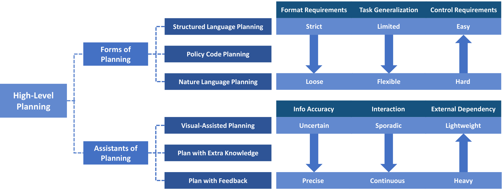
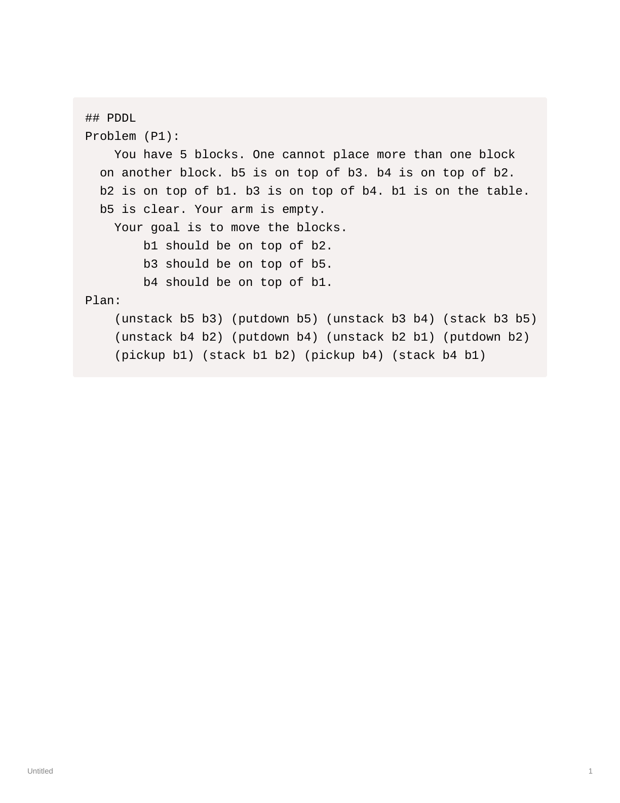
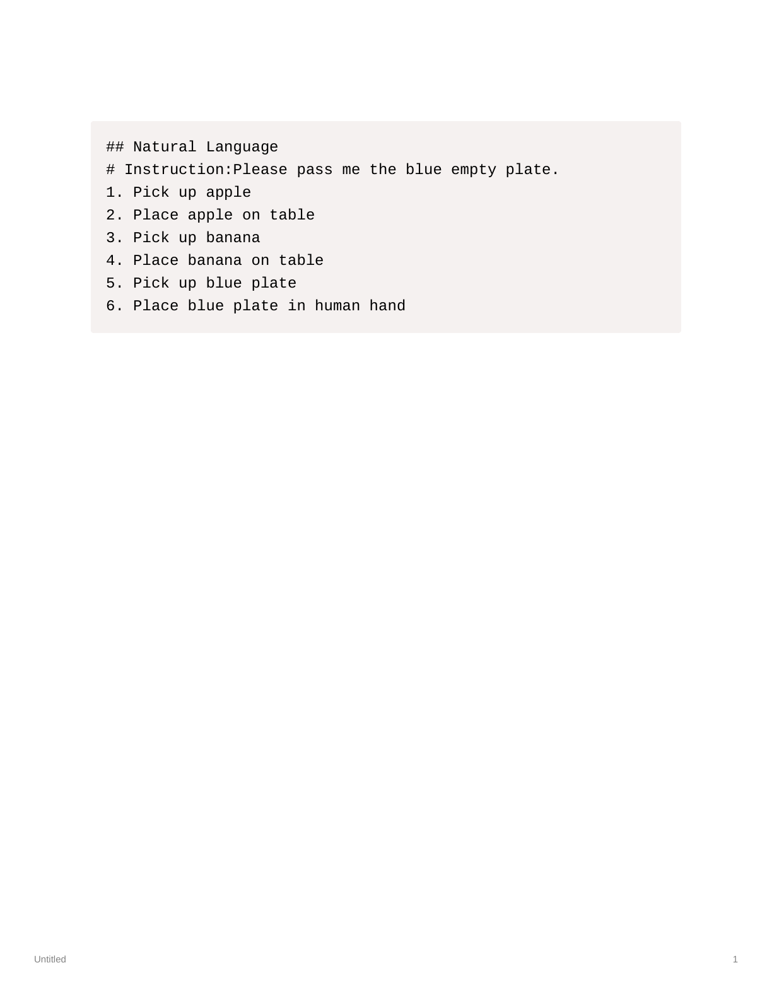

# S1. A Survey on Robotics with Foundation Models: toward Embodied AI

## 0. 읽기 전 약어 및 핵심 용어

이 문서를 읽기 전에 아래 약어와 용어를 먼저 정리한다. 이후 본문에서는 괄호 안의 약어를 사용한다.

- Artificial Intelligence (AI): 사람의 지각, 추론, 학습, 의사결정 능력을 기계가 수행하도록 만드는 인공지능 분야를 뜻한다.
- Application Programming Interface (API): 소프트웨어 모듈이나 robot primitive를 외부에서 호출하기 위한 함수/규약 interface이다.
- Large Language Model (LLM): 대규모 텍스트 데이터로 학습되어 언어 이해, 생성, 추론, 계획에 쓰이는 foundation model이다.
- Vision-Language Model (VLM): 이미지와 텍스트를 함께 입력받아 시각-언어 이해나 생성 작업을 수행하는 모델이다.
- Vision-Language-Action (VLA): 시각 관측과 언어 명령을 함께 받아 로봇 action까지 생성하는 모델 또는 학습 패러다임이다.
- Robotics Foundation Model (RFM): 로봇의 지각, 계획, 제어, 조작 능력에 전이되도록 학습된 foundation model을 뜻한다.
- Planning Domain Definition Language (PDDL): symbolic planning에서 action, precondition, effect, goal을 엄격한 형식으로 기술하는 planning language이다.
- Robotics Transformer (RT): robot observation을 입력받아 action을 예측하는 transformer 기반 robot policy 계열을 뜻한다.
- Robotics Transformer 1 (RT-1): Google의 실제 로봇 demonstration data로 학습한 transformer 기반 robot control policy이다.
- Robotics Transformer 2 (RT-2): web-scale vision-language knowledge와 robot trajectory를 함께 학습해 action token을 생성하는 VLA 모델이다.
- Physical Intelligence pi-zero model (pi0): Physical Intelligence가 제안한 general robot control용 vision-language-action flow model이다.
- Generalist Robot 00 Technology (GR00T): NVIDIA가 humanoid/generalist robot을 위해 공개한 robot foundation model family 이름이다.
- World Action Model (WAM): video/world model이 action과 future observation을 함께 모델링해 policy처럼 쓰일 수 있게 만든 모델이다.
- Physical Artificial Intelligence (Physical AI): 디지털 공간의 예측을 넘어 물리 세계에서 지각, 예측, 계획, 행동, 안전 검사를 수행하는 AI 시스템을 뜻한다.

## 1. Metadata

| 항목 | 내용 |
|---|---|
| 논문 | A Survey on Robotics with Foundation Models: toward Embodied AI |
| 저자 | Zhiyuan Xu, Kun Wu, Junjie Wen, Jinming Li, Ning Liu, Zhengping Che, Jian Tang |
| 소속 | Midea Group |
| 공개일 | 2024-02-04 |
| 링크 | https://arxiv.org/abs/2402.02385 |
| 성격 | foundation model을 robotics planning/control에 연결하는 survey |

## 2. 핵심 요약

이 survey는 foundation model을 로봇에 적용하는 방식을 high-level planning과 low-level control로 나누어 정리한다. 초반 스터디에서 유용한 이유는 Physical AI를 "큰 모델을 로봇에 붙인다"가 아니라, perception, reasoning, planning, control, dataset, simulator, benchmark가 얽힌 시스템 문제로 보게 해주기 때문이다.

  

Figure 1. Foundation models for robotics overview. survey는 foundation model이 planning과 control 양쪽에 들어가는 위치를 큰 지도처럼 보여준다.

## 3. 논문이 제시하는 분류

High-level planning은 자연어 명령과 환경 관측을 받아 long-horizon task를 step-by-step으로 나누는 영역이다. 저자들은 계획 표현을 PDDL 같은 strict structured language, code-based policy, natural language plan으로 구분한다. 표현이 엄격할수록 실행기는 다루기 쉽지만 zero-shot 유연성이 떨어지고, 자연어가 될수록 표현력은 커지지만 grounding과 execution이 어려워진다.

  

Figure 2. PDDL planning. structured planning은 검증과 재사용성이 좋지만, 표현 형식이 강하게 고정된다.

  

Figure 3. Policy code planning. code는 spatial relation, feedback loop, primitive API 호출을 명확하게 표현할 수 있다.

  

Figure 4. Natural language planning. 자연어 계획은 사용자 친화적이고 유연하지만, low-level controller가 의미를 안정적으로 실행해야 한다.

Low-level control은 실행 명령을 실제 end-effector pose, joint command, gripper state 등으로 변환하는 영역이다. 이 survey는 VLM/LLM을 frozen representation으로 쓰는 방식, robot data로 fine-tuning하는 방식, large-scale robot foundation model을 학습하는 방식이 점점 연결된다고 본다.

## 4. 스터디에서 가져갈 포인트

Physical AI의 난점은 모델 하나가 아니라 interface의 난점이다. 언어 계획은 hallucination과 grounding 문제가 있고, low-level control은 data scale과 embodiment mismatch 문제가 있다. 따라서 이후 RT-1, RT-2, PaLM-E, OpenVLA, pi0, GR00T, DreamZero를 볼 때도 "어디까지가 planning이고 어디부터가 control인가"를 계속 질문해야 한다.

이 논문은 2024년 초 기준 survey라 최신 WAM/World Action Model까지 포괄하지는 못한다. 하지만 curriculum 초반에 분야의 vocabulary를 잡는 데 좋다. 특히 datasets, simulators, benchmarks가 별도 구성 요소로 다뤄진다는 점은 운영/현장 적용 관점에서 중요하다.

## 5. 연결되는 논문

| 연결 | 논문 | 관계 |
|---|---|---|
| planning | G2 SayCan, G5 PaLM-E | LLM/VLM 기반 high-level planning |
| control | G4 RT-1, G6 RT-2 | foundation model을 action prediction으로 확장 |
| data scale | D1 Open X-Embodiment | robot data scaling 문제의 대표 사례 |
| world model | W4 Genie, W10 DreamGen, W12 DreamZero | survey 이후 등장한 video/world-model 기반 흐름 |
