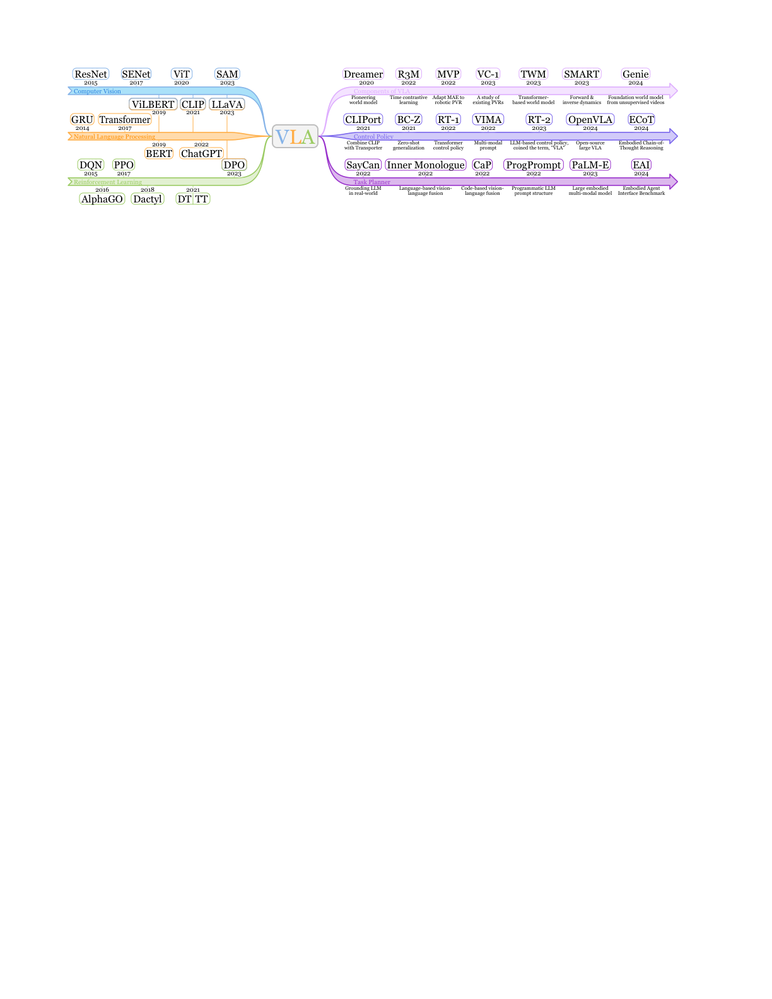

# S2. A Survey on Vision-Language-Action Models for Embodied AI

## 0. 읽기 전 약어 및 핵심 용어

이 문서를 읽기 전에 아래 약어와 용어를 먼저 정리한다. 이후 본문에서는 괄호 안의 약어를 사용한다.

- Artificial Intelligence (AI): 사람의 지각, 추론, 학습, 의사결정 능력을 기계가 수행하도록 만드는 인공지능 분야를 뜻한다.
- Vision-Language Model (VLM): 이미지와 텍스트를 함께 입력받아 시각-언어 이해나 생성 작업을 수행하는 모델이다.
- Vision-Language-Action (VLA): 시각 관측과 언어 명령을 함께 받아 로봇 action까지 생성하는 모델 또는 학습 패러다임이다.
- Behavior Cloning (BC): expert demonstration의 observation-action pair를 supervised learning으로 모방하는 imitation learning 방법이다.
- Behavior Cloning from Zero-shot task specification (BC-Z): language나 goal image 같은 task specification을 조건으로 zero-shot generalization을 노리는 behavior cloning 계열 방법이다.
- Reinforcement Learning (RL): agent가 reward를 최대화하도록 environment와 상호작용하며 policy를 학습하는 방법이다.
- Robotics Transformer (RT): robot observation을 입력받아 action을 예측하는 transformer 기반 robot policy 계열을 뜻한다.
- Robotics Transformer 1 (RT-1): Google의 실제 로봇 demonstration data로 학습한 transformer 기반 robot control policy이다.
- Robotics Transformer 2 (RT-2): web-scale vision-language knowledge와 robot trajectory를 함께 학습해 action token을 생성하는 VLA 모델이다.
- Cross-Embodiment Vision-Language-Action model (X-VLA): 서로 다른 robot embodiment의 camera, action space, hardware 차이를 하나의 VLA 안에서 다루려는 cross-embodiment model이다.
- General Robot Manipulation with Multimodal Prompts model (VIMA): language, image, video demonstration을 함께 prompt로 받아 robot manipulation task를 수행하는 policy이다.
- Physical Intelligence pi-zero model (pi0): Physical Intelligence가 제안한 general robot control용 vision-language-action flow model이다.
- Physical Intelligence pi-zero-point-five model (pi0.5): pi0를 open-world household manipulation으로 확장한 VLA model이다.
- Generalist Robot 00 Technology (GR00T): NVIDIA가 humanoid/generalist robot을 위해 공개한 robot foundation model family 이름이다.
- Chinese University of Hong Kong (CUHK): 홍콩중문대학교를 뜻한다.

## 1. Metadata

| 항목 | 내용 |
|---|---|
| 논문 | A Survey on Vision-Language-Action Models for Embodied AI |
| 저자 | Yueen Ma, Zixing Song, Yuzheng Zhuang, Jianye Hao, Irwin King |
| 소속 | CUHK / University of Bristol / Huawei Noah's Ark Lab |
| 공개일 | 2024-05-23, arXiv v7 2026-02-04 |
| 링크 | https://arxiv.org/abs/2405.14093 |
| 리소스 | https://github.com/yueen-ma/Awesome-VLA |

## 2. 핵심 요약

이 survey는 VLA를 vision, language, action 세 modality를 모두 다루는 embodied AI 모델군으로 정의하고, 구성 요소, low-level control policy, high-level task planner의 세 축으로 정리한다. RT-2 이후 VLA라는 용어가 빠르게 확산된 시점의 지형도를 제공한다.

  

Figure 1. General architecture of VLA models. vision encoder, language encoder, action decoder가 중심이며, pretrained visual representation, reasoning, world model, dynamics learning, RL, policy steering이 주변 모듈로 연결된다.

## 3. VLA를 읽는 세 가지 관점

첫째, component 관점이다. VLA는 vision encoder, language model, action decoder가 어떻게 결합되는지가 중요하다. visual representation은 object, pose, geometry를 제공하고, language model은 instruction과 reasoning을 담당하며, action decoder는 discrete token, continuous action, diffusion/flow action 등 다양한 형태로 구현된다.

둘째, control policy 관점이다. RT-1, RT-2, OpenVLA, pi0 계열은 language-conditioned robot policy로서 state와 instruction을 action으로 직접 매핑한다. 이 축은 실제 로봇 제어 성능과 데이터 규모가 핵심이다.

셋째, task planner 관점이다. 복잡한 long-horizon task는 VLA 단독 action prediction만으로 해결하기 어렵기 때문에 planner가 subtask를 만들고 low-level policy가 실행하는 구조가 필요하다. 이 지점에서 SayCan, CaP, PaLM-E 같은 계열과 연결된다.

  

Figure 2. Timeline. CLIPort, BC-Z, RT-1, VIMA, RT-2, OpenVLA 등 주요 VLA milestone을 시간순으로 정리한다.

  

Figure 3. Components. VLA 시스템을 구성하는 perception, language, action, policy learning 요소를 분해해서 볼 수 있다.

## 4. 한계와 이후 흐름

survey가 강조하는 문제는 data scarcity, embodiment heterogeneity, long-horizon planning, evaluation standardization이다. 특히 VLA가 web-scale VLM 지식을 가져오더라도 action grounding은 robot data에 크게 의존한다. 이 한계는 이후 pi0/pi0.5, GR00T, X-VLA, DreamZero에서 각각 flow matching, open-world generalization, humanoid foundation model, video world prior로 풀리기 시작한다.

World model은 이 survey에서 VLA 주변 구성요소 중 하나로 등장하지만, W10-W12로 갈수록 주변 모듈이 아니라 policy generalization의 중심축으로 이동한다. 스터디에서는 이 변화를 눈여겨보면 좋다.

## 5. 연결되는 논문

| 연결 | 논문 | 관계 |
|---|---|---|
| 대표 VLA | G6 RT-2, D5 OpenVLA, P4 pi0, P5 pi0.5 | survey의 중심 모델군 |
| planner | G2 SayCan, G5 PaLM-E | high-level planner와 VLA 연결 |
| architecture | V1-V8 | reasoning, spatial understanding, efficient VLA 변형 |
| world model 전환 | W10-W12 | VLA 한계를 video/world prior로 보완 |
