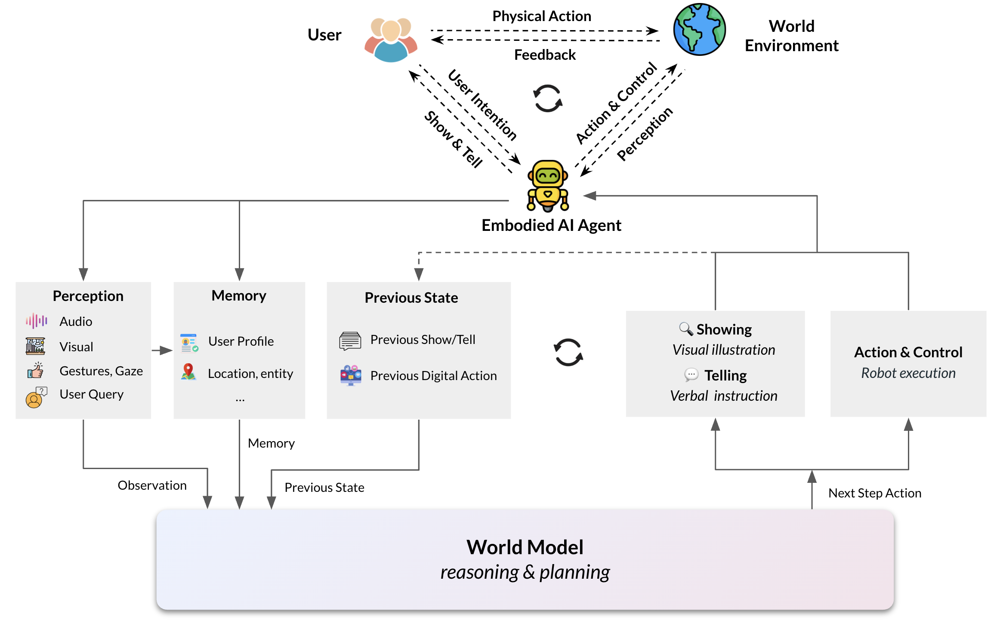
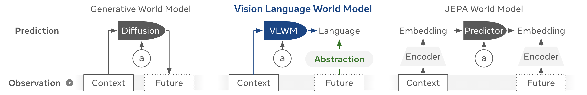

# S3. Embodied AI Agents: Modeling the World

## 0. 읽기 전 약어 및 핵심 용어

이 문서를 읽기 전에 아래 약어와 용어를 먼저 정리한다. 이후 본문에서는 괄호 안의 약어를 사용한다.

- Artificial Intelligence (AI): 사람의 지각, 추론, 학습, 의사결정 능력을 기계가 수행하도록 만드는 인공지능 분야를 뜻한다.
- Vision-Language-Action (VLA): 시각 관측과 언어 명령을 함께 받아 로봇 action까지 생성하는 모델 또는 학습 패러다임이다.
- Lifelong Robot Learning Benchmark (LIBERO): 로봇이 여러 task를 순차적으로 배우며 knowledge transfer와 forgetting을 평가하는 benchmark이다.
- Physical Artificial Intelligence (Physical AI): 디지털 공간의 예측을 넘어 물리 세계에서 지각, 예측, 계획, 행동, 안전 검사를 수행하는 AI 시스템을 뜻한다.

## 1. Metadata

| 항목 | 내용 |
|---|---|
| 논문 | Embodied AI Agents: Modeling the World |
| 저자 | Pascale Fung, Yoram Bachrach, Asli Celikyilmaz, Kamalika Chaudhuri, Delong Chen et al. |
| 소속 | Meta AI Research |
| 공개일 | 2025-06-27, arXiv v3 2025-07-07 |
| 링크 | https://arxiv.org/abs/2506.22355 |
| 성격 | embodied agent와 world model에 대한 position/survey paper |

## 2. 핵심 요약

이 논문은 embodied AI agent를 virtual avatar, wearable agent, robotic agent로 넓게 정의하고, 이들의 핵심 구성 요소로 world model을 둔다. Physical AI 관점에서 중요한 점은 world model을 단순한 dynamics predictor가 아니라 perception, planning, reasoning, memory, action/control, 그리고 user의 mental world model까지 포함하는 agent architecture의 중심으로 본다는 것이다.

  

Figure 1. Embodied AI agent architecture. user, world, agent의 interaction loop 안에서 world model이 planning과 reasoning의 핵심 역할을 한다.

## 3. Physical World Model과 Mental World Model

논문은 world model을 두 층으로 나눈다. physical world model은 주변 환경을 이해하고 future state를 예측하며 low-level/high-level action planning을 가능하게 한다. mental world model은 사용자의 의도, 선호, 사회적 맥락을 추론해 human-agent collaboration을 더 자연스럽게 만든다.

이 구분은 로봇 연구에서도 중요하다. 예를 들어 table bussing robot은 물체의 위치와 dynamics만 알아서는 부족하고, 사람이 무엇을 의도하는지, 어떤 행동이 방해가 되는지, 어떤 설명이 필요한지도 추론해야 한다. 즉 Physical AI는 물리 세계와 사회적 맥락의 결합 문제로 확장된다.

  

Figure 2. Vision-language world model. multimodal perception과 world prediction이 embodied reasoning의 기반이 된다.

  

Figure 3. Mental world model. 사용자 의도와 사회적 맥락을 모델링하는 방향을 별도 축으로 제시한다.

## 4. Benchmarks and Evaluation

논문은 world model benchmark로 minimal video pairs, IntPhys2, CausalVQA, World Prediction Benchmark 등을 다룬다. 이는 world model 평가가 단순히 pixel quality가 아니라 physical plausibility, causality, action-conditioned prediction, goal inference를 봐야 한다는 뜻이다.

  

Figure 4. World Prediction Benchmark. future prediction을 통해 모델의 world understanding을 평가하는 흐름이다.

## 5. 스터디에서의 역할

이 문서는 모델 하나의 성능보다 "어떤 agent architecture가 필요한가"를 논의하게 해준다. W2 DreamerV3는 latent world model을 agent learning에 쓰고, W4 Genie는 interactive environment를 생성하며, W12 DreamZero는 video world model을 action policy로 만든다. S3는 이 흐름을 더 넓은 agent design 문제로 확장한다.

## 6. 연결되는 논문

| 연결 | 논문 | 관계 |
|---|---|---|
| world model | W2-W12 | physical world prediction과 planning |
| VLA | G6, D5, P4, P5 | embodied action/control의 구현체 |
| evaluation | E3 RoboArena, E4 LIBERO | world model/agent를 어떻게 평가할지의 문제 |
| human-agent | A 계열 | multi-agent, healthcare, wearable 등 adjacent application |
