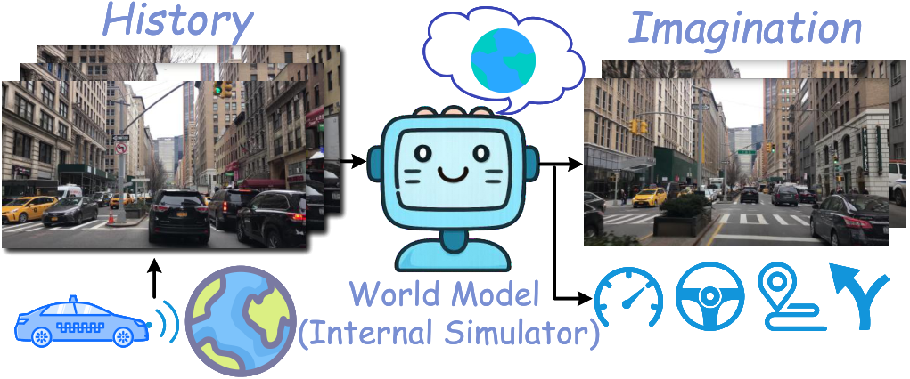

# S4. A Comprehensive Survey on World Models for Embodied AI

## 0. 읽기 전 약어 및 핵심 용어

이 문서를 읽기 전에 아래 약어와 용어를 먼저 정리한다. 이후 본문에서는 괄호 안의 약어를 사용한다.

- Artificial Intelligence (AI): 사람의 지각, 추론, 학습, 의사결정 능력을 기계가 수행하도록 만드는 인공지능 분야를 뜻한다.
- Reinforcement Learning (RL): agent가 reward를 최대화하도록 environment와 상호작용하며 policy를 학습하는 방법이다.
- World Model (WM): agent가 environment dynamics와 미래 상태 변화를 내부적으로 예측하기 위해 학습하는 모델이다.
- World Action Model (WAM): video/world model이 action과 future observation을 함께 모델링해 policy처럼 쓰일 수 있게 만든 모델이다.
- A Generative World Model for Autonomous Driving (GAIA-1): video, text, action condition을 이용해 driving scene의 미래를 생성하는 Wayve의 world model이다.
- Physical Artificial Intelligence (Physical AI): 디지털 공간의 예측을 넘어 물리 세계에서 지각, 예측, 계획, 행동, 안전 검사를 수행하는 AI 시스템을 뜻한다.

## 1. Metadata

| 항목 | 내용 |
|---|---|
| 논문 | A Comprehensive Survey on World Models for Embodied AI |
| 저자 | Xinqing Li, Xin He, Le Zhang, Min Wu, Xiaoli Li, Yun Liu |
| 소속 | Multi-institution collaborators |
| 공개일 | 2025-10-19 |
| 링크 | https://arxiv.org/abs/2510.16732 |
| 성격 | embodied AI용 world model survey |

## 2. 핵심 요약

이 survey는 world model을 embodied AI의 perception-action loop 안에서 정리한다. 핵심은 world model이 단지 미래 frame을 생성하는 모델이 아니라, state abstraction, temporal prediction, decision making, generalization, planning을 연결하는 구조라는 점이다.

  

Figure 1. Core concepts. world model은 environment dynamics, state representation, prediction, decision을 함께 다루는 개념으로 정리된다.

## 3. World Model을 보는 축

survey는 world model을 representation, prediction granularity, decision integration, multimodal grounding, long-horizon reasoning 같은 축으로 나누어 볼 수 있게 한다. 이 분류는 W2 DreamerV3와 W10-W12를 비교할 때 특히 유용하다.

Dreamer 계열은 compact latent state에서 dynamics를 학습하고 imagination rollout으로 policy를 학습한다. Genie/GAIA/Pandora/UniSim/DreamZero 계열은 video 또는 interactive visual simulation을 통해 더 풍부한 perceptual future를 생성한다. 전자는 sample-efficient RL에 강하고, 후자는 open-world physical prior와 human-interpretable future에 강하다.

  

Figure 2. General world model flow. observation에서 latent/world state를 만들고, transition/prediction을 통해 action decision과 연결한다.

  

Figure 3. Language/vision grounding. embodied world model은 visual state뿐 아니라 language goal과 action interface를 함께 다뤄야 한다.

## 4. 발표 포인트

이 논문은 특정 모델의 contribution보다 taxonomy를 발표하는 데 적합하다. 발표에서는 world model을 latent dynamics, video generation, simulator, policy-coupled model 네 범주로 재구성해서 설명하면 W2-W12 전체 흐름과 잘 맞는다.

운영/현장 적용 관점에서는 world model이 "현장을 예측하는 digital twin"과 닮아 있다는 점을 강조할 수 있다. 다만 Physical AI의 world model은 단순 시뮬레이션이 아니라 action-conditioned, uncertainty-aware, policy-coupled prediction이어야 한다.

## 5. 연결되는 논문

| 연결 | 논문 | 관계 |
|---|---|---|
| latent WM | W2 DreamerV3, W3 Scalable World Models | compact latent dynamics |
| interactive WM | W4 Genie, W5 Genie 2, W8 UniSim | action-conditioned simulator |
| video WM | W6 Pandora, W9 GAIA-1, W10 DreamGen | video future prediction |
| WAM | W12 DreamZero | world model과 action policy의 결합 |
