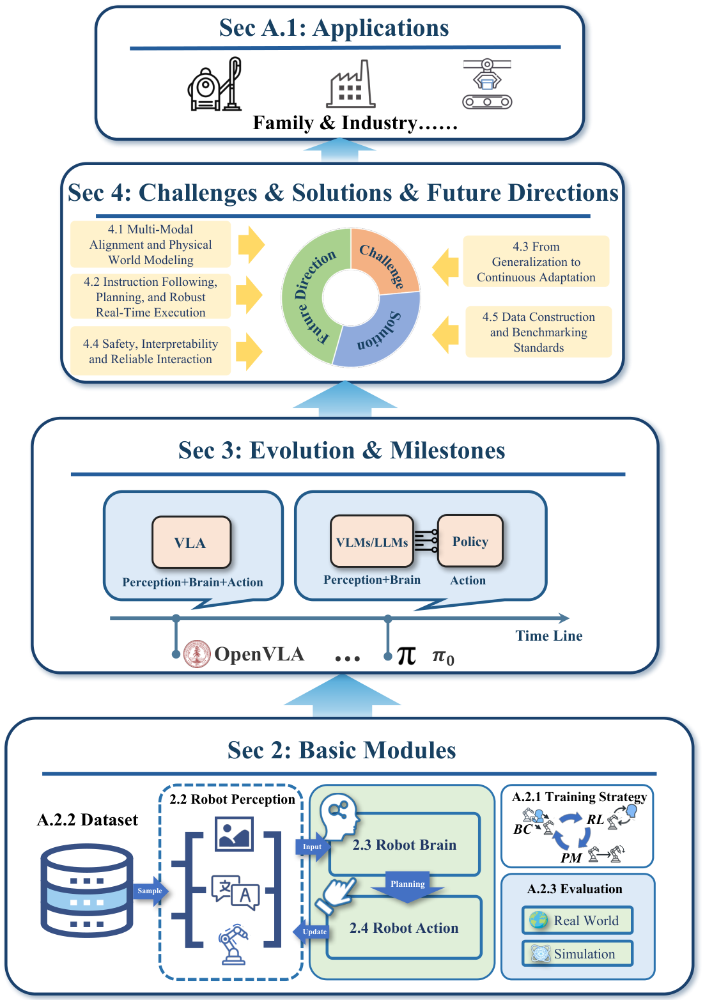
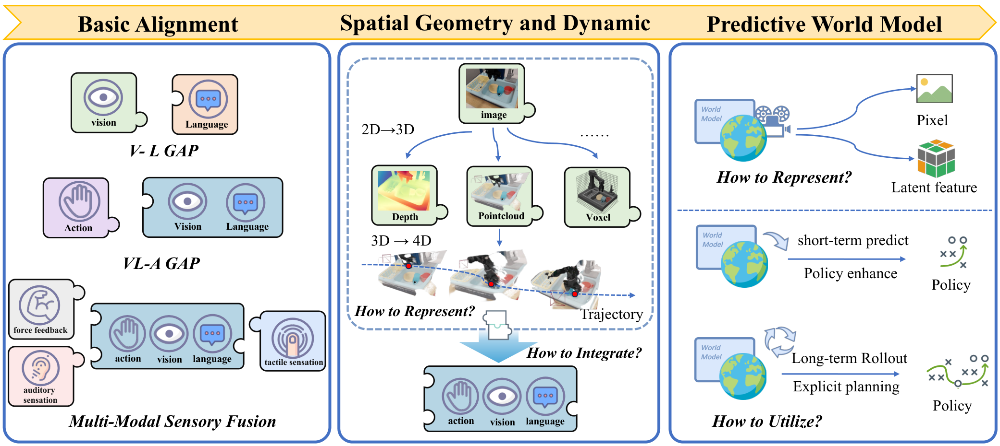
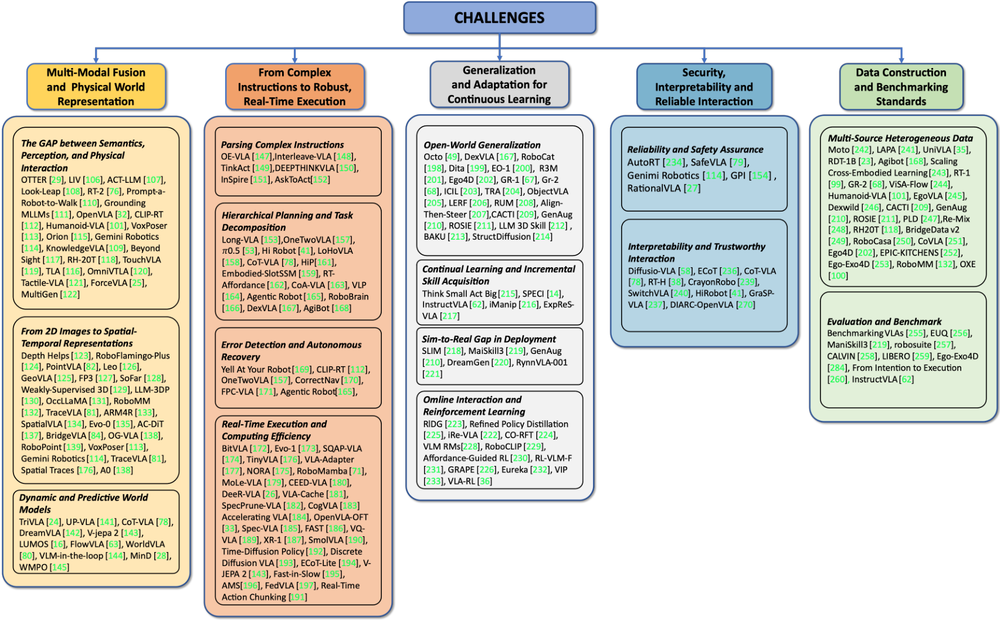

# S5. An Anatomy of Vision-Language-Action Models: From Modules to Milestones and Challenges

## 0. 읽기 전 약어 및 핵심 용어

이 문서를 읽기 전에 아래 약어와 용어를 먼저 정리한다. 이후 본문에서는 괄호 안의 약어를 사용한다.

- Artificial Intelligence (AI): 사람의 지각, 추론, 학습, 의사결정 능력을 기계가 수행하도록 만드는 인공지능 분야를 뜻한다.
- Large Language Model (LLM): 대규모 텍스트 데이터로 학습되어 언어 이해, 생성, 추론, 계획에 쓰이는 foundation model이다.
- Vision-Language Model (VLM): 이미지와 텍스트를 함께 입력받아 시각-언어 이해나 생성 작업을 수행하는 모델이다.
- Vision-Language-Action (VLA): 시각 관측과 언어 명령을 함께 받아 로봇 action까지 생성하는 모델 또는 학습 패러다임이다.
- Reinforcement Learning (RL): agent가 reward를 최대화하도록 environment와 상호작용하며 policy를 학습하는 방법이다.
- Robotics Transformer (RT): robot observation을 입력받아 action을 예측하는 transformer 기반 robot policy 계열을 뜻한다.
- Robotics Transformer 1 (RT-1): Google의 실제 로봇 demonstration data로 학습한 transformer 기반 robot control policy이다.
- Robotics Transformer 2 (RT-2): web-scale vision-language knowledge와 robot trajectory를 함께 학습해 action token을 생성하는 VLA 모델이다.
- Lifelong Robot Learning Benchmark (LIBERO): 로봇이 여러 task를 순차적으로 배우며 knowledge transfer와 forgetting을 평가하는 benchmark이다.
- Physical Intelligence pi-zero model (pi0): Physical Intelligence가 제안한 general robot control용 vision-language-action flow model이다.
- Generalist Robot 00 Technology (GR00T): NVIDIA가 humanoid/generalist robot을 위해 공개한 robot foundation model family 이름이다.
- World Action Model (WAM): video/world model이 action과 future observation을 함께 모델링해 policy처럼 쓰일 수 있게 만든 모델이다.
- Physical Artificial Intelligence (Physical AI): 디지털 공간의 예측을 넘어 물리 세계에서 지각, 예측, 계획, 행동, 안전 검사를 수행하는 AI 시스템을 뜻한다.

## 1. Metadata

| 항목 | 내용 |
|---|---|
| 논문 | An Anatomy of Vision-Language-Action Models: From Modules to Milestones and Challenges |
| 저자 | Chao Xu, Suyu Zhang, Yang Liu, Baigui Sun, Weihong Chen et al. |
| 소속 | Multi-institution collaborators |
| 공개일 | 2025-12-12 |
| 링크 | https://arxiv.org/abs/2512.11362 |
| 성격 | VLA architecture, milestone, challenge survey |

## 2. 핵심 요약

이 survey는 VLA를 perception, brain/reasoning, action generation, training strategy, dataset/evaluation challenge로 해부한다. S2가 VLA의 초기 지도라면, S5는 2025년 말까지 확장된 VLA 생태계를 모듈별로 다시 정리한 문서에 가깝다.

  

Figure 1. VLA overview. VLA를 구성하는 perception, reasoning, action, data/evaluation 축을 한 장으로 정리한다.

## 3. 모듈 관점

논문은 VLA를 하나의 end-to-end black box로만 보지 않는다. perception module은 image, video, 3D, tactile/force input까지 확장되고, brain module은 LLM/VLM reasoning, chain-of-thought, subgoal planning을 담당한다. action module은 discrete token, continuous control, diffusion/flow matching, hierarchical action representation으로 나뉜다.

  

Figure 2. VLA construction. model construction을 module별로 나누어 보는 방식은 이후 논문 비교표 작성에 유용하다.

  

Figure 3. VLA timeline. RT-1, RT-2, OpenVLA, pi0, GR00T, reasoning VLA, world-model VLA까지의 milestone을 정리한다.

## 4. Challenge 관점

survey는 VLA의 핵심 도전으로 generalization, long-horizon reasoning, safety/interpretability, data construction, benchmark standardization을 꼽는다. 특히 최신 흐름에서는 VLA가 passive imitation을 넘어 active exploration, world prediction, RL-based improvement로 이동한다고 본다.

  

Figure 4. Challenges. VLA 시스템의 한계는 architecture보다 data, evaluation, safety, deployment와 더 깊이 연결된다.

## 5. World Model과의 연결

이 survey의 흥미로운 지점은 world model이 VLA의 future prediction/training strategy 중 하나로 점점 중요해진다는 점이다. WorldVLA, predictive modeling, embodied world model benchmark 흐름은 W10-W12의 핵심 문제의식과 맞닿아 있다. 즉 2025년 말 VLA survey를 보면, Physical AI의 다음 방향은 action-only VLA가 아니라 world-aware VLA 또는 WAM으로 이동하고 있음을 확인할 수 있다.

## 6. 연결되는 논문

| 연결 | 논문 | 관계 |
|---|---|---|
| VLA milestone | G4, G6, D5, P4, P5, P6 | timeline의 주요 모델 |
| reasoning VLA | V1-V8 | CoT, spatial, physical reachability 확장 |
| evaluation | E3 RoboArena, E4 LIBERO | benchmark standardization 문제 |
| WAM | W10-W12 | world prediction과 action policy 결합 |
