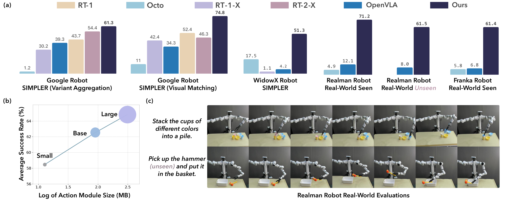
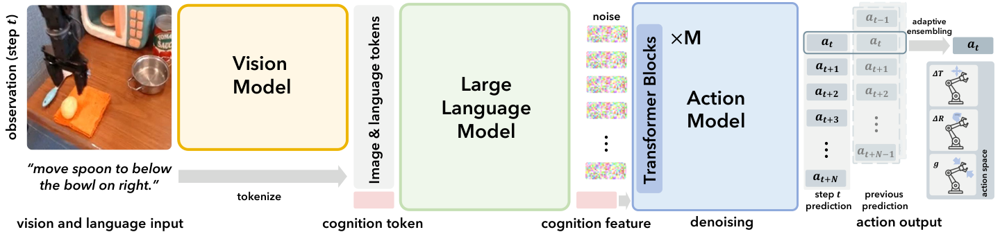

# V1. CogACT: A Foundational Vision-Language-Action Model for Synergizing Cognition and Action in Robotic Manipulation

## 0. 읽기 전 약어 및 핵심 용어

이 문서를 읽기 전에 아래 약어와 용어를 먼저 정리한다. 이후 본문에서는 괄호 안의 약어를 사용한다.

- Artificial Intelligence (AI): 사람의 지각, 추론, 학습, 의사결정 능력을 기계가 수행하도록 만드는 인공지능 분야를 뜻한다.
- Vision-Language Model (VLM): 이미지와 텍스트를 함께 입력받아 시각-언어 이해나 생성 작업을 수행하는 모델이다.
- Vision-Language-Action (VLA): 시각 관측과 언어 명령을 함께 받아 로봇 action까지 생성하는 모델 또는 학습 패러다임이다.
- Multi-Layer Perceptron (MLP): fully connected layer를 여러 층 쌓은 feed-forward neural network이다.
- Diffusion Transformer (DiT): U-Net 대신 transformer backbone을 사용해 diffusion denoising이나 flow prediction을 수행하는 architecture이다.
- Mean Squared Error (MSE): 예측값과 정답의 차이를 제곱해 평균한 regression loss이다.
- Robotics Transformer (RT): robot observation을 입력받아 action을 예측하는 transformer 기반 robot policy 계열을 뜻한다.
- Robotics Transformer 2 (RT-2): web-scale vision-language knowledge와 robot trajectory를 함께 학습해 action token을 생성하는 VLA 모델이다.
- Robotics Transformer-X model family (RT-X): Open X-Embodiment 데이터 위에서 여러 robot embodiment로 확장한 RT 계열 policy family를 뜻한다.
- Robotics Transformer 2-X (RT-2-X): Open X-Embodiment 데이터로 확장 학습한 RT-2 계열 cross-embodiment VLA policy이다.
- Open X-Embodiment (OXE): 여러 기관, 로봇, task의 demonstration을 묶은 대규모 cross-embodiment robot dataset이다.
- Action Chunking with Transformers (ACT): 여러 timestep의 action chunk를 한 번에 예측해 fine-grained robot manipulation을 학습하는 transformer policy이다.
- Simulation-to-Real Policy Evaluation for Robot Manipulation (SIMPLER): real robot 없이 simulation에서 manipulation policy를 비교 평가하려는 evaluation setup이다.
- General Robot Manipulation with Multimodal Prompts model (VIMA): language, image, video demonstration을 함께 prompt로 받아 robot manipulation task를 수행하는 policy이다.
- Robotics Diffusion Transformer (RDT): diffusion model과 transformer를 결합해 robot action trajectory를 생성하는 robot foundation policy 계열이다.
- Robotics Diffusion Transformer 1B (RDT-1B): 약 1B parameter 규모의 bimanual manipulation diffusion foundation model이다.
- Physical Intelligence pi-zero model (pi0): Physical Intelligence가 제안한 general robot control용 vision-language-action flow model이다.
- Generalist Robot 00 Technology (GR00T): NVIDIA가 humanoid/generalist robot을 위해 공개한 robot foundation model family 이름이다.
- University of Science and Technology of China (USTC): 중국과학기술대학교를 뜻한다.
- Chinese Academy of Sciences (CAS): 중국과학원을 뜻한다.
- Physical Artificial Intelligence (Physical AI): 디지털 공간의 예측을 넘어 물리 세계에서 지각, 예측, 계획, 행동, 안전 검사를 수행하는 AI 시스템을 뜻한다.

## 1. Metadata

| Field | 내용 |
|---|---|
| ID | `V1` |
| Title | CogACT: A Foundational Vision-Language-Action Model for Synergizing Cognition and Action in Robotic Manipulation |
| Authors | Qixiu Li, Yaobo Liang, Zeyu Wang, Lin Luo et al. |
| Affiliation / Team | Microsoft Research Asia / Tsinghua University / USTC / CAS |
| Venue / Status | arXiv |
| Date | 2024-11-29 |
| Link | https://arxiv.org/abs/2411.19650 |
| Local source | `paper_corpus/sources/V1` |
| Source figures | `paper_corpus/figures_source/V1/manifest.md` |

## 2. 핵심 요약

CogACT는 VLM 기반 VLA에서 cognition과 action을 분리한 componentized architecture를 제안한다. 기존 RT-2/OpenVLA 계열은 VLM을 action prediction에 직접 재사용하면서 continuous action을 discrete token/bin으로 바꾸는 경향이 있었다. CogACT는 VLM이 visual-language cognition feature를 만들고, 별도의 diffusion transformer action module이 이 feature를 condition으로 multi-step continuous action sequence를 생성하도록 설계한다.

핵심 메시지는 "VLM의 semantic/cognitive generalization은 살리되, dense robot action은 전용 action module이 모델링해야 한다"는 것이다.

## 3. 왜 중요한가?

- OpenVLA와 유사한 7B급 VLM base를 사용하면서 action module 설계만 바꿔 큰 성능 차이를 보인다.
- action discretization 대신 diffusion action transformer를 사용해 continuous, multimodal, temporally correlated action을 다룬다.
- action module size scaling을 체계적으로 비교하고, DiT action module이 log-parameter scale에서 성능이 좋아지는 경향을 보고한다.
- SIMPLER simulation, Realman real robot, Franka real robot까지 여러 embodiment에서 평가한다.
- Adaptive Action Ensemble을 제안해 action chunking/temporal ensemble의 mode averaging 문제를 줄이려 한다.

## 4. Overall Concept

  

<em>Figure 1. CogACT teaser. CogACT는 VLA의 cognition-action decoupling과 action module scaling이 task success를 크게 높일 수 있음을 보여준다. Source figure: <code>figures/teaser-v8.pdf</code>.</em>

CogACT의 문제 제기는 간단하다. VLM은 이미지와 언어를 잘 이해하지만, 그 출력 언어 토큰 공간은 robot action의 연속적이고 정밀한 제어와 다르다. 따라서 VLM을 action tokenizer처럼 쓰지 말고, VLM은 cognition feature를 만들고 action은 action-specialized module이 생성해야 한다.

## 5. Architecture Overview

  

<em>Figure 2. CogACT architecture. Vision module, language/cognition module, diffusion action module로 구성되며, inference에서는 adaptive action ensemble을 적용한다. Source figure: <code>figures/method-V3.pdf</code>.</em>

CogACT는 세 부분으로 구성된다.

| Module | 구성 | 역할 |
|---|---|---|
| vision module | DINOv2 + SigLIP | 현재 image observation을 visual tokens로 변환 |
| language/cognition module | LLAMA-2 기반 VLM | visual token과 language instruction을 통합해 cognition feature 생성 |
| action module | Diffusion Transformer | cognition feature를 condition으로 multi-step action sequence 생성 |

vision/language module은 OpenVLA와 유사하게 pretrained VLM을 기반으로 하지만, action prediction은 VLM next-token head가 아니라 dedicated DiT가 담당한다.

## 6. Problem Formulation

CogACT는 language instruction과 visual observation을 받아 future action sequence를 예측한다.

$$
\boldsymbol{\pi}:
(\boldsymbol{l},\boldsymbol{o}_t)
\rightarrow
(\boldsymbol{a}_t,\boldsymbol{a}_{t+1},\ldots,\boldsymbol{a}_{t+N})
$$

| Notation | 의미 |
|---|---|
| $\boldsymbol{\pi}$ | VLA policy |
| $\boldsymbol{l}$ | language instruction |
| $\boldsymbol{o}_t$ | time $t$의 visual observation |
| $\boldsymbol{a}_t$ | time $t$의 robot action |
| $N$ | future action prediction horizon |

논문은 7-DoF gripper action space를 사용한다.

$$
\boldsymbol{a}_t
=
[\Delta x,\Delta y,\Delta z,\Delta\phi,\Delta\theta,\Delta\psi,g]
$$

| Notation | 의미 |
|---|---|
| $\Delta x,\Delta y,\Delta z$ | end-effector relative translation offset |
| $\Delta\phi,\Delta\theta,\Delta\psi$ | end-effector rotation change |
| $g$ | gripper open/close state, $g\in\{0,1\}$ |

이 formulation은 Open X-Embodiment의 여러 robot을 다루지만, RDT/GR00T처럼 모든 morphology를 일반 unified space로 포괄하기보다는 gripper 7-DoF action setting에 초점을 둔다.

## 7. Vision-Language Cognition Feature

vision module은 현재 image $\boldsymbol{o}_t$를 DINOv2와 SigLIP에 넣어 두 종류의 feature map을 만든다.

$$
\boldsymbol{o}_t
\mapsto
(\boldsymbol{f}_t^{\mathrm{DINO}},\boldsymbol{f}_t^{\mathrm{Sig}})
\mapsto
\mathcal{V}
=
\{\boldsymbol{v}_1,\boldsymbol{v}_2,\ldots,\boldsymbol{v}_{N_\mathcal{V}}\}
$$

| Notation | 의미 |
|---|---|
| $\boldsymbol{f}_t^{\mathrm{DINO}}$ | DINOv2 visual feature map |
| $\boldsymbol{f}_t^{\mathrm{Sig}}$ | SigLIP visual feature map |
| $\mathcal{V}$ | serialized visual perceptual tokens |
| $N_\mathcal{V}$ | visual token length, 논문 default는 256 |

language module은 instruction token, visual token, learnable cognition token을 causal attention으로 처리한다. cognition token에 해당하는 output feature가 action module condition이 된다.

$$
\boldsymbol{f}_t^{\boldsymbol{c}}
=
\mathrm{VLM}
\left(
\mathcal{T},
\mathcal{V},
\boldsymbol{c}
\right)_{\boldsymbol{c}}
$$

| Notation | 의미 |
|---|---|
| $\mathcal{T}$ | LLAMA-2 tokenizer로 만든 language tokens |
| $\boldsymbol{c}$ | learnable cognition token |
| $\boldsymbol{f}_t^{\boldsymbol{c}}$ | cognition token 위치의 output feature |
| $\mathrm{VLM}(\cdot)_{\boldsymbol{c}}$ | VLM output 중 cognition token에 해당하는 feature |

## 8. Diffusion Action Module

CogACT의 action module은 cognition feature $\boldsymbol{f}_t^{\boldsymbol{c}}$와 noisy action sequence를 input token으로 받아 denoising한다. denoising step 정보 $i$는 sinusoidal positional encoding으로 cognition feature에 더한다.

default로 $N=15$ future steps를 예측하므로, current action 포함 16-step action sequence를 생성한다. action module context length는 cognition token과 action tokens를 포함해 $N+2=17$이다.

이 설계는 다음 문제를 겨냥한다.

| Action 특성 | CogACT의 처리 |
|---|---|
| continuous | quantization 대신 diffusion denoising |
| multimodal | distributional action generation |
| temporally correlated | multi-step action sequence prediction |
| high precision | dedicated action module로 VLM token head와 분리 |

## 9. Training Objective

CogACT는 action module이 noise를 예측하도록 end-to-end로 학습한다.

$$
\mathcal{L}_{\mathrm{MSE}}
=
\mathbb{E}_{\boldsymbol{\epsilon}\sim\mathcal{N}(0,1),i}
\left\|
\hat{\boldsymbol{\epsilon}}^i
-
\boldsymbol{\epsilon}
\right\|_2
$$

| Notation | 의미 |
|---|---|
| $\mathcal{L}_{\mathrm{MSE}}$ | diffusion noise prediction loss |
| $\boldsymbol{\epsilon}$ | ground-truth Gaussian noise |
| $\hat{\boldsymbol{\epsilon}}^i$ | denoising step $i$에서 action module이 예측한 noise |
| $i$ | diffusion denoising step |
| $\|\cdot\|_2$ | Euclidean norm |

논문 구현에서는 batch size 256, 8 diffusion steps per sample, learning rate $2e-5$, 135K+ iterations, 16 NVIDIA A100 GPUs 약 5일 학습을 사용한다. vision module, language module, action module은 모두 end-to-end로 train/fine-tune된다.

## 10. Adaptive Action Ensemble

  

<em>Figure 3. Adaptive action ensemble. 현재 observation 기반 prediction과 과거 observation 기반 prediction을 similarity weight로 결합한다. Source figure: <code>figures/inference-V2.pdf</code>.</em>

action chunk를 그대로 실행하면 매 step의 최신 visual information을 덜 쓰고, 현재 action만 실행하면 trajectory가 덜 smooth해질 수 있다. ACT의 temporal ensemble은 과거 prediction을 fixed weight로 평균내지만, 서로 다른 action mode를 평균내면 오히려 mode 밖 action이 될 수 있다.

CogACT는 cosine similarity 기반 adaptive weight를 사용한다.

$$
\hat{\boldsymbol{a}}_t
=
\sum_{k=0}^{K}
w^{\mathrm{ada}}_k
\cdot
\boldsymbol{a}_{t}\mid\boldsymbol{o}_{t-k}
$$

$$
w_k^{\mathrm{ada}}
=
\exp
\left(
\alpha
\cdot
\langle
\boldsymbol{a}_{t}\mid\boldsymbol{o}_{t},
\boldsymbol{a}_{t}\mid\boldsymbol{o}_{t-k}
\rangle
\right)
$$

| Notation | 의미 |
|---|---|
| $\hat{\boldsymbol{a}}_t$ | 실제로 실행할 final action |
| $K$ | ensemble window size |
| $\boldsymbol{a}_{t}\mid\boldsymbol{o}_{t-k}$ | 과거 observation $\boldsymbol{o}_{t-k}$에서 예측된 time $t$ action |
| $w_k^{\mathrm{ada}}$ | adaptive ensemble weight |
| $\langle\cdot,\cdot\rangle$ | cosine similarity |
| $\alpha$ | similarity weighting hyperparameter, 논문 default는 0.1 |

직관적으로 현재 prediction과 비슷한 과거 prediction은 더 많이 반영하고, 다른 mode로 보이는 prediction은 덜 반영한다.

## 11. Training Data and Evaluation Setup

CogACT는 Open X-Embodiment(OXE)를 primary training dataset으로 사용한다. OXE는 60 datasets, 22 robot embodiments, 1M+ real-world trajectories를 포함한다. 논문은 Octo/OpenVLA와 유사한 subset을 사용하며, 총 22.5M frames 규모라고 설명한다.

simulation 평가는 SIMPLER에서 수행한다.

| Robot | Setting | Tasks |
|---|---|---|
| Google Robot | Visual Matching, Variant Aggregation | Pick Coke Can, Move Near, Open/Close Drawer, Open Top Drawer and Place Apple |
| WidowX | Visual Matching | Put Spoon on Towel, Put Carrot on Plate, Stack Green Block, Put Eggplant in Yellow Basket |

## 12. Simulation Results

Google Robot SIMPLER 결과에서 CogACT는 Visual Matching 평균 74.8%, Variant Aggregation 평균 61.3%를 기록한다. 이는 OpenVLA보다 각각 40.5%p, 22.0%p 높고, 55B RT-2-X보다 작은 7.6B 모델로도 평균 성능을 앞선다.

| Setting | RT-2-X | OpenVLA | CogACT |
|---|---:|---:|---:|
| Google Robot, Visual Matching | 46.3% | 34.3% | 74.8% |
| Google Robot, Variant Aggregation | 54.4% | 39.3% | 61.3% |
| WidowX, Visual Matching | n/a | 4.2% | 51.3% |

이 결과는 VLM base 자체보다 action module 설계가 VLA success rate에 큰 영향을 줄 수 있음을 보여준다.

## 13. Real-World Evaluation

  

<em>Figure 4. Real-world evaluation environments of Realman robot and Franka robot. Source figure: <code>figures/task-realmanv2.pdf</code>.</em>

Realman robot에서는 Pick, Stack, Place 세 가지 task를 평가한다. fine-tuning data는 총 391 demonstrations이며, evaluation setting과 동일한 demonstration은 매우 적다.

| Model | Realman Task Avg. |
|---|---:|
| Octo-Base | 4.9% |
| OpenVLA | 12.1% |
| CogACT | 71.2% |

unseen table/distractor setting에서도 CogACT는 평균 58.4%, unseen colors/shapes/categories에서는 평균 64.6%를 기록한다.

Franka robot에서는 4개 task에 대해 task당 100 demonstrations를 수집해 fine-tuning하고, 11 trials로 평가한다.

| Model | Franka Avg. |
|---|---:|
| Octo-Base | 5.8% |
| OpenVLA | 6.8% |
| CogACT | 61.4% |

## 14. Ablation: Action Module Scaling

CogACT의 중요한 기여는 action module scaling 실험이다.

| Action model | Params | Average success |
|---|---:|---:|
| MLP, 3-layer | 3M | 50.6% |
| MLP, 7-layer | 89M | 52.5% |
| DiT-Small | 13M | 58.5% |
| DiT-Base | 89M | 62.5% |
| DiT-Large | 308M | 64.8% |

같은 89M parameter에서도 DiT-Base가 MLP 7-layer보다 훨씬 높다. 논문은 DiT action module의 평균 success rate가 model size의 log scale에 대해 거의 선형적으로 증가한다고 해석한다.

multi-step action prediction도 중요하다.

| Future steps | Average success |
|---:|---:|
| 0 | 42.8% |
| 3 | 55.5% |
| 15 | 62.5% |
| 31 | 51.2% |

너무 짧으면 temporal correlation을 못 쓰고, 너무 길면 오히려 성능이 떨어진다. default $N=15$가 가장 좋다.

Adaptive Ensemble도 기존 action chunking/temporal ensemble보다 높다.

| Strategy | Average success |
|---|---:|
| Action Chunking | 50.7% |
| Temporal Ensemble | 58.9% |
| Adaptive Ensemble | 62.5% |

## 15. Physical AI / World Model 관점

CogACT는 world model을 명시적으로 학습하지 않는다. 그러나 physical AI 관점에서는 "cognition과 action을 어떻게 interface할 것인가"라는 핵심 문제를 다룬다.

| 관점 | CogACT의 의미 |
|---|---|
| cognition-action gap | VLM의 semantic feature와 dense motor action 사이의 간극을 action module로 메운다. |
| action multimodality | diffusion action module로 여러 feasible trajectory mode를 표현한다. |
| temporal consistency | future action sequence와 adaptive ensemble로 smooth control을 강화한다. |
| scaling | VLM 크기만 키우는 대신 action module scaling도 효과적임을 보인다. |

world model 스터디에서는 CogACT를 "미래 상태를 예측하는 모델"이 아니라 "VLM cognition을 action distribution으로 변환하는 motor decoder 설계"로 읽으면 좋다.

## 16. 기존 논문들과의 연결

| 연결 논문 | 연결 포인트 |
|---|---|
| OpenVLA (`D5`) | VLM을 직접 action token prediction에 쓰는 방식과 componentized action module의 대비 |
| RT-2 / RT-X (`G6`, `D1`) | web/VLM knowledge transfer와 robot action prediction의 연결 |
| Diffusion Policy (`P1`) | continuous multimodal action generation |
| RDT-1B (`P3`) | cognition/action 분리와 DiT action module의 유사성 |
| pi0 / GR00T N1 (`P4`, `P6`) | VLM/flow/diffusion action module을 결합하는 최신 VLA 흐름 |
| VIMA (`G3`) | transformer 기반 multimodal prompt/action modeling |

## 17. 한계와 주의점

- action space는 7-DoF gripper 중심이라 humanoid/dexterous hand generalization은 직접 다루지 않는다.
- OpenVLA 대비 큰 성능 향상을 보이지만, real-world evaluation task 범위는 여전히 tabletop manipulation에 가깝다.
- end-to-end fine-tuning은 compute cost와 data engineering 부담이 있다.
- adaptive ensemble은 similarity 기반 heuristic이므로 failure mode나 stability guarantee는 추가 분석이 필요하다.
- world dynamics나 long-horizon planning을 명시적으로 모델링하지 않는다.

## 18. 발표 구성 제안

1. OpenVLA/RT-2식 action tokenization의 한계를 제기한다.
2. cognition-action decoupling 직관을 인간의 cognition/motor cortex analogy와 함께 설명한다.
3. architecture figure로 VLM cognition feature와 diffusion action module을 연결한다.
4. action formulation, 7-DoF action vector, diffusion loss를 설명한다.
5. adaptive ensemble을 ACT temporal ensemble과 비교한다.
6. SIMPLER, Realman, Franka 결과를 OpenVLA 대비로 보여준다.
7. action module scaling ablation으로 "VLA scaling은 VLM만의 문제가 아니다"라고 정리한다.

## 19. 토론 질문

- VLM final token을 action에 직접 쓰는 방식과 cognition token을 condition으로 쓰는 방식의 차이는 어디서 가장 크게 나타날까?
- action module이 커질수록 성능이 좋아진다면, robot foundation model scaling law는 VLM과 action decoder를 따로 봐야 할까?
- Adaptive Ensemble은 서로 다른 action mode를 얼마나 잘 구분할 수 있을까?
- RDT/GR00T처럼 embodiment-aware design을 추가하면 CogACT가 더 확장될 수 있을까?
- world model을 붙인다면 cognition module 앞에 붙이는 것이 좋을까, action module 뒤 rollout model로 붙이는 것이 좋을까?

## 20. 한 문장 정리

CogACT는 VLM의 cognition 능력과 diffusion transformer의 action modeling 능력을 분리/결합함으로써, 기존 VLA의 action discretization 한계를 크게 줄인 componentized VLA 모델이다.