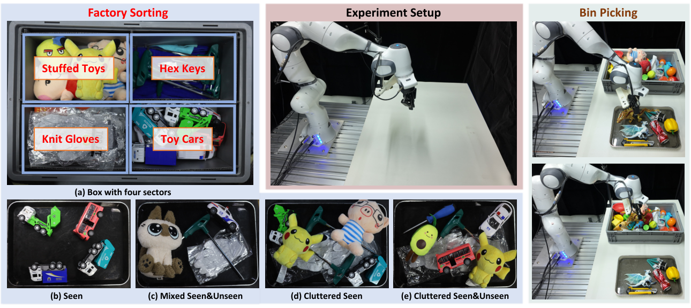
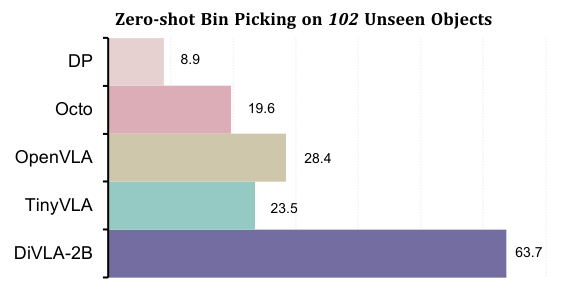
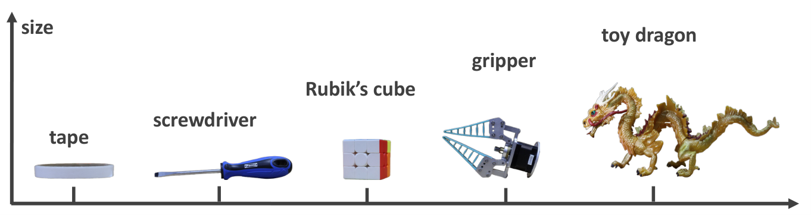

# V2. Diffusion-VLA: Generalizable and Interpretable Robot Foundation Model via Self-Generated Reasoning

## 0. 읽기 전 약어 및 핵심 용어

이 문서를 읽기 전에 아래 약어와 용어를 먼저 정리한다. 이후 본문에서는 괄호 안의 약어를 사용한다.

- Artificial Intelligence (AI): 사람의 지각, 추론, 학습, 의사결정 능력을 기계가 수행하도록 만드는 인공지능 분야를 뜻한다.
- Vision-Language Model (VLM): 이미지와 텍스트를 함께 입력받아 시각-언어 이해나 생성 작업을 수행하는 모델이다.
- Vision-Language-Action (VLA): 시각 관측과 언어 명령을 함께 받아 로봇 action까지 생성하는 모델 또는 학습 패러다임이다.
- Vision-Language (VL): 시각 정보와 언어 정보를 함께 다루는 multimodal setting을 뜻한다.
- Multi-Layer Perceptron (MLP): fully connected layer를 여러 층 쌓은 feed-forward neural network이다.
- Open X-Embodiment (OXE): 여러 기관, 로봇, task의 demonstration을 묶은 대규모 cross-embodiment robot dataset이다.
- Distributed Robot Interaction Dataset (DROID): 여러 장소에서 수집한 in-the-wild robot manipulation demonstration dataset이다.
- Robotics Diffusion Transformer (RDT): diffusion model과 transformer를 결합해 robot action trajectory를 생성하는 robot foundation policy 계열이다.
- Robotics Diffusion Transformer 1B (RDT-1B): 약 1B parameter 규모의 bimanual manipulation diffusion foundation model이다.
- Physical Intelligence pi-zero model (pi0): Physical Intelligence가 제안한 general robot control용 vision-language-action flow model이다.
- Physical Intelligence pi-zero-point-five model (pi0.5): pi0를 open-world household manipulation으로 확장한 VLA model이다.
- Generalist Robot 00 Technology (GR00T): NVIDIA가 humanoid/generalist robot을 위해 공개한 robot foundation model family 이름이다.
- Graphics Processing Unit (GPU): 대규모 neural network 학습과 병렬 연산을 빠르게 수행하는 processor이다.
- Physical Artificial Intelligence (Physical AI): 디지털 공간의 예측을 넘어 물리 세계에서 지각, 예측, 계획, 행동, 안전 검사를 수행하는 AI 시스템을 뜻한다.

## 1. Metadata

| Field | 내용 |
|---|---|
| ID | `V2` |
| Title | Diffusion-VLA: Generalizable and Interpretable Robot Foundation Model via Self-Generated Reasoning |
| Authors | Junjie Wen, Minjie Zhu, Yichen Zhu, Zhibin Tang et al. |
| Affiliation / Team | Midea Group / Shanghai and collaborators |
| Venue / Status | ICML 2025 |
| Date | 2024-12-04 |
| Link | https://arxiv.org/abs/2412.03293 |
| Local source | `paper_corpus/sources/V2` |
| Source figures | `paper_corpus/figures_source/V2/manifest.md` |

## 2. 핵심 요약

DiffusionVLA, 또는 DiVLA는 autoregressive reasoning과 diffusion policy를 결합한 robot foundation model이다. 기존 autoregressive VLA는 reasoning과 language 능력은 강하지만 continuous action을 discrete token으로 다루어 정밀하고 빠른 action generation이 어렵다. 반대로 diffusion policy는 high-frequency action generation에는 강하지만 reasoning 능력이 부족하다. DiVLA는 Qwen2-VL 기반 VLM의 autoregressive reasoning과 diffusion action head를 결합하고, self-generated reasoning phrase를 policy learning에 직접 주입하는 reasoning injection module을 제안한다.

핵심 메시지는 "robot policy가 말하고 생각할 수 있는 autoregressive VLM 능력과, 빠르고 robust한 diffusion action generation을 한 모델 안에서 연결하자"는 것이다.

## 3. 왜 중요한가?

- CogACT와 마찬가지로 action discretization 기반 VLA의 한계를 겨냥하지만, reasoning 자체를 policy에 주입한다.
- self-generated reasoning을 사용해 action interpretability와 failure diagnosis를 제공한다.
- factory sorting, zero-shot bin picking, visual change robustness, bimanual table bussing 등 real robot task를 중심으로 평가한다.
- DiVLA-2B가 single A6000 GPU에서 82 Hz로 동작한다고 보고해 inference speed를 강조한다.
- 2B, 7B, 72B scaling family를 제시하며 model size 증가가 generalization을 개선한다고 주장한다.

## 4. Overall Framework

  

<em>Figure 1. DiffusionVLA framework. Qwen2-VL 기반 autoregressive reasoning과 diffusion action generation을 결합하고, reasoning injection module로 reasoning signal을 policy에 주입한다. Source figure: <code>sec/figures/divla_framework.pdf</code>.</em>

DiVLA는 두 흐름을 하나로 묶는다.

| 흐름 | 역할 |
|---|---|
| autoregressive VLM | task decomposition, explanation, object/category reasoning, conversation |
| diffusion policy | continuous robot action sequence generation |
| reasoning injection | self-generated reasoning phrase를 action policy 내부 feature로 주입 |

단순히 VLM이 reasoning text를 출력하고 다시 입력으로 넣는 recursive setup은 느리고 복잡하다. DiVLA는 reasoning output의 final embedding을 policy network에 직접 넣어 inference overhead를 줄인다.

## 5. Architecture

DiVLA는 입력으로 interleaved images, text, video sequence를 받을 수 있다. image는 SigLIP으로 dense visual feature로 encoding되고, Transformer를 통해 fixed number of visual embeddings로 변환된다. multi-view robot setting에서는 각 view에 shared SigLIP backbone을 적용한 뒤 visual tokens를 concatenate한다.

VLM backbone은 Qwen2-VL이며, 2B, 8B, 72B 크기를 사용한다. VLM의 final embedding layer 뒤에 fixed number of action tokens가 생성되고, projection module이 VLM embedding을 diffusion model dimension에 맞춘다.

| Component | 설명 |
|---|---|
| visual encoder | SigLIP으로 camera images encoding |
| VLM backbone | Qwen2-VL, autoregressive reasoning 담당 |
| action token projection | two-layer MLP + LayerNorm으로 VLM output과 diffusion model 연결 |
| diffusion model | Diffusion Policy design 기반 action decoder |
| embodiment adaptation | 새 embodiment에는 bottom action decoder MLP를 새로 초기화해 적응 |

## 6. Reasoning Injection Module

reasoning injection module은 self-generated reasoning phrase의 final embedding을 FiLM 방식으로 policy model layer에 주입한다.

$$
\mathrm{FiLM}(\mathbf{h};\gamma,\beta)
=
\gamma(\mathbf{r})\odot \mathbf{h}
+
\beta(\mathbf{r})
$$

| Notation | 의미 |
|---|---|
| $\mathbf{h}$ | policy/action network의 intermediate feature |
| $\mathbf{r}$ | self-generated reasoning phrase에서 얻은 reasoning embedding |
| $\gamma(\mathbf{r})$ | reasoning embedding으로부터 생성된 feature-wise scale |
| $\beta(\mathbf{r})$ | reasoning embedding으로부터 생성된 feature-wise shift |
| $\odot$ | element-wise multiplication |

이 수식은 논문이 설명한 Feature-wise Linear Modulation의 핵심 형태를 정리한 것이다. reasoning은 별도 text output으로만 남지 않고, action-specific token을 처리하는 policy network를 modulation한다.

## 7. Training Objective

DiVLA는 diffusion loss와 next-token prediction loss를 함께 사용한다.

$$
L
=
L_{\mathrm{diff}}
+
\alpha L_{\mathrm{ntp}}
$$

$$
\alpha=10
$$

| Notation | 의미 |
|---|---|
| $L$ | overall training loss |
| $L_{\mathrm{diff}}$ | robot action diffusion loss |
| $L_{\mathrm{ntp}}$ | autoregressive next-token prediction loss |
| $\alpha$ | next-token prediction loss weight |

논문은 $L_{\mathrm{ntp}}$ magnitude가 $L_{\mathrm{diff}}$보다 약 10배 작게 관찰되어, 두 loss의 기여를 맞추기 위해 $\alpha=10$을 사용했다고 설명한다.

pretraining에는 DROID와 OXE를 사용한다. DiVLA-2B/7B는 DROID로 pretrain하고, DiVLA-72B는 더 큰 model size에 맞춰 OXE와 DROID를 함께 사용한다. DROID의 language/reasoning form을 보강하기 위해 GPT-4o로 reasoning이 포함된 형태로 자동 변환한다.

## 8. Factory Sorting Setup

  

<em>Figure 2. Factory sorting and bin-picking setup. Franka robot, multi-view camera setup, category-sector sorting box, seen/unseen objects, cluttered scenes가 포함된다. Source figure: <code>sec/figures/divla_sorting_2.pdf</code>.</em>

factory sorting은 industrial setting을 닮은 task다. robot은 toy cars, knit gloves, stuffed toys, hex keys 네 category를 큰 box의 지정 sector로 분류해야 한다. instruction은 "Sort all items into corresponding areas"이며, training data는 500 trajectories다.

task success는 object를 grasp하고 올바른 sector에 place해야 인정된다. easy mode는 5개 미만 object, hard mode는 6-11개 object와 cluttered layout을 포함한다.

## 9. Factory Sorting Results and Interpretability

  

<em>Figure 3. Factory sorting results. DiVLA는 Diffusion Policy, Octo, TinyVLA, OpenVLA보다 높은 평균 success rate를 보이며, 특히 cluttered mixed setting에서 성능 저하가 작다. Source figure: <code>sec/figures/bin_sorting_results.pdf</code>.</em>

DiVLA는 factory sorting 전체 setting에서 평균 66.2% success rate를 보고한다. 논문은 runner-up OpenVLA보다 20.9% 높다고 설명한다. 가장 어려운 cluttered mixed scene에서도 DiVLA는 60% success를 유지하지만, Diffusion Policy는 9.2%로 크게 떨어진다.

reasoning injection의 장점은 해석 가능성에서도 드러난다.

  

<em>Figure 4. Reasoning behavior. target object가 바뀌면 model reasoning도 toy car에서 hex key로 바뀌며, action도 이에 맞춰 조정된다. Source figure: <code>sec/figures/divla_reasoning.pdf</code>.</em>

논문은 model이 unseen screwdriver를 hex key와 유사한 category로 analogize하는 사례를 설명한다. 이는 model이 단순히 seen object ID를 외운 것이 아니라, visual-semantic similarity를 reasoning에 사용한다는 해석을 가능하게 한다.

## 10. Zero-Shot Bin Picking

  

<em>Figure 5. Zero-shot bin picking on 102 unseen objects. DiVLA는 unseen object instance generalization에서 baseline보다 높은 성능을 보인다. Source figure: <code>sec/figures/bin_picking_results.pdf</code>.</em>

zero-shot bin picking은 training에 포함되지 않은 102개 unique objects를 사용한다. instruction은 "move any object on the right panel to the left basket"이며, object는 크기, shape, color, texture, deformability가 다양하다.

| Model | Success rate |
|---|---:|
| Diffusion Policy | 8.9% |
| Octo | 19.6% |
| TinyVLA | 23.5% |
| OpenVLA | 28.4% |
| DiVLA | 63.7% |

이 결과는 reasoning-capable VLM backbone과 diffusion action head의 결합이 unseen object instance generalization에 유리할 수 있음을 보여준다.

## 11. Visual Robustness and Multi-Task Learning

DiVLA는 Franka robot에서 five-task multi-task setting을 평가한다. tasks는 object selection, pot flipping, cube-to-box placement, cup-to-plate placement, cube-inside-box placement 등이다. fine-tuning data는 factory sorting과 multi-task data를 같은 embodiment 기준으로 함께 학습한다.

| Model | In-distribution Avg. | Visual Generalization Avg. |
|---|---:|---:|
| Diffusion Policy | 27.9% | 8.9% |
| TinyVLA | 45.5% | 28.9% |
| Octo | 24.3% | 17.8% |
| OpenVLA-7B | 39.4% | 26.7% |
| DiVLA-2B | 83.6% | 57.8% |

visual changes는 distractors, background changes, colorful lighting을 포함한다. 논문은 explicit data augmentation 없이도 DiVLA가 가장 높은 average success rate를 유지한다고 보고한다.

## 12. Bimanual Robot Adaptation

  

<em>Figure 6. Bimanual table bussing setup. Tableware는 왼쪽 panel, trash는 오른쪽 bin으로 정리해야 한다. Source figure: <code>sec/figures/divla_bimanual_robot.pdf</code>.</em>

DiVLA는 AgileX bimanual robot의 table bussing task에도 적응된다. objects는 tableware와 trash로 나뉘며, tableware는 왼쪽 panel로, trash는 오른쪽 bin으로 옮겨야 한다. training data는 400 trajectories다.

논문은 seen objects에서 평균 72.9% success, seen+unseen objects mixture에서 최대 70.8% success를 보고한다. Diffusion Policy는 seen setting에서 45.8%, OpenVLA는 0%라고 설명한다. 이는 single-arm Franka에서 bimanual setup으로 embodiment adaptation이 가능함을 보여준다.

## 13. Model Scaling and Inference Speed

  

<em>Figure 7. Unseen objects with varying sizes used in zero-shot bin-picking tasks. Source figure: <code>sec/figures/divla_size.pdf</code>.</em>

DiVLA는 2B, 7B, 72B model family를 제시한다. 논문은 model size가 커질수록 generalization capability가 개선된다고 주장한다. 동시에 smallest DiVLA-2B는 A6000 GPU 한 장에서 82 Hz, DiVLA-7B는 42 Hz로 동작한다고 보고한다.

이 부분은 practical deployment 관점에서 중요하다. autoregressive VLA가 action을 token-by-token으로 생성하면 real-time control에 불리하지만, DiVLA는 reasoning은 autoregressive로 유지하면서 action은 diffusion policy로 빠르게 생성한다.

## 14. Physical AI / World Model 관점

DiVLA는 explicit world model은 아니지만, self-generated reasoning을 action policy에 넣어 "physical reasoning trace"를 만드는 방향이다.

| 관점 | DiVLA의 의미 |
|---|---|
| reasoning-action coupling | language reasoning을 action generation의 조건으로 직접 사용한다. |
| interpretability | reasoning phrase를 통해 failure analysis와 decision trace를 일부 확인할 수 있다. |
| action generation | diffusion model로 continuous high-frequency action을 생성한다. |
| embodiment adaptation | action decoder/projection을 통해 Franka에서 bimanual robot으로 적응한다. |

world model 스터디에서는 DiVLA를 "미래 상태 예측"보다 "행동을 설명 가능한 intermediate reasoning으로 grounding하는 policy"로 읽으면 좋다.

## 15. 기존 논문들과의 연결

| 연결 논문 | 연결 포인트 |
|---|---|
| OpenVLA (`D5`) | autoregressive VLA의 action tokenization 한계와 대비 |
| CogACT (`V1`) | cognition-action decoupling과 diffusion action module 흐름 |
| Diffusion Policy (`P1`) | diffusion-based high-frequency action generation |
| RDT-1B (`P3`) | diffusion action model과 multi-robot/bimanual generalization |
| GR00T N1 (`P6`) | autoregressive/VLM reasoning과 flow/diffusion action module 결합 |
| pi0 / pi0.5 (`P4`, `P5`) | continuous action generation을 VLA foundation model에 결합하는 흐름 |

## 16. 한계와 주의점

- reasoning phrase가 실제 causal decision factor인지, post-hoc correlate인지 더 엄밀한 검증이 필요하다.
- factory sorting과 bin picking 중심의 real-world evaluation이라 long-horizon household autonomy는 직접 다루지 않는다.
- GPT-4o를 사용해 DROID language/reasoning form을 보강하므로 data preprocessing 의존성이 있다.
- 72B scaling은 흥미롭지만 deployment cost와 latency를 고려하면 2B/7B와 trade-off가 크다.
- reasoning injection의 FiLM-style modulation이 어떤 layer에서 어떤 방식으로 가장 효과적인지는 추가 ablation이 필요하다.

## 17. 발표 구성 제안

1. NTP-based VLA와 diffusion policy의 장단점 대립으로 시작한다.
2. DiVLA framework figure로 autoregressive reasoning과 diffusion action head를 설명한다.
3. reasoning injection module을 FiLM modulation 관점에서 설명한다.
4. training objective에서 diffusion loss와 next-token prediction loss를 함께 보는 이유를 설명한다.
5. factory sorting 결과와 reasoning visualization으로 interpretability를 보여준다.
6. zero-shot bin picking과 bimanual table bussing으로 generalization/adaptation을 정리한다.
7. CogACT와 비교하며 "cognition feature"에서 "self-generated reasoning injection"으로 진화한 흐름을 연결한다.

## 18. 토론 질문

- self-generated reasoning은 실제 policy 성능을 개선하는 원인일까, 아니면 VLM representation의 side effect일까?
- reasoning text가 틀렸지만 action이 맞는 경우, 또는 reasoning은 맞지만 action이 틀린 경우를 어떻게 평가해야 할까?
- DiVLA와 CogACT 중 어느 방식이 더 interpretable하고, 어느 방식이 더 deployable할까?
- robot policy에서 next-token prediction loss를 계속 유지하는 것이 action performance에 장기적으로 도움이 될까?
- world model과 결합한다면 reasoning phrase가 future state rollout을 제어하는 interface가 될 수 있을까?

## 19. 한 문장 정리

DiffusionVLA는 autoregressive VLM의 self-generated reasoning을 diffusion action policy에 직접 주입해, 빠른 continuous control과 설명 가능한 robot reasoning을 동시에 노리는 VLA 모델이다.