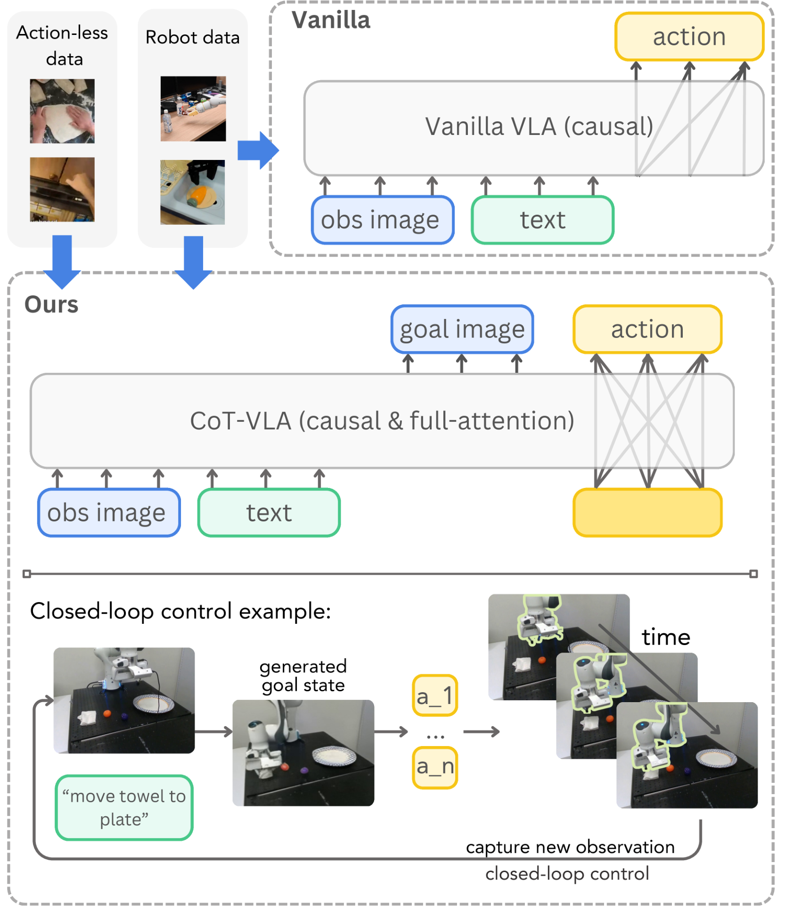
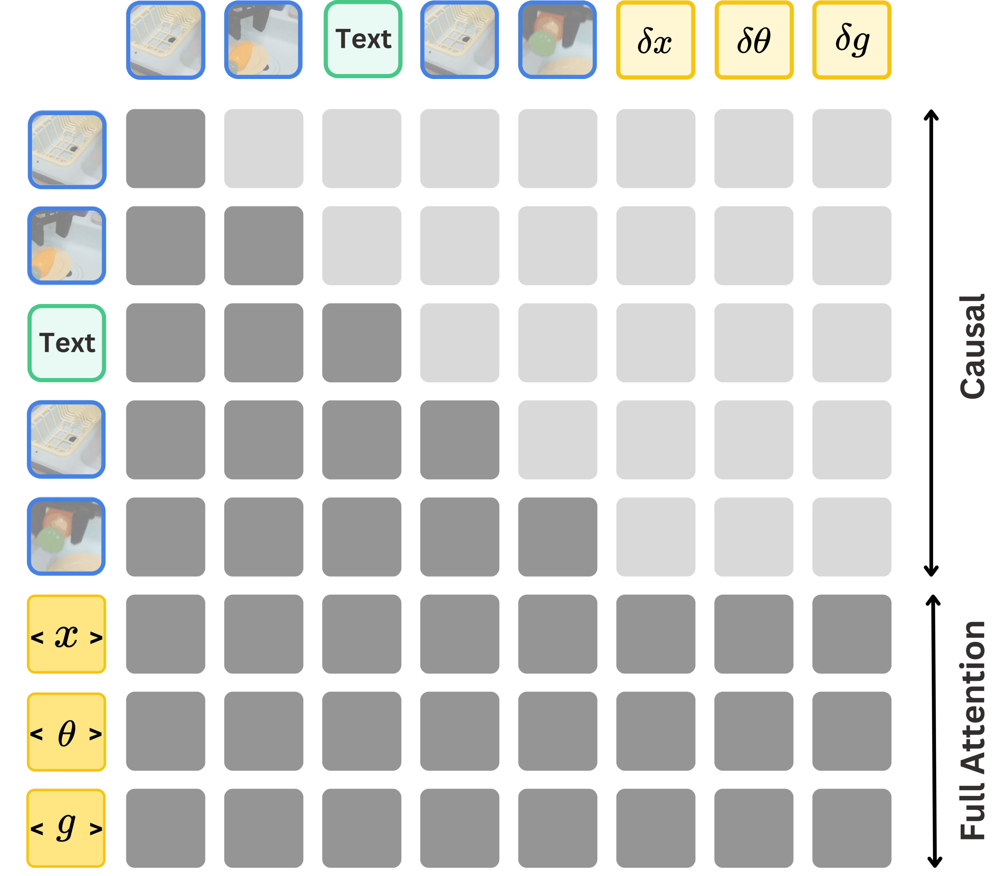
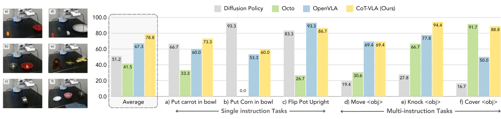
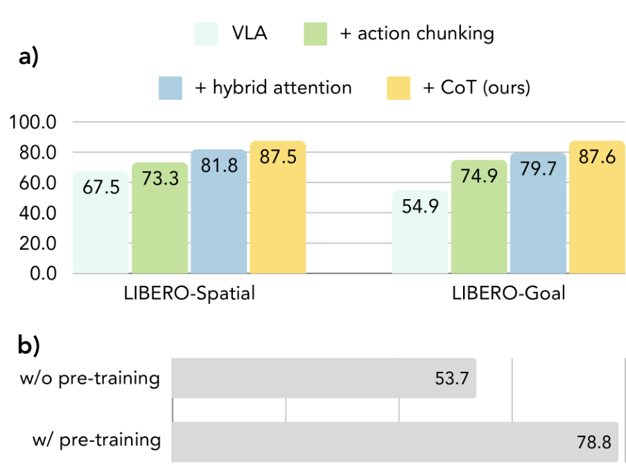

# V3. CoT-VLA: Visual Chain-of-Thought Reasoning for Vision-Language-Action Models

## 0. 읽기 전 약어 및 핵심 용어

이 문서를 읽기 전에 아래 약어와 용어를 먼저 정리한다. 이후 본문에서는 괄호 안의 약어를 사용한다.

- Artificial Intelligence (AI): 사람의 지각, 추론, 학습, 의사결정 능력을 기계가 수행하도록 만드는 인공지능 분야를 뜻한다.
- Vision-Language-Action (VLA): 시각 관측과 언어 명령을 함께 받아 로봇 action까지 생성하는 모델 또는 학습 패러다임이다.
- Robotics Transformer (RT): robot observation을 입력받아 action을 예측하는 transformer 기반 robot policy 계열을 뜻한다.
- Robotics Transformer 1 (RT-1): Google의 실제 로봇 demonstration data로 학습한 transformer 기반 robot control policy이다.
- Lifelong Robot Learning Benchmark (LIBERO): 로봇이 여러 task를 순차적으로 배우며 knowledge transfer와 forgetting을 평가하는 benchmark이다.
- Robotics Diffusion Transformer (RDT): diffusion model과 transformer를 결합해 robot action trajectory를 생성하는 robot foundation policy 계열이다.
- Physical Intelligence pi-zero model (pi0): Physical Intelligence가 제안한 general robot control용 vision-language-action flow model이다.
- Physical Intelligence pi-zero-point-five model (pi0.5): pi0를 open-world household manipulation으로 확장한 VLA model이다.
- Graphics Processing Unit (GPU): 대규모 neural network 학습과 병렬 연산을 빠르게 수행하는 processor이다.
- Physical Artificial Intelligence (Physical AI): 디지털 공간의 예측을 넘어 물리 세계에서 지각, 예측, 계획, 행동, 안전 검사를 수행하는 AI 시스템을 뜻한다.

## 1. Metadata

| Field | 내용 |
|---|---|
| ID | `V3` |
| Title | CoT-VLA: Visual Chain-of-Thought Reasoning for Vision-Language-Action Models |
| Authors | Qingqing Zhao, Yao Lu, Moo Jin Kim, Zipeng Fu et al. |
| Affiliation / Team | NVIDIA / Stanford University / MIT |
| Venue / Status | CVPR 2025 |
| Date | 2025-06 |
| Link | https://openaccess.thecvf.com/content/CVPR2025/html/Zhao_CoT-VLA_Visual_Chain-of-Thought_Reasoning_for_Vision-Language-Action_Models_CVPR_2025_paper.html |
| Local source | `paper_corpus/sources/V3` |
| Source figures | `paper_corpus/figures_source/V3/manifest.md` |

## 2. 핵심 요약

CoT-VLA는 VLA가 바로 action을 예측하지 않고, 먼저 미래 subgoal image를 생성한 뒤 그 subgoal을 달성하기 위한 action chunk를 생성하도록 만든 visual chain-of-thought VLA다. 기존 VLA가 observation과 instruction에서 action으로 직접 가는 direct input-output mapping에 가깝다면, CoT-VLA는 pixel-space future state를 intermediate reasoning step으로 둔다.

핵심 메시지는 "robot reasoning을 text/keypoint/bounding box가 아니라 subgoal image로 표현하면, robot demonstration video와 action-less video를 모두 활용하면서 closed-loop control에 쓸 수 있다"는 것이다.

## 3. 왜 중요한가?

- VLA에 visual chain-of-thought라는 명시적 intermediate reasoning step을 넣은 대표 논문이다.
- subgoal image generation은 action label이 없어도 학습 가능하므로 EPIC-KITCHENS, Something-Something V2 같은 action-less video data를 활용할 수 있다.
- VILA-U 기반 7B generative multimodal model을 사용해 text, image, action token을 함께 다룬다.
- causal attention은 image/text generation에, full attention은 action generation에 쓰는 hybrid attention을 제안한다.
- LIBERO, Bridge-V2, Franka-Tabletop에서 OpenVLA/Octo/Diffusion Policy/SUSIE와 비교한다.

## 4. Vanilla VLA vs CoT-VLA

  

<em>Figure 1. Vanilla VLA와 CoT-VLA 비교. CoT-VLA는 먼저 subgoal image를 생성하고, 그 다음 action sequence를 생성한다. Source figure: <code>figure/teaser.pdf</code>.</em>

Vanilla VLA는 현재 observation과 instruction을 바로 action으로 mapping한다. CoT-VLA는 중간에 "이 task를 성공하면 화면이 어떻게 변해야 하는가"를 subgoal image로 생성한다.

| 방식 | 구조 | 장점/한계 |
|---|---|---|
| Vanilla VLA | observation + language -> action | 단순하지만 temporal planning/reasoning이 약함 |
| CoT-VLA | observation + language -> subgoal image -> action chunk | visual reasoning이 명시적이고 action-less video를 활용 가능 |

## 5. Framework Overview

  

<em>Figure 2. CoT-VLA framework. VILA-U 기반 model이 subgoal image를 causal attention으로 생성하고, action sequence는 full attention으로 생성한다. Source figure: <code>figure/method.pdf</code>.</em>

CoT-VLA의 deployment loop는 다음과 같다.

| Step | 설명 |
|---|---|
| observation | 현재 robot image observation과 language instruction을 입력 |
| visual CoT | 미래 subgoal image를 autoregressive하게 생성 |
| action generation | 현재 observation, instruction, subgoal image를 조건으로 action chunk 생성 |
| closed-loop | action chunk 실행 후 새 observation을 받고 반복 |

이 구조는 world model과도 닮아 있다. 다만 전체 dynamics rollout을 길게 예측하기보다, control에 필요한 짧은 subgoal image를 intermediate reasoning으로 사용한다.

## 6. Dataset Formulation

CoT-VLA는 두 종류의 data를 사용한다.

$$
D_r=\{(l,\mathbf{a}_{1...T},\mathbf{s}_{1...T})\}
$$

| Notation | 의미 |
|---|---|
| $D_r$ | robot demonstration dataset |
| $l$ | natural language instruction |
| $\mathbf{a}_{1...T}$ | robot action sequence |
| $\mathbf{s}_{1...T}$ | image observation sequence |

$$
D_v=\{(l,\mathbf{s}_{1...T})\}
$$

| Notation | 의미 |
|---|---|
| $D_v$ | action-less video dataset |
| $l$ | video description 또는 language label |
| $\mathbf{s}_{1...T}$ | image/video frame sequence |

visual reasoning은 $D_r$와 $D_v$ 모두에서 학습할 수 있지만, action generation은 action label이 있는 $D_r$에서만 학습한다.

## 7. Vanilla VLA Formulation

기존 VLA는 현재 image와 instruction에서 action을 직접 예측한다.

$$
\hat{\mathbf{a}}_{t}\sim P_{\theta}(\mathbf{a}_t\mid\mathbf{s}_t,l)
$$

| Notation | 의미 |
|---|---|
| $P_{\theta}$ | pretrained/fine-tuned VLA model |
| $\hat{\mathbf{a}}_t$ | predicted action |
| $\mathbf{s}_t$ | current image observation |
| $l$ | language instruction |

이 방식은 action prediction이 observation에 바로 붙기 때문에, intermediate planning state를 모델이 명시적으로 보여주지 않는다.

## 8. Visual Chain-of-Thought Formulation

CoT-VLA는 두 단계로 동작한다.

$$
\hat{\mathbf{s}}_{t+n}\sim P_{\theta}(\mathbf{s}_{t+n}\mid\mathbf{s}_t,l)
$$

| Notation | 의미 |
|---|---|
| $\hat{\mathbf{s}}_{t+n}$ | model이 생성한 future subgoal image |
| $n$ | subgoal prediction horizon |
| $\mathbf{s}_{t+n}$ | 실제 future image state |

그 다음 subgoal image를 조건으로 action chunk를 생성한다.

$$
\{\hat{\mathbf{a}}_t,\ldots,\hat{\mathbf{a}}_{t+m}\}\sim P_{\theta}(\{\mathbf{a}_t,\ldots,\mathbf{a}_{t+m}\}\mid\mathbf{s}_t,l,\hat{\mathbf{s}}_{t+n})
$$

| Notation | 의미 |
|---|---|
| $\{\hat{\mathbf{a}}_t,\ldots,\hat{\mathbf{a}}_{t+m}\}$ | predicted action chunk |
| $m$ | action chunk horizon |
| $\hat{\mathbf{s}}_{t+n}$ | generated subgoal image condition |

이 수식이 논문의 핵심이다. "think visually before acting"을 action generation 앞에 넣은 것이다.

## 9. Hybrid Attention

  

<em>Figure 3. Hybrid attention mechanism. Image/text generation에는 causal attention, action generation에는 full attention을 사용한다. Source figure: <code>figure/attention.pdf</code>.</em>

CoT-VLA는 text/image와 action의 generation 방식이 다르다고 본다.

| Token type | Attention | 이유 |
|---|---|---|
| text/image token | causal attention | autoregressive next-token/image-token generation |
| action token | full attention | action dimensions와 action chunk 전체를 함께 예측해 temporal/dimensional consistency 확보 |

action은 7-DoF이며, 각 action dimension은 OpenVLA처럼 256 discrete bins로 변환된다. 다만 기존 VLA와 달리 action tokens는 full attention으로 서로 상호작용한다.

## 10. Training Objective

subgoal image generation은 visual token prediction objective를 사용한다.

$$
\mathcal{L}_{\mathrm{visual}}=-\sum_j\sum_{d=1}^{D}\log P_{\delta}(k_{jd}\mid k_{j,<d})
$$

| Notation | 의미 |
|---|---|
| $\mathcal{L}_{\mathrm{visual}}$ | visual residual token prediction loss |
| $j$ | visual token position |
| $d$ | residual quantization depth index |
| $D$ | residual token depth |
| $k_{jd}$ | position $j$, depth $d$의 visual residual token |
| $P_{\delta}$ | depth transformer |

action prediction은 action token cross entropy로 학습한다.

$$
\mathcal{L}_{\mathrm{action}}=-\sum_{i=1}^{m}\log P_{\theta}(\mathbf{a}_t...\mathbf{a}_{t+m}\mid l,\mathbf{s}_t,\mathbf{s}_{t+n})
$$

| Notation | 의미 |
|---|---|
| $\mathcal{L}_{\mathrm{action}}$ | action token prediction loss |
| $i$ | action chunk index |
| $m$ | action chunk length |
| $\mathbf{s}_{t+n}$ | subgoal image condition |

전체 loss는 두 항의 합이다.

$$
\mathcal{L}=\mathcal{L}_{\mathrm{action}}+\mathcal{L}_{\mathrm{visual}}
$$

| Notation | 의미 |
|---|---|
| $\mathcal{L}$ | total training objective |

## 11. Pretraining and Adaptation

pretraining data는 robot demonstrations와 action-less videos를 함께 쓴다.

| Data | 사용 방식 |
|---|---|
| Open X-Embodiment subset | robot demonstration $D_r$, 7-DoF end-effector control 중심 |
| EPIC-KITCHENS-100 | action-less video $D_v$ |
| Something-Something V2 | action-less video $D_v$ |

보충자료에 따르면 dataset weights는 Bridge 24.14%, RT-1 6.90%, TOTO/VIOLA/RoboTurk/Jaco Play/Berkeley datasets 각각 10.34%, Something2Something/EPIC-KITCHEN 각각 3.45%다. pretraining은 12 A100 nodes, 총 11K A100 GPU hours를 사용한다.

## 12. LIBERO Results

LIBERO에서는 Spatial, Object, Goal, Long suite에서 평가한다.

| Method | Average | Spatial | Object | Goal | Long |
|---|---:|---:|---:|---:|---:|
| Diffusion Policy | 72.4% | 78.3% | 92.5% | 68.3% | 50.5% |
| Octo fine-tuned | 75.1% | 78.9% | 85.7% | 84.6% | 51.1% |
| OpenVLA fine-tuned | 76.5% | 84.7% | 88.4% | 79.2% | 53.7% |
| CoT-VLA-7B | 81.13% | 87.5% | 91.6% | 87.6% | 69.0% |

논문은 CoT-VLA가 average와 Long suite에서 특히 좋은 성능을 보인다고 보고한다. 이는 visual subgoal reasoning이 long-horizon task에서 이점을 줄 수 있음을 시사한다.

## 13. Real-Robot Evaluation

  

<em>Figure 4. Franka-Tabletop comparisons. 6개 task에서 CoT-VLA와 baselines를 비교한다. Source figure: <code>figure/franka.pdf</code>.</em>

real-world는 Bridge-V2 WidowX와 Franka-Tabletop에서 평가한다. Franka-Tabletop은 pretraining에 없던 setup이며, task별 10-150 demonstrations만 사용한다.

Bridge-V2는 visual, motion, semantic, language generalization 네 category를 본다.

| Category | SUSIE | Octo | OpenVLA | CoT-VLA |
|---|---:|---:|---:|---:|
| Visual | 30% | 35% | 75% | 65% |
| Motion | 10% | 10% | 45% | 60% |
| Semantic | 20% | 0% | 40% | 50% |
| Language | 40% | 40% | 75% | 70% |

CoT-VLA는 OpenVLA보다 visual/language category에서 살짝 낮지만, motion/semantic category에서 더 높다. 논문은 visual/language에서의 실패가 visual reasoning 자체보다 action chunking으로 인한 grasping failure와 관련이 있다고 해석한다.

## 14. Visual Reasoning Examples

  

<em>Figure 5. Task execution examples. 각 task에서 instruction, initial state, generated subgoal images, final state를 보여준다. Source figure: <code>figure/rollout.pdf</code>.</em>

이 figure는 발표에 매우 좋다. CoT-VLA가 "무엇을 하려고 생각했는지"를 subgoal image로 보여주기 때문에, text-only reasoning보다 직관적으로 failure/success를 분석할 수 있다.

## 15. Ablations

  

<em>Figure 6. Ablation studies. Action chunking, hybrid attention, visual CoT, OpenX/action-less video pretraining의 효과를 비교한다. Source figure: <code>figure/ablation.pdf</code>.</em>

ablation은 세 component가 모두 중요함을 보인다.

| Component | 효과 |
|---|---|
| action chunking | single-step action prediction보다 안정적 |
| hybrid attention | action sequence prediction에서 full attention이 성능 개선 |
| visual CoT | subgoal image reasoning으로 최고 성능 |
| pretraining with OpenX + action-less videos | Franka-Tabletop에서 direct fine-tuning 대비 46.7% relative improvement |

논문은 visual reasoning quality가 action performance와 직접 연결된다고도 주장한다. novel long-horizon task에서 generated goal image 대신 ground-truth goal image를 쓰면 두 task 모두 absolute success가 40% 개선된다.

## 16. Physical AI / World Model 관점

CoT-VLA는 explicit dynamics world model은 아니지만, future image를 intermediate reasoning으로 생성한다는 점에서 world model 연구와 강하게 연결된다.

| 관점 | CoT-VLA의 의미 |
|---|---|
| future state prediction | subgoal image $\hat{\mathbf{s}}_{t+n}$를 생성한다. |
| action-less video 활용 | image future prediction은 action label 없이 학습 가능하다. |
| interpretability | generated subgoal image가 모델의 의도와 failure mode를 보여준다. |
| closed-loop control | subgoal/action chunk 실행 후 새 observation으로 반복한다. |

world model 스터디에서는 CoT-VLA를 "long rollout simulator"가 아니라 "policy 내부의 short-horizon visual goal generator"로 읽으면 좋다.

## 17. 기존 논문들과의 연결

| 연결 논문 | 연결 포인트 |
|---|---|
| OpenVLA (`D5`) | direct VLA action prediction baseline |
| CogACT (`V1`) | cognition/action decoupling 흐름 |
| Diffusion-VLA (`V2`) | self-generated reasoning과 action generation 결합 |
| SUSIE | image goal generation + goal-conditioned policy와의 비교 |
| pi0.5 (`P5`) | high-level subtask prediction과 visual subgoal prediction의 대비 |
| Genie/Pandora/DreamGen (`W4`, `W6`, `W10`) | video/future image generation을 embodied action에 활용하는 흐름 |

## 18. 한계와 주의점

- subgoal image generation quality가 낮으면 action도 실패할 수 있다.
- visual goal이 실제 physics와 맞지 않는 경우, goal-conditioned action이 오히려 오도될 수 있다.
- action은 discrete bin token 기반이라 pi0/RDT식 continuous action generation과는 차이가 있다.
- generated goal image는 interpretability를 제공하지만, causal guarantee는 아니다.
- long-horizon household autonomy 전체보다는 short subgoal 반복 closed-loop에 가깝다.

## 19. 발표 구성 제안

1. 기존 VLA가 바로 action을 예측한다는 문제를 Figure 1로 보여준다.
2. CoT-VLA의 핵심을 "future image를 먼저 상상하고 행동한다"로 설명한다.
3. 두 단계 수식, subgoal image generation과 action chunk generation을 설명한다.
4. hybrid attention figure로 image/text와 action의 attention 차이를 설명한다.
5. LIBERO/Bridge/Franka 결과를 정리한다.
6. rollout figure로 subgoal image가 어떻게 interpretability를 주는지 보여준다.
7. world model 관점에서 future image prediction과 action-less video 활용으로 연결한다.

## 20. 토론 질문

- subgoal image는 text plan보다 robot에게 더 좋은 intermediate representation일까?
- visual CoT가 실패했을 때 action module은 이를 보정할 수 있을까?
- future image를 여러 개 생성하는 trajectory-level CoT로 확장하면 long-horizon planning에 도움이 될까?
- generated image의 realism과 task success 사이에는 어떤 관계가 있을까?
- CoT-VLA의 visual goal generator를 DreamGen/Genie 같은 world model과 결합할 수 있을까?

## 21. 한 문장 정리

CoT-VLA는 VLA가 행동하기 전에 미래 subgoal image를 생성하도록 만들어, action-less video pretraining과 interpretable visual reasoning을 robot control에 연결한 visual chain-of-thought VLA 모델이다.
