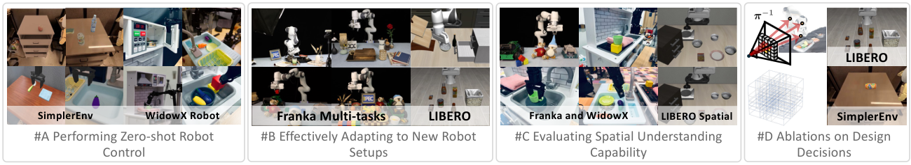
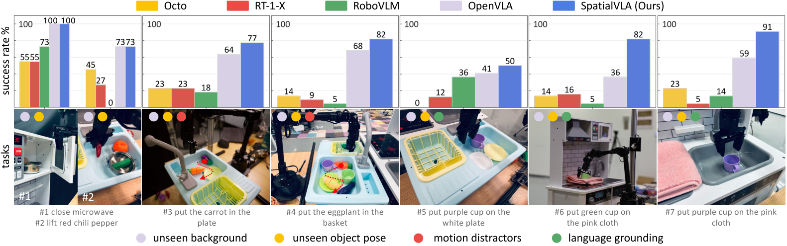
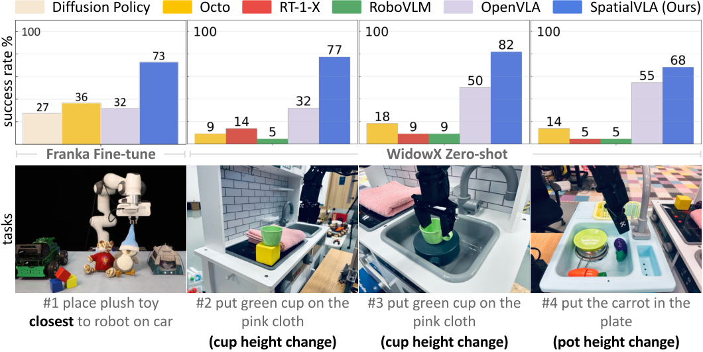
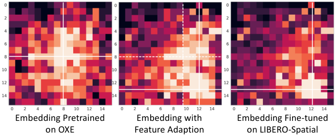

# V4. SpatialVLA: Exploring Spatial Representations for Visual-Language-Action Model

## 0. 읽기 전 약어 및 핵심 용어

이 문서를 읽기 전에 아래 약어와 용어를 먼저 정리한다. 이후 본문에서는 괄호 안의 약어를 사용한다.

- Artificial Intelligence (AI): 사람의 지각, 추론, 학습, 의사결정 능력을 기계가 수행하도록 만드는 인공지능 분야를 뜻한다.
- Data Science and Business Analytics (DSBA): 데이터 과학, 비즈니스 분석, AI 기반 의사결정을 다루는 연구실/전공 맥락을 뜻한다.
- Large Language Model (LLM): 대규모 텍스트 데이터로 학습되어 언어 이해, 생성, 추론, 계획에 쓰이는 foundation model이다.
- Vision-Language Model (VLM): 이미지와 텍스트를 함께 입력받아 시각-언어 이해나 생성 작업을 수행하는 모델이다.
- Vision-Language-Action (VLA): 시각 관측과 언어 명령을 함께 받아 로봇 action까지 생성하는 모델 또는 학습 패러다임이다.
- Multi-Layer Perceptron (MLP): fully connected layer를 여러 층 쌓은 feed-forward neural network이다.
- Variational Autoencoder (VAE): latent variable의 확률분포를 학습해 data를 생성하거나 압축하는 generative model이다.
- Robotics Transformer (RT): robot observation을 입력받아 action을 예측하는 transformer 기반 robot policy 계열을 뜻한다.
- Robotics Transformer 1 (RT-1): Google의 실제 로봇 demonstration data로 학습한 transformer 기반 robot control policy이다.
- Robotics Transformer 2 (RT-2): web-scale vision-language knowledge와 robot trajectory를 함께 학습해 action token을 생성하는 VLA 모델이다.
- Robotics Transformer-X model family (RT-X): Open X-Embodiment 데이터 위에서 여러 robot embodiment로 확장한 RT 계열 policy family를 뜻한다.
- Robotics Transformer 2-X (RT-2-X): Open X-Embodiment 데이터로 확장 학습한 RT-2 계열 cross-embodiment VLA policy이다.
- RT-X shorthand (RTX): Open X-Embodiment 맥락에서 RT-X 계열 robot policy를 줄여 부르는 표기다.
- Open X-Embodiment (OXE): 여러 기관, 로봇, task의 demonstration을 묶은 대규모 cross-embodiment robot dataset이다.
- Distributed Robot Interaction Dataset (DROID): 여러 장소에서 수집한 in-the-wild robot manipulation demonstration dataset이다.
- Lifelong Robot Learning Benchmark (LIBERO): 로봇이 여러 task를 순차적으로 배우며 knowledge transfer와 forgetting을 평가하는 benchmark이다.
- Physical Intelligence pi-zero model (pi0): Physical Intelligence가 제안한 general robot control용 vision-language-action flow model이다.
- Generalist Robot 00 Technology (GR00T): NVIDIA가 humanoid/generalist robot을 위해 공개한 robot foundation model family 이름이다.
- Graphics Processing Unit (GPU): 대규모 neural network 학습과 병렬 연산을 빠르게 수행하는 processor이다.

## 1. Metadata

| Field | 내용 |
|---|---|
| ID | `V4` |
| Title | SpatialVLA: Exploring Spatial Representations for Visual-Language-Action Model |
| Authors | Delin Qu, Haoming Song, Qizhi Chen, Dong Wang, Yuanqi Yao et al. |
| Affiliation / Team | Shanghai AI Laboratory / Fudan University / Shanghai Jiao Tong University / Zhejiang University / ShanghaiTech University / Northwestern Polytechnical University |
| Venue / Status | RSS 2025 |
| Date | 2025-01-27 |
| Link | https://arxiv.org/abs/2501.15830 |
| Project | https://spatialvla.github.io |
| Local source | `paper_corpus/sources/V4` |
| Source figures | `paper_corpus/figures_source/V4/manifest.md` |

## 2. 핵심 요약

SpatialVLA는 VLA의 약점이 3D spatial understanding에 있다고 보고, observation과 action 양쪽에 공간 표현을 직접 주입한 generalist robot policy다. 관찰 쪽에서는 depth 기반 `Ego3D Position Encoding`으로 2D visual token에 egocentric 3D 좌표를 더하고, 행동 쪽에서는 continuous action을 robot/action distribution에 맞춘 `Adaptive Action Grids`로 discretize한다.

핵심 메시지는 "VLA가 언어와 이미지 의미만 잘 이해해서는 manipulation을 잘하기 어렵고, 3D 위치와 움직임 분포를 action tokenization 단계까지 일관되게 반영해야 한다"는 것이다.

## 3. 왜 중요한가?

- OpenVLA, RT-X, Octo 계열이 주로 large-scale data와 VLM backbone에 집중했다면, SpatialVLA는 VLA 내부의 observation/action representation을 3D-aware하게 바꾼다.
- camera extrinsic calibration에 의존하지 않는 egocentric 3D 좌표계를 사용해 cross-embodiment setup에 적용하기 쉽게 만든다.
- action을 7개 scalar token으로 뽑는 대신 translation, rotation, gripper를 3개 spatial action token으로 표현해 inference 속도와 action representation 효율을 함께 노린다.
- pretraining 후 새 robot setup에 fine-tuning할 때 action grid를 새 dataset distribution에 맞춰 다시 discretize하고, 기존 spatial token embedding을 interpolation으로 초기화한다.
- SimplerEnv, WidowX real robot, LIBERO, Franka real robot, spatial understanding task, ablation까지 폭넓게 평가한다.

## 4. Overall Idea

  

<em>Figure 1. SpatialVLA teaser. Ego3D position encoding과 adaptive action grids를 결합해 3D scene understanding, zero-shot control, new setup adaptation을 개선한다. Source figure: <code>figure/head.pdf</code>.</em>

SpatialVLA는 "robot foundation model이 실제 물리 세계에서 움직이려면 image-language alignment만으로는 부족하다"는 문제의식에서 출발한다. 특히 서로 다른 robot embodiment에서는 camera pose, workspace, controller, action distribution이 다르기 때문에 단순한 2D image input과 per-dimension action binning만으로는 spatial transfer가 어렵다.

| 구성 요소 | 역할 | 직관 |
|---|---|---|
| Ego3D Position Encoding | visual token에 egocentric 3D position embedding 추가 | "이 물체가 image 어디에 보이는가"가 아니라 "camera 기준 3D 공간 어디에 있는가"를 모델에 제공 |
| Adaptive Action Grids | continuous translation/rotation action을 distribution-aware grid token으로 변환 | robot별 자주 쓰는 움직임 영역을 더 세밀하게 표현 |
| Spatial Embedding Adaptation | 새 robot dataset에서 action grid를 다시 만들고 pretrained token embedding을 보간 | pretraining에서 배운 spatial action knowledge를 새 setup으로 이전 |

## 5. Model Architecture

  

<em>Figure 2. SpatialVLA pipeline. SigLIP visual encoder, Ego3D position encoding, Paligemma2 backbone, adaptive action grid tokenization이 결합된다. Source figure: <code>figure/pipeline.pdf</code>.</em>

SpatialVLA는 image observation과 language instruction을 받아 action chunk를 autoregressive하게 생성한다. 논문은 Paligemma2 backbone을 기반으로 하며, visual feature 위에 3D position embedding을 더하고, output action은 spatial action token으로 예측한다.

기본 mapping은 다음처럼 볼 수 있다.

$$
\mathbf{A}_t=\mathcal{F}(\mathbf{o}_t,\mathbf{L})
$$

| Notation | 의미 |
|---|---|
| $\mathbf{o}_t$ | time $t$의 robot image observations |
| $\mathbf{L}$ | natural language task instruction |
| $\mathbf{A}_t$ | predicted action chunk |
| $\mathcal{F}$ | SpatialVLA policy mapping |

학습 objective는 predicted spatial action token과 ground-truth spatial action token 사이의 cross entropy다.

$$
L_{\mathrm{spatial}}(\theta)=\mathbb{E}_{p(\mathbf{A}_t\mid\mathbf{o}_t)}\mathcal{L}(a_t^{\mathrm{spatial}},\tilde{a}_t^{\mathrm{spatial}})
$$

| Notation | 의미 |
|---|---|
| $L_{\mathrm{spatial}}(\theta)$ | model parameter $\theta$에 대한 training objective |
| $\mathbf{A}_t$ | future action chunk |
| $\mathbf{o}_t$ | current observation |
| $a_t^{\mathrm{spatial}}$ | ground-truth spatial action token |
| $\tilde{a}_t^{\mathrm{spatial}}$ | predicted spatial action token |
| $\mathcal{L}$ | cross-entropy loss |

논문 원문 수식에는 괄호가 하나 더 들어간 typo가 있지만, 의미상 cross-entropy next-token prediction objective로 해석하면 된다.

## 6. Ego3D Position Encoding

SpatialVLA의 observation representation은 2D semantic visual feature와 egocentric 3D coordinate를 결합한다. 먼저 ZoeDepth로 depth map을 추정하고, camera intrinsic을 이용해 pixel을 egocentric 3D coordinate로 back-project한다. 그 다음 SigLIP visual token과 3D position embedding을 더한다.

$$
\mathbf{O}_{3d}=\mathbf{X}+\mathbf{P}'=\mathbf{X}+\mathrm{MLP}(\boldsymbol{\gamma}(\mathbf{P}))
$$

| Notation | 의미 |
|---|---|
| $\mathbf{O}_{3d}$ | 3D-aware visual representation |
| $\mathbf{X}$ | SigLIP visual encoder가 만든 2D semantic feature |
| $\mathbf{P}$ | 각 visual token에 대응되는 egocentric 3D position |
| $\mathbf{P}'$ | sinusoidal encoding과 MLP를 거친 3D position embedding |
| $\boldsymbol{\gamma}(\cdot)$ | sinusoidal position encoding function |
| $\mathrm{MLP}$ | learnable projection network |

여기서 중요한 점은 egocentric coordinate를 쓴다는 것이다. robot-camera extrinsic calibration을 요구하지 않기 때문에, 서로 다른 camera mounting과 embodiment를 가진 robot data mixture에 적용하기 쉽다.

## 7. Adaptive Action Grids

  

<em>Figure 3. Adaptive action grids. Dataset action distribution을 Gaussian으로 fitting한 뒤 equal-probability interval로 translation/rotation grid를 구성한다. Source figure: <code>figure/action_grids.pdf</code>.</em>

기존 RT-1, RT-2, OpenVLA 계열은 7-DoF action의 각 scalar dimension을 binning하는 방식이 많다. SpatialVLA는 이를 spatial action space로 묶어 translation, rotation, gripper 세 종류 token으로 예측한다.

$$
\mathbf{a}=\{\mathbf{a}_{\mathrm{trans}},\mathbf{a}_{\mathrm{rot}},\mathbf{a}_{\mathrm{grip}}\}
$$

| Notation | 의미 |
|---|---|
| $\mathbf{a}$ | single-step robot action |
| $\mathbf{a}_{\mathrm{trans}}$ | translation movement, 원래는 $(x,y,z)$이며 polar coordinate $(\phi,\theta,r)$로 변환 |
| $\mathbf{a}_{\mathrm{rot}}$ | rotation movement, $(\mathrm{roll},\mathrm{pitch},\mathrm{yaw})$ |
| $\mathbf{a}_{\mathrm{grip}}$ | gripper open/close action |

translation과 rotation action variable은 먼저 $[-1,1]$ 범위로 normalize된다. 이후 action distribution을 Gaussian으로 fitting하고, 각 variable을 equal probability interval로 나눈다.

$$
a_2,\ldots,a_M=\arg\min_{a_2,\ldots,a_M}\left|\int_{a_i}^{a_{i+1}} f(x)dx-\frac{1}{M}\right|
$$

| Notation | 의미 |
|---|---|
| $a_2,\ldots,a_M$ | action variable의 discretization boundary |
| $M$ | 한 action variable에 배정된 interval 개수 |
| $f(x)$ | fitted Gaussian distribution의 probability density function |
| $\int_{a_i}^{a_{i+1}} f(x)dx$ | interval $[a_i,a_{i+1}]$에 속할 확률 질량 |

이 수식의 직관은 단순 uniform binning이 아니라 "데이터에서 자주 발생하는 움직임 구간을 더 잘 쓰도록 action grid를 나눈다"는 것이다. 특히 manipulation에서는 작은 움직임과 특정 방향 움직임이 많기 때문에, uniform bin은 token 사용 효율이 낮아질 수 있다.

spatial action token embedding은 translation, rotation, gripper embedding의 합집합으로 정의된다.

$$
\mathbf{E}_{a}=\{\mathbf{E}_{\mathrm{trans}},\mathbf{E}_{\mathrm{rot}},\mathbf{E}_{\mathrm{grip}}\}
$$

| Notation | 의미 |
|---|---|
| $\mathbf{E}_{a}$ | 전체 spatial action token embedding set |
| $\mathbf{E}_{\mathrm{trans}}$ | translation grid token embeddings |
| $\mathbf{E}_{\mathrm{rot}}$ | rotation grid token embeddings |
| $\mathbf{E}_{\mathrm{grip}}$ | gripper open/close token embeddings |
| $V$ | 전체 action token 수, 논문 implementation에서는 8194개 |

논문 implementation에서는 policy가 미래 $T=4$ action chunk를 예측하며, action 하나당 translation, rotation, gripper 3개 token을 사용한다. 따라서 한 chunk는 12개 spatial action token으로 표현된다.

## 8. Pretraining and Post-Training

SpatialVLA는 1.1M real-world robot episodes로 pretraining된다. 데이터는 OXE subset과 RH20T를 포함하며, DROID는 OpenVLA와 유사하게 final third pretraining에서 제거해 data quality를 높인다.

pretraining에서는 spatial action token embedding과 Ego3D MLP가 랜덤 초기화되고, vision encoder와 LLM backbone까지 함께 최적화된다. 다만 text token embedding은 freeze해 VLM의 general language/world knowledge를 유지한다.

post-training에서 핵심은 `Spatial Embedding Adaptation`이다. 새 robot/task dataset에 대해 action distribution을 다시 fitting하고, 새 grid token embedding을 pretrained spatial action token embedding에서 trilinear interpolation으로 초기화한다.

$$
\mathbf{e}_{a,\mathrm{new}}^{i}=\sum_{j=1}^{K}w_j\mathbf{e}^{j}
$$

| Notation | 의미 |
|---|---|
| $\mathbf{e}_{a,\mathrm{new}}^{i}$ | 새 action grid의 $i$번째 token embedding |
| $K$ | 새 grid centroid 주변의 인접 pretrained grid 개수 |
| $w_j$ | 새 grid centroid와 인접 grid centroid 사이 거리 기반 interpolation weight |
| $\mathbf{e}^{j}$ | 인접 pretrained action grid token embedding |

이 방식은 "새 robot의 action range는 다르지만, pretraining에서 배운 spatial action manifold는 재사용할 수 있다"는 가정에 기반한다.

## 9. Evaluation Scope

  

<em>Figure 4. Experiment overview. 7개 robot learning scenario, 24 real-robot tasks, 3 simulation environments에서 zero-shot, adaptation, spatial understanding을 평가한다. Source figure: <code>figure/experinment_overview.pdf</code>.</em>

논문은 다음 네 질문을 실험으로 다룬다.

| 질문 | 평가 |
|---|---|
| pretrained model이 바로 in-distribution task를 수행할 수 있는가? | SimplerEnv Google Robot/WidowX, real-world WidowX zero-shot |
| 새 robot setup/task에 잘 fine-tuning되는가? | LIBERO, Franka robot |
| spatial understanding이 필요한 task에서 강한가? | Franka spatial prompt, WidowX height/layout change, LIBERO-Spatial |
| 제안한 representation이 실제로 도움이 되는가? | pretraining/fine-tuning ablation |

implementation 기준으로 SpatialVLA는 64 A100 GPU에서 10일간 pretraining되었고, inference는 RTX 4090 1장에서 약 8.5GB memory와 20Hz 속도로 동작한다고 보고한다.

## 10. Zero-Shot and Fine-Tuning Results

SimplerEnv Google Robot에서는 SpatialVLA가 zero-shot에서 Visual Matching 71.9%, Variant Aggregation 68.8%를 기록한다. 논문은 이 결과가 RT-2-X보다 높은 Visual Matching과 Variant Aggregation이며, $\pi_0$와도 경쟁적인 수준이라고 해석한다.

| Setup | Metric | SpatialVLA zero-shot | SpatialVLA fine-tuned | 비교 포인트 |
|---|---:|---:|---:|---|
| Google Robot SimplerEnv | Visual Matching avg. | 71.9% | 75.1% | RT-2-X 60.7%, RoboVLM fine-tuned 63.4% |
| Google Robot SimplerEnv | Variant Aggregation avg. | 68.8% | 70.7% | RT-2-X 64.3%, RoboVLM fine-tuned 51.3% |
| WidowX SimplerEnv | Overall avg. | 34.4% | 42.7% | RoboVLM fine-tuned 31.3%, Octo-Small 30.0% |

  

<em>Figure 5. Real-world WidowX zero-shot evaluation. language grounding, semantic understanding, motion distractor 상황에서 generalist policies를 비교한다. Source figure: <code>figure/windowx_zeroshot.pdf</code>.</em>

real-world WidowX에서는 close microwave 같은 단순 task에서는 여러 policy가 가능성을 보이지만, motion distractor나 color/semantic instruction이 필요한 task에서는 SpatialVLA가 더 robust하다고 보고한다. 논문은 특히 사람이 object를 움직이는 상황에서 carrot/eggplant를 추적하고 grasp하는 능력을 강조한다.

## 11. LIBERO and Franka Adaptation

LIBERO에서는 SpatialVLA가 평균 78.1% success rate로 비교 대상 중 가장 높은 평균 성능을 보인다.

| Method | LIBERO-Spatial | LIBERO-Object | LIBERO-Goal | LIBERO-Long | Average |
|---|---:|---:|---:|---:|---:|
| Diffusion Policy | 78.3% | 92.5% | 68.3% | 50.5% | 72.4% |
| Octo fine-tuned | 78.9% | 85.7% | 84.6% | 51.1% | 75.1% |
| OpenVLA fine-tuned | 84.7% | 88.4% | 79.2% | 53.7% | 76.5% |
| TraceVLA fine-tuned | 84.6% | 85.2% | 75.1% | 54.1% | 74.8% |
| SpatialVLA fine-tuned | 88.2% | 89.9% | 78.6% | 55.5% | 78.1% |

Franka real robot에서는 single-task에서 Diffusion Policy와 비슷한 수준이지만, instruction following과 multi-task에서는 VLA pretraining과 3D representation의 이점이 더 크게 나타난다. Spatial prompt task인 "place plush toy closest to robot on car"에서도 성공률이 가장 높게 보고된다.

## 12. Spatial Understanding Evaluation

  

<em>Figure 6. Spatial understanding capability evaluation. spatial prompts, height changes, object layout variation에서 Ego3D position encoding의 효과를 평가한다. Source figure: <code>figure/spatial_setup.pdf</code>.</em>

이 논문의 발표 포인트는 이 figure에서 잘 드러난다. "closest to robot", 높이 변화, object layout 변화처럼 단순 category recognition이 아니라 3D relation이 필요한 task에서 SpatialVLA가 강하다는 주장이다.

| Spatial challenge | SpatialVLA가 노리는 능력 |
|---|---|
| closest/farthest 같은 spatial language | language instruction을 3D 위치 관계로 grounding |
| object height/layout change | 2D visual appearance가 바뀌어도 egocentric 3D coordinate로 대응 |
| LIBERO-Spatial | 다양한 object layout에서 manipulation policy 유지 |

## 13. Ablations

  

<em>Figure 7. Spatial embedding adaptation. target fine-tuning grid feature와 pretrained spatial grid feature를 정렬해 adaptation을 빠르게 만든다. Source figure: <code>figure/emb_adpt.pdf</code>.</em>

pretraining ablation은 adaptive action grid, grid resolution, Ego3D encoding, language embedding freeze가 모두 영향을 준다고 보고한다.

| Ablation | 관찰 |
|---|---|
| linear 256-bin discretization | Google Robot에서 큰 성능 저하, 특히 visual matching과 variant aggregation이 낮아짐 |
| uniform distribution grid | data distribution 기반 grid보다 낮은 generalization |
| low-resolution grid | 작은 움직임을 과도하게 학습하거나 transfer 성능이 낮아지는 경향 |
| without Ego3D encoding | variant aggregation과 spatial/layout generalization이 떨어짐 |
| without frozen LLM embedding | instruction following과 manipulation 성능이 함께 저하 |

fine-tuning ablation에서는 Spatial Embedding Adaptation이 small dataset인 LIBERO에서 특히 뚜렷하다.

| Setting | LIBERO-Spatial | LIBERO-Object | LIBERO-Goal | LIBERO-Long |
|---|---:|---:|---:|---:|
| Full params tuning | 77.7% | 73.3% | 78.5% | 43.9% |
| LoRA tuning | 83.6% | 84.8% | 76.4% | 50.1% |
| LoRA + Spatial embedding adaptation | 88.2% | 89.9% | 78.6% | 55.5% |

## 14. 한계와 후속 연구 포인트

논문은 스스로 세 가지 한계를 제시한다.

| 한계 | 의미 | 후속 연구 방향 |
|---|---|---|
| Gaussian distribution fitting | action distribution이 단일 Gaussian으로 잘 표현되지 않는 robot/task가 있을 수 있음 | VAE나 implicit density modeling과 explicit grid partition을 결합 |
| autoregressive token decoding | 20Hz 정도로 동작하지만 diffusion decoding보다 느릴 수 있음 | diffusion decoding과 spatial grid action representation 결합 |
| long-horizon memory 부족 | 현재 frame과 history token만으로 long-horizon task를 다루기 어려움 | temporal memory, hierarchical planning, world model과 결합 |
| data quality issue | OXE mixture의 quality variance가 pretraining을 방해할 수 있음 | high-quality subset distillation, data mixture optimization |

## 15. 다른 논문과의 연결

| 연결 논문 | 연결점 |
|---|---|
| RT-1 / RT-2 | action을 token으로 예측하는 VLA 흐름을 계승하지만, scalar binning 대신 spatial action grid를 사용 |
| Open X-Embodiment / OpenVLA | large-scale robot data mixture와 open VLA 방향을 계승 |
| 3D Diffusion Policy | 3D representation이 manipulation generalization에 중요하다는 문제의식 공유 |
| pi0 / GR00T N1 | general robot foundation model 경쟁 축에서 action representation과 inference speed를 다르게 설계 |
| CoT-VLA / Diffusion-VLA | reasoning을 강화하는 VLA 흐름과 달리, SpatialVLA는 geometric grounding을 강화 |

스터디 흐름에서는 CoT-VLA 다음에 SpatialVLA를 배치하면 좋다. CoT-VLA가 "행동 전 visual reasoning"을 다룬다면, SpatialVLA는 "행동과 관찰 자체의 3D spatial representation"을 다루기 때문이다.

## 16. 발표 구성 제안

1. VLA가 2D image-language alignment만으로 manipulation하기 어려운 이유를 소개한다.
2. Ego3D Position Encoding figure를 보며 observation side의 3D grounding을 설명한다.
3. Adaptive Action Grids figure를 보며 action side의 discretization 문제를 설명한다.
4. Spatial Embedding Adaptation을 통해 새 robot setup에 어떻게 fine-tuning되는지 설명한다.
5. SimplerEnv, LIBERO, WidowX, Franka 결과를 "zero-shot, adaptation, spatial understanding" 세 축으로 정리한다.
6. Gaussian fitting과 long-horizon limitation을 world model/temporal memory 연구와 연결한다.

## 17. 토론 질문

| 질문 | 논의 포인트 |
|---|---|
| Ego3D encoding은 depth estimation error에 얼마나 민감할까? | real-world deployment에서 monocular depth uncertainty가 action prediction에 주는 영향 |
| action distribution을 Gaussian으로 fitting하는 것이 충분할까? | multimodal action distribution, task-specific motion, rare but important motion |
| SpatialVLA의 action grid와 diffusion action head는 결합 가능할까? | tokenized spatial prior와 continuous trajectory generation의 결합 |
| DSBA/IE 관점에서 data mixture 최적화 문제로 볼 수 있을까? | dataset weighting, quality filtering, embodiment balancing, curriculum scheduling |

## 18. 한 줄 정리

SpatialVLA는 VLA를 더 똑똑한 언어-이미지 모델로만 키우는 대신, observation과 action 모두에 3D spatial representation을 심어 manipulation generalization을 끌어올리려는 논문이다.
