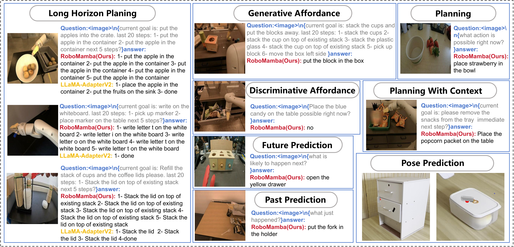
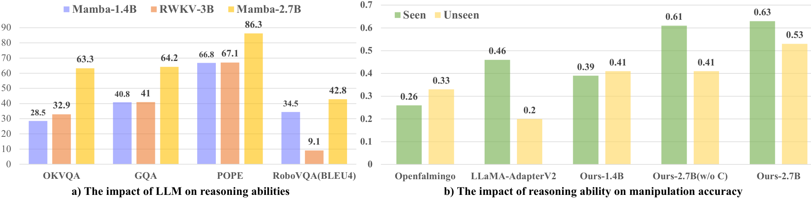

# V5. RoboMamba: Efficient Vision-Language-Action Model for Robotic Reasoning and Manipulation

## 0. 읽기 전 약어 및 핵심 용어

이 문서를 읽기 전에 아래 약어와 용어를 먼저 정리한다. 이후 본문에서는 괄호 안의 약어를 사용한다.

- Data Science and Business Analytics (DSBA): 데이터 과학, 비즈니스 분석, AI 기반 의사결정을 다루는 연구실/전공 맥락을 뜻한다.
- Large Language Model (LLM): 대규모 텍스트 데이터로 학습되어 언어 이해, 생성, 추론, 계획에 쓰이는 foundation model이다.
- Vision-Language-Action (VLA): 시각 관측과 언어 명령을 함께 받아 로봇 action까지 생성하는 모델 또는 학습 패러다임이다.
- Visual Question Answering (VQA): 이미지나 비디오를 보고 자연어 질문에 답하는 vision-language task이다.
- State of the Art (SOTA): 특정 benchmark나 task에서 현재 가장 높은 수준의 성능을 보이는 방법을 뜻한다.
- Multi-Layer Perceptron (MLP): fully connected layer를 여러 층 쌓은 feed-forward neural network이다.
- Robotics Transformer (RT): robot observation을 입력받아 action을 예측하는 transformer 기반 robot policy 계열을 뜻한다.
- Robotics Transformer 1 (RT-1): Google의 실제 로봇 demonstration data로 학습한 transformer 기반 robot control policy이다.
- Robotics Transformer 2 (RT-2): web-scale vision-language knowledge와 robot trajectory를 함께 학습해 action token을 생성하는 VLA 모델이다.
- Physical Intelligence pi-zero model (pi0): Physical Intelligence가 제안한 general robot control용 vision-language-action flow model이다.
- Bilingual Evaluation Understudy (BLEU): generated text와 reference text의 n-gram overlap을 측정하는 metric이다.
- Bilingual Evaluation Understudy unigram score (BLEU-1): generated text와 reference text의 unigram overlap을 측정하는 BLEU 변형이다.
- Bilingual Evaluation Understudy four-gram score (BLEU-4): generated text와 reference text의 four-gram overlap을 측정하는 BLEU 변형이다.
- Graph Question Answering / GQA benchmark (GQA): scene graph 기반 compositional visual question answering benchmark 또는 그 계열 task를 뜻한다.
- Outside Knowledge Visual Question Answering (OKVQA): 외부 지식 기반 visual question answering benchmark를 뜻한다.
- Beijing Academy of Artificial Intelligence (BAAI): 중국 베이징의 인공지능 연구기관이다.

## 1. Metadata

| Field | 내용 |
|---|---|
| ID | `V5` |
| Title | RoboMamba: Efficient Vision-Language-Action Model for Robotic Reasoning and Manipulation |
| Authors | Jiaming Liu, Mengzhen Liu, Zhenyu Wang, Pengju An, Xiaoqi Li et al. |
| Affiliation / Team | Peking University / AI2Robotics / BAAI |
| Venue / Status | NeurIPS 2024 |
| Date | 2024-06-06 |
| Link | https://arxiv.org/abs/2406.04339 |
| Project | https://sites.google.com/view/robomamba-web |
| Local source | `paper_corpus/sources/V5` |
| Source figures | `paper_corpus/figures_source/V5/manifest.md` |

## 2. 핵심 요약

RoboMamba는 robot VLA에서 reasoning 능력과 inference/fine-tuning 효율을 동시에 얻기 위해 Transformer LLM 대신 Mamba 기반 State Space Model을 사용한 VLA다. 먼저 CLIP/SigLIP vision encoder와 Mamba LLM을 alignment pretraining 및 instruction co-training으로 연결해 visual/common-sense/robotic reasoning을 학습하고, 이후 Mamba 본체는 freeze한 채 작은 MLP policy head만 fine-tuning해 SE(3) pose prediction을 수행한다.

핵심 메시지는 "VLA가 manipulation skill을 배우려면 반드시 거대한 LLM 전체를 비싸게 fine-tuning할 필요는 없고, 충분한 robotic reasoning을 가진 backbone 위에 작은 policy head만 붙여도 action pose prediction을 효율적으로 학습할 수 있다"는 것이다.

## 3. 왜 중요한가?

- VLA 효율성 문제를 정면으로 다룬 초기 Mamba/SSM 기반 robotics 논문이다.
- robot reasoning과 low-level pose prediction을 하나의 VLA framework 안에 넣되, manipulation fine-tuning에서는 전체 모델의 약 0.1%에 해당하는 3.7M parameter policy head만 업데이트한다.
- reasoning stage에서 RoboVQA를 co-training해 task planning, success classification, affordance, past/future prediction 같은 robot-related reasoning을 강화한다.
- SAPIEN simulation에서 seen/unseen articulated object manipulation을 평가하고, real-world Franka 예시도 제시한다.
- OpenVLA/pi0/SpatialVLA처럼 action foundation model을 크게 만드는 흐름과 달리, "효율적인 backbone + 작은 action head"라는 대안 축을 제공한다.

## 4. Overall Idea

  

<em>Figure 1. RoboMamba overview. Mamba 기반 VLA로 reasoning과 pose prediction을 결합하고, 작은 policy head만 fine-tuning해 manipulation skill을 얻는다. Source figure: <code>images/intro_v6.pdf</code>.</em>

논문이 보는 기존 VLA의 문제는 두 가지다.

| 문제 | 설명 |
|---|---|
| reasoning 부족 | 복잡한 robot scene/task에서 planning, affordance, future prediction이 약함 |
| 계산 비용 | Transformer 기반 MLLM/VLA는 fine-tuning과 inference가 비싸 robot control frequency에 부담 |

RoboMamba는 이 문제를 Mamba의 linear-complexity sequence modeling으로 풀려고 한다. 즉, "robotic reasoning을 학습한 Mamba backbone"과 "작은 pose prediction head"를 결합한다.

## 5. Problem Formulation

RoboMamba는 visual reasoning answer를 생성하고, 그 reasoning representation을 바탕으로 action pose를 예측한다.

$$
L_a=R(I,L_q)
$$

| Notation | 의미 |
|---|---|
| $L_a$ | model이 생성한 language answer 또는 reasoning response |
| $R$ | RoboMamba reasoning model |
| $I$ | input image |
| $L_q$ | language question 또는 task prompt |

robot action prediction은 policy head로 표현된다.

$$
a=\pi(R(I,L_q))
$$

| Notation | 의미 |
|---|---|
| $a$ | predicted robot action pose |
| $\pi$ | simple policy head |
| $R(I,L_q)$ | Mamba backbone이 생성한 multimodal reasoning representation |

논문은 Franka Emika Panda arm을 기준으로 6-DoF end-effector pose를 사용한다. grasping task에서는 gripper status를 추가해 7-DoF control로 확장한다.

## 6. Why Mamba?

RoboMamba의 기술적 기반은 selective State Space Model이다. SSM은 hidden state를 통해 sequence input을 output sequence로 변환한다.

$$
h'(t)=\mathbf{A}h(t)+\mathbf{B}x(t)
$$

| Notation | 의미 |
|---|---|
| $h(t)$ | continuous-time hidden state |
| $x(t)$ | input sequence signal |
| $\mathbf{A}$ | state transition matrix |
| $\mathbf{B}$ | input matrix |

출력은 hidden state에서 계산된다.

$$
y(t)=\mathbf{C}h(t)
$$

| Notation | 의미 |
|---|---|
| $y(t)$ | output sequence signal |
| $\mathbf{C}$ | output matrix |

discrete sequence modeling을 위해 continuous SSM parameter를 discretize한다.

$$
\overline{\mathbf{A}}=\exp(\mathbf{\Delta}\mathbf{A})
$$

| Notation | 의미 |
|---|---|
| $\overline{\mathbf{A}}$ | discretized state transition matrix |
| $\mathbf{\Delta}$ | timescale parameter |

$$
\overline{\mathbf{B}}=(\mathbf{\Delta}\mathbf{A})^{-1}(\exp(\mathbf{\Delta}\mathbf{A})-\mathbf{I})\mathbf{\Delta}\mathbf{B}
$$

| Notation | 의미 |
|---|---|
| $\overline{\mathbf{B}}$ | discretized input matrix |
| $\mathbf{I}$ | identity matrix |

최종 recurrent form은 다음과 같다.

$$
h_t=\overline{\mathbf{A}}h_{t-1}+\overline{\mathbf{B}}x_t
$$

| Notation | 의미 |
|---|---|
| $h_t$ | time step $t$의 hidden state |
| $x_t$ | time step $t$의 input token |

$$
y_t=\mathbf{C}h_t
$$

| Notation | 의미 |
|---|---|
| $y_t$ | time step $t$의 output token/state |

Mamba의 핵심은 selective scan mechanism이다. 입력에 따라 $\mathbf{B}$, $\mathbf{C}$, $\mathbf{\Delta}$가 content-aware하게 달라지므로, Transformer attention보다 효율적이면서도 sequence context를 선택적으로 반영할 수 있다.

## 7. Architecture

  

<em>Figure 2. RoboMamba framework and training strategy. Vision encoder와 projection layer로 image token을 Mamba embedding space에 맞추고, global token에서 position/rotation MLP policy head를 학습한다. Source figure: <code>images/frame_v2.pdf</code>.</em>

RoboMamba architecture는 간단하다.

| Component | 역할 |
|---|---|
| CLIP/SigLIP visual encoder | image feature extraction |
| MLP projection layer | visual feature를 Mamba language embedding space로 변환 |
| Mamba LLM | multimodal reasoning과 response generation |
| pooling/global token | language output token에서 policy head 입력 representation 구성 |
| MLP policy heads | end-effector position과 direction 예측 |

visual feature는 다음 shape로 표현된다.

$$
f_v\in\mathbb{R}^{B\times N\times 1024}
$$

| Notation | 의미 |
|---|---|
| $f_v$ | visual encoder output feature |
| $B$ | batch size |
| $N$ | visual token 수 |
| $1024$ | visual feature dimension |

projection 이후 visual token은 Mamba embedding dimension으로 변환된다.

$$
f_v^L\in\mathbb{R}^{B\times N\times 2560}
$$

| Notation | 의미 |
|---|---|
| $f_v^L$ | language embedding space로 변환된 visual token |
| $2560$ | Mamba language embedding dimension |

이후 text embedding과 visual embedding을 concatenate해 Mamba에 입력한다. 논문은 vision encoder ensemble을 쓰지 않고 단일 visual encoder를 사용해 practical robotics에서의 계산 비용을 줄이려 한다.

## 8. Training Pipeline

RoboMamba는 두 stage로 학습된다.

| Stage | 학습 내용 | 업데이트 parameter |
|---|---|---|
| Stage 1.1 Alignment pre-training | LLaVA-LCS 558K image-text caption data로 visual token과 Mamba word embedding 정렬 | projection layer only |
| Stage 1.2 Instruction co-training | general instruction data와 RoboVQA 300K를 섞어 common/robotic reasoning 학습 | projection layer + Mamba |
| Stage 2 Manipulation fine-tuning | SAPIEN pose prediction data로 position/direction policy head 학습 | policy head only |

Stage 1.2에서 RoboVQA를 섞는 것이 중요하다. 논문은 robot domain reasoning이 hallucination을 줄이고, planning/affordance/future prediction 같은 robotics-specific 능력을 강화한다고 본다.

## 9. Policy Head and Loss

manipulation fine-tuning에서는 RoboMamba backbone을 freeze하고, position head와 direction head만 학습한다. position loss는 L1 distance로 정의된다.

$$
L_{\mathrm{pos}}=\frac{1}{N}\sum_{i=1}^{N}\left|a_{\mathrm{pos}}-a_{\mathrm{pos}}^{gt}\right|
$$

| Notation | 의미 |
|---|---|
| $L_{\mathrm{pos}}$ | end-effector position prediction loss |
| $N$ | training sample 수 |
| $a_{\mathrm{pos}}$ | predicted end-effector position |
| $a_{\mathrm{pos}}^{gt}$ | ground-truth end-effector position |

direction loss는 predicted rotation과 ground-truth rotation 사이의 geodesic angle을 사용한다.

$$
L_{\mathrm{dir}}=\frac{1}{N}\sum_{i=1}^{N}\arccos\left(\frac{\mathrm{Tr}((a_{\mathrm{dir}}^{gt})^T a_{\mathrm{dir}})-1}{2}\right)
$$

| Notation | 의미 |
|---|---|
| $L_{\mathrm{dir}}$ | end-effector direction/rotation prediction loss |
| $a_{\mathrm{dir}}$ | predicted rotation matrix |
| $a_{\mathrm{dir}}^{gt}$ | ground-truth rotation matrix |
| $\mathrm{Tr}(\cdot)$ | matrix trace |
| $\arccos(\cdot)$ | rotation angle error로 변환하는 함수 |

open-loop simulation에서는 contact pixel의 2D position을 예측한 뒤 depth information으로 3D position으로 변환한다. 즉, 이 논문의 low-level action은 RT-1/OpenVLA처럼 token sequence action을 직접 뽑는 방식보다, articulated object manipulation을 위한 pose prediction에 더 가깝다.

## 10. Reasoning Results

RoboMamba는 general MLLM benchmark와 RoboVQA에서 평가된다.

| Metric / Benchmark | RoboMamba result | 해석 |
|---|---:|---|
| OKVQA | 63.3 | 2.7B model임에도 여러 7B MLLM과 경쟁 |
| VQAv2 | 79.6 | visual question answering 성능 확보 |
| GQA | 64.2 | spatial/scene reasoning 개선 |
| VizWiz | 57.1 또는 58.1 | 336 resolution에서 best |
| RoboVQA BLEU-4 | 42.8 | LLaMA-AdapterV2, TinyLLaVA보다 높은 robotic reasoning score |
| RoboVQA BLEU-1 | 62.7 | robotic instruction/answer quality 개선 |

논문은 RoboMamba가 LLaMA-AdapterV2와 ManipLLM보다 robotic reasoning inference가 7배 빠르다고 보고한다. 이는 Mamba의 linear-complexity inference가 robotics control loop에 유리할 수 있음을 보여주는 핵심 결과다.

## 11. Manipulation Results

SAPIEN simulation에서는 PartNet-Mobility articulated object를 대상으로 open-loop success rate를 평가한다. training set은 20 seen tasks의 10K images, test set은 seen 20 categories와 unseen 10 categories의 1.1K examples로 구성된다.

  

<em>Figure 3. Main manipulation result table. Seen/unseen articulated object categories에서 UMPNet, FlowBot3D, RoboFlamingo, ManipLLM과 비교한다. Source figure: <code>tables/mian_pic.pdf</code>.</em>

요약 결과는 다음과 같다.

| Method | Seen avg. | Unseen avg. | 특징 |
|---|---:|---:|---|
| UMPNet | 0.34 | 0.26 | geometry/action 중심 baseline |
| FlowBot3D | 0.35 | 0.30 | point-cloud flow 기반 |
| RoboFlamingo | 0.41 | 0.43 | MLLM 기반 VLA |
| ManipLLM | 0.56 | 0.51 | previous MLLM-based SOTA |
| RoboMamba | 0.63 | 0.53 | seen +7.0%, unseen +2.0% over ManipLLM |

효율성 측면에서 차이가 더 크다.

| Model | Fine-tuned parameters | 비고 |
|---|---:|---|
| RoboFlamingo | 1.8B, 35.5% | large parameter update |
| ManipLLM | 41.3M, 0.5% | adapter update |
| RoboMamba | 3.7M, 0.1% | simple policy head only |

논문은 RoboMamba가 ManipLLM보다 10배 적은 parameter를 업데이트하고, inference는 7배 빠르다고 정리한다.

## 12. Ablation

  

<em>Figure 4. Ablation study. a) linear-complexity LLM 선택이 reasoning에 미치는 영향, b) reasoning ability가 manipulation accuracy에 미치는 영향. Source figure: <code>images/abla_v2.pdf</code>.</em>

ablation의 핵심은 두 가지다.

| Ablation | 결론 |
|---|---|
| Mamba vs RWKV 등 linear-complexity LLM | 같은 training strategy에서 Mamba-2.7B가 common/robotic reasoning 모두 더 강함 |
| reasoning ability vs manipulation accuracy | 더 강한 reasoning backbone일수록 같은 작은 policy head fine-tuning에서도 manipulation 성능이 좋아짐 |
| without co-training | RoboVQA robotic instruction co-training을 빼면 unseen object generalization이 약해짐 |

여기서 중요한 주장은 "manipulation head만 잘 설계하면 된다"가 아니다. 논문은 오히려 작은 policy head가 잘 작동하려면 backbone에 충분한 robot-related reasoning 능력이 먼저 있어야 한다고 본다.

## 13. Real-World Demonstrations

  

<em>Figure 5. Real-world downstream task visualization. task planning, affordance, past/future prediction, low-level pose prediction 예시를 보여준다. Source figure: <code>tables/appandix_pic.pdf</code>.</em>

real-world에서는 Franka Panda robot으로 household articulated objects를 조작한다. figure는 다음 능력을 보여준다.

| Capability | 의미 |
|---|---|
| task planning | 자연어 task를 atomic steps로 분해 |
| long-horizon planning | 여러 단계가 필요한 task 순서 생성 |
| discriminative/generative affordance | 가능한 interaction point나 action을 판단/생성 |
| past/future prediction | 과거 실패 원인이나 미래 action 결과를 추론 |
| low-level pose prediction | contact point와 end-effector rotation을 예측 |

다만 이 real-world 부분은 정량 success rate보다는 qualitative visualization 중심이다. 발표에서는 "실제 deployment 완성도"보다 "reasoning과 pose prediction을 같은 model에서 보여준 예시"로 해석하는 것이 안전하다.

## 14. 한계와 후속 연구 포인트

| 한계 | 의미 | 후속 연구 방향 |
|---|---|---|
| 2.7B Mamba의 reasoning capacity | 7B/13B MLLM보다 복잡한 reasoning에서는 한계가 있을 수 있음 | 더 강한 linear-complexity LLM으로 확장 |
| pose prediction 중심 action | RT-1/OpenVLA처럼 general action sequence policy라기보다 articulated object pose prediction에 가까움 | broader robot control benchmark와 closed-loop evaluation 필요 |
| real-world 정량 부족 | real-world는 qualitative examples 중심 | real robot success rate, robustness, latency 측정 강화 |
| 2D image + depth 기반 pose | 3D/temporal information을 충분히 쓰지 않음 | 3D point cloud와 temporal data를 결합한 4D Robot VLA |

논문 자체도 future plan으로 4D Robot VLA를 제안한다. 이는 SpatialVLA의 3D spatial representation, CoT-VLA의 temporal/visual reasoning, world model 계열의 predictive representation과 자연스럽게 연결된다.

## 15. 다른 논문과의 연결

| 연결 논문 | 연결점 |
|---|---|
| PaLM-E / SayCan | language reasoning을 robot planning/manipulation에 연결하는 흐름 |
| RT-1 / RT-2 / OpenVLA | VLA이지만, autoregressive action token보다 efficient reasoning + pose head에 초점 |
| SpatialVLA | robotics-specific representation을 강화한다는 문제의식은 유사하지만, SpatialVLA는 3D/action grid, RoboMamba는 SSM efficiency 중심 |
| CoT-VLA | robot reasoning을 강화하려는 방향은 유사하지만, CoT-VLA는 visual subgoal, RoboMamba는 language/robotic reasoning과 policy head |
| 3D Diffusion Policy / FlowBot3D | pose/contact/action prediction benchmark에서 geometric manipulation과 연결 |

스터디 흐름에서는 SpatialVLA 다음에 RoboMamba를 두면 좋다. SpatialVLA가 "공간 표현"을 강조했다면, RoboMamba는 "효율적인 sequence backbone과 parameter-efficient action adaptation"을 강조한다.

## 16. 발표 구성 제안

1. 기존 VLA의 두 문제, 즉 reasoning 부족과 계산 비용을 소개한다.
2. Mamba/SSM의 linear-complexity motivation을 간단히 설명한다.
3. RoboMamba architecture figure로 vision encoder, projection, Mamba, policy head 구조를 설명한다.
4. Stage 1 reasoning co-training과 Stage 2 policy-head-only fine-tuning을 비교한다.
5. RoboVQA reasoning result와 SAPIEN manipulation result를 나누어 설명한다.
6. "작은 policy head가 왜 가능했는가?"를 reasoning ability와 manipulation accuracy ablation으로 토론한다.

## 17. 토론 질문

| 질문 | 논의 포인트 |
|---|---|
| Mamba 기반 VLA가 Transformer VLA보다 robot control에 실제로 더 유리한가? | latency, memory, sequence length, hardware optimization |
| reasoning ability가 manipulation accuracy를 높인다는 주장을 어떻게 더 엄밀히 검증할 수 있을까? | causal ablation, representation probing, held-out task generalization |
| pose prediction benchmark가 general robot policy를 충분히 대표할까? | articulated object manipulation과 general manipulation의 차이 |
| DSBA/IE 관점에서는 어떤 문제로 볼 수 있을까? | parameter-efficient adaptation, resource-constrained model selection, latency-performance trade-off optimization |

## 18. 한 줄 정리

RoboMamba는 VLA를 더 크게 만드는 대신 Mamba 기반 efficient reasoning backbone과 아주 작은 pose policy head로 robot reasoning과 manipulation을 비용 효율적으로 결합하려는 논문이다.
