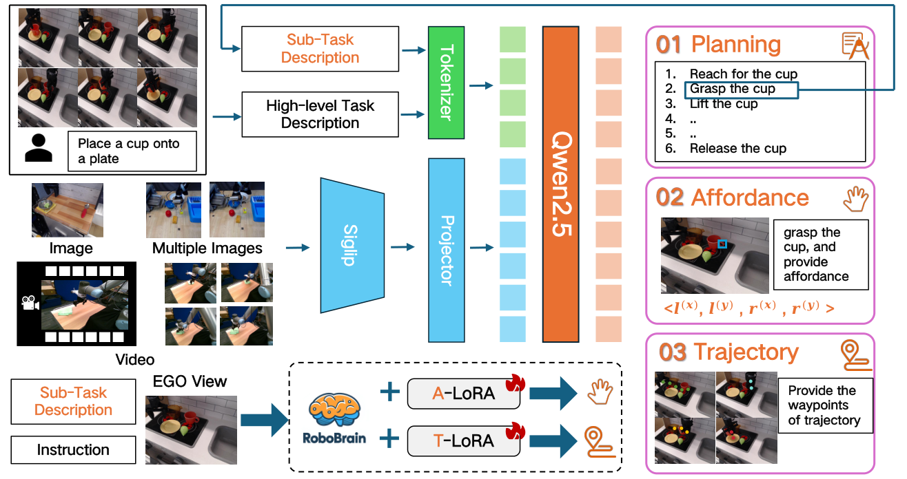
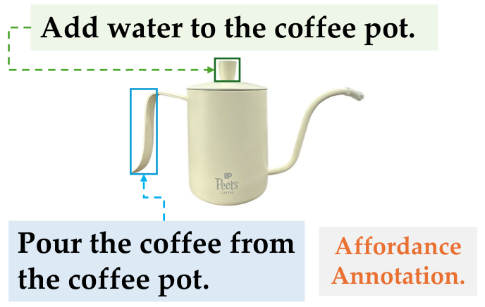
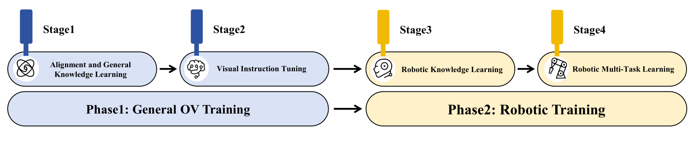
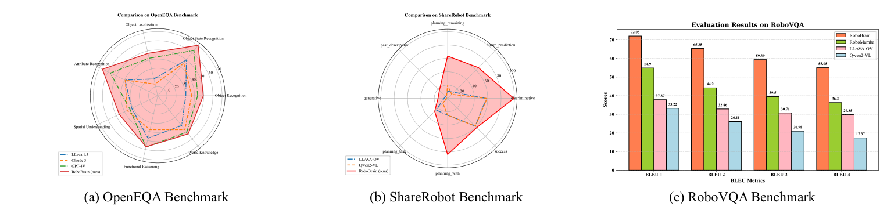
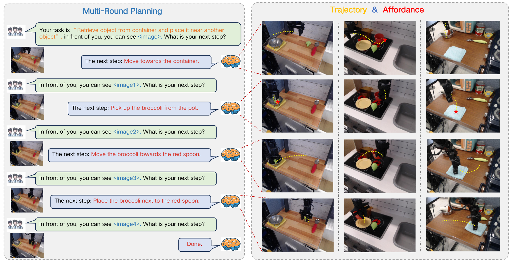

# V6. RoboBrain: A Unified Brain Model for Robotic Manipulation from Abstract to Concrete

## 0. 읽기 전 약어 및 핵심 용어

이 문서를 읽기 전에 아래 약어와 용어를 먼저 정리한다. 이후 본문에서는 괄호 안의 약어를 사용한다.

- Artificial Intelligence (AI): 사람의 지각, 추론, 학습, 의사결정 능력을 기계가 수행하도록 만드는 인공지능 분야를 뜻한다.
- Large Language Model (LLM): 대규모 텍스트 데이터로 학습되어 언어 이해, 생성, 추론, 계획에 쓰이는 foundation model이다.
- Vision-Language-Action (VLA): 시각 관측과 언어 명령을 함께 받아 로봇 action까지 생성하는 모델 또는 학습 패러다임이다.
- Vision-Language (VL): 시각 정보와 언어 정보를 함께 다루는 multimodal setting을 뜻한다.
- Question Answering (QA): 질문에 대해 정답이나 설명을 생성하는 자연어 처리 task이다.
- Multi-Layer Perceptron (MLP): fully connected layer를 여러 층 쌓은 feed-forward neural network이다.
- Robotics Transformer (RT): robot observation을 입력받아 action을 예측하는 transformer 기반 robot policy 계열을 뜻한다.
- Robotics Transformer 1 (RT-1): Google의 실제 로봇 demonstration data로 학습한 transformer 기반 robot control policy이다.
- Robotics Transformer 2 (RT-2): web-scale vision-language knowledge와 robot trajectory를 함께 학습해 action token을 생성하는 VLA 모델이다.
- Open X-Embodiment (OXE): 여러 기관, 로봇, task의 demonstration을 묶은 대규모 cross-embodiment robot dataset이다.
- Root Mean Squared Error (RMSE): squared error 평균의 제곱근으로 regression 예측 오차를 측정하는 metric이다.
- Bilingual Evaluation Understudy (BLEU): generated text와 reference text의 n-gram overlap을 측정하는 metric이다.
- Bilingual Evaluation Understudy unigram score (BLEU-1): generated text와 reference text의 unigram overlap을 측정하는 BLEU 변형이다.
- Bilingual Evaluation Understudy bigram score (BLEU-2): generated text와 reference text의 bigram overlap을 측정하는 BLEU 변형이다.
- Bilingual Evaluation Understudy trigram score (BLEU-3): generated text와 reference text의 trigram overlap을 측정하는 BLEU 변형이다.
- Bilingual Evaluation Understudy four-gram score (BLEU-4): generated text와 reference text의 four-gram overlap을 측정하는 BLEU 변형이다.
- Beijing Academy of Artificial Intelligence (BAAI): 중국 베이징의 인공지능 연구기관이다.
- University of Hong Kong (HKU): 홍콩대학교를 뜻한다.
- Chinese Academy of Sciences (CAS): 중국과학원을 뜻한다.

## 1. Metadata

| Field | 내용 |
|---|---|
| ID | `V6` |
| Title | RoboBrain: A Unified Brain Model for Robotic Manipulation from Abstract to Concrete |
| Authors | Yuheng Ji, Huajie Tan, Jiayu Shi, Xiaoshuai Hao, Yuan Zhang et al. |
| Affiliation / Team | Peking University / BAAI / CAS / HKU |
| Venue / Status | arXiv / CVPR-style manuscript |
| Date | 2025-02-28 |
| Link | https://arxiv.org/abs/2502.21257 |
| Project | https://superrobobrain.github.io |
| Local source | `paper_corpus/sources/V6` |
| Source figures | `paper_corpus/figures_source/V6/manifest.md` |

## 2. 핵심 요약

RoboBrain은 long-horizon robotic manipulation을 위해 MLLM이 가져야 할 세 가지 능력을 planning, affordance perception, trajectory prediction으로 나누고, 이를 하나의 "robotic brain"으로 학습시키려는 논문이다. 이를 위해 저자들은 ShareRobot이라는 dataset을 만들고, task planning, object affordance, end-effector trajectory를 함께 label한다.

핵심 메시지는 "로봇용 MLLM은 추상적인 instruction을 이해하는 데서 끝나면 안 되고, 계획을 세운 뒤 어떤 물체의 어느 affordance를 잡고 어떤 trajectory로 움직일지까지 구체화해야 한다"는 것이다.

## 3. 왜 중요한가?

- RoboMamba가 efficient VLA backbone과 policy head에 초점을 맞췄다면, RoboBrain은 "robot brain capability"를 planning, affordance, trajectory로 명시적으로 분해한다.
- Open X-Embodiment 기반 data를 task planning QA, affordance box, 2D trajectory waypoint로 재가공한 ShareRobot dataset을 제안한다.
- long video, high-resolution image, historical frame memory를 포함해 robotic manipulation planning에 필요한 multimodal context를 강조한다.
- A-LoRA와 T-LoRA를 통해 affordance perception과 trajectory prediction을 별도 concrete skill로 fine-tuning한다.
- 결과적으로 RoboVQA, OpenEQA, ShareRobot, affordance AP, trajectory distance metric에서 평가한다.

## 4. Abstract to Concrete

  

<em>Figure 1. RoboBrain overview. planning capability, affordance perception, trajectory prediction을 핵심 robotic brain capability로 정의한다. Source figure: <code>images/teaser.pdf</code>.</em>

논문은 기존 MLLM이 robotic scenario에서 부족한 이유를 세 capability로 설명한다.

| Capability | 질문 | 출력 |
|---|---|---|
| Planning Capability | 복잡한 task를 어떤 sub-task로 나눌 것인가? | language plan / sub-task decomposition |
| Affordance Perception | 각 sub-task에서 어디를 잡거나 접촉해야 하는가? | affordance bounding box |
| Trajectory Prediction | end-effector가 어떤 경로로 움직여야 하는가? | 2D visual trajectory waypoints |

이 구조는 "abstract instruction -> concrete manipulation cues"라는 이름 그대로다. RoboBrain은 로봇 action을 직접 torque/pose로 내는 policy라기보다, downstream action model이나 robot controller가 쓸 수 있는 planning/affordance/trajectory-level intermediate representation을 생성하는 robotic MLLM에 가깝다.

## 5. ShareRobot Dataset

  

<em>Figure 2. ShareRobot data generation pipeline. task planning은 atomic task와 QA pair로, affordance와 trajectory는 instruction-conditioned spatial labels로 구성된다. Source figure: <code>images/dataset_pipeline_new.pdf</code>.</em>

ShareRobot은 Open X-Embodiment에서 high-quality demonstration을 선별하고, 이를 fine-grained robotic reasoning data로 재구성한다.

| Dataset property | 내용 |
|---|---|
| Source | Open X-Embodiment에서 선별 |
| Selected instances | 51,403 instances |
| Planning QA pairs | 1,027,990 QA pairs |
| Scenes | 102 scenes |
| Embodiments | 12 robot bodies |
| Atomic task types | 논문 본문 figure caption은 107, statistics paragraph는 132로 표기되어 있음 |
| Affordance labels | 6,522 images annotated, train/test 6,000/522 |
| Trajectory labels | 6,870 images annotated, train/test 6,000/870 |

  

<em>Figure 3. ShareRobot diversity. 23 original datasets, 12 embodiments, atomic task distribution을 보여준다. Source figure: <code>images/diversity.pdf</code>.</em>

data selection 기준은 발표에서 중요하다. 저자들은 low-resolution, vague description, failed demonstration, too-short video, occluded object/end-effector, unclear trajectory를 제거한다. 즉 단순히 OXE를 더 많이 쓰는 것이 아니라, planning/affordance/trajectory supervision에 적합하도록 quality filtering을 수행한다.

## 6. Model Architecture

  

<em>Figure 4. RoboBrain pipeline. foundation model로 planning을 수행하고, A-LoRA와 T-LoRA로 affordance perception과 trajectory prediction을 fine-tuning한다. Source figure: <code>images/pipeline_new.pdf</code>.</em>

RoboBrain은 LLaVA-style architecture를 기반으로 한다.

| Module | 구현 | 역할 |
|---|---|---|
| Vision Encoder | SigLIP | image/video visual feature 추출 |
| Projector | 2-layer MLP | visual feature를 LLM semantic space로 mapping |
| LLM | Qwen2.5-7B-Instruct | planning과 language response generation |
| A-LoRA | LoRA module | affordance perception |
| T-LoRA | LoRA module | trajectory prediction |

visual input은 다음처럼 처리된다.

$$
Z_v=g(X_v)
$$

| Notation | 의미 |
|---|---|
| $X_v$ | image 또는 video visual input |
| $g(\cdot)$ | Vision Encoder, 논문에서는 SigLIP |
| $Z_v$ | encoded visual features |

visual feature는 projector를 통해 LLM semantic space로 변환된다.

$$
H_v=h(Z_v)
$$

| Notation | 의미 |
|---|---|
| $h(\cdot)$ | projector, 논문에서는 2-layer MLP |
| $H_v$ | LLM에 입력되는 visual tokens |

LLM은 text instruction과 visual token을 조건으로 autoregressive textual response를 생성한다.

$$
Y=f(X_t,H_v)
$$

| Notation | 의미 |
|---|---|
| $f(\cdot)$ | LLM, 논문에서는 Qwen2.5-7B-Instruct |
| $X_t$ | human language instruction |
| $Y$ | generated response, 예: plan, affordance description, trajectory coordinates |

## 7. Affordance Representation

RoboBrain에서 affordance는 "human hand 또는 end-effector가 object와 접촉하는 영역"으로 정의되며, bounding box로 표현된다.

$$
O_i=\{A_i^0,A_i^1,\ldots,A_i^N\}
$$

| Notation | 의미 |
|---|---|
| $O_i$ | $i$번째 object |
| $A_i^j$ | $i$번째 object의 $j$번째 affordance region |
| $N$ | object가 가진 affordance region 개수 |

각 affordance box는 top-left와 bottom-right 좌표로 표현된다.

$$
A_i^j=\{l^{(x)},l^{(y)},r^{(x)},r^{(y)}\}
$$

| Notation | 의미 |
|---|---|
| $l^{(x)},l^{(y)}$ | affordance bounding box의 top-left coordinate |
| $r^{(x)},r^{(y)}$ | affordance bounding box의 bottom-right coordinate |

  

<em>Figure 5. Prompt-aware affordance training sample. 같은 object라도 instruction에 따라 lid, spout 등 affordance target이 달라진다. Source figure: <code>images/affordance.pdf</code>.</em>

중요한 점은 affordance가 object category만으로 정해지지 않는다는 것이다. 예를 들어 "물 넣기"는 teapot lid가 affordance가 될 수 있고, "차 따르기"는 spout이 affordance가 될 수 있다. 따라서 RoboBrain은 prompt-aware affordance를 학습한다.

## 8. Trajectory Representation

RoboBrain의 trajectory는 full continuous robot state/action trajectory가 아니라, image plane 위의 coarse 2D visual trace다.

$$
P_{t:N}=\{(x_i,y_i)\mid i=t,t+1,\ldots,N\}
$$

| Notation | 의미 |
|---|---|
| $P_{t:N}$ | time $t$부터 $N$까지의 trajectory waypoints |
| $(x_i,y_i)$ | $i$번째 waypoint의 2D image coordinate |
| $N$ | episode의 total time step 또는 waypoint horizon |

이 표현은 RT-style visual trace 또는 2D waypoint와 비슷하다. 실제 low-level controller가 바로 쓰는 action이라기보다, manipulation path의 coarse spatial pattern을 MLLM이 예측하도록 하는 중간 표현이다.

## 9. Training Strategy

  

<em>Figure 6. Multi-stage training configuration. general OV training 이후 robotic planning, affordance, trajectory capability를 단계적으로 학습한다. Source figure: <code>images/training_process.pdf</code>.</em>

RoboBrain은 Phase 1 general training과 Phase 2 robotic training으로 나뉜다.

| Stage | Data | Trainable parameters | 목적 |
|---|---|---|---|
| Stage 1 | LCS 558K | Projector | visual-language alignment |
| Stage 1.5 | 4M image-text | Full model | general multimodal understanding |
| Stage 2 | 3.2M image + 1.6M image/video | Full model | high-resolution image/video instruction following |
| Stage 3 | 3M robotic data | Full model | manipulation planning and robotic reasoning |
| Stage 4 A-LoRA | 10K affordance data | A-LoRA, 28M | affordance perception |
| Stage 4 T-LoRA | 400K trajectory data | T-LoRA, 28M | trajectory prediction |

Stage 3에서는 RoboVQA-800K, ScanView-318K, ShareRobot-200K 등을 쓰고, catastrophic forgetting을 줄이기 위해 Phase 1의 high-quality image-text data 약 1.7M을 섞는다.

## 10. Planning / Robot Brain Results

  

<em>Figure 7. Robot brain benchmark results. OpenEQA, ShareRobot, RoboVQA에서 RoboBrain이 baselines보다 높은 성능을 보인다고 보고한다. Source figure: <code>images/result.pdf</code>.</em>

supplementary table 기준으로 RoboVQA 결과는 다음과 같다.

| Model | BLEU-1 | BLEU-2 | BLEU-3 | BLEU-4 |
|---|---:|---:|---:|---:|
| RoboBrain | 72.05 | 65.35 | 59.39 | 55.05 |
| RoboMamba | 54.90 | 44.20 | 39.50 | 36.30 |
| LLaVA-OV-7B | 38.12 | 33.56 | 31.76 | 30.97 |
| GPT-4V | 32.23 | 26.51 | 24.65 | 23.94 |
| Qwen2-VL-7B | 33.22 | 26.11 | 20.98 | 17.37 |

ShareRobot Eval에서는 RoboBrain이 planning, future prediction, past description, discriminative/generative affordance 관련 항목에서 높은 점수를 보인다. 다만 OpenEQA에서는 일부 category에서 Qwen2-VL이나 LLaVA-OV가 더 높고, RoboBrain이 모든 category를 압도하는 것은 아니다. 논문도 future work에서 spatial intelligence를 더 강화해야 한다고 언급한다.

## 11. Affordance and Trajectory Results

affordance prediction은 AGD20K affordance test set에서 AP로 평가한다.

| Model | AP |
|---|---:|
| LLaVA-NeXT-7B | 9.8% |
| Qwen2-VL-7B | 12.5% |
| RoboBrain | 27.1% |

trajectory prediction은 DFD, HD, RMSE로 평가한다. 낮을수록 좋다.

| Method | DFD | HD | RMSE |
|---|---:|---:|---:|
| RoboBrain Base | 0.191 | 0.171 | 0.133 |
| + Start Points | 0.176 | 0.157 | 0.117 |
| + Max Points | 0.185 | 0.163 | 0.125 |
| + Spec Token and End Points | 0.109 | 0.010 | 0.091 |

저자들은 start point가 generated trajectory와 end-effector 사이의 translational offset을 줄이고, special token과 endpoint가 waypoint/start/goal point를 더 명시적으로 학습하게 한다고 해석한다.

## 12. Visualization

  

<em>Figure 8. RoboBrain demonstration. instruction과 visual input을 바탕으로 plan, affordance, trajectory를 함께 생성하는 예시. Source figure: <code>images/demo.pdf</code>.</em>

이 figure는 발표에서 "abstract-to-concrete" 흐름을 보여주기 좋다. 사용자가 instruction을 주면 RoboBrain은 먼저 계획을 만들고, 각 step에 대해 affordance와 trajectory를 예측한다.

  

<em>Figure 9. Additional trajectory visualization. ground-truth와 predicted 2D trajectory를 비교하며, 마지막 row에는 spatial/world knowledge 부족으로 인한 failure case가 포함된다. Source figure: <code>images/some_trajectory_Visualization_v2.pdf</code>.</em>

supplementary는 실패 사례도 설명한다. cup localization 실패, fridge door의 articulated constraint 무시, clothing folding에서 deformable property 반영 부족 등이 나온다. 이는 RoboBrain이 아직 물리적 제약과 world knowledge를 충분히 trajectory prediction에 넣지 못한다는 뜻이다.

## 13. 한계와 후속 연구 포인트

| 한계 | 의미 | 후속 연구 방향 |
|---|---|---|
| direct low-level control은 아님 | trajectory는 2D visual trace이고, 실제 robot action은 별도 controller/action model이 필요 | VLA/action policy와의 end-to-end 연결 |
| spatial/world knowledge 부족 | failure case에서 object localization, articulated constraints, deformable object 이해가 부족 | 3D spatial representation, physical world model 결합 |
| benchmark evaluation 의존 | OpenEQA/ShareRobot 일부는 GPT-4o scoring을 사용 | human/robot execution 기반 evaluation 강화 |
| dataset generation bias | Gemini와 template 기반 QA generation이 포함됨 | annotation bias, template leakage, real deployment robustness 점검 |

## 14. 다른 논문과의 연결

| 연결 논문 | 연결점 |
|---|---|
| SayCan / PaLM-E | language-level task decomposition과 embodied reasoning |
| RoboMamba | robot-related reasoning을 강화하지만, RoboBrain은 planning-affordance-trajectory capability를 더 명시적으로 분해 |
| RT-1 / RT-2 / OpenVLA | action token을 바로 예측하기보다 intermediate planning and grounding signal을 생성 |
| SpatialVLA | spatial grounding 필요성 공유. RoboBrain은 2D affordance/trajectory, SpatialVLA는 3D position/action grid |
| CoT-VLA | action 전 reasoning step을 둔다는 점에서 유사. CoT-VLA는 subgoal image, RoboBrain은 plan/affordance/trajectory |
| World Model 계열 | trajectory/future prediction은 world model과 연결되지만, RoboBrain은 dynamics rollout보다 language-conditioned visual trace generation에 가깝다 |

스터디 흐름에서는 RoboMamba 뒤에 RoboBrain을 두면 자연스럽다. RoboMamba가 "efficient reasoning backbone + pose head"라면, RoboBrain은 "robot brain capability decomposition + dataset-driven training"이다.

## 15. 발표 구성 제안

1. long-horizon manipulation에서 MLLM이 부족한 세 capability를 소개한다.
2. ShareRobot dataset pipeline과 diversity figure로 dataset contribution을 설명한다.
3. RoboBrain architecture를 planning foundation model, A-LoRA, T-LoRA로 나눠 설명한다.
4. affordance box와 trajectory waypoint representation을 수식으로 짚는다.
5. RoboVQA/ShareRobot planning 결과, affordance AP, trajectory metric을 나눠 정리한다.
6. failure case를 통해 "2D trajectory와 real physics 사이의 gap"을 world model/physical AI 연구 질문으로 연결한다.

## 16. 토론 질문

| 질문 | 논의 포인트 |
|---|---|
| 2D visual trace는 실제 robot control에 충분한 intermediate representation인가? | controller 연결, depth/3D information, closed-loop correction |
| planning-affordance-trajectory decomposition은 general한가? | task 종류, manipulation primitives, deformable/articulated object |
| ShareRobot 같은 generated/annotated dataset은 어떤 bias를 만들까? | Gemini annotation, template QA, OXE data distribution |
| 운영/평가 관점에서는 무엇을 연구할 수 있을까? | dataset filtering, task decomposition taxonomy, evaluation metric design, data mixture optimization |

## 17. 한 줄 정리

RoboBrain은 로봇용 MLLM이 추상적 instruction을 실제 조작으로 연결하기 위해 planning, affordance, trajectory라는 세 중간 능력을 명시적으로 학습해야 한다고 주장하는 논문이다.