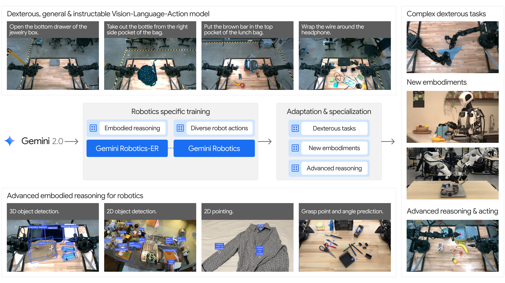
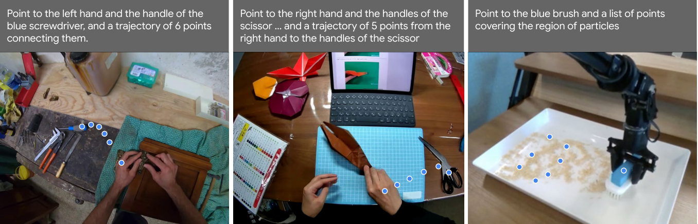
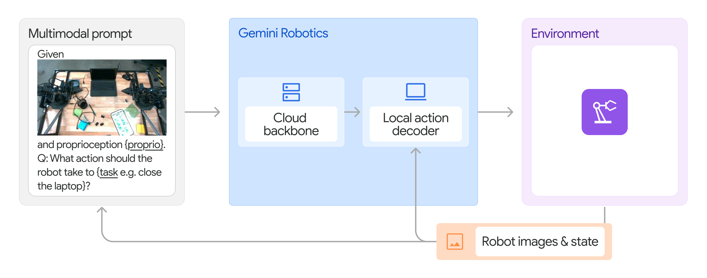
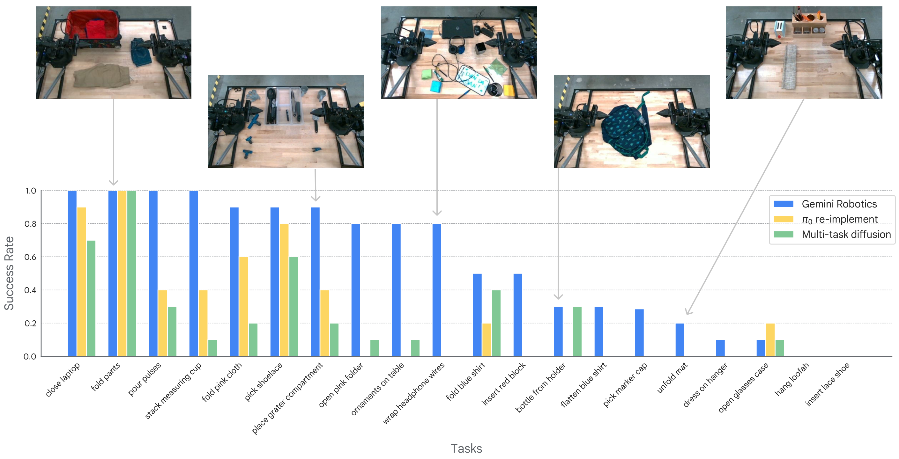
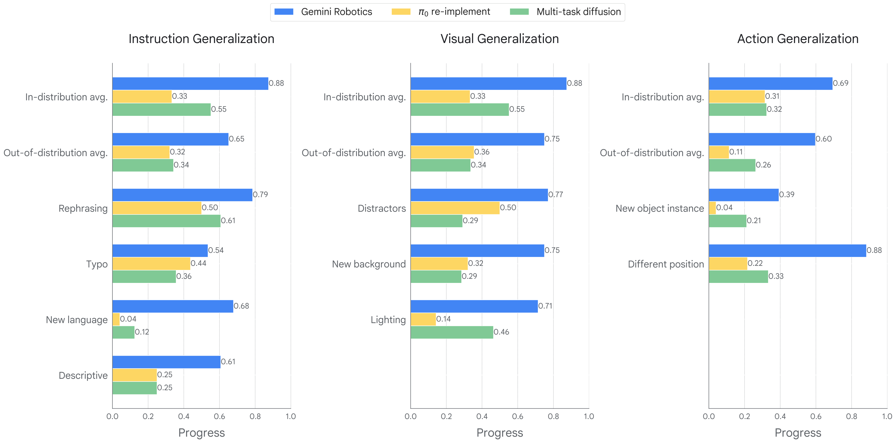
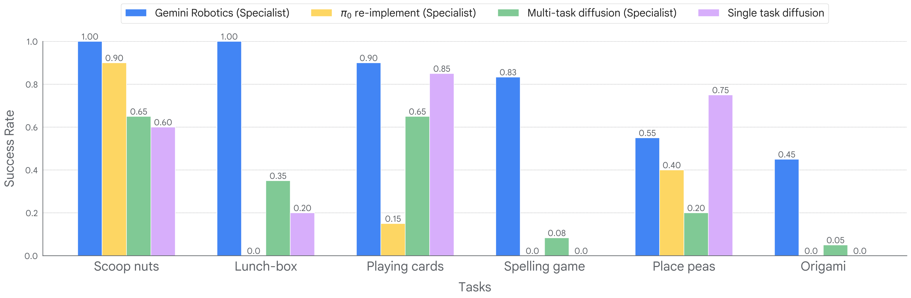
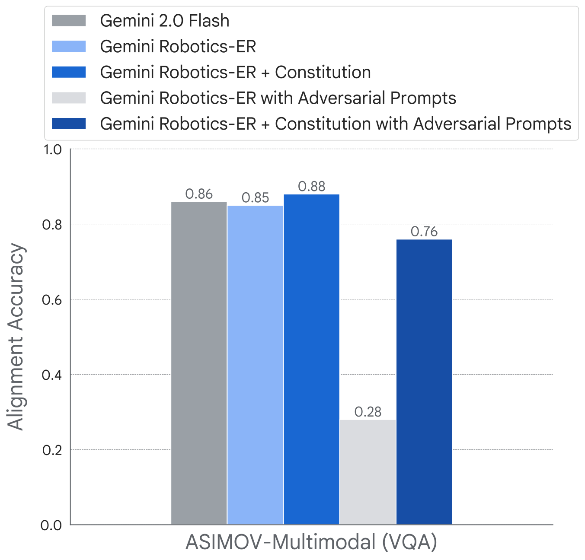

# V7. Gemini Robotics: Bringing AI into the Physical World

## 0. 읽기 전 약어 및 핵심 용어

이 문서를 읽기 전에 아래 약어와 용어를 먼저 정리한다. 이후 본문에서는 괄호 안의 약어를 사용한다.

- Artificial Intelligence (AI): 사람의 지각, 추론, 학습, 의사결정 능력을 기계가 수행하도록 만드는 인공지능 분야를 뜻한다.
- Data Science and Business Analytics (DSBA): 데이터 과학, 비즈니스 분석, AI 기반 의사결정을 다루는 연구실/전공 맥락을 뜻한다.
- Vision-Language Model (VLM): 이미지와 텍스트를 함께 입력받아 시각-언어 이해나 생성 작업을 수행하는 모델이다.
- Vision-Language-Action (VLA): 시각 관측과 언어 명령을 함께 받아 로봇 action까지 생성하는 모델 또는 학습 패러다임이다.
- Visual Question Answering (VQA): 이미지나 비디오를 보고 자연어 질문에 답하는 vision-language task이다.
- Out-of-Distribution (OOD): 학습 데이터 분포와 다른 object, scene, task, embodiment, environment 조건을 뜻한다.
- Experience Replay (ER): 이전 task나 episode의 데이터를 buffer에 저장했다가 다시 학습해 forgetting을 줄이는 방법이다.
- Robotics Transformer (RT): robot observation을 입력받아 action을 예측하는 transformer 기반 robot policy 계열을 뜻한다.
- Robotics Transformer 2 (RT-2): web-scale vision-language knowledge와 robot trajectory를 함께 학습해 action token을 생성하는 VLA 모델이다.
- A Low-cost Open-source Hardware System for Bimanual Teleoperation (ALOHA): 저비용 양팔 teleoperation hardware와 imitation learning setup을 뜻한다.
- ASIMOV safety framework (ASIMOV): Gemini Robotics 맥락에서 robot action의 안전성과 정책 제약을 다루기 위한 safety evaluation/framework 이름으로 쓰인다.
- Large Vocabulary Instance Segmentation (LVIS): long-tail object category를 포함하는 large-vocabulary instance segmentation dataset이다.

## 1. Metadata

| Field | 내용 |
|---|---|
| ID | `V7` |
| Title | Gemini Robotics: Bringing AI into the Physical World |
| Authors | Gemini Robotics Team, Google DeepMind |
| Affiliation / Team | Google DeepMind |
| Venue / Status | arXiv technical report |
| Date | 2025-03-25 |
| Link | https://arxiv.org/abs/2503.20020 |
| Local source | `paper_corpus/sources/V7` |
| Source figures | `paper_corpus/figures_source/V7/manifest.md` |

## 2. 핵심 요약

Gemini Robotics는 Gemini 2.0을 물리 세계로 확장하기 위한 Google DeepMind의 robotics foundation model report다. 논문은 두 모델을 제시한다. 첫째, `Gemini Robotics-ER`는 embodied reasoning을 강화한 VLM으로 object detection, pointing, trajectory prediction, grasp prediction, multi-view correspondence, 3D bounding box prediction을 수행한다. 둘째, `Gemini Robotics` action model은 Gemini Robotics-ER 위에 구축된 VLA로, cloud VLA backbone과 on-robot local action decoder를 결합해 real robot을 직접 제어한다.

핵심 메시지는 "general-purpose robot을 만들려면 internet-scale multimodal reasoning을 physical action data로 grounding해야 하며, embodied reasoning과 low-latency action generation이 함께 필요하다"는 것이다.

## 3. 왜 중요한가?

- Google DeepMind가 Gemini 2.0 기반으로 physical AI와 generalist VLA를 공식적으로 연결한 대표 tech report다.
- embodied reasoning을 별도 benchmark인 ERQA로 평가하고, 이후 VLA action model에 연결하는 구조를 제시한다.
- action model은 large VLA backbone을 cloud에 두고 local action decoder를 robot onboard에서 실행해 latency를 보완한다.
- ALOHA 2 fleet에서 12개월간 수집한 수천 시간 규모 teleoperated robot action data와 non-action multimodal data를 함께 사용한다.
- post-training으로 long-horizon dexterity, reasoning-enhanced generalization, fast adaptation, new embodiment adaptation을 모두 다룬다.
- robotics foundation model에서 safety를 별도 섹션으로 다루며 content safety, semantic action safety, ASIMOV benchmark, constitutional AI를 논의한다.

## 4. Model Family Overview

  

<em>Figure 1. Gemini Robotics family overview. Gemini 2.0의 multimodal capability 위에 embodied reasoning, action generation, specialization, safety를 추가한다. Source figure: <code>src/assets/gr_overview.pdf</code>.</em>

논문은 embodied AI를 두 단계로 본다.

| 단계 | 모델 | 역할 |
|---|---|---|
| Passive physical understanding | Gemini Robotics-ER | spatial/temporal/3D/affordance reasoning |
| Active physical interaction | Gemini Robotics action model | robot action chunks를 생성해 real robot control |

이 구분은 스터디에서 중요하다. RoboBrain이 planning-affordance-trajectory intermediate representation을 강조했다면, Gemini Robotics는 embodied reasoning model과 action model을 명시적으로 결합한다.

## 5. Embodied Reasoning and ERQA

  

<em>Figure 2. Embodied reasoning capabilities. Gemini 2.0은 2D detection/pointing, trajectory/grasp prediction, multi-view correspondence, 3D bounding box prediction을 수행한다. Source figure: <code>src/assets/ER/er_overview_v2.pdf</code>.</em>

논문에서 embodied reasoning은 VLM이 real world의 object와 spatial concept을 grounding하고, 이를 downstream robotics application에 쓸 수 있는 signal로 합성하는 능력이다.

ERQA는 이를 평가하기 위한 benchmark다.

| ERQA property | 내용 |
|---|---|
| 형식 | multiple-choice VQA |
| 문항 수 | 400 questions |
| 범주 | spatial reasoning, trajectory reasoning, action reasoning, state estimation, pointing, multi-view reasoning, task reasoning |
| multi-image 비율 | 28% |
| 특징 | object recognition/counting보다 physical action에 필요한 reasoning을 평가 |

  

<em>Figure 3. ERQA examples. 단순 perception보다 action/spatial/multi-view reasoning이 필요한 질문들로 구성된다. Source figure: <code>src/assets/ER/erbenchmark/er_benchmark_examples.pdf</code>.</em>

ERQA와 관련 benchmark 결과는 다음과 같다.

| Benchmark | Gemini 2.0 Flash | Gemini 2.0 Pro Experimental | GPT-4o | Claude 3.5 Sonnet |
|---|---:|---:|---:|---:|
| ERQA | 46.3 | 48.3 | 47.0 | 35.5 |
| RealworldQA | 71.6 | 74.5 | 71.9 | 61.4 |
| BLINK | 65.0 | 65.2 | 62.3 | 60.2 |

Chain-of-Thought prompting도 효과가 있다.

| Prompt | Gemini 2.0 Flash | Gemini 2.0 Pro Experimental | GPT-4o |
|---|---:|---:|---:|
| Without CoT | 46.3 | 48.3 | 47.0 |
| With CoT | 50.3 | 54.8 | 50.5 |

이 결과는 physical AI에서 "reasoning trace"가 단순 설명이 아니라 spatial grounding을 강화하는 도구가 될 수 있음을 보여준다.

## 6. Spatial Outputs as Robot-Useful Representations

Gemini Robotics-ER는 여러 robotics-friendly output format을 사용한다.

| Capability | Output representation | 의미 |
|---|---|---|
| 2D object detection | $[y_0,x_0,y_1,x_1]$ | normalized image bounding box |
| 2D pointing | $[y,x]$ | object, part, free space, affordance point |
| trajectory prediction | sequence of 2D points | coarse motion path |
| top-down grasp prediction | $(y,x,\theta)$ | grasp center and rotation angle |
| multi-view correspondence | paired 2D points | 같은 3D point의 multi-view correspondence |
| 3D bounding box | metric 3D box | monocular image에서 3D object extent 추정 |

2D pointing benchmark에서 Gemini Robotics-ER는 다음 성능을 보고한다.

| Benchmark | Gemini Robotics-ER | Gemini 2.0 Flash | GPT-4o | Molmo 72B |
|---|---:|---:|---:|---:|
| Paco-LVIS | 71.3 | 46.1 | 16.2 | 47.1 |
| Pixmo-Point | 49.5 | 25.8 | 5.0 | 12.5 |
| Where2Place | 45.0 | 33.8 | 20.6 | 63.8 |

  

<em>Figure 4. 2D trajectory prediction examples. Gemini 2.0은 start/end point를 기반으로 image-grounded trajectory를 생성한다. Source figure: <code>src/assets/ER/trajectory/trajectory_collage_v2.pdf</code>.</em>

이 부분은 RoboBrain과 직접 연결된다. 둘 다 2D trajectory를 intermediate representation으로 사용하지만, Gemini Robotics는 이를 VLA action model의 reasoning-enhanced variant로 연결한다.

## 7. Gemini Robotics Action Model

  

<em>Figure 5. Gemini Robotics action model architecture. cloud VLA backbone과 on-robot local action decoder가 action chunks를 생성한다. Source figure: <code>src/assets/actions/action_model_overview_new_alt.pdf</code>.</em>

Gemini Robotics action model은 Gemini-derived VLA다. input은 scene images와 task instruction이며, output은 robot이 실행할 action chunk다.

| Component | 위치 | 역할 |
|---|---|---|
| Gemini Robotics backbone | cloud | multimodal prompt를 처리하고 high-level action representation 생성 |
| Local action decoder | robot onboard computer | latency를 보완하며 low-level action chunk로 변환 |

latency 관련 수치가 중요하다.

| Metric | 값 |
|---|---:|
| backbone query-to-response latency | under 160 ms |
| raw observation to low-level action chunk latency | approximately 250 ms |
| effective control frequency | 50 Hz |

데이터는 ALOHA 2 robot fleet에서 12개월간 수집한 수천 시간의 real-world expert demonstrations를 포함한다. 또한 web documents, code, image/audio/video multimodal content, embodied reasoning/VQA data 같은 non-action data도 함께 사용한다.

## 8. Out-of-the-box Dexterous Manipulation

  

<em>Figure 6. Out-of-the-box dexterous manipulation. 20개 short-horizon dexterous tasks에서 Gemini Robotics action model과 baselines를 비교한다. Source figure: <code>src/assets/actions/actions-base-1-sr.pdf</code>.</em>

baselines는 두 가지다.

| Baseline | 설명 |
|---|---|
| $\pi_0$ re-implementation | 동일 data mixture로 학습한 open-weight VLA baseline |
| multi-task diffusion policy | ALOHA Unleashed에서 영감을 받은 task-conditioned diffusion policy |

논문은 20개 short-horizon dexterous tasks에서 Gemini Robotics action model을 평가한다. model은 절반의 task에서 80% 이상 success rate를 보이며, deformable object manipulation과 challenging tasks에서 baselines보다 강하다고 보고한다. 특히 "open pink folder", "insert red block", "wrap wire around headphone" 같은 hard task에서는 Gemini Robotics만 non-zero success를 보이는 경우가 있다고 설명한다.

## 9. Generalization

  

<em>Figure 7. Generalization benchmark. visual, instruction, action generalization 세 축에서 progress score를 비교한다. Source figure: <code>src/assets/actions/generalization_results_horizontals_progress.pdf</code>.</em>

generalization benchmark는 85 tasks로 구성된다.

| Category | 비율 | 예시 |
|---|---:|---|
| in-distribution | 20% | training distribution과 유사 |
| visual generalization | 28% | background, lighting, distractor, texture 변화 |
| instruction generalization | 28% | paraphrase, typo, new language, detail level 변화 |
| action generalization | 24% | initial condition 변화, object shape/property 변화 |

논문은 Gemini Robotics가 세 generalization axis 모두에서 baselines보다 안정적이며, 특히 new language instruction이나 target object visual variation처럼 baselines가 catastrophic failure를 보이는 상황에서도 non-zero performance를 유지한다고 말한다.

## 10. Specialization and Adaptation

  

<em>Figure 8. Long-horizon dexterity after specialization. origami, lunch-box packing, spelling game, card game 등 challenging tasks에서 specialized Gemini Robotics를 평가한다. Source figure: <code>src/assets/actions/post_training_sr.pdf</code>.</em>

post-training은 네 방향으로 진행된다.

| Direction | 내용 | 결과 요약 |
|---|---|---|
| long-horizon dexterity | origami fox, lunch-box packing, spelling game 등 | specialist models average 79% success |
| reasoning-enhanced generalization | trajectory reasoning을 action prediction과 더 가깝게 relabeling | OOD reasoning/spatial/semantic tasks 성능 향상 |
| fast adaptation | short-horizon new tasks를 적은 demo로 학습 | 8개 중 7개 task에서 100 demos 이하로 70% 이상 success |
| new embodiment adaptation | bi-arm Franka, Apollo humanoid | bi-arm Franka에서 average 63% success, generalization tests에서 diffusion baseline보다 강함 |

long-horizon dexterity에서 특히 lunch-box packing은 100% success로 보고되며, task completion이 2분 이상 걸리는 full long-horizon task다. spelling game에서는 printed images뿐 아니라 training에 없던 hand-drawn sketches 6개 중 4개를 맞춘다고 보고한다.

  

<em>Figure 9. Fast adaptation. 최대 100 demonstrations로 새로운 short-horizon task를 fine-tuning한다. Source figure: <code>src/assets/actions/fast_adaptation_sr_new.pdf</code>.</em>

이 결과는 "large generalist VLA가 few-shot robot skill adaptation에 유리한가?"라는 질문에 대해 강한 evidence를 제공한다. 단, 논문은 여전히 task-specific fine-tuning을 사용한다는 점도 같이 봐야 한다.

## 11. Safety

  

<em>Figure 10. ASIMOV-Multimodal safety evaluation. physical-world safety question answering에서 Gemini 2.0 Flash와 Gemini Robotics-ER를 평가한다. Source figure: <code>src/assets/safety/maxer-asimov-multimodal-new.pdf</code>.</em>

논문은 robotics foundation model의 safety를 세 층으로 나눈다.

| Safety layer | 설명 |
|---|---|
| physical action safety | collision avoidance, workspace bounds, stable mobility, force regulation 등 low-level control safety |
| content safety | harmful conversational content, privacy, inappropriate advice 방지 |
| semantic action safety | soft toy on hot stove, allergen serving, knife pointing 등 open-domain physical safety reasoning |

Gemini Robotics-ER는 pointing 같은 새로운 output modality가 있기 때문에, bias-inducing pointing query에 대한 rejection training도 수행한다. 논문은 supervised fine-tuning 후 bias-inducing pointing query rejection rate가 baseline 20%에서 96%로 올라간다고 보고한다.

semantic action safety는 ASIMOV datasets로 평가한다. 논문은 constitution/post-training이 adversarial prompt 상황에서도 safety understanding degradation을 줄일 수 있다고 설명한다.

## 12. 한계와 후속 연구 포인트

| 한계 | 의미 | 후속 연구 방향 |
|---|---|---|
| fine-grained numerical precision | point/box prediction이 low-level control에 충분히 정밀하지 않을 수 있음 | geometric calibration, uncertainty-aware grounding, closed-loop correction |
| long-video spatial grounding | Gemini 2.0도 긴 video에서 spatial relationship grounding에 어려움이 있을 수 있음 | temporal memory, world model, video-grounded policy |
| cloud backbone latency/dependency | low-latency decoder가 있지만 cloud inference 구조는 deployment 제약이 있음 | on-device distillation, edge VLA, hierarchical local controller |
| cross-embodiment transfer | new embodiment adaptation은 fine-tuning 기반이며 zero-shot은 아직 future goal | embodiment-invariant action representation |
| safety | semantic action safety는 open-domain이라 exhaustive enumeration이 불가능 | constitutional AI, formal constraints, runtime safety monitor 결합 |

## 13. 다른 논문과의 연결

| 연결 논문 | 연결점 |
|---|---|
| RT-2 | web-scale VLM knowledge를 robot action으로 transfer한다는 큰 방향을 계승 |
| OpenVLA / $\pi_0$ | generalist VLA action model 경쟁 축. Gemini Robotics는 closed frontier backbone과 cloud-local decoder 구조가 특징 |
| CoT-VLA | action 전 embodied reasoning 또는 trajectory intermediate를 활용한다는 점에서 연결 |
| SpatialVLA | physical world grounding과 3D/spatial understanding 강화라는 문제의식 공유 |
| RoboBrain | planning/affordance/trajectory intermediate representation과 강하게 연결 |
| RoboMamba | robot reasoning과 action efficiency를 다루지만, Gemini Robotics는 frontier VLM 기반 + real-world fleet data 중심 |
| World Model 계열 | trajectory, temporal reasoning, physical safety는 predictive world representation과 직접 연결되는 후속 질문 |

스터디 흐름에서는 RoboBrain 다음에 Gemini Robotics를 배치하면 좋다. RoboBrain이 capability decomposition과 dataset-driven robotic brain을 제시했다면, Gemini Robotics는 frontier multimodal foundation model을 실제 robot action과 safety까지 확장한 산업/연구 최전선 사례다.

## 14. 발표 구성 제안

1. digital AI와 physical AI의 gap을 embodied reasoning과 action grounding으로 설명한다.
2. ERQA benchmark와 Gemini Robotics-ER capability를 소개한다.
3. 2D/3D spatial output representation이 왜 robot control에 유용한지 설명한다.
4. Gemini Robotics action model의 cloud backbone + local decoder 구조와 latency 수치를 짚는다.
5. dexterous manipulation, generalization, post-training/adaptation 결과를 세 축으로 정리한다.
6. safety section을 별도 슬라이드로 두고 physical/content/semantic action safety를 구분한다.

## 15. 토론 질문

| 질문 | 논의 포인트 |
|---|---|
| cloud VLA backbone + local decoder는 practical robot deployment에 적절한 구조인가? | latency, reliability, privacy, edge deployment |
| embodied reasoning benchmark가 real robot success를 얼마나 예측할까? | ERQA score와 manipulation success의 상관 |
| action model이 reasoning intermediate를 출력하는 것이 interpretability와 성능을 동시에 높일까? | CoT-VLA, RoboBrain, trajectory CoT와 비교 |
| DSBA/IE 관점에서는 어떤 연구 질문이 나올까? | fleet data collection design, A/B testing, safety evaluation, adaptation cost-performance trade-off |

## 16. 한 줄 정리

Gemini Robotics는 Gemini 2.0의 embodied reasoning을 robot action data로 grounding해, physical world에서 이해하고 행동하는 general-purpose VLA로 확장하려는 frontier robotics foundation model report다.
