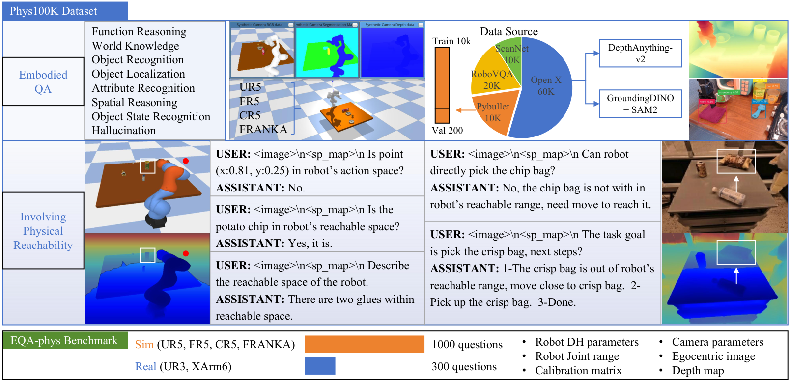

# V8. PhysVLM: Enabling Visual Language Models to Understand Robotic Physical Reachability

## 0. 읽기 전 약어 및 핵심 용어

이 문서를 읽기 전에 아래 약어와 용어를 먼저 정리한다. 이후 본문에서는 괄호 안의 약어를 사용한다.

- Data Science and Business Analytics (DSBA): 데이터 과학, 비즈니스 분석, AI 기반 의사결정을 다루는 연구실/전공 맥락을 뜻한다.
- Application Programming Interface (API): 소프트웨어 모듈이나 robot primitive를 외부에서 호출하기 위한 함수/규약 interface이다.
- Vision-Language Model (VLM): 이미지와 텍스트를 함께 입력받아 시각-언어 이해나 생성 작업을 수행하는 모델이다.
- Vision-Language-Action (VLA): 시각 관측과 언어 명령을 함께 받아 로봇 action까지 생성하는 모델 또는 학습 패러다임이다.
- Embodied Question Answering (EQA): agent가 환경 안에서 관측하거나 이동하면서 질문에 답하는 embodied AI task이다.
- Question Answering (QA): 질문에 대해 정답이나 설명을 생성하는 자연어 처리 task이다.
- Red-Green-Blue image (RGB): 색상을 red, green, blue 세 채널로 표현하는 일반 image format이다.
- Red-Green-Blue plus Depth image (RGB-D): RGB image에 각 pixel의 depth 정보를 함께 포함한 visual observation이다.
- Multi-Layer Perceptron (MLP): fully connected layer를 여러 층 쌓은 feed-forward neural network이다.
- Bilingual Evaluation Understudy (BLEU): generated text와 reference text의 n-gram overlap을 측정하는 metric이다.
- Bilingual Evaluation Understudy unigram score (BLEU-1): generated text와 reference text의 unigram overlap을 측정하는 BLEU 변형이다.
- Bilingual Evaluation Understudy bigram score (BLEU-2): generated text와 reference text의 bigram overlap을 측정하는 BLEU 변형이다.
- Bilingual Evaluation Understudy trigram score (BLEU-3): generated text와 reference text의 trigram overlap을 측정하는 BLEU 변형이다.
- Bilingual Evaluation Understudy four-gram score (BLEU-4): generated text와 reference text의 four-gram overlap을 측정하는 BLEU 변형이다.
- Habitat-Matterport 3D dataset (HM3D): embodied navigation과 3D scene understanding에 쓰이는 실내 3D environment dataset이다.
- Computer Vision Foundation (CVF): CVPR/ICCV/ECCV 등 computer vision 논문의 open access proceedings를 제공하는 foundation이다.
- Chinese Academy of Sciences (CAS): 중국과학원을 뜻한다.

## 1. Metadata

| Field | 내용 |
|---|---|
| ID | `V8` |
| Title | PhysVLM: Enabling Visual Language Models to Understand Robotic Physical Reachability |
| Authors | Weijie Zhou, Manli Tao, Chaoyang Zhao, Haiyun Guo, Honghui Dong, Ming Tang, Jinqiao Wang |
| Affiliation / Team | Beijing Jiaotong University / Institute of Automation, CAS / ObjectEye Inc. / Guangdong Polytechnic Normal University |
| Venue / Status | CVPR 2025 |
| Date | 2025-03-11 arXiv / CVPR 2025 |
| Link | https://arxiv.org/abs/2503.08481 |
| CVF | https://openaccess.thecvf.com/content/CVPR2025/html/Zhou_PhysVLM_Enabling_Visual_Language_Models_to_Understand_Robotic_Physical_Reachability_CVPR_2025_paper.html |
| Code | https://github.com/unira-zwj/PhysVLM |
| Local source | `paper_corpus/sources/V8` |
| Source figures | `paper_corpus/figures_source/V8/manifest.md` |

## 2. 핵심 요약

PhysVLM은 VLM이 물체를 볼 수는 있지만 "로봇이 실제로 닿을 수 있는가"를 모른다는 문제를 다룬다. 이를 위해 저자들은 다양한 robot의 physical reachability를 unified spatial representation으로 추상화한 `Space-Physical Reachability Map` 또는 `S-P Map`을 만들고, RGB image, instruction, S-P Map을 함께 입력받는 dual-branch VLM인 PhysVLM을 제안한다.

핵심 메시지는 "robot reasoning에서 affordance는 object property만이 아니라 robot body와 workspace constraint에 의해 결정되며, VLM이 task planning을 잘하려면 reachability를 별도 modality로 이해해야 한다"는 것이다.

## 3. 왜 중요한가?

- 기존 VLM/VLA가 환경 perception은 잘하지만 robot-specific physical reachability를 무시해 infeasible plan을 만들 수 있음을 정면으로 다룬다.
- S-P Map은 joint limit, DH parameter, egocentric depth/point cloud, extrinsic calibration을 이용해 reachable/unreachable region을 image plane에 정렬된 map으로 표현한다.
- PhysVLM은 S-P Map 전용 physical reachability encoder를 추가해 일반 vision-language capability를 유지하면서 physical constraint reasoning을 학습한다.
- Phys100K dataset과 EQA-phys benchmark를 제안해 physical reachability QA를 평가한다.
- GPT-4o 같은 API VLM에도 S-P Map을 prompt/input으로 주면 성능이 올라간다는 점을 보여준다.

## 4. Motivation

  

<em>Figure 1. Motivation. GPT-4o 같은 VLM은 object와 scene을 이해해도 robot physical reachability를 고려하지 못해 잘못된 응답을 만들 수 있다. Source figure: <code>images/image1.pdf</code>.</em>

PhysVLM이 강조하는 실패 유형은 단순 object recognition failure가 아니다. VLM은 "crisp bag이 보인다", "잡으면 된다"라고 말할 수 있지만, 실제 robot arm이 해당 위치에 닿을 수 없다면 task plan은 실패한다.

| 일반 VLM이 보는 것 | PhysVLM이 추가로 보는 것 |
|---|---|
| object category, relation, scene context | robot workspace와 reachable region |
| "무엇이 어디에 있는가" | "내 robot body로 실제 접근 가능한가" |
| visual affordance | physical reachability-aware affordance |

이 관점은 SayCan의 affordance grounding과도 연결된다. SayCan이 language plan을 skill affordance로 필터링했다면, PhysVLM은 VLM reasoning 자체에 physical reachability map을 넣는다.

## 5. S-P Map Encoding

  

<em>Figure 2. PhysVLM overview. robot parameter와 egocentric depth map으로 S-P Map을 만들고, image/instruction/S-P Map을 함께 사용해 reachability-aware answer를 생성한다. Source figure: <code>images/image2.pdf</code>.</em>

S-P Map은 raw point cloud, joint range, DH parameters, extrinsic calibration을 이용해 만들어진다.

$$
\mathrm{SPMap}=F(\mathcal{P}_{\mathrm{raw}},\{\theta_i^{\mathrm{min}},\theta_i^{\mathrm{max}}\},\mathrm{DH},\mathbf{E})
$$

| Notation | 의미 |
|---|---|
| $\mathrm{SPMap}$ | Space-Physical Reachability Map |
| $F$ | reachability encoding function |
| $\mathcal{P}_{\mathrm{raw}}$ | robot RGB-D camera에서 얻은 raw point cloud |
| $\{\theta_i^{\mathrm{min}},\theta_i^{\mathrm{max}}\}$ | 각 joint $i$의 motion range |
| $\mathrm{DH}$ | Denavit-Hartenberg parameters |
| $\mathbf{E}$ | camera coordinate를 robot coordinate로 변환하는 extrinsic calibration matrix |

각 joint의 homogeneous transformation은 DH parameter로 표현된다.

$$
\mathbf{T}_i=G(\theta_i,d_i,a_i,\alpha_i)
$$

| Notation | 의미 |
|---|---|
| $\mathbf{T}_i$ | $i$번째 joint의 homogeneous transformation matrix |
| $G$ | standard Denavit-Hartenberg transformation function |
| $\theta_i$ | joint angle |
| $d_i$ | z-axis offset |
| $a_i$ | link length |
| $\alpha_i$ | twist angle |

전체 base-to-end-effector transformation은 joint transformation의 곱이다.

$$
\mathbf{T}=\mathbf{T}_1\mathbf{T}_2\ldots\mathbf{T}_n
$$

| Notation | 의미 |
|---|---|
| $\mathbf{T}$ | base frame에서 end-effector frame까지의 transformation |
| $n$ | robot arm의 degrees of freedom 또는 joint 수 |

joint configuration을 sampling하고 forward kinematics로 reachable workspace voxel을 만든다.

$$
\mathcal{W}_{\mathrm{voxel}}=\{\mathbf{p}\mid\mathbf{p}=\mathbf{T}(\theta_1,\theta_2,\ldots,\theta_n)\mathbf{p}_0\}
$$

| Notation | 의미 |
|---|---|
| $\mathcal{W}_{\mathrm{voxel}}$ | precomputed reachable workspace voxel grid |
| $\mathbf{p}$ | reachable end-effector point |
| $\mathbf{p}_0$ | end-effector frame의 origin point |
| $\theta_1,\ldots,\theta_n$ | sampled joint configuration |

raw point cloud는 robot coordinate로 변환된다.

$$
\mathcal{P}=\mathbf{E}\mathcal{P}_{\mathrm{raw}}
$$

| Notation | 의미 |
|---|---|
| $\mathcal{P}$ | robot coordinate system으로 변환된 point cloud |
| $\mathbf{E}$ | camera-to-robot extrinsic matrix |

이후 reachable workspace 안에 있는 point만 valid point로 남긴다.

$$
\mathcal{P}_{\mathrm{valid}}=\{\mathbf{p}\in\mathcal{P}\mid\mathbf{p}\in\mathcal{W}_{\mathrm{voxel}}\}
$$

| Notation | 의미 |
|---|---|
| $\mathcal{P}_{\mathrm{valid}}$ | robot이 물리적으로 도달 가능한 point set |
| $\mathcal{W}_{\mathrm{voxel}}$ | reachable workspace voxel grid |

마지막으로 valid point를 camera coordinate/image plane으로 다시 project해 reachable/unreachable region을 depth map 위에 표시한다. unreachable region은 gray mask로 표시된다.

## 6. Model Architecture

PhysVLM은 dual-branch architecture를 사용한다.

| Branch | Input | Encoder | Output |
|---|---|---|---|
| Vision branch | egocentric RGB image | SigLIP-400M + Max Pooling + 2-layer MLP | visual tokens |
| Physical reachability branch | S-P Map | SigLIP-400M + Max Pooling + fusion layer + 2-layer MLP | reachability tokens |
| Language decoder | instruction + visual tokens + reachability tokens | Qwen-2.5-Instruct-3B | reachability-aware textual response |

핵심 설계는 S-P Map branch를 vision branch와 독립적으로 둔 것이다. ablation에 따르면 S-P Map encoder를 visual encoder와 weight sharing하면 EQA-phys뿐 아니라 OpenEQA 성능도 떨어진다. 논문은 S-P Map feature가 일반 image feature와 다르고, image-text data가 훨씬 많기 때문에 독립 encoder가 필요하다고 해석한다.

## 7. Phys100K and EQA-phys

  

<em>Figure 3. Phys100K dataset and EQA-phys benchmark. Phys100K는 reachability QA와 general embodied QA를 함께 포함한다. Source figure: <code>images/image5.pdf</code>.</em>

Phys100K는 reachability와 general embodied QA를 함께 학습하기 위한 dataset이다.

| Source | Samples |
|---|---:|
| RoboVQA | 20K |
| ScanNet | 10K |
| OpenX-Embodiment | 60K |
| PyBullet | 10K |
| Total | 100K |

datasets에 depth map이 없으면 DepthAnything-v2로 생성하고, Grounding DINO와 SAM2로 object bounding box와 segmentation을 얻는다. PyBullet에서는 UR5, FR5, CR5, FRANKA 네 robot arm으로 RGB, depth, segmentation, precise robot configuration을 얻는다.

EQA-phys benchmark는 physical reachability 중심 QA다.

| Split | 구성 |
|---|---|
| Simulator | PyBullet validation set, 200 samples, 1,000 questions |
| Real-world zero-shot | UR3 and XArm6, 2 scenarios, 60 samples, 300 questions |
| Robots | simulator 4 robots + real 2 robots, total 6 robots |

## 8. Training

PhysVLM은 두 단계로 학습된다.

| Stage | Data | Trainable parameters | 목적 |
|---|---|---|---|
| Stage 1 | LLaVA-Pretrain + OpenX-Embodiment subset from Phys100K | projection layers only | visual input과 physical reachability feature alignment |
| Stage 2 | Phys100K + ShareGPT4V + RoboVQA | all parameters | reachability-constrained visual reasoning |

implementation은 PhysVLM-3B 기준으로 8 A800 GPUs에서 48시간 학습한다. Stage 1은 batch size 128, learning rate 1e-3이고, Stage 2는 batch size 64, learning rate 1e-5다. 각 stage는 1 epoch로 진행된다.

## 9. EQA-phys Results

EQA-phys에서는 PhysVLM-3B가 평균 71.0으로 가장 높다.

| Model | Real UR3 | Real XArm6 | Sim UR5 | Sim FR5 | Sim CR5 | Sim FRANKA | ALL |
|---|---:|---:|---:|---:|---:|---:|---:|
| GPT-4o-mini | 54.3 | 56.0 | 49.4 | 55.4 | 54.6 | 47.1 | 52.8 |
| Claude-3.5 | 56.2 | 60.5 | 54.0 | 58.1 | 55.7 | 54.3 | 56.4 |
| GPT-4o | 56.7 | 61.5 | 55.7 | 58.3 | 57.5 | 52.6 | 57.0 |
| GPT-4o + S-P Map | 66.6 | 68.1 | 55.8 | 60.7 | 59.4 | 57.6 | 61.3 |
| SpatialVLM | 56.3 | 55.1 | 54.6 | 59.1 | 52.0 | 47.5 | 54.1 |
| SpatialBot | 51.1 | 50.2 | 50.0 | 48.1 | 53.3 | 54.4 | 51.1 |
| PhysVLM-3B | 64.1 | 63.0 | 71.4 | 75.7 | 74.0 | 78.1 | 71.0 |

주목할 점은 두 가지다.

| Observation | 해석 |
|---|---|
| GPT-4o + S-P Map이 GPT-4o보다 ALL 4.1 point 높음 | S-P Map 자체가 API VLM에도 유용한 representation |
| PhysVLM-3B가 simulator에서 특히 강함 | S-P Map과 Phys100K training이 physical reachability reasoning에 직접 기여 |

real-world UR3/XArm6 zero-shot에서는 PhysVLM이 simulator보다 낮지만, 여전히 embodied VLM baselines보다 높다. 논문은 domain gap을 한계로 지적한다.

## 10. Embodied QA and Task Planning

RoboVQA-val에서는 PhysVLM-3B가 가장 높은 BLEU-4를 기록한다.

| Model | BLEU-1 | BLEU-2 | BLEU-3 | BLEU-4 |
|---|---:|---:|---:|---:|
| SpatialVLM | 5.1 | 3.0 | 1.9 | 1.2 |
| SpatialBot | 12.4 | 9.3 | 8.0 | 7.2 |
| 3D-VLA | 48.3 | 38.5 | 31.7 | 26.8 |
| RoboMamba | 54.9 | 44.2 | 39.5 | 36.3 |
| PhysVLM-3B | 65.3 | 62.4 | 50.9 | 43.5 |

OpenEQA에서는 GPT-4o가 가장 높지만, PhysVLM은 embodied VLM baselines와 GPT-4V를 넘고 전체 2위를 기록한다.

| Model | EM-EQA ScanNet | EM-EQA HM3D | ALL |
|---|---:|---:|---:|
| SpatialVLM | 42.9 | 44.3 | 43.8 |
| SpatialBot | 45.3 | 51.0 | 49.1 |
| GPT4V | 57.4 | 51.3 | 55.3 |
| GPT-4o | 68.2 | 65.2 | 66.7 |
| PhysVLM-3B | 60.7 | 51.2 | 57.4 |

task planning에서는 reachability가 중요한 경우 차이가 커진다.

| Model | All objects in range | Part objects in range |
|---|---:|---:|
| GPT-4o-mini | 70.5 | 23.2 |
| Claude-3.5 | 73.6 | 32.1 |
| GPT-4o | 75.9 | 35.8 |
| SpatialVLM | 64.4 | 21.5 |
| SpatialBot | 65.6 | 25.3 |
| PhysVLM-3B | 69.2 | 48.4 |

모든 object가 reachable하면 GPT-4o가 가장 높지만, 일부 object가 unreachable한 경우 PhysVLM이 가장 높다. 이게 논문의 핵심 주장과 가장 잘 맞는 결과다.

## 11. Ablation and Qualitative Results

  

<em>Figure 4. Qualitative comparison. PhysVLM, GPT-4o, SpatialBot을 reachability reasoning 상황에서 비교한다. Source figure: <code>images/image6.pdf</code>.</em>

S-P Map ablation은 representation의 효과를 직접 보여준다.

| Input to constraint encoder | EQA-phys Real | EQA-phys Sim |
|---|---:|---:|
| S-P Map | 63.5 | 74.8 |
| Depth Map | 58.1 | 62.4 |
| None | 54.2 | 58.8 |

depth map만으로는 physical reachability를 충분히 표현하지 못한다. 즉, "깊이상 가까워 보이는가"와 "robot kinematics상 닿을 수 있는가"는 다르다.

feature encoder ablation도 있다.

| Encoder design | EQA-phys | OpenEQA |
|---|---:|---:|
| Independent encoder | 71.0 | 57.4 |
| Shared with visual encoder | 68.2 | 56.5 |

Phys100K data ablation도 S-P Map과 PyBullet/embodied data가 모두 필요하다는 점을 보여준다.

| Training data | EQA-phys Real | EQA-phys Sim |
|---|---:|---:|
| All | 63.5 | 74.8 |
| w/o PyBullet | 62.1 | 65.4 |
| w/o Other Datasets | 58.6 | 71.5 |

## 12. 한계와 후속 연구 포인트

| 한계 | 의미 | 후속 연구 방향 |
|---|---|---|
| real-world domain gap | real robot zero-shot 성능이 simulator보다 낮음 | 더 다양한 real robot reachability data |
| reachability 중심 | grasp stability, dynamics, collision, force까지 직접 모델링하지 않음 | motion planning/control과 결합 |
| S-P Map 생성 비용 | robot parameters, depth, calibration, workspace voxel precompute 필요 | online/uncertainty-aware reachability estimation |
| natural language planning 중심 | 실제 low-level robot execution은 별도 control strategy 필요 | VLA action head 또는 world model과 연결 |

논문 결론도 real-world performance 개선과 physical accessibility understanding 확장을 future work로 제시한다.

## 13. 다른 논문과의 연결

| 연결 논문 | 연결점 |
|---|---|
| SayCan | robot capability/affordance를 language planning에 반영한다는 문제의식 공유 |
| SpatialVLA | robot physical/spatial representation을 VLM/VLA에 주입한다는 방향 |
| RoboBrain | affordance/trajectory reasoning과 reachability-aware planning이 연결됨 |
| Gemini Robotics | embodied reasoning output을 robot action에 연결하려면 reachability constraint가 중요 |
| VoxPoser / ReKep | voxel/keypoint/constraint 기반 planning과 reachability map의 연결 |
| World Model 계열 | reachable/unreachable workspace는 future action feasibility를 판단하는 constraint representation |

스터디 흐름에서는 Gemini Robotics 다음 또는 SpatialVLA 근처에 배치하면 좋다. Gemini Robotics가 broad embodied reasoning/action foundation model이라면, PhysVLM은 그중에서도 "physical reachability"라는 매우 구체적이고 중요한 constraint를 깊게 다룬다.

## 14. 발표 구성 제안

1. VLM이 scene은 이해하지만 robot reachability를 모르면 왜 planning이 실패하는지 보여준다.
2. S-P Map 생성 과정을 point cloud, joint range, DH parameter, voxel workspace 순서로 설명한다.
3. dual-branch PhysVLM architecture를 vision branch와 reachability branch로 나눠 설명한다.
4. Phys100K와 EQA-phys benchmark 구성을 정리한다.
5. EQA-phys, RoboVQA/OpenEQA, task planning 결과를 "reachability가 필요한 상황에서 특히 강하다"는 메시지로 묶는다.
6. S-P Map ablation을 통해 depth map과 reachability map의 차이를 토론한다.

## 15. 토론 질문

| 질문 | 논의 포인트 |
|---|---|
| S-P Map은 affordance인가, constraint인가, world model state인가? | representation의 역할 정의 |
| reachability map만으로 task feasibility를 충분히 판단할 수 있을까? | collision, grasp pose, dynamics, force, object movability |
| robot-agnostic representation이라고 볼 수 있는가? | DH/extrinsic/calibration은 robot-specific이지만 output map은 unified |
| DSBA/IE 관점에서는 무엇을 연구할 수 있을까? | reachability-aware task allocation, workspace design, safety constraint reasoning, planning feasibility prediction |

## 16. 한 줄 정리

PhysVLM은 VLM이 "보이는 것"뿐 아니라 "로봇이 실제로 닿을 수 있는 것"을 이해하도록 S-P Map을 추가해 physical reachability-aware reasoning을 가능하게 한 논문이다.
