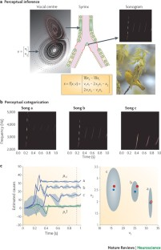
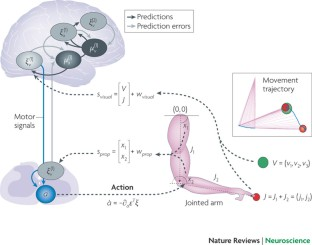
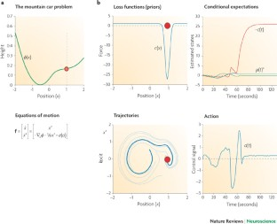

# W1. The free-energy principle: a unified brain theory?

## 0. 읽기 전 약어 및 핵심 용어

이 문서를 읽기 전에 아래 약어와 용어를 먼저 정리한다. 이후 본문에서는 괄호 안의 약어를 사용한다.

- Artificial Intelligence (AI): 사람의 지각, 추론, 학습, 의사결정 능력을 기계가 수행하도록 만드는 인공지능 분야를 뜻한다.
- Vision-Language-Action (VLA): 시각 관측과 언어 명령을 함께 받아 로봇 action까지 생성하는 모델 또는 학습 패러다임이다.
- Red-Green-Blue image (RGB): 색상을 red, green, blue 세 채널로 표현하는 일반 image format이다.
- Red-Green-Blue plus Depth image (RGB-D): RGB image에 각 pixel의 depth 정보를 함께 포함한 visual observation이다.
- Reinforcement Learning (RL): agent가 reward를 최대화하도록 environment와 상호작용하며 policy를 학습하는 방법이다.
- Kullback-Leibler divergence (KL): 두 확률분포 사이의 차이를 측정하는 information-theoretic divergence이다.
- Free-Energy Principle (FEP): agent가 prediction error 또는 variational free energy를 줄이는 방향으로 perception과 action을 수행한다는 이론이다.
- Physical Artificial Intelligence (Physical AI): 디지털 공간의 예측을 넘어 물리 세계에서 지각, 예측, 계획, 행동, 안전 검사를 수행하는 AI 시스템을 뜻한다.

## 1. Metadata

| Field | 내용 |
|---|---|
| ID | `W1` |
| Title | The free-energy principle: a unified brain theory? |
| Authors | Karl Friston |
| Affiliation / Team | University College London / Wellcome Trust Centre for Neuroimaging |
| Venue / Status | Nature Reviews Neuroscience |
| Date | 2010 |
| Link | https://www.nature.com/articles/nrn2787 |
| Local text | `paper_corpus/texts/W1.html.txt` |
| Source figures | `paper_corpus/figures_source/W1/manifest.md` |

## 2. 핵심 요약

이 논문은 Free-Energy Principle, 또는 FEP를 통해 perception, action, learning을 하나의 optimization 관점으로 설명하려는 review다. 핵심 주장은 생물학적 agent가 생존 가능한 상태의 좁은 영역에 머물기 위해 sensory surprise를 낮춰야 하며, 직접 측정하기 어려운 surprise 대신 variational free energy라는 upper bound를 최소화한다는 것이다.

Physical AI와 world model 관점에서는 이 논문이 중요한 출발점이다. 현대 world model이 "agent가 세계의 latent dynamics를 학습하고 그 안에서 행동을 계획한다"는 계산적 프레임이라면, FEP는 그보다 넓게 "agent가 sensory input을 생성하는 원인에 대한 generative model을 갖고, perception과 action을 모두 prediction error 감소로 이해할 수 있다"는 원리를 제공한다.

## 3. 왜 중요한가?

- World model을 단순한 video prediction model이 아니라 agent가 자신의 sensory stream을 설명하고 통제하기 위한 generative model로 보게 만든다.
- Perception과 action을 분리된 module이 아니라 같은 free-energy minimization 과정의 서로 다른 방향으로 해석한다.
- Active inference의 핵심 아이디어, 즉 agent가 자신이 기대하는 sensory input을 실제로 sampling하도록 행동한다는 관점을 제공한다.
- Reward maximization 중심의 RL과 달리, value와 cost를 prior expectation, surprise, entropy의 관점에서 재해석한다.
- 로봇 제어에서는 "목표 상태로 가는 action을 직접 계산한다"보다 "proprioceptive prediction을 만들고 action이 prediction error를 줄인다"는 다른 설계 철학을 제시한다.

## 4. Free Energy Principle의 기본 아이디어

논문은 생물학적 agent가 homeostasis를 유지하려면 장기적으로 surprise가 낮은 상태들을 반복적으로 방문해야 한다고 설명한다. 여기서 surprise는 어떤 sensory outcome이 얼마나 예상 밖인지를 나타내는 정보량이다.

$$
\mathrm{surprise}(s)=-\log p(s)
$$

| Notation | 의미 |
|---|---|
| $s$ | agent가 관측한 sensory input 또는 sensory state |
| $p(s)$ | agent의 generative model이 부여하는 sensory input의 probability |
| $\mathrm{surprise}(s)$ | 관측 $s$가 얼마나 예상 밖인지 나타내는 negative log-probability |

문제는 agent가 자신의 surprise를 직접 계산하기 어렵다는 점이다. Friston은 agent가 접근 가능한 sensory state와 internal state로 정의되는 recognition density를 이용해 free energy를 계산하고, 이것을 최소화하면 surprise도 간접적으로 낮출 수 있다고 본다.

## 5. Variational Free Energy

논문은 free energy를 세 가지 동등한 방식으로 설명한다. 첫 번째는 energy minus entropy 형태다.

$$
F[q]=\mathbb{E}_{q(z)}[-\log p(s,z)]-\mathcal{H}[q(z)]
$$

| Notation | 의미 |
|---|---|
| $F[q]$ | recognition density $q$에 대한 variational free energy |
| $q(z)$ | sensory input의 hidden cause $z$에 대한 recognition density 또는 approximate posterior |
| $z$ | sensory input을 생성한 hidden cause, latent state, environmental state |
| $p(s,z)$ | sensory input $s$와 hidden cause $z$의 joint probability를 나타내는 generative model |
| $\mathbb{E}_{q(z)}[\cdot]$ | recognition density $q(z)$ 아래에서의 expectation |
| $\mathcal{H}[q(z)]$ | recognition density의 entropy |

이 식은 agent가 세계를 설명하는 probabilistic generative model을 갖고 있어야 한다는 점을 보여준다. Energy 항은 sensory data와 hidden cause의 joint occurrence가 얼마나 예상 가능한지를 반영하고, entropy 항은 recognition density의 uncertainty를 반영한다.

두 번째 표현은 free energy가 surprise의 upper bound라는 사실을 드러낸다.

$$
F[q]=-\log p(s)+D_{\mathrm{KL}}(q(z)\parallel p(z\mid s))
$$

| Notation | 의미 |
|---|---|
| $-\log p(s)$ | sensory input $s$의 surprise |
| $D_{\mathrm{KL}}(\cdot\parallel\cdot)$ | 두 probability distribution 사이의 Kullback-Leibler divergence |
| $q(z)$ | agent의 internal state가 encoding하는 approximate posterior |
| $p(z\mid s)$ | sensory input을 관측한 뒤의 true posterior |

KL divergence는 항상 0 이상이므로 free energy는 surprise보다 크거나 같다. 따라서 perception은 sensory input을 고정한 상태에서 $q(z)$를 posterior에 가깝게 만들어 free energy를 줄이는 과정으로 해석된다.

세 번째 표현은 complexity minus accuracy 형태다.

$$
F[q]=D_{\mathrm{KL}}(q(z)\parallel p(z))-\mathbb{E}_{q(z)}[\log p(s\mid z)]
$$

| Notation | 의미 |
|---|---|
| $p(z)$ | hidden cause에 대한 prior belief |
| $p(s\mid z)$ | hidden cause가 주어졌을 때 sensory input을 생성하는 likelihood |
| $D_{\mathrm{KL}}(q(z)\parallel p(z))$ | posterior belief가 prior에서 얼마나 벗어났는지 나타내는 complexity |
| $\mathbb{E}_{q(z)}[\log p(s\mid z)]$ | recognition density 아래에서 sensory input을 잘 설명하는 정도, 즉 accuracy |

이 표현은 agent가 단순히 sensory data를 잘 맞추는 것만이 아니라, prior와 posterior 사이의 복잡도도 함께 조절한다는 점을 보여준다. world model 학습에서 "accuracy만 높이는 모델"이 충분하지 않은 이유를 설명할 때 좋은 개념적 연결점이 된다.

## 6. Perception, Learning, Action

FEP에서 perception은 internal belief를 바꾸어 sensory prediction error를 줄이는 과정이다. learning은 generative model의 parameter나 synaptic efficacy를 조정해 sensory regularity를 더 잘 encoding하는 과정이다. action은 sensory input 자체를 바꾸어 현재 prediction에 맞게 만드는 과정이다.

| 과정 | Free-energy 관점 | Physical AI 해석 |
|---|---|---|
| Perception | recognition density를 posterior에 가깝게 조정 | world state 추론, latent state estimation |
| Learning | generative model의 parameter를 조정 | world model 학습, dynamics/observation model fitting |
| Action | sensory input이 prediction과 맞도록 세계를 sampling | active perception, closed-loop control, embodied planning |

여기서 중요한 전환은 action이 motor command를 직접 optimize하는 절차라기보다 sensory prediction error를 없애는 절차라는 점이다. agent는 "어떤 감각이 올 것인가"를 예측하고, 행동을 통해 그 감각이 실제로 오도록 만든다.

## 7. Figure 1: Perceptual Categorization

  

<em>Figure 1. Birdsongs and perceptual categorization. Generative model of birdsong에서 causal state를 추론하며, internal representation을 바꾸는 방식으로 free energy를 낮춘다. Source figure: Nature Reviews Neuroscience official image asset.</em>

Figure 1은 birdsong perception 예시를 통해 FEP가 perception을 어떻게 설명하는지 보여준다. 새가 들은 chirp의 sonogram 자체가 목표가 아니라, 그 sensory pattern을 만들어낸 hidden causal state를 추론하는 것이 목표다.

Physical AI로 옮기면 로봇이 RGB-D observation을 그대로 암기하는 것이 아니라, 그 observation을 만들어낸 object state, contact state, affordance, task-relevant latent cause를 추론해야 한다는 메시지로 읽을 수 있다.

## 8. Figure 2: Active Inference for Reaching

  

<em>Figure 2. Cued reaching movements. Two-joint arm, proprioceptive input, visual input, target state를 통해 active inference가 reaching movement를 설명하는 예시다. Source figure: Nature Reviews Neuroscience official image asset.</em>

Figure 2는 motor control을 active inference로 설명한다. agent는 joint angle에 해당하는 proprioceptive input과 finger/target의 visual input을 받는다. brain은 hidden state와 causal state에 대한 conditional expectation을 조정하고, action은 proprioceptive prediction error를 줄이는 방향으로 발생한다.

이 관점은 VLA 연구에서 action head를 단순히 behavior cloning으로 학습하는 흐름과 다르게, policy를 predictive model과 closed-loop error correction으로 설계할 수 있음을 시사한다. 특히 로봇 제어에서는 proprioception, visual feedback, target belief가 하나의 generative model 안에서 결합되어야 한다.

## 9. Figure 3: Mountain Car and Priors

  

<em>Figure 3. Mountain car problem with prior expectations. Agent가 목표로 바로 가지 않고 반대 방향으로 움직여 momentum을 얻는 행동이 prior expectation과 active inference로 설명된다. Source figure: Nature Reviews Neuroscience official image asset.</em>

Figure 3은 sparse reward나 non-myopic planning이 필요한 mountain car 문제를 FEP 관점에서 설명한다. agent는 현재 위치에서 바로 목표로 갈 수 없기 때문에, 일시적으로 목표에서 멀어지는 행동을 통해 나중에 목표에 도달할 momentum을 만든다.

논문은 이런 행동을 cost function과 prior expectation의 관점에서 해석한다. 즉, adaptive behavior는 단순한 즉시 reward maximization이 아니라, hidden-state trajectory에 대한 prior가 action을 이끌 때 나타날 수 있다.

## 10. World Model과의 연결

FEP의 generative model은 현대 ML의 world model과 완전히 같은 것은 아니지만, 중요한 공통 기반을 제공한다.

| FEP 개념 | 현대 world model 개념 | 연결 |
|---|---|---|
| Generative model | latent dynamics model, video/world simulator | sensory input이 어떻게 생성되는지 모델링 |
| Recognition density | encoder, state estimator, posterior inference | observation에서 latent state 추론 |
| Prediction error | reconstruction/prediction loss, model error | 관측과 예측의 mismatch |
| Active inference | planning/control inside model | action을 통해 예상 sensory trajectory를 실현 |
| Prior expectation | goal, reward, task constraint, policy prior | agent가 자주 방문해야 하는 state를 지정 |

Dreamer 계열은 latent dynamics 안에서 policy/value를 학습하고 imagined rollout으로 control을 개선한다. Genie, GAIA, DreamGen 같은 video world model은 action-conditioned future generation을 통해 interactive environment를 모델링한다. FEP는 이런 연구들을 "agent가 세계를 예측하는 모델을 갖는다"에서 한 걸음 더 나아가 "agent가 자신의 sensory evidence를 유지하기 위해 perception과 action을 함께 최적화한다"는 철학적 기반으로 묶어준다.

## 11. 연구 관점에서 볼 포인트

운영/현장 적용 관점에서는 FEP를 직접 뇌 이론으로 받아들이기보다, physical AI 시스템 설계의 lens로 활용하는 것이 좋다.

| 연구 질문 | 설명 |
|---|---|
| World model의 uncertainty를 어떻게 action에 반영할 것인가? | free energy는 accuracy와 complexity를 함께 보므로, model confidence와 control을 연결하는 이론적 언어를 준다. |
| Robot policy가 reward뿐 아니라 prior와 constraint를 어떻게 encoding할 것인가? | industrial robot은 safety, reachability, throughput, energy 같은 prior를 동시에 만족해야 한다. |
| Active perception을 어떻게 설계할 것인가? | 로봇이 더 좋은 observation을 얻기 위해 camera/viewpoint/gripper pose를 조정하는 문제와 직접 연결된다. |
| Foundation VLA와 closed-loop control을 어떻게 결합할 것인가? | VLA의 high-level prediction과 low-level proprioceptive correction 사이의 interface를 고민하게 한다. |

## 12. 한계와 주의점

- 이 논문은 review/theory paper이므로 현대 robot benchmark에서 직접적인 empirical result를 제공하지 않는다.
- FEP의 개념은 포괄적이지만, 실제 algorithm으로 구현할 때는 generative model, prior, approximate inference method를 명확히 정해야 한다.
- "모든 것이 free-energy minimization이다"처럼 너무 넓게 해석하면 검증 가능한 연구 가설이 약해질 수 있다.
- 현대 deep world model은 대규모 data와 neural architecture 중심으로 발전했기 때문에, FEP와 연결할 때는 개념적 유사성과 구현상의 차이를 분리해서 봐야 한다.

## 13. 발표 구성 제안

1. "왜 brain theory가 Physical AI 스터디에 들어오는가?"로 시작한다.
2. surprise, entropy, homeostasis를 직관적으로 설명한다.
3. free energy가 surprise의 upper bound라는 핵심 수식을 설명한다.
4. perception, learning, action이 같은 objective의 다른 방향이라는 점을 Figure 1과 Figure 2로 보여준다.
5. mountain car 예시로 active inference와 prior-driven behavior를 설명한다.
6. Dreamer/Genie/GAIA 같은 world model 연구로 넘어가기 위한 conceptual bridge로 마무리한다.

## 14. 토론 질문

- Robot world model에서 prior expectation은 reward와 같은 것인가, 아니면 constraint와 safety까지 포함하는 더 넓은 개념인가?
- VLA의 action head를 active inference 관점으로 재설계한다면 무엇이 달라질까?
- Industrial setting에서 "surprise minimization"은 anomaly detection, predictive maintenance, closed-loop planning 중 어디에 가장 자연스럽게 연결될까?

## 15. 한 줄 정리

Friston의 Free-Energy Principle은 world model을 단순 예측기가 아니라 perception, action, learning을 함께 묶는 embodied generative model로 이해하게 만드는 이론적 출발점이다.