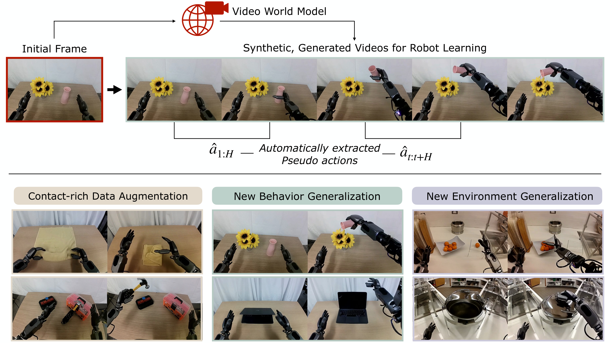
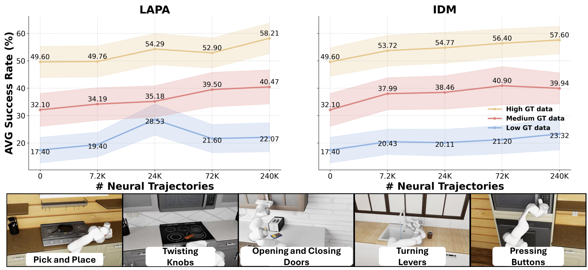

# W10. DREAM GEN: Unlocking Generalization in Robot Learning through Video World Models

## 0. 읽기 전 약어 및 핵심 용어

이 문서를 읽기 전에 아래 약어와 용어를 먼저 정리한다. 이후 본문에서는 괄호 안의 약어를 사용한다.

- Artificial Intelligence (AI): 사람의 지각, 추론, 학습, 의사결정 능력을 기계가 수행하도록 만드는 인공지능 분야를 뜻한다.
- Vision-Language Model (VLM): 이미지와 텍스트를 함께 입력받아 시각-언어 이해나 생성 작업을 수행하는 모델이다.
- Vision-Language (VL): 시각 정보와 언어 정보를 함께 다루는 multimodal setting을 뜻한다.
- Reinforcement Learning (RL): agent가 reward를 최대화하도록 environment와 상호작용하며 policy를 학습하는 방법이다.
- Variational Autoencoder (VAE): latent variable의 확률분포를 학습해 data를 생성하거나 압축하는 generative model이다.
- Vector Quantization (VQ): continuous representation을 discrete codebook vector로 양자화하는 방법이다.
- Vector-Quantized Variational Autoencoder (VQ-VAE): latent를 discrete codebook으로 양자화하는 variational autoencoder 계열 generative model이다.
- Generalist Robot 1 (GR1): GR-1을 하이픈 없이 줄여 쓴 표기이며 humanoid/generalist robot policy 계열을 뜻한다.
- Generalist Robot 00 Technology (GR00T): NVIDIA가 humanoid/generalist robot을 위해 공개한 robot foundation model family 이름이다.
- Inverse Dynamics Model (IDM): 현재와 다음 관측을 보고 그 변화를 만든 action을 추정하는 model이다.
- Latent Action Pretraining from videos (LAPA): video에서 latent action representation을 학습해 downstream robot policy에 활용하는 pretraining 계열 접근이다.
- Korea Advanced Institute of Science and Technology (KAIST): 대한민국의 과학기술 특성화 대학이다.
- Nanyang Technological University (NTU): 싱가포르의 연구중심 대학이다.
- University of California, Los Angeles (UCLA): 미국 캘리포니아대학교 로스앤젤레스 캠퍼스다.
- University of California, San Diego (UCSD): 미국 캘리포니아대학교 샌디에이고 캠퍼스다.
- Physical Artificial Intelligence (Physical AI): 디지털 공간의 예측을 넘어 물리 세계에서 지각, 예측, 계획, 행동, 안전 검사를 수행하는 AI 시스템을 뜻한다.

## 1. Metadata

| Field | 내용 |
|---|---|
| ID | `W10` |
| Title | DREAM GEN: Unlocking Generalization in Robot Learning through Video World Models |
| Authors | Joel Jang, Seonghyeon Ye, Zongyu Lin, Jiannan Xiang, Johan Bjorck, Yu Fang, Fengyuan Hu, Spencer Huang, Kaushil Kundalia, Lin Yen-Chen, Loic Magne, Ajay Mandlekar, Avnish Narayan, You Liang Tan, Guanzhi Wang, Jing Wang, Qi Wang, Yinzhen Xu, Xiaohui Zeng, Kaiyuan Zheng, Ruijie Zheng, Ming-Yu Liu, Luke Zettlemoyer, Dieter Fox, Jan Kautz, Scott Reed, Yuke Zhu, Linxi Fan |
| Affiliation / Team | NVIDIA, University of Washington, KAIST, UCLA, UCSD, CalTech, NTU, University of Maryland, UT Austin |
| Venue / Status | arXiv / robotics preprint |
| Date | 2025-05-19, v2 2025-06-17 |
| Link | https://arxiv.org/abs/2505.12705 |
| Project page | https://research.nvidia.com/labs/gear/dreamgen |
| Local source | `paper_corpus/sources/W10` |
| Source figures | `paper_corpus/figures_source/W10/manifest.md` |

## 2. 핵심 요약

DREAM GEN은 video world model을 robot policy의 synthetic data generator로 사용하는 4-stage pipeline이다. 핵심 개념은 neural trajectories다. Video world model이 initial frame과 language instruction을 받아 robot video rollout을 생성하면, 그 video에는 action label이 없기 때문에 inverse dynamics model 또는 latent action model로 pseudo-action을 붙인다. 이렇게 만든 video-action sequence를 neural trajectory라고 부르고, 이를 visuomotor policy training data로 사용한다.

가장 중요한 메시지는 "video world model을 planner로 실시간 사용하지 말고, offline synthetic data generator로 쓰자"는 것이다. 이 방식은 inference latency 요구가 낮고, internet-scale video prior를 충분히 활용할 수 있다. 논문은 pick-and-place 한 종류의 teleoperation data만으로 GR1 humanoid가 novel behaviors와 novel environments에서 성능을 얻는 결과를 제시한다.

## 3. 왜 중요한가?

- UniSim이 simulator-generated experience로 policy를 학습했다면, DREAM GEN은 최신 image-to-video world model을 robot data augmentation 엔진으로 직접 사용한다.
- Video-only synthetic rollout에 pseudo-action을 붙여 실제 policy training dataset으로 바꾸는 bridge를 제시한다.
- Manual teleoperation collection 없이 behavior generalization과 environment generalization을 얻는 방향을 보여준다.
- DreamGen Bench를 통해 video generation benchmark와 downstream robot policy success의 상관을 평가한다.
- Physical AI 연구에서 "world model의 품질을 어떻게 robot learning 성능과 연결할 것인가"라는 질문에 실용적인 답을 준다.

## 4. Generalization through Neural Trajectories

  

<em>Figure 1. Generalization through DREAM GEN. Video world models generate synthetic robot videos that enable policies to generalize to new behaviors and environments from limited teleoperation data. Source figure: <code>assets/figure_1_neural.pdf</code>.</em>

DREAM GEN의 핵심 흐름은 다음과 같다.

| 요소 | 의미 |
|---|---|
| Human teleoperation data | target robot embodiment를 fine-tune하기 위한 소량의 real trajectories |
| Video world model | initial frame + instruction에서 synthetic robot video 생성 |
| Pseudo-action labeler | generated video에 action sequence를 붙이는 IDM 또는 latent action model |
| Neural trajectory | generated video + pseudo actions |
| Visuomotor policy | neural trajectories로 학습되는 downstream robot policy |

이때 generated video는 단순한 시각 자료가 아니라, policy가 imitation/RL-style training에 사용할 수 있는 trajectory dataset이 된다.

## 5. Four-Stage Pipeline

  

<em>Figure 2. DREAM GEN overview. Fine-tune a video world model, roll it out from initial frames and language instructions, infer pseudo-actions, then train visuomotor policies on neural trajectories. Source figure: <code>assets/figure2_3.pdf</code>.</em>

| Stage | 설명 |
|---|---|
| 1. Video world model fine-tuning | target robot의 teleoperated trajectories로 robot kinematics와 embodiment dynamics를 학습 |
| 2. Video world model rollout | initial frame과 language instruction으로 synthetic robot videos 생성 |
| 3. Pseudo-action labeling | IDM 또는 LAPA로 generated videos에 action label 부여 |
| 4. Policy training | neural trajectories를 사용해 Diffusion Policy, $\pi_0$, GR00T N1 등을 학습 |

Stage 1에서는 LoRA를 기본으로 사용해 video world model을 robot domain에 적응시키고, internet video prior의 catastrophic forgetting을 줄인다. Stage 2에서는 simulation이면 simulator에서 새로운 initial frame을 뽑고, real-world이면 target object 위치를 randomize하며 initial frame을 촬영한다.

## 6. Neural Trajectory Formulation

Generated video rollout은 다음처럼 볼 수 있다.

$$
\hat{\mathbf{o}}_{1:T}
\sim
G_{\phi}(\mathbf{o}_1,\ell)
$$

| Notation | 의미 |
|---|---|
| $G_{\phi}$ | fine-tuned video world model |
| $\mathbf{o}_1$ | initial observation frame |
| $\ell$ | language instruction |
| $\hat{\mathbf{o}}_{1:T}$ | generated robot observation/video sequence |
| $\phi$ | video world model parameters |

Pseudo-action model은 generated observations에서 action chunk를 추정한다.

$$
\hat{\mathbf{a}}_{t:t+H}
=
Q_{\psi}(\hat{\mathbf{o}}_{t},\hat{\mathbf{o}}_{t+H})
$$

| Notation | 의미 |
|---|---|
| $Q_{\psi}$ | pseudo-action labeler, IDM 또는 latent action model |
| $\hat{\mathbf{o}}_{t}$ | generated video의 current frame |
| $\hat{\mathbf{o}}_{t+H}$ | $H$ step 이후 generated future frame |
| $\hat{\mathbf{a}}_{t:t+H}$ | pseudo action chunk |
| $H$ | action prediction horizon |

최종 neural trajectory는 generated observations와 pseudo actions의 pair다.

$$
\tau_{\mathrm{neural}}
=
(\hat{\mathbf{o}}_{1:T},\hat{\mathbf{a}}_{1:T})
$$

| Notation | 의미 |
|---|---|
| $\tau_{\mathrm{neural}}$ | neural trajectory |
| $\hat{\mathbf{o}}_{1:T}$ | generated observation sequence |
| $\hat{\mathbf{a}}_{1:T}$ | pseudo-labeled action sequence |

Policy는 image observation과 instruction이 주어졌을 때 action chunk를 생성하도록 학습된다.

$$
\pi_{\theta}(\hat{\mathbf{a}}_{t:t+H}\mid \hat{\mathbf{o}}_t,\ell)
$$

| Notation | 의미 |
|---|---|
| $\pi_{\theta}$ | downstream visuomotor policy |
| $\hat{\mathbf{o}}_t$ | training input observation |
| $\ell$ | task instruction |
| $\hat{\mathbf{a}}_{t:t+H}$ | target pseudo-action chunk |

## 7. Pseudo-Action Labeling

  
  

<em>Figure 3. Pseudo-action extraction. DREAM GEN uses either an inverse dynamics model or a latent action model to label generated robot videos. Source figures: <code>assets/idm.pdf</code>, <code>assets/lapa.pdf</code>.</em>

논문은 두 가지 pseudo-action labeling 방식을 사용한다.

| 방식 | 입력 | 출력 | 장점 |
|---|---|---|---|
| IDM | two image frames | action chunk | target robot의 실제 action space에 맞는 label 생성 가능 |
| LAPA | current and future frame | latent action embedding | ground-truth robot action 없이도 latent action label 생성 가능 |

IDM은 SigLIP-2 vision encoder와 diffusion transformer를 사용하고 flow matching objective로 action chunk를 예측한다. Sliding window로 $\hat{a}_t$부터 $\hat{a}_{t+H}$까지 예측하고 한 step씩 밀어 전체 generated video에 action을 붙인다.

LAPA는 VQ-VAE 방식의 latent action model로, visual delta를 설명하는 latent action을 만든다. GR00T N1처럼 latent action을 policy target으로 사용할 수 있는 경우 유용하다.

## 8. Data Augmentation Results

  

<em>Figure 4. RoboCasa scaling. Increasing neural trajectories improves downstream policy performance across low, mid, and high ground-truth data regimes. Source figure: <code>assets/sim_result_2.pdf</code>.</em>

RoboCasa simulation에서는 neural trajectories를 최대 original human demonstrations 대비 333x까지 늘린다. 결과는 neural trajectory 수가 증가할수록 policy performance가 log-linear하게 증가한다. 이는 synthetic data generation이 manual teleoperation보다 훨씬 scalable한 robot learning axis가 될 수 있음을 보여준다.

  

<em>Figure 5. Real-world robot evaluation. Neural trajectories improve policy success across GR1 humanoid, Franka, and SO-100 tasks. Source figure: <code>assets/real_world_unified.pdf</code>.</em>

Real-world experiments에서는 9개 task, 3개 embodiment를 사용한다.

| Robot | Tasks | Reported average success gain |
|---|---|---|
| Fourier GR1 | hammering, wiping, folding, stacking | 37% to 46.4% |
| Franka Emika | pick-and-place, cube stacking, tool use | 23% to 37% |
| SO-100 | picking strawberries, tic-tac-toe | 21% to 45.5% |

특히 hammering, wiping liquid, folding towel, scooping M&Ms 같은 task는 classic simulator로 synthetic data를 만들기 어려운 contact-rich/deformable/tool-use task라는 점이 중요하다.

## 9. Behavior and Environment Generalization

DREAM GEN은 GR1 humanoid에서 pick-and-place data만으로 novel behavior와 novel environment generalization을 실험한다. Original teleoperation data에는 pick-and-place만 있고, pouring, opening/closing articulated objects, using tools 같은 verb는 없다.

| Setting | Baseline GR00T N1 | w/ DREAM GEN |
|---|---:|---:|
| Seen environments, novel behaviors | 11.2% | 43.2% |
| Novel environments, seen and novel behaviors | 0.0% | 28.5% |

이 결과는 "비디오 world model이 pretraining에서 얻은 physics/natural motion/language prior를 robot policy dataset으로 전환할 수 있다"는 주장을 뒷받침한다. 다만 성능이 완전한 해결책 수준은 아니며, generated video 품질과 pseudo-action 품질에 크게 의존한다.

## 10. DreamGen Bench

  

<em>Figure 6. DreamGen Bench correlation. Benchmark quality of video world models correlates with downstream policy performance after generating neural trajectories. Source figure: <code>assets/scatter_plot.pdf</code>.</em>

DreamGen Bench는 video world model이 robot embodiment에 얼마나 잘 적응하고, unseen object, unseen behavior, unseen environment를 얼마나 물리적으로 그럴듯하게 생성하는지 평가한다.

| Metric | 의미 |
|---|---|
| Instruction Following | generated video가 instruction의 task를 수행하는가 |
| Physics Alignment | robot kinematics와 physical interaction이 그럴듯한가 |
| Evaluators | GPT-4o, Qwen2.5-VL, human evaluation |

비교한 모델은 Hunyuan, CogVideoX, WAN2.1, Cosmos의 zero-shot 및 fine-tuned variants다. 전반적으로 zero-shot 모델은 robot-specific video generation에서 매우 약하고, fine-tuning 이후 instruction/physics score가 크게 올라간다. 논문은 benchmark score가 downstream policy success와 상관된다고 보고한다.

## 11. UniSim과 비교해서 읽기

| 관점 | UniSim | DREAM GEN |
|---|---|---|
| World model 역할 | action-conditioned simulator | synthetic robot data generator |
| Action label | simulator action input으로 직접 사용 | generated video 후 pseudo-action을 추정 |
| Policy learning | simulator rollout으로 VLM/RL policy 학습 | neural trajectories로 imitation-style policy 학습 |
| Data source | broad mixed datasets | video world model + target robot fine-tuning |
| 핵심 bottleneck | visual-only simulator reliability | video quality와 pseudo-action quality |

UniSim은 simulator 자체가 action-conditioned model이고, DREAM GEN은 이미 강력한 video world model을 target robot에 맞게 fine-tune한 뒤 pseudo-action으로 policy data화한다. 두 방법은 경쟁이라기보다 서로 다른 data-generation interface다.

## 12. Limitations

| 한계 | 설명 |
|---|---|
| Initial frame collection | 새 환경/객체의 initial frame은 여전히 촬영해야 한다. |
| Pseudo-action noise | IDM/LAPA가 generated video motion을 잘못 action으로 변환하면 policy가 오염된다. |
| Video model bias | generated trajectories는 video world model의 hallucination과 physics error를 포함한다. |
| State/proprioception gap | neural trajectories에는 true state가 없어 zero state를 넣어 학습한다. |
| Evaluation scale | 많은 real-world robot rollouts가 필요하고, task별 scoring rule이 복잡하다. |
| Novel behavior ceiling | baseline보다 크게 오르지만 success rate는 아직 완성 단계가 아니다. |

논문은 future work로 image-to-image diffusion을 사용해 initial frame randomization 부담을 줄이는 방향을 언급한다.

## 13. 발표 구성 제안

1. Teleoperation data collection bottleneck과 sim2real gap을 문제로 제시한다.
2. Figure 1로 neural trajectory가 무엇인지 직관적으로 설명한다.
3. Figure 2로 DREAM GEN의 4-stage pipeline을 정리한다.
4. IDM/LAPA figure와 수식으로 video-only rollout을 action-labeled trajectory로 바꾸는 bridge를 설명한다.
5. RoboCasa scaling과 real-world results를 통해 data augmentation 효과를 보여준다.
6. Behavior/environment generalization table로 zero-to-one improvement를 강조한다.
7. DreamGen Bench를 통해 video world model evaluation과 downstream policy success 연결을 토론한다.

## 14. 토론 질문

- Generated video가 photorealistic해도 pseudo-action이 틀리면 policy는 어떻게 망가질까?
- DREAM GEN에서 world model을 planner가 아니라 data generator로 쓰는 선택은 어떤 장단점이 있을까?
- Neural trajectories만으로 학습한 policy가 실제 robot safety를 만족하려면 어떤 filtering이나 validation이 필요할까?
- DreamGen Bench 같은 video benchmark가 실제 robot learning 성능을 충분히 예측할 수 있을까?

## 15. 한 줄 정리

DREAM GEN은 video world model이 생성한 robot videos에 pseudo-actions를 붙인 neural trajectories를 통해, 적은 teleoperation data로 robot policy의 behavior/environment generalization을 크게 확장하는 synthetic data pipeline이다.