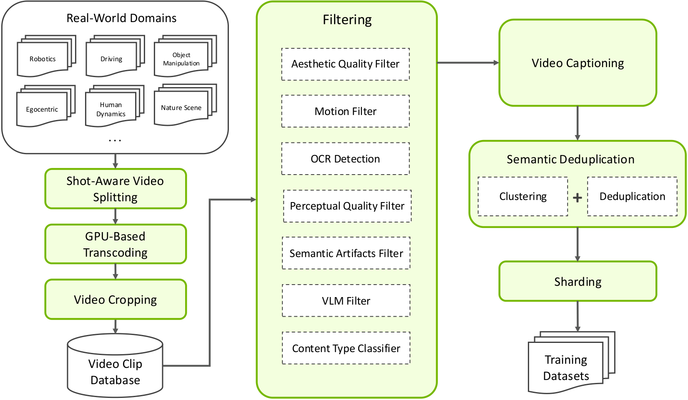
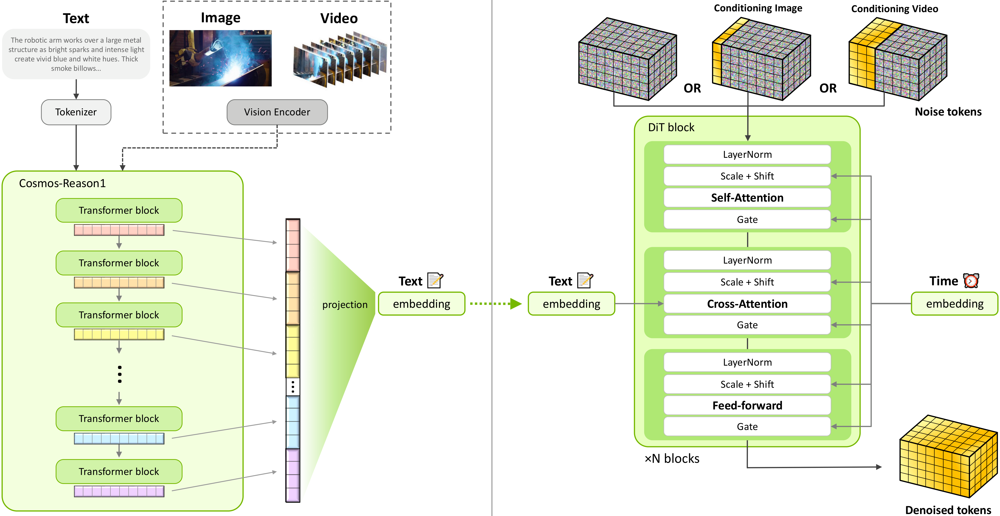
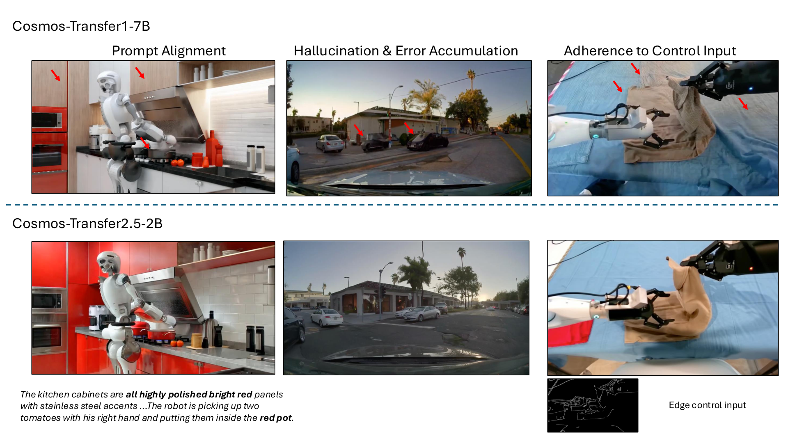
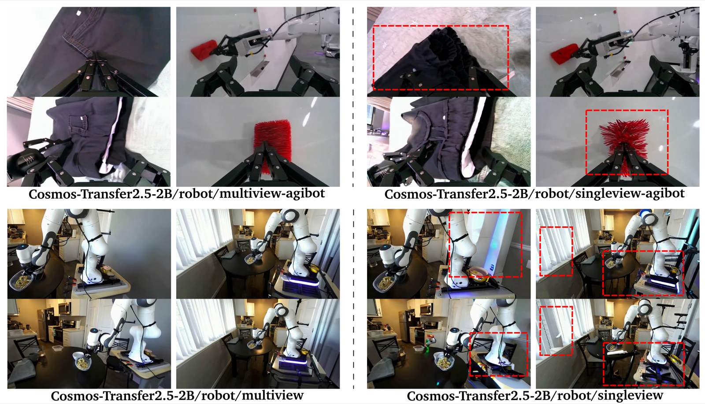
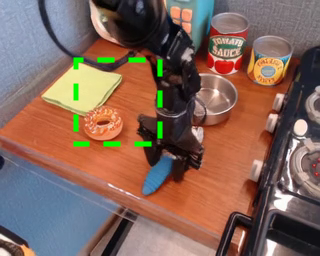
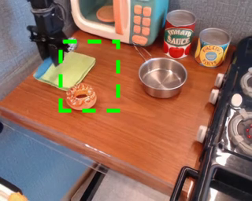

# W11. World Simulation with Video Foundation Models for Physical AI

## 0. 읽기 전 약어 및 핵심 용어

이 문서를 읽기 전에 아래 약어와 용어를 먼저 정리한다. 이후 본문에서는 괄호 안의 약어를 사용한다.

- Artificial Intelligence (AI): 사람의 지각, 추론, 학습, 의사결정 능력을 기계가 수행하도록 만드는 인공지능 분야를 뜻한다.
- Vision-Language Model (VLM): 이미지와 텍스트를 함께 입력받아 시각-언어 이해나 생성 작업을 수행하는 모델이다.
- Vision-Language-Action (VLA): 시각 관측과 언어 명령을 함께 받아 로봇 action까지 생성하는 모델 또는 학습 패러다임이다.
- Vision-Language (VL): 시각 정보와 언어 정보를 함께 다루는 multimodal setting을 뜻한다.
- Optical Character Recognition (OCR): 이미지 안의 문자나 문서 텍스트를 인식해 machine-readable text로 바꾸는 기술이다.
- Reinforcement Learning (RL): agent가 reward를 최대화하도록 environment와 상호작용하며 policy를 학습하는 방법이다.
- Multi-Layer Perceptron (MLP): fully connected layer를 여러 층 쌓은 feed-forward neural network이다.
- Variational Autoencoder (VAE): latent variable의 확률분포를 학습해 data를 생성하거나 압축하는 generative model이다.
- Elucidated Diffusion Model (EDM): diffusion model의 noise schedule, preconditioning, sampler 설계를 정리한 diffusion formulation이다.
- Diffusion Transformer (DiT): U-Net 대신 transformer backbone을 사용해 diffusion denoising이나 flow prediction을 수행하는 architecture이다.
- Mean Squared Error (MSE): 예측값과 정답의 차이를 제곱해 평균한 regression loss이다.
- Distributed Robot Interaction Dataset (DROID): 여러 장소에서 수집한 in-the-wild robot manipulation demonstration dataset이다.
- Generalist Robot 00 Technology (GR00T): NVIDIA가 humanoid/generalist robot을 위해 공개한 robot foundation model family 이름이다.
- Inverse Dynamics Model (IDM): 현재와 다음 관측을 보고 그 변화를 만든 action을 추정하는 model이다.
- Latent Action Pretraining from videos (LAPA): video에서 latent action representation을 학습해 downstream robot policy에 활용하는 pretraining 계열 접근이다.
- Image-to-World (I2W): 하나의 image를 조건으로 미래 world video나 scene evolution을 생성하는 setting이다.
- Video-to-World (V2W): 초기 video context를 조건으로 이후 world state나 video rollout을 생성하는 setting이다.
- Supervised Fine-Tuning (SFT): labeled instruction-response 또는 domain-specific data로 pretrained model을 supervised 방식으로 추가 학습하는 절차다.
- Group Relative Policy Optimization (GRPO): 여러 candidate output의 relative quality를 이용해 policy를 최적화하는 reinforcement learning post-training 기법이다.
- Frames Per Second (FPS): video나 control loop가 1초에 처리하는 frame 수를 나타내는 속도 단위다.
- Graphics Processing Unit (GPU): 대규모 neural network 학습과 병렬 연산을 빠르게 수행하는 processor이다.
- Physical Artificial Intelligence (Physical AI): 디지털 공간의 예측을 넘어 물리 세계에서 지각, 예측, 계획, 행동, 안전 검사를 수행하는 AI 시스템을 뜻한다.

## 1. Metadata

| Field | 내용 |
|---|---|
| ID | `W11` |
| Title | World Simulation with Video Foundation Models for Physical AI |
| Authors | NVIDIA |
| Affiliation / Team | NVIDIA |
| Venue / Status | NVIDIA technical report / arXiv |
| Date | arXiv v2 2026-02-24, report date 2026-02-26 |
| Link | https://arxiv.org/abs/2511.00062 |
| Code / Models | https://github.com/nvidia-cosmos/cosmos-predict2.5, https://github.com/nvidia-cosmos/cosmos-transfer2.5 |
| Local source | `paper_corpus/sources/W11` |
| Source figures | `paper_corpus/figures_source/W11/manifest.md` |

## 2. 핵심 요약

이 기술 보고서는 NVIDIA Cosmos World Foundation Models의 최신 세대인 Cosmos-Predict2.5와 Cosmos-Transfer2.5를 소개한다. Cosmos-Predict2.5는 Text2World, Image2World, Video2World를 하나의 flow-based model로 통합하고, Physical AI에 특화된 vision-language model인 Cosmos-Reason1을 text encoder로 사용해 더 풍부한 text grounding과 fine-grained control을 제공한다.

핵심 스케일은 200M curated video clips, 2B/14B model release, supervised fine-tuning, model merging, reinforcement-learning post-training, timestep distillation이다. Cosmos-Transfer2.5는 control-net style framework로 Sim2Real, Real2Real, semantic scenario-to-realistic video translation을 지원하며, Cosmos-Transfer1보다 3.5배 작지만 더 높은 fidelity와 long-horizon generation을 보여준다고 보고한다.

## 3. 왜 중요한가?

- "World model for Physical AI"를 robotics, autonomous driving, smart spaces, human dynamics, physics까지 포괄하는 production-scale model family로 제시한다.
- DREAM GEN에서 본 synthetic VLA data generation을 더 큰 Cosmos model family 안으로 흡수한다.
- Predict model과 Transfer model을 분리해 world generation과 world translation을 각각 다룬다.
- Open model checkpoints와 code release를 강조해, 이전 대형 world model demo보다 실제 연구 활용 가능성이 높다.
- Flow matching, VLM-based reward post-training, timestep distillation, multiview/camera/action conditioning 등 최근 video foundation model recipe가 한 문서에 모여 있다.

## 4. Data Curation Pipeline

  

<em>Figure 1. Cosmos video curation pipeline. Raw videos are split, transcoded, cropped, filtered, captioned, deduplicated, and sharded for large-scale video world model training. Source figure: <code>images/curation_pipeline.pdf</code>.</em>

Cosmos-Predict2.5는 35M hours raw video에서 6B clips를 만들고, multi-stage filtering 후 약 200M trainable clips를 pre-training dataset으로 사용한다. 통과율은 약 4%로, Cosmos-Predict1의 30%보다 훨씬 엄격하다.

| Stage | 역할 |
|---|---|
| Shot-aware splitting | 긴 video를 shot 단위로 분할 |
| GPU transcoding / cropping | format 변환, black border와 padding 제거 |
| Filtering | aesthetic, motion, OCR, perceptual quality, semantic artifact, VLM filter |
| Captioning | Qwen2.5-VL-7B로 5초 windows에 factual captions 생성 |
| Semantic deduplication | embedding similarity 기반 중복 제거 |
| Sharding | content type, resolution, aspect ratio, length별 training shard 구성 |

Domain-specific data는 robotics, autonomous driving, smart spaces, human dynamics, physics로 나뉜다. Robotics dataset에는 AgiBot-Beta, Bridge, DROID, GR00T, 1X, OpenX, RoboMIND 등이 포함된다.

## 5. Flow Matching Formulation

  

<em>Figure 2. Cosmos-Predict2.5 architecture. The model is a flow-based world foundation model supporting Text2World, Image2World, and Video2World generation. Source figure: <code>images/cosmos-predict2.5.pdf</code>.</em>

Cosmos-Predict2.5는 diffusion/EDM 대신 flow matching formulation을 사용한다. Data sample과 noise를 선형 보간해 noisy latent를 만들고, model은 trajectory velocity를 예측한다.

$$
\mathbf{x}_t=(1-t)\mathbf{x}+t\epsilon
$$

| Notation | 의미 |
|---|---|
| $\mathbf{x}$ | image 또는 video data sample |
| $\epsilon$ | Gaussian noise, $\epsilon\sim\mathcal{N}(0,I)$ |
| $t$ | timestep, $[0,1]$ 범위에서 sampling |
| $\mathbf{x}_t$ | data와 noise 사이의 interpolated latent |

Ground-truth velocity는 다음과 같다.

$$
\mathbf{v}_t=\epsilon-\mathbf{x}
$$

| Notation | 의미 |
|---|---|
| $\mathbf{v}_t$ | flow trajectory의 target velocity |
| $\epsilon$ | noise endpoint |
| $\mathbf{x}$ | data endpoint |

Training objective는 predicted velocity와 target velocity의 MSE다.

$$
\mathcal{L}(\theta)
=
\mathbb{E}_{\mathbf{x},\epsilon,\mathbf{c},t}
\left\|
\mathbf{u}(\mathbf{x}_t,t,\mathbf{c};\theta)
-
\mathbf{v}_t
\right\|^2
$$

| Notation | 의미 |
|---|---|
| $\mathcal{L}(\theta)$ | flow matching training loss |
| $\mathbf{u}(\cdot;\theta)$ | model이 예측하는 velocity function |
| $\mathbf{c}$ | conditioning information, 예: text embeddings, reference frames, visual conditions |
| $\theta$ | model parameters |

고해상도 content의 redundancy를 깨기 위해 shifted logit-normal timestep을 사용한다.

$$
t_s=
\frac{\beta t}{1+(\beta-1)t}
$$

| Notation | 의미 |
|---|---|
| $t_s$ | shifted timestep |
| $t$ | original timestep |
| $\beta$ | higher-noise timestep을 더 자주 보게 하는 shift hyperparameter |

## 6. Network and Conditioning

Cosmos-Predict2.5는 Cosmos-Predict1의 DiT 기반 latent diffusion denoising network를 상당 부분 유지하되, absolute positional embeddings를 제거하고 relative positional embeddings를 남긴다. 이는 training 때 보지 못한 resolution이나 sequence length로 generalize하기 쉽게 하기 위한 선택이다.

| Component | 내용 |
|---|---|
| Visual tokenizer | WAN2.1 VAE, temporal/height/width compression $4\times8\times8$ |
| Patchification | latent features에 $1\times2\times2$ patchification 추가 |
| Text encoder | T5 대신 Cosmos-Reason1 사용 |
| Generation length | 16 FPS 기준 93 frames, latent 24 frames, 약 5.8초 |
| Modes | Text2World, Image2World, Video2World |
| I2W/V2W conditioning | initial frames를 generated sequence에 frame replacement로 고정 |

Cosmos-Reason1의 multi-block activations를 concatenate하고 1024-dimensional space로 project해 text embeddings로 사용한다. 이는 Physical AI prompt의 local/global context를 더 잘 담기 위한 설계다.

## 7. Post-Training

  

<em>Figure 3. Domain-specific SFT win rates. Domain-specific post-training improves target-domain human preference win rates over the pretrained baseline. Source figure: <code>images/domain_win_rates.pdf</code>.</em>

Post-training은 세 축으로 구성된다.

| Step | 목적 |
|---|---|
| Supervised fine-tuning | object permanence, high motion, complex scenes, driving, robotic manipulation domain별 특화 |
| Model merging | domain-specific SFT와 cooldown model의 장점을 통합 |
| Reinforcement learning | VideoAlign reward model로 text alignment, motion quality, visual quality 개선 |
| Timestep distillation | 4-step high-fidelity sampling으로 inference 가속 |

RL post-training은 GRPO-like group advantage를 사용한다. 각 input condition에서 8개 output을 20 diffusion steps로 생성하고, group 내 reward normalization으로 advantage를 계산한다. Reward hacking을 줄이기 위해 fine-tuning dataset의 diffusion loss를 regularization으로 함께 사용한다.

  

<em>Figure 4. RL post-training. Human voting prefers RL-post-trained outputs across evaluated settings. Source figure: <code>images/win_rates_rl_is_effective.pdf</code>.</em>

## 8. Cosmos-Transfer2.5

  

<em>Figure 5. Cosmos-Transfer2.5 results. The model translates control signals such as edge, blur, segmentation, and depth into realistic videos for Physical AI applications. Source figure: <code>images/transfer2_results.pdf</code>.</em>

Cosmos-Transfer2.5는 control-net style world translation framework다. 입력 control은 edge, blur, segmentation, depth, world scenario map, third-person/head-view video 등으로 다양하다. 목적은 physical simulator output을 photorealistic하게 바꾸거나, real-world video를 변형하거나, semantic scenario를 realistic multi-view sensory input으로 변환하는 것이다.

| Use case | 의미 |
|---|---|
| Sim2Real | simulator rendering을 photorealistic video로 변환 |
| Real2Real | real video augmentation |
| Scenario-to-video | semantic world scenario map에서 realistic driving views 생성 |
| Robot multiview | third-person/head-view video에서 multi-camera robot video 생성 |
| Long-horizon translation | error accumulation을 줄여 긴 video translation 지원 |

## 9. Applications for Physical AI

  

<em>Figure 6. Multi-camera driving simulation. Cosmos models support coherent multiview world generation for autonomous driving simulation. Source figure: <code>images/multicamera/multicam_comparison.pdf</code>.</em>

  
  
  
  
  

<em>Figure 7. Action-conditioned world generation example frames. Cosmos-Predict2.5-2B/robot/action-cond predicts future frames from a conditional image and robot action sequence. Source figures: <code>images/action_conditioned/traj_pred2_373/*.png</code>.</em>

보고서가 강조하는 application은 다음과 같다.

| Application | 핵심 |
|---|---|
| Synthetic VLA data generation | DreamGen paradigm처럼 generated videos에서 pseudo-actions를 추출해 VLA training data 생성 |
| Robot policy learning | Cosmos-Transfer2.5 Real2Real augmentation으로 robot policy generalization 개선 |
| Driving simulation | 7-camera surround-view world generation과 scenario-map conditioning |
| Camera-control multiview | robot manipulation에서 camera pose controllable multiview generation |
| Action-conditioned world model | single image + robot action sequence에서 future frames 생성해 policy evaluation에 사용 |

Action-conditioned robot model은 Bridge dataset으로 평가한다. Action은 gripper coordinate space의 7D vector다.

$$
\mathbf{a}_t=
(\Delta x,\Delta y,\Delta z,\Delta\theta_r,\Delta\theta_p,\Delta\theta_y,w)
$$

| Notation | 의미 |
|---|---|
| $\mathbf{a}_t$ | time $t$의 robot action vector |
| $\Delta x,\Delta y,\Delta z$ | gripper의 relative translation |
| $\Delta\theta_r,\Delta\theta_p,\Delta\theta_y$ | roll, pitch, yaw relative rotation |
| $w$ | gripper width |

모델은 action embedder MLP로 action을 tensor로 바꾼 뒤 DiT timestep embeddings에 더해 condition을 주입한다. 전체 trajectory는 chunk를 autoregressive하게 생성한다.

## 10. DREAM GEN과의 연결

| 관점 | DREAM GEN | Cosmos-Predict2.5 / Transfer2.5 |
|---|---|---|
| 역할 | video world model을 synthetic robot data generator로 사용 | synthetic VLA data generation을 포함하는 foundation model family |
| Action label | IDM/LAPA로 pseudo-actions 추출 | DreamGen-style pseudo-action extraction + action-conditioned generation |
| Scope | robot learning pipeline 중심 | robotics, driving, smart spaces, human dynamics, physics |
| Model release | pipeline/benchmark 중심 | 2B/14B checkpoints, Predict/Transfer variants |
| 핵심 기여 | neural trajectories | open Physical AI world foundation model ecosystem |

따라서 W10을 먼저 읽고 W11을 읽으면, "world model을 robot data generator로 쓰는 idea"가 NVIDIA Cosmos 계열의 더 큰 product/research stack으로 확장되는 흐름을 볼 수 있다.

## 11. Limitations and Cautions

| 한계 | 설명 |
|---|---|
| Evaluation complexity | 다양한 domain과 model variants가 있어 단일 benchmark로 품질을 요약하기 어렵다. |
| Synthetic data risk | photorealism이 action correctness나 physical correctness를 보장하지 않는다. |
| Reward model dependence | RL post-training은 VideoAlign 같은 reward model의 bias와 reward hacking 위험을 갖는다. |
| Compute and data scale | 200M curated clips, petabyte-scale pipeline은 일반 연구실에서 재현하기 어렵다. |
| Model family complexity | Predict, Transfer, domain-specialized variants가 많아 사용 목적에 맞는 선택이 중요하다. |

## 12. 발표 구성 제안

1. Physical AI에서 world simulator가 왜 필요한지 Introduction의 safety/cost/risk 문제로 시작한다.
2. Figure 1로 200M curated clips를 만드는 data pipeline을 보여준다.
3. Figure 2와 flow matching 수식으로 Cosmos-Predict2.5의 core model을 설명한다.
4. Cosmos-Reason1, WAN2.1 VAE, frame replacement conditioning으로 architecture를 정리한다.
5. SFT, model merging, RL, timestep distillation을 post-training recipe로 설명한다.
6. Transfer2.5, multiview driving, synthetic VLA data, action-conditioned robot model을 application별로 연결한다.
7. 마지막에는 DREAM GEN, UniSim, GAIA-1과 비교해 "foundation world model ecosystem" 관점으로 토론한다.

## 13. 토론 질문

- Physical AI용 world model에서 "open checkpoints"는 연구 흐름을 얼마나 바꿀 수 있을까?
- Reward-model 기반 RL post-training이 visual quality는 높이지만 physical correctness를 왜곡할 가능성은 없을까?
- Predict model과 Transfer model 중 robot policy learning에는 어느 쪽이 더 직접적으로 유용할까?
- Synthetic VLA data generation이 teleoperation data 수집을 대체하려면 어떤 failure filtering이 필요할까?

## 14. 한 줄 정리

Cosmos-Predict2.5와 Cosmos-Transfer2.5는 Physical AI를 위한 대규모 video world foundation model family로, world generation, world translation, synthetic VLA data, multiview driving simulation, action-conditioned robot rollout을 하나의 open ecosystem으로 묶는다.