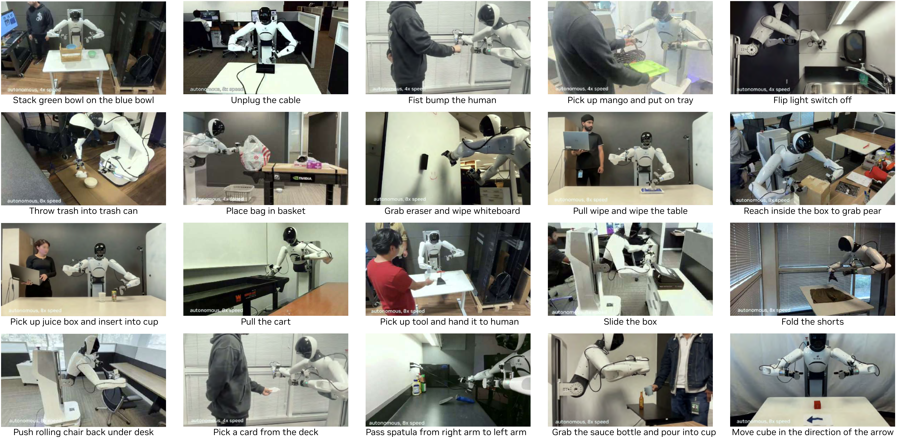
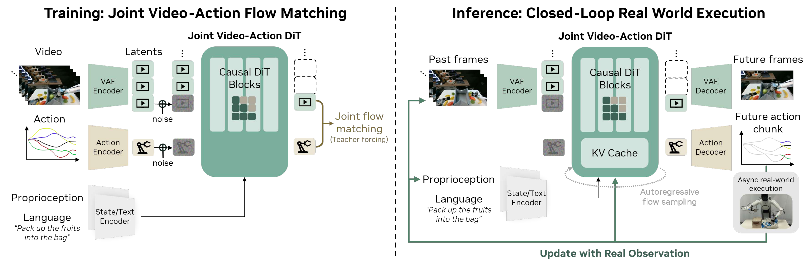
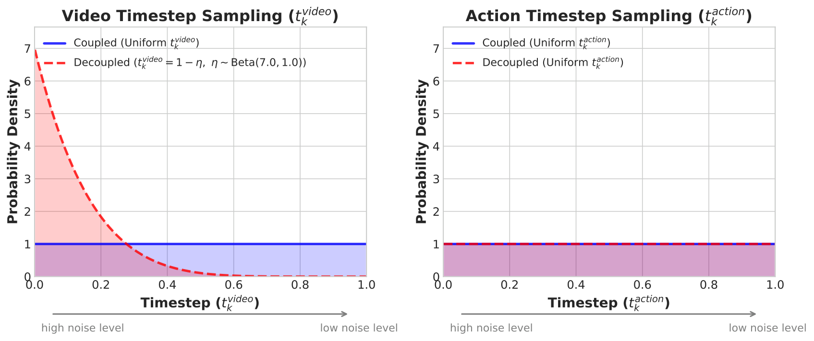
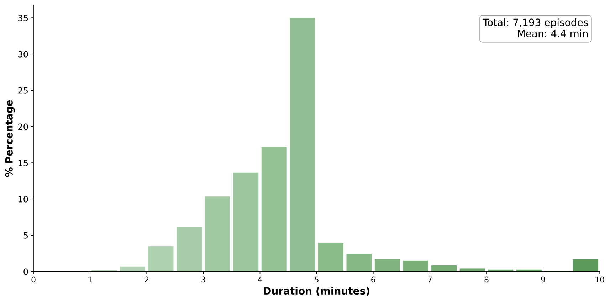
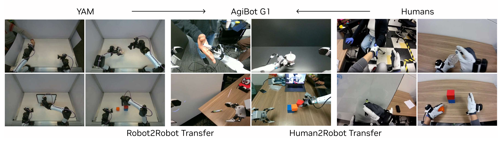

# W12. World Action Models are Zero-shot Policies

## 0. 읽기 전 약어 및 핵심 용어

이 문서를 읽기 전에 아래 약어와 용어를 먼저 정리한다. 이후 본문에서는 괄호 안의 약어를 사용한다.

- Artificial Intelligence (AI): 사람의 지각, 추론, 학습, 의사결정 능력을 기계가 수행하도록 만드는 인공지능 분야를 뜻한다.
- Vision-Language Model (VLM): 이미지와 텍스트를 함께 입력받아 시각-언어 이해나 생성 작업을 수행하는 모델이다.
- Vision-Language-Action (VLA): 시각 관측과 언어 명령을 함께 받아 로봇 action까지 생성하는 모델 또는 학습 패러다임이다.
- Out-of-Distribution (OOD): 학습 데이터 분포와 다른 object, scene, task, embodiment, environment 조건을 뜻한다.
- Reinforcement Learning (RL): agent가 reward를 최대화하도록 environment와 상호작용하며 policy를 학습하는 방법이다.
- Variational Autoencoder (VAE): latent variable의 확률분포를 학습해 data를 생성하거나 압축하는 generative model이다.
- Diffusion Transformer (DiT): U-Net 대신 transformer backbone을 사용해 diffusion denoising이나 flow prediction을 수행하는 architecture이다.
- Key-Value cache (KV): transformer decoding에서 이전 token의 attention key/value를 저장해 inference를 빠르게 하는 cache이다.
- Distributed Robot Interaction Dataset (DROID): 여러 장소에서 수집한 in-the-wild robot manipulation demonstration dataset이다.
- Physical Intelligence pi-zero model (pi0): Physical Intelligence가 제안한 general robot control용 vision-language-action flow model이다.
- Physical Intelligence pi-zero-point-five model (pi0.5): pi0를 open-world household manipulation으로 확장한 VLA model이다.
- Generalist Robot 00 Technology (GR00T): NVIDIA가 humanoid/generalist robot을 위해 공개한 robot foundation model family 이름이다.
- World Action Model (WAM): video/world model이 action과 future observation을 함께 모델링해 policy처럼 쓰일 수 있게 만든 모델이다.
- Autoregressive (AR): 이전 token이나 frame을 조건으로 다음 token/frame을 순차적으로 생성하는 modeling 방식이다.
- Classifier-Free Guidance (CFG): conditional generation에서 condition strength를 조절해 sample quality와 diversity를 제어하는 guidance 기법이다.
- Image-to-Video (I2V): 하나의 image를 조건으로 temporal video sequence를 생성하는 setting이다.
- Frames Per Second (FPS): video나 control loop가 1초에 처리하는 frame 수를 나타내는 속도 단위다.
- Graphics Processing Unit (GPU): 대규모 neural network 학습과 병렬 연산을 빠르게 수행하는 processor이다.
- Compute Unified Device Architecture (CUDA): NVIDIA GPU에서 병렬 연산을 수행하기 위한 programming platform이다.
- NVIDIA 4-bit floating point format (NVFP4): NVIDIA GPU에서 저정밀 추론/학습을 가속하기 위한 4-bit floating point format이다.
- Closed-Circuit Television (CCTV): 특정 장소의 영상을 폐쇄 회로로 촬영/감시하는 video source를 뜻한다.
- Physical Artificial Intelligence (Physical AI): 디지털 공간의 예측을 넘어 물리 세계에서 지각, 예측, 계획, 행동, 안전 검사를 수행하는 AI 시스템을 뜻한다.

## 1. Metadata

| 항목 | 내용 |
|---|---|
| 논문 | World Action Models are Zero-shot Policies |
| 모델/시스템 | DreamZero |
| 저자 | Seonghyeon Ye, Yunhao Ge, Kaiyuan Zheng, Shenyuan Gao, Sihyun Yu, George Kurian, Suneel Indupuru, You Liang Tan, Chuning Zhu, Jiannan Xiang, Ayaan Malik, Kyungmin Lee, William Liang, Nadun Ranawaka, Jiasheng Gu, Yinzhen Xu, Guanzhi Wang, Fengyuan Hu, Avnish Narayan, Johan Bjorck, Jing Wang, Gwanghyun Kim, Dantong Niu, Ruijie Zheng, Yuqi Xie, Jimmy Wu, Qi Wang, Ryan Julian, Danfei Xu, Yilun Du, Yevgen Chebotar, Scott Reed, Jan Kautz, Yuke Zhu, Linxi "Jim" Fan, Joel Jang |
| 소속 | NVIDIA |
| 공개일 | 2026-02-17 arXiv v1, source text 표기 2026-02-19 |
| 링크 | https://arxiv.org/abs/2602.15922, https://dreamzero0.github.io |
| 코드/프로젝트 | https://github.com/dreamzero0/dreamzero |
| 핵심 키워드 | World Action Model, video diffusion policy, zero-shot robot generalization, cross-embodiment transfer, real-time video world model |

## 2. 한 줄 요약

DreamZero는 비디오 diffusion foundation model을 로봇 정책으로 전환해, 미래 비디오와 행동을 함께 예측하면 VLA보다 새로운 물리 동작과 환경에 강한 zero-shot policy를 만들 수 있음을 보인 World Action Model이다.

## 3. 왜 중요한가

기존 VLA는 웹 규모 VLM에서 언어/시각 의미 지식을 잘 가져오지만, 정적인 image-text pretraining에 기반하기 때문에 "무엇을 해야 하는가"는 알아도 "물리적으로 어떻게 움직여야 하는가"를 일반화하는 데 한계가 있다. DreamZero는 이 병목을 정면으로 찌른다. 로봇 행동을 바로 맞히는 대신, 비디오 foundation model이 가진 spatiotemporal prior를 활용해 미래 장면을 예측하고 그 미래와 정렬된 action을 함께 생성한다.

이 논문이 W10 DreamGen, W11 Cosmos 기반 Physical AI 흐름 다음에 자연스럽게 오는 이유도 여기에 있다. W10은 video world model이 robot learning 데이터/trajectory 생성에 도움이 된다는 쪽에 가깝고, W11은 Physical AI용 video foundation model을 체계화한다. W12는 한 발 더 나아가 "world model 자체가 policy가 될 수 있는가?"라는 질문에 실시간 real-robot 제어 결과로 답한다.

  

Figure 1. Overview. WAM은 video와 action을 함께 예측함으로써 diverse non-repetitive data 학습, open-world generalization, video-only cross-embodiment learning, few-shot adaptation을 노린다.

## 4. 문제의식: VLA에서 WAM으로

논문은 VLA의 약점을 "semantic generalization은 강하지만 physical motion generalization은 약하다"로 요약한다. 예를 들어 VLA는 특정 물체나 의미적 대상 위치를 잘 찾을 수 있지만, 훈련 데이터에 없던 "untie shoelace", "iron clothes", "paint with brush" 같은 새로운 물리 동작에서는 dominant behavior인 pick-and-place로 무너지는 경향이 있다.

DreamZero의 관점은 다르다. 로봇 데이터의 모든 연속 frame pair가 일종의 dense world evolution supervision이 되며, action은 예측된 visual future와 맞춰지는 inverse dynamics 문제로 바뀐다. 그래서 WAM은 단순한 Video Action Model이 아니라, 향후 tactile, force, latent dynamics까지 포함할 수 있는 world modeling objective와 action을 연결하는 broader category로 제안된다.

  

Figure 2. Joint Video and Action Prediction. DreamZero는 unseen task에서도 generated video와 실제 실행 action이 밀접하게 정렬되는 사례를 보여준다.

  

Figure 3. Free-form Evaluation. object manipulation, tool use, human-robot interaction까지 자연어 조건에서 다양한 행동을 수행하는 qualitative 예시다.

## 5. 핵심 formulation

DreamZero는 현재 및 과거 관측, 언어 instruction, proprioceptive state가 주어졌을 때 미래 observation과 action을 함께 예측한다.

$$
\pi_0(o_{l:l+H}, a_{l:l+H} \mid o_{0:l}, c, q_l)
=
\pi_0(o_{l:l+H} \mid o_{0:l}, c, q_l)
\pi_0(a_{l:l+H} \mid o_{0:l+H}, q_l)
$$

| 기호 | 의미 |
|---|---|
| $\pi_0$ | DreamZero가 학습하는 joint video-action policy/model |
| $o_{0:l}$ | 현재 시점 $l$까지의 visual observation history |
| $o_{l:l+H}$ | horizon $H$ 동안 예측할 미래 visual observation |
| $a_{l:l+H}$ | 같은 horizon 동안 예측할 robot action sequence |
| $c$ | 자연어 instruction |
| $q_l$ | 현재 proprioceptive state |
| $H$ | 고정된 prediction/action horizon |

이 식의 오른쪽은 해석상 두 부분으로 나뉜다. 첫 항은 미래 비디오를 예측하는 autoregressive video prediction이고, 둘째 항은 예측된 미래 observation까지 보고 action을 복원하는 inverse dynamics model이다. 중요한 점은 DreamZero가 이를 두 개 모델로 분리하지 않고 하나의 end-to-end joint denoising model로 학습한다는 것이다. 이 덕분에 video와 action의 alignment가 깊은 shared representation 안에서 형성된다.

## 6. Architecture

DreamZero는 Wan2.1-I2V-14B-480P image-to-video diffusion model을 backbone으로 사용한다. 입력은 visual context, language instruction, proprioceptive state이며, VAE/text encoder/state encoder를 거쳐 autoregressive DiT backbone에서 flow matching 방식으로 미래 video latent와 action을 함께 denoise한다. 추가 파라미터는 state encoder, action encoder, action decoder 중심으로 최소화하고, text encoder, image encoder, VAE는 freeze한다.

  

Figure 4. Model Architecture. 학습 시에는 clean previous chunks를 context로 두고 noisy current chunk의 video/action을 denoise한다. 추론 시에는 action chunk를 실행한 뒤 실제 관측을 KV cache에 다시 넣어 autoregressive video generation의 compounding error를 줄인다.

Autoregressive 구조를 택한 이유는 세 가지다. 첫째, KV cache로 inference를 빠르게 할 수 있다. 둘째, closed-loop control에서 실제 관측 history를 다음 generation의 guidance로 사용할 수 있다. 셋째, bidirectional diffusion이 fixed-length sequence와 video subsampling 때문에 native FPS와 action alignment를 깨뜨릴 수 있는 문제를 피한다.

## 7. Flow Matching Objective

각 chunk $k$에 대해 clean video latent와 clean action을 Gaussian noise와 선형 보간해 noisy input을 만든다.

$$
z_{t_k}^{k}
=
t_k z_{1}^{k}
+
(1 - t_k) z_{0}^{k}
$$

$$
a_{t_k}^{k}
=
t_k a_{1}^{k}
+
(1 - t_k) a_{0}^{k}
$$

| 기호 | 의미 |
|---|---|
| $k$ | chunk index |
| $t_k$ | chunk $k$의 denoising timestep, $[0, 1]$ 범위 |
| $z_{1}^{k}$ | chunk $k$의 clean video latent |
| $z_{0}^{k}$ | Gaussian noise에서 샘플링한 video latent noise |
| $z_{t_k}^{k}$ | timestep $t_k$에서의 noisy video latent |
| $a_{1}^{k}$ | clean normalized action |
| $a_{0}^{k}$ | Gaussian noise에서 샘플링한 action noise |
| $a_{t_k}^{k}$ | timestep $t_k$에서의 noisy action |

이때 이전 chunk의 clean context는 다음과 같이 정의된다.

$$
\mathcal{C}_{k}
=
\{(z_{1}^{j}, a_{1}^{j})\}_{j=1}^{k-1}
$$

| 기호 | 의미 |
|---|---|
| $\mathcal{C}_{k}$ | chunk $k$를 예측할 때 참고하는 이전 clean video/action chunks |
| $j$ | 현재 chunk 이전의 chunk index |
| $(z_{1}^{j}, a_{1}^{j})$ | 이전 chunk의 clean video latent와 clean action |

모델은 video와 action을 합친 joint velocity를 예측하도록 학습된다.

$$
v^{k}
=
[z_{1}^{k}, a_{1}^{k}]
-
[z_{0}^{k}, a_{0}^{k}]
$$

$$
\mathcal{L}(\theta)
=
\mathbb{E}_{z,a,\{t_k\}}
\left[
\frac{1}{K}
\sum_{k=1}^{K}
w(t_k)
\left\|
u_{\theta}([z_{t_k}^{k}, a_{t_k}^{k}]; \mathcal{C}_{k}, c, q_k, t_k)
-
v^{k}
\right\|^{2}
\right]
$$

| 기호 | 의미 |
|---|---|
| $v^{k}$ | clean target와 noise의 차이로 정의되는 chunk $k$의 joint velocity |
| $u_{\theta}$ | DreamZero의 velocity prediction network |
| $\theta$ | 학습 파라미터 |
| $K$ | trajectory 안의 chunk 수 |
| $w(t_k)$ | timestep별 loss weighting function |
| $q_k$ | chunk $k$의 proprioceptive state |
| $\mathcal{L}(\theta)$ | flow matching training loss |

이 objective의 발표 포인트는 간단하다. DreamZero는 "미래 장면을 잘 그리는 모델"과 "그 장면을 만들 action을 찾는 모델"을 따로 붙이는 대신, 하나의 diffusion transformer 안에서 video/action velocity를 같이 맞춘다. 따라서 action 품질은 video prediction 품질과 강하게 묶인다.

## 8. Real-Time Control: 14B Video Model을 7Hz Policy로 만들기

논문에서 가장 인상적인 공학적 지점은 14B autoregressive video diffusion model을 실제 closed-loop 로봇 제어에 올렸다는 점이다. naive DreamZero는 single GPU에서 action chunk 하나에 약 5.7초가 걸려 reactive control에 맞지 않는다. DreamZero는 이를 asynchronous execution, CFG parallelism, DiT caching, torch.compile/CUDA Graphs, kernel scheduler optimization, NVFP4 quantization, DreamZero-Flash로 줄인다.

핵심 latency target은 action horizon 48, 30Hz 제어 기준 chunk가 1.6초라는 점에서 나온다. inference는 현재 chunk가 끝나기 전에 충분히 일찍 끝나야 하므로 약 200ms 이하를 목표로 한다.

DreamZero-Flash는 video와 action의 denoising schedule을 분리한다. 표준 DreamZero는 video/action 모두 같은 uniform timestep을 쓰지만, Flash는 video는 high-noise context에 치우치게 두고 action은 uniform으로 유지한다.

$$
t_{k}^{video}
=
1 - \eta
$$

$$
\eta
\sim
\mathrm{Beta}(\alpha, \beta)
$$

| 기호 | 의미 |
|---|---|
| $t_{k}^{video}$ | chunk $k$의 video denoising timestep |
| $\eta$ | Beta distribution에서 샘플링한 보조 변수 |
| $\alpha, \beta$ | Beta distribution shape parameters |
| $\mathrm{Beta}(7, 1)$ | 논문에서 예시로 사용한 설정, video를 noisy 상태에 더 자주 노출 |

직관은 "few-step inference에서는 video token이 아직 noisy할 수 있으니, 학습 때부터 noisy visual context에서도 clean action을 예측하게 만들자"이다. 논문은 이를 통해 diffusion step을 4에서 1로 줄이면서 table bussing에서 83% 대비 74% task progress를 유지하고, inference를 약 350ms에서 150ms로 낮춘다.

  

Figure 5. Decoupled Noise Schedules. DreamZero-Flash는 action은 uniform noise schedule을 유지하면서 video timestep을 high-noise 쪽으로 bias해 noisy visual context에서 clean action을 예측하도록 학습한다.

## 9. Data and Evaluation

DreamZero는 AgiBot G1 mobile bimanual manipulator와 Franka single-arm robot에서 검증된다. AgiBot 데이터는 약 500시간, 7,193 episodes, 평균 4.4분, 평균 42.4 subtasks로 구성되며, 집, 레스토랑, 슈퍼마켓, 카페, 사무실 등 22개 환경에서 수집된다. 논문은 반복 demonstration을 많이 모으기보다 task diversity와 real-world utility를 우선시한다.

  

Figure 6a. AgiBot pretraining corpus의 episode duration distribution. 총 7.2K episodes, 약 500시간 규모다.

  

Figure 7. AgiBot Evaluation Set-up. 기본 evaluation 자체가 unseen environment와 unseen objects를 포함하도록 설계되어 있다.

비교 대상은 GR00T N1.6과 pi0.5이며, 각각 from-scratch와 official pretrained checkpoint에서 동일 데이터로 continued training한 설정을 비교한다. 평가 축은 seen task와 unseen task로 나뉘지만, seen task도 환경과 물체는 OOD인 것이 중요하다.

## 10. Main Results

Seen task에서 AgiBot G1 기준 DreamZero는 평균 task progress 62.2%를 달성한다. best pretrained VLA baseline은 27.4%이고, from-scratch VLA는 거의 0에 가까운 성능을 보인다. 논문의 해석은 WAM이 heterogeneous data에서 직접 observation-to-action mapping만 배우는 것이 아니라 video generation prior를 활용해 action prediction을 더 잘 학습하기 때문이라는 것이다.

  

Figure 8. Seen Task Evaluation. DreamZero는 PnP Easy, PnP Hard, Contact-Rich Manipulation에서 VLA baseline을 크게 앞선다.

Unseen task에서는 차이가 더 명확하다. AgiBot G1에서 DreamZero는 평균 task progress 39.5%를 보이며, pretrained VLA의 16.3%보다 높다. DROID-Franka에서도 DreamZero는 49% task progress와 22.5% success rate로 GR00T N1.6, pi0.5 pretrained baseline을 앞선다.

  

Figure 9. Zero-shot Generalization to Unseen Tasks. untying shoelaces, ironing, painting, shaking hands처럼 훈련에 없던 motion/verb에서 DreamZero가 non-trivial progress를 보인다.

## 11. Cross-Embodiment Transfer

WAM의 또 다른 중요한 가능성은 action label 없는 video-only data를 transfer에 쓸 수 있다는 점이다. 논문은 YAM robot과 human egocentric video로 unseen task를 수행한 데이터를 추가로 사용한다. 이때 cross-embodiment data에는 action label을 쓰지 않고 video prediction objective만 적용하며, AgiBot 데이터에는 기존 joint video-action objective를 유지한다.

  

Figure 11. Cross-Embodiment Transfer. YAM to AgiBot robot-to-robot transfer와 human-to-robot transfer를 모두 실험한다.

결과적으로 unseen task 평균 task progress가 DreamZero 38.3%에서 Human2Robot 54.3%, Robot2Robot 55.4%로 오른다. 추가 데이터가 10-20분 수준의 video-only demonstrations라는 점을 고려하면, 이는 WAM이 인간/다른 로봇 비디오를 skill acquisition signal로 쓸 수 있다는 강한 힌트다.

  

Figure 12. Few-shot Embodiment Adaptation. AgiBot 기반 DreamZero를 YAM robot의 30분 play data로 post-training해 새로운 embodiment에서도 language following을 유지하는 예시다.

## 12. 운영/현장 적용 관점에서 볼 포인트

이 논문은 단순히 로봇 성능표 하나가 아니라, 데이터 전략 자체를 바꿀 수 있다는 점에서 운영/현장 적용 관점의 관심사가 크다. 반복 demonstration을 많이 모으는 방식은 비용과 병목이 크다. DreamZero는 diverse, non-repetitive, long-horizon teleoperation log를 world modeling supervision으로 재활용한다. 제조/물류/서비스 로봇 환경에서는 정형화된 task demo보다 "현장에서 자연스럽게 쌓이는 장시간 operation video"가 더 많을 수 있으므로, WAM은 현장 데이터의 활용도를 높이는 방향으로 읽을 수 있다.

연구 질문도 꽤 선명하다. 첫째, 어떤 data diversity가 video-action alignment에 가장 중요한가? 둘째, failure가 video prediction error인지 inverse dynamics error인지 어떻게 자동 진단할 것인가? 셋째, human video, CCTV, egocentric video, robot video를 어떤 비율과 schedule로 섞어야 transfer가 잘 되는가? 넷째, 7Hz policy가 실제 산업 현장의 safety, latency, human-robot collaboration 요구조건을 만족하려면 어떤 monitoring layer가 필요할까?

## 13. 한계와 주의점

DreamZero의 실패는 주로 video generation error에서 나온다고 논문이 보고한다. 즉 모델은 잘못 생성된 visual plan도 충실히 실행할 수 있다. 이는 WAM의 강점이자 위험이다. world model이 더 좋아지면 policy도 좋아질 수 있지만, hallucinated future가 안전하지 않은 action으로 이어질 수 있다.

또한 14B video diffusion model을 실시간으로 돌리기 위해 GB200, NVFP4, CUDA Graphs, custom scheduler 등 상당한 시스템 최적화가 필요하다. 연구실에서 재현할 때는 알고리즘적 아이디어와 production-level latency engineering을 분리해서 봐야 한다. 그리고 cross-embodiment transfer는 매우 유망하지만, 현재 success rate가 완전히 안정적인 수준은 아니며 embodiment gap이 커질수록 추가 연구가 필요하다.

## 14. 발표 구성 제안

1. VLA의 한계에서 시작한다. semantic generalization과 physical motion generalization을 분리해서 설명한다.
2. WAM formulation을 소개한다. 미래 video prediction과 inverse dynamics가 왜 하나의 policy가 되는지 식으로 보여준다.
3. DreamZero architecture를 Figure 4 중심으로 설명한다. VAE/text/state encoder, AR DiT, joint video/action decoder, KV cache 교체가 핵심이다.
4. 실시간 제어 파트를 별도 highlight로 다룬다. 5.7초에서 150ms까지 가는 최적화 흐름은 청중의 흥미를 끌기 좋다.
5. 결과는 seen task보다 unseen task와 cross-embodiment transfer를 중심으로 읽는다. 이 논문의 진짜 주장은 "video world prior가 physical skill transfer를 만든다"이다.
6. 마지막에는 데이터 수집 전략, failure diagnosis, 현장 deployment monitoring을 연결한다.

## 15. 연결되는 논문

| 연결 | 논문 | 관계 |
|---|---|---|
| 이전 흐름 | W10 DreamGen | video world model을 robot learning에 활용하는 흐름 |
| 이전 흐름 | W11 World Simulation with Video Foundation Models for Physical AI | Physical AI용 video foundation model과 curation/RL post-training 흐름 |
| 비교 대상 | P5 pi0.5 | open-world generalization을 추구하는 VLA baseline |
| 비교 대상 | P6 GR00T N1 | humanoid/generalist robot foundation model baseline |
| 기반 개념 | W2 DreamerV3 | latent world model 기반 agent learning과 대비되는 video foundation WAM |
| 데이터/정책 흐름 | D1 Open X-Embodiment, D3 DROID | cross-embodiment robot data의 중요성과 WAM의 video-only transfer 가능성 |