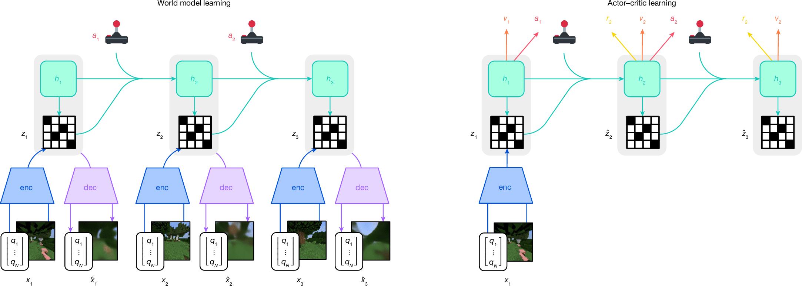
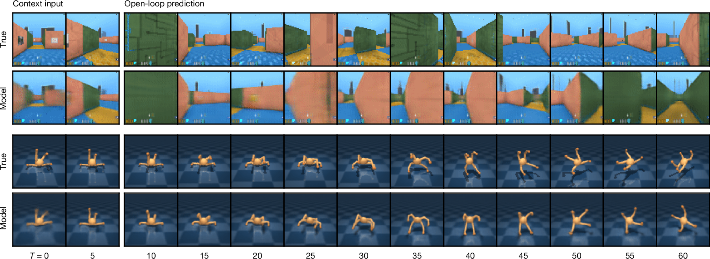
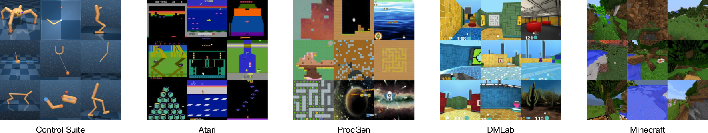
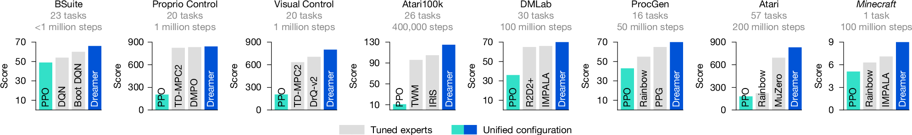
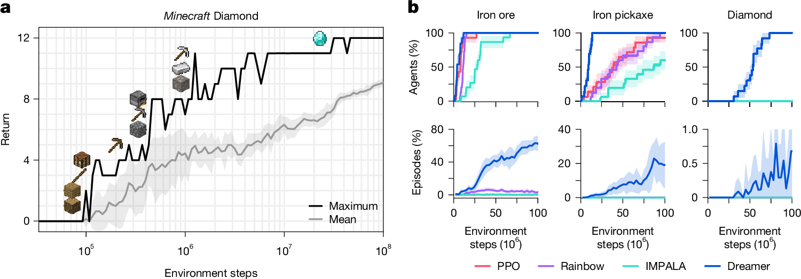
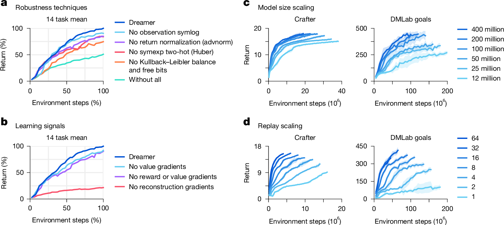

# W2. DreamerV3: Mastering Diverse Control Tasks through World Models

## 0. 읽기 전 약어 및 핵심 용어

이 문서를 읽기 전에 아래 약어와 용어를 먼저 정리한다. 이후 본문에서는 괄호 안의 약어를 사용한다.

- Artificial Intelligence (AI): 사람의 지각, 추론, 학습, 의사결정 능력을 기계가 수행하도록 만드는 인공지능 분야를 뜻한다.
- Vision-Language Model (VLM): 이미지와 텍스트를 함께 입력받아 시각-언어 이해나 생성 작업을 수행하는 모델이다.
- Vision-Language-Action (VLA): 시각 관측과 언어 명령을 함께 받아 로봇 action까지 생성하는 모델 또는 학습 패러다임이다.
- Reinforcement Learning (RL): agent가 reward를 최대화하도록 environment와 상호작용하며 policy를 학습하는 방법이다.
- Gated Recurrent Unit (GRU): sequence modeling을 위한 recurrent neural network cell로, reset/update gate를 사용한다.
- Exponential Moving Average (EMA): model parameter나 metric을 지수 가중 평균으로 smoothing하는 기법이다.
- Kullback-Leibler divergence (KL): 두 확률분포 사이의 차이를 측정하는 information-theoretic divergence이다.
- Recurrent State-Space Model (RSSM): deterministic recurrent state와 stochastic latent state를 결합해 dynamics를 모델링하는 world model 구조다.
- Distributional Maximum a Posteriori Policy Optimization (DMPO): policy optimization을 distributional maximum-a-posteriori 관점에서 수행하는 reinforcement learning method이다.
- Importance Weighted Actor-Learner Architecture (IMPALA): 여러 actor와 중앙 learner를 분리해 large-scale RL을 수행하는 architecture이다.
- Phasic Policy Gradient (PPG): policy와 value representation 학습을 phase로 나누는 reinforcement learning algorithm이다.
- Temporal Difference Model Predictive Control 2 (TD-MPC2): learned dynamics와 temporal-difference learning을 결합한 model-based RL/control 방법이다.
- Transformer World Model (TWM): transformer architecture로 environment dynamics나 future observation을 예측하는 world model이다.
- IRIS world model baseline (IRIS): discrete latent representation과 transformer를 이용하는 world model/RL baseline으로 쓰이는 모델명이다.
- Digital Object Identifier (DOI): 논문이나 dataset 같은 digital object를 영구적으로 식별하기 위한 identifier이다.
- Physical Artificial Intelligence (Physical AI): 디지털 공간의 예측을 넘어 물리 세계에서 지각, 예측, 계획, 행동, 안전 검사를 수행하는 AI 시스템을 뜻한다.

## 1. Metadata

| Field | 내용 |
|---|---|
| ID | `W2` |
| Title | Mastering diverse control tasks through world models |
| Authors | Danijar Hafner, Jurgis Pasukonis, Jimmy Ba, Timothy Lillicrap |
| Affiliation / Team | Google DeepMind / University of Toronto |
| Venue / Status | Nature |
| Date | 2025-04-02 published / 2025-04-17 issue |
| Link | https://www.nature.com/articles/s41586-025-08744-2 |
| DOI | https://doi.org/10.1038/s41586-025-08744-2 |
| Code | https://github.com/danijar/dreamerv3 |
| Local text | `paper_corpus/texts/W2.html.txt` |
| Source figures | `paper_corpus/figures_source/W2/manifest.md` |

## 2. 핵심 요약

DreamerV3는 single configuration으로 150개 이상의 다양한 control task를 학습하는 general world-model RL algorithm이다. 핵심은 environment interaction으로 replay buffer를 만들고, recurrent state-space world model을 학습한 뒤, 실제 환경이 아니라 learned latent world 안에서 actor와 critic을 훈련하는 것이다.

논문의 가장 강한 메시지는 "world model은 특정 도메인용 trick이 아니라, fixed hyperparameter로도 visual control, proprioceptive control, Atari, ProcGen, DMLab, BSuite, Minecraft까지 포괄할 수 있는 일반 RL backbone이 될 수 있다"는 점이다. 특히 Minecraft Diamond challenge에서 human data나 curriculum 없이 diamond를 획득한 점을 주요 milestone으로 제시한다.

## 3. 왜 중요한가?

- World model을 "미래 예측용 보조 모델"이 아니라 actor-critic 학습의 중심 substrate로 둔다.
- 모델 기반 RL의 고질적 문제였던 domain-specific tuning을 normalization, balancing, transformation으로 완화한다.
- visual input, vector/proprioceptive input, discrete action, continuous action을 single setting으로 처리한다.
- unsupervised reconstruction objective가 Dreamer 성능의 핵심 learning signal이라는 ablation을 제시한다.
- Physical AI 관점에서는 로봇이 real-world trial을 무한히 할 수 없을 때, latent imagination으로 data efficiency를 끌어올리는 대표 사례다.

## 4. Overall Training Process

  

<em>Fig. 1. Training process of Dreamer. Encoder가 sensory input을 discrete latent representation으로 바꾸고, recurrent sequence model이 action-conditioned latent future를 예측한다. Actor와 critic은 world model이 상상한 latent trajectory에서 학습한다. Source figure: Springer Nature official image asset.</em>

DreamerV3는 세 구성요소를 동시에 학습한다.

| Component | 역할 |
|---|---|
| World model | observation, reward, continuation을 latent dynamics로 예측 |
| Critic | imagined latent state의 return distribution을 예측 |
| Actor | critic이 높게 평가하는 imagined trajectory를 만들도록 action을 선택 |

실제 환경에서 action을 할 때는 actor가 바로 action을 sampling한다. 하지만 actor와 critic의 학습은 world model이 생성한 imagined latent rollout에서 이루어진다. 즉, agent는 "실제 세계에서 조금 경험하고, 모델 안에서 많이 연습하는" 구조를 가진다.

## 5. Recurrent State-Space World Model

Dreamer의 world model은 RSSM 계열 구조다. recurrent deterministic state와 stochastic latent state를 함께 사용한다.

$$
h_t=f_{\phi}(h_{t-1},z_{t-1},a_{t-1})
$$

$$
z_t\sim q_{\phi}(z_t\mid h_t,x_t)
$$

$$
\hat{z}_t\sim p_{\phi}(\hat{z}_t\mid h_t)
$$

$$
\hat{r}_t\sim p_{\phi}(\hat{r}_t\mid h_t,z_t)
$$

$$
\hat{c}_t\sim p_{\phi}(\hat{c}_t\mid h_t,z_t)
$$

$$
\hat{x}_t\sim p_{\phi}(\hat{x}_t\mid h_t,z_t)
$$

| Notation | 의미 |
|---|---|
| $x_t$ | time step $t$의 sensory input, 예를 들면 image 또는 vector observation |
| $a_t$ | action |
| $h_t$ | recurrent deterministic state |
| $z_t$ | encoder가 posterior로 sampling한 stochastic latent representation |
| $\hat{z}_t$ | dynamics predictor가 observation 없이 예측한 stochastic latent |
| $\hat{r}_t$ | predicted reward |
| $\hat{c}_t$ | episode continuation flag prediction |
| $\hat{x}_t$ | reconstructed input |
| $\phi$ | world model parameter |

중요한 점은 model state가 $s_t=\{h_t,z_t\}$로 정의된다는 것이다. actor와 critic은 raw image가 아니라 이 latent model state 위에서 학습한다.

## 6. World Model Objective

World model은 prediction loss, dynamics loss, representation loss를 함께 최소화한다.

$$
\mathcal{L}(\phi)=\mathbb{E}_{q_{\phi}}\sum_{t=1}^{T}
\beta_{\mathrm{pred}}\mathcal{L}_{\mathrm{pred}}(\phi)
+\beta_{\mathrm{dyn}}\mathcal{L}_{\mathrm{dyn}}(\phi)
+\beta_{\mathrm{rep}}\mathcal{L}_{\mathrm{rep}}(\phi)
$$

| Notation | 의미 |
|---|---|
| $\mathcal{L}(\phi)$ | 전체 world model loss |
| $\mathcal{L}_{\mathrm{pred}}$ | observation, reward, continuation prediction loss |
| $\mathcal{L}_{\mathrm{dyn}}$ | prior dynamics가 posterior latent를 예측하도록 하는 KL loss |
| $\mathcal{L}_{\mathrm{rep}}$ | posterior representation이 dynamics prior와 잘 맞도록 하는 KL loss |
| $\beta_{\mathrm{pred}},\beta_{\mathrm{dyn}},\beta_{\mathrm{rep}}$ | loss weights. 논문은 각각 1, 1, 0.1을 사용 |
| $T$ | training sequence length |

Prediction loss는 reconstruction과 reward/continue prediction을 묶는다.

$$
\mathcal{L}_{\mathrm{pred}}(\phi)
=-\log p_{\phi}(x_t\mid z_t,h_t)
-\log p_{\phi}(r_t\mid z_t,h_t)
-\log p_{\phi}(c_t\mid z_t,h_t)
$$

| Notation | 의미 |
|---|---|
| $p_{\phi}(x_t\mid z_t,h_t)$ | latent state에서 observation을 복원하는 decoder likelihood |
| $p_{\phi}(r_t\mid z_t,h_t)$ | latent state에서 reward를 예측하는 likelihood |
| $p_{\phi}(c_t\mid z_t,h_t)$ | latent state에서 episode continuation을 예측하는 likelihood |

Dynamics loss와 representation loss는 stop-gradient 위치가 다르다. 논문은 free bits를 사용해 KL 항이 1 nat 아래일 때는 더 줄이려고 하지 않게 만든다.

$$
\mathcal{L}_{\mathrm{dyn}}(\phi)
=\max\{1,D_{\mathrm{KL}}(\mathrm{sg}(q_{\phi}(z_t\mid h_t,x_t))\parallel p_{\phi}(z_t\mid h_t))\}
$$

$$
\mathcal{L}_{\mathrm{rep}}(\phi)
=\max\{1,D_{\mathrm{KL}}(q_{\phi}(z_t\mid h_t,x_t)\parallel \mathrm{sg}(p_{\phi}(z_t\mid h_t)))\}
$$

| Notation | 의미 |
|---|---|
| $D_{\mathrm{KL}}$ | Kullback-Leibler divergence |
| $\mathrm{sg}(\cdot)$ | stop-gradient operator |
| $q_{\phi}(z_t\mid h_t,x_t)$ | observation을 본 posterior latent distribution |
| $p_{\phi}(z_t\mid h_t)$ | recurrent state만으로 예측한 prior latent distribution |
| $\max\{1,\cdot\}$ | free bits clipping. KL이 1 nat보다 작으면 해당 항의 압력을 줄임 |

이 설계가 중요한 이유는 reconstruction만 강하면 latent가 control에 불필요한 visual detail까지 담을 수 있고, KL regularization만 강하면 latent가 observation 정보를 잃을 수 있기 때문이다. DreamerV3는 KL balance, free bits, representation loss scale을 조합해 다양한 visual complexity에서 같은 hyperparameter를 유지한다.

## 7. Video Prediction and Learned Dynamics

  

<em>Fig. 3. Video predictions of the world model. 5개 context frame과 action sequence만으로 45 frame 미래를 예측한다. Procedural maze와 quadruped task에서 observation 없이 latent dynamics가 장기 예측을 수행한다. Source figure: Springer Nature official image asset.</em>

Figure 3는 DreamerV3가 단순 reward predictor가 아니라 실제로 environment dynamics의 구조를 학습한다는 evidence다. 이미지가 perfect하게 복원되는 것이 목표라기보다, actor-critic이 활용할 수 있는 abstract representation과 reward-relevant dynamics를 갖는 것이 중요하다.

Physical AI로 보면 이 그림은 robot video prediction과 유사하지만, 차이가 있다. DreamerV3의 world model은 "예쁜 비디오 생성"보다 "control에 충분한 latent future"를 만든다. 따라서 generative fidelity와 control utility 사이의 균형이 핵심이다.

## 8. Actor-Critic Learning in Imagination

Actor와 critic은 model state 위에서 동작한다.

$$
a_t\sim\pi_{\theta}(a_t\mid s_t)
$$

$$
v_{\psi}(R_t\mid s_t)
$$

| Notation | 의미 |
|---|---|
| $s_t$ | model state, 즉 $\{h_t,z_t\}$ |
| $\pi_{\theta}$ | actor policy |
| $\theta$ | actor parameter |
| $v_{\psi}$ | return distribution을 예측하는 critic |
| $\psi$ | critic parameter |
| $R_t$ | time step $t$에서 시작하는 return |

Critic은 bootstrapped lambda return을 학습한다.

$$
R_t^{\lambda}=r_t+\gamma c_t((1-\lambda)v_t+\lambda R_{t+1}^{\lambda})
$$

$$
R_T^{\lambda}=v_T
$$

$$
\mathcal{L}(\psi)=-\sum_{t=1}^{T}\log p_{\psi}(R_t^{\lambda}\mid s_t)
$$

| Notation | 의미 |
|---|---|
| $R_t^{\lambda}$ | reward와 critic value를 섞은 bootstrapped lambda return |
| $r_t$ | imagined reward |
| $\gamma$ | discount factor. 논문은 0.997 사용 |
| $c_t$ | continuation flag |
| $\lambda$ | reward rollout과 bootstrap value의 mixing parameter |
| $v_t$ | critic distribution의 expectation |
| $p_{\psi}(R_t^{\lambda}\mid s_t)$ | critic이 예측하는 return distribution |

Actor는 return advantage와 policy entropy를 함께 사용한다.

$$
\mathcal{L}(\theta)
=-\sum_{t=1}^{T}
\mathrm{sg}\left(\frac{R_t^{\lambda}-v_t}{\max\{1,S\}}\right)
\log \pi_{\theta}(a_t\mid s_t)
+\eta H[\pi_{\theta}(a_t\mid s_t)]
$$

| Notation | 의미 |
|---|---|
| $\mathcal{L}(\theta)$ | actor loss |
| $R_t^{\lambda}-v_t$ | imagined trajectory에서의 advantage estimate |
| $S$ | return scale normalization denominator |
| $\eta$ | entropy regularization scale. 논문은 $3\times10^{-4}$ 사용 |
| $H[\pi_{\theta}]$ | policy entropy |

Return scale은 5th percentile과 95th percentile 차이의 EMA로 잡는다.

$$
S=\mathrm{EMA}(\mathrm{Per}(R_t^{\lambda},95)-\mathrm{Per}(R_t^{\lambda},5),0.99)
$$

| Notation | 의미 |
|---|---|
| $\mathrm{Per}(R_t^{\lambda},95)$ | batch 내 lambda return의 95th percentile |
| $\mathrm{Per}(R_t^{\lambda},5)$ | batch 내 lambda return의 5th percentile |
| $\mathrm{EMA}(\cdot,0.99)$ | decay 0.99의 exponential moving average |

이 normalization은 reward scale이 환경마다 크게 다른 문제를 다룬다. sparse reward에서는 noise를 과도하게 키우지 않고, dense reward에서는 exploitation이 가능하도록 entropy와 return의 상대 scale을 안정화한다.

## 9. Robust Prediction Tricks

DreamerV3의 practical contribution은 world model 자체만큼이나 robustness trick에 있다.

| Technique | 역할 |
|---|---|
| observation symlog | vector observation과 target scale을 압축해 큰 값 때문에 loss가 폭주하지 않게 함 |
| KL balancing + free bits | dynamics와 representation learning 사이의 trade-off 안정화 |
| 1% unimix for categoricals | categorical distribution이 deterministic하게 붕괴해 KL spike가 생기는 문제 완화 |
| percentile return normalization | reward scale과 sparsity가 달라도 entropy regularization을 fixed scale로 유지 |
| symexp two-hot regression | reward/value target scale과 gradient scale을 분리 |
| block GRU, RMSNorm, SiLU | network architecture 안정성 개선 |
| LaProp, adaptive gradient clipping | optimizer 안정성 개선 |

Symlog와 symexp는 큰 양수와 음수를 모두 다루기 위한 symmetric transform이다.

$$
\mathrm{symlog}(y)=\mathrm{sign}(y)\log(|y|+1)
$$

$$
\mathrm{symexp}(y)=\mathrm{sign}(y)(\exp(|y|)-1)
$$

| Notation | 의미 |
|---|---|
| $y$ | observation, reward, return 같은 scalar target |
| $\mathrm{symlog}$ | 큰 magnitude를 log scale로 압축하는 transform |
| $\mathrm{symexp}$ | symlog의 inverse transform |

Symlog squared error는 다음처럼 쓰인다.

$$
\mathcal{L}(\theta)=\frac{1}{2}(f(x,\theta)-\mathrm{symlog}(y))^2
$$

$$
\hat{y}=\mathrm{symexp}(f(x,\theta))
$$

| Notation | 의미 |
|---|---|
| $f(x,\theta)$ | network output |
| $x$ | network input |
| $\theta$ | network parameter |
| $\hat{y}$ | inverse transform으로 읽어낸 prediction |

Reward predictor와 critic은 noisy target을 다루기 위해 symexp two-hot loss를 사용한다.

$$
\hat{y}=\mathrm{softmax}(f(x))^{\top}B
$$

$$
B=\mathrm{symexp}([-20,\ldots,+20])
$$

$$
\mathcal{L}(\theta)
=-\mathrm{twohot}(y)^{\top}\log\mathrm{softmax}(f(x,\theta))
$$

| Notation | 의미 |
|---|---|
| $B$ | exponentially spaced bins |
| $\mathrm{twohot}(y)$ | target scalar를 가까운 두 bin에 나누어 encoding한 soft target |
| $\mathrm{softmax}(f(x))$ | bin probability distribution |
| $\hat{y}$ | bin location의 probability-weighted average |

## 10. Domains and Benchmarks

  

<em>Fig. 2. Diverse visual domains used in the experiments. Dreamer는 robot locomotion/manipulation, Atari, ProcGen, DMLab, Minecraft 등 다양한 visual domain에서 동일 설정으로 평가된다. Source figure: Springer Nature official image asset.</em>

논문은 DreamerV3를 여러 benchmark에 걸쳐 평가한다.

| Benchmark | 특징 | 논문에서의 요지 |
|---|---|---|
| Atari | 57 games, 200M frames | MuZero, Rainbow, IQN보다 강한 성능을 보고 |
| ProcGen | randomized levels, visual distraction | tuned PPG, Rainbow보다 높은 성능 |
| DMLab | 30 3D tasks, spatial/temporal reasoning | IMPALA, R2D2+ 대비 큰 data efficiency gain |
| Atari100k | 26 games, 400K frames | IRIS, TWM, SimPLe, SPR 등 주요 방법보다 높음 |
| Proprio Control Suite | 20 continuous control tasks | DMPO, TD-MPC2 수준의 state-of-the-art 성능 |
| Visual Control Suite | image-only continuous control | visual control에서 state-of-the-art를 보고 |
| BSuite | scale robustness, memory, exploration 등 진단 benchmark | 특히 scale robustness에서 강점 |
| Minecraft Diamond | sparse reward, long horizon, open world | human data/curriculum 없이 diamond 획득 |

  

<em>Fig. 4. Benchmark scores. Fixed hyperparameter로 여러 domain에서 tuned expert algorithms 및 PPO와 비교한다. Source figure: Springer Nature official image asset.</em>

## 11. Minecraft Diamond Challenge

  

<em>Fig. 5. Minecraft Diamond challenge. Dreamer는 sparse reward와 long-horizon exploration이 필요한 Minecraft에서 12개 milestone을 거쳐 diamond를 획득한다. Source figure: Springer Nature official image asset.</em>

Minecraft는 procedurally generated infinite 3D world, sparse rewards, long time horizon, crafting technology tree가 결합된 어려운 benchmark다. 논문은 Diamond task에서 12개 milestone을 모두 통과해야 하며, 이전 접근들은 human data나 domain-specific curriculum을 활용했다고 설명한다.

DreamerV3는 default hyperparameter로 이 task에 적용되어 diamond를 얻은 첫 end-to-end RL algorithm으로 제시된다. 이 결과는 world model이 단순한 short-horizon prediction이 아니라 sparse reward exploration과 long-horizon planning에 도움을 줄 수 있음을 보여준다.

## 12. Ablation and Scaling

  

<em>Fig. 6. Ablations and robust scaling. KL balancing/free bits, return normalization, symexp two-hot regression 등 robustness technique의 효과와 model size/replay ratio scaling을 분석한다. Source figure: Springer Nature official image asset.</em>

Figure 6에서 논문은 네 가지 메시지를 준다.

| Panel | 핵심 메시지 |
|---|---|
| a | 개별 robustness technique이 평균 성능에 모두 기여하며, 특히 KL balancing/free bits가 중요하다. |
| b | Dreamer 성능은 reward/value gradient보다 world model의 unsupervised reconstruction objective에 크게 의존한다. |
| c | 12M에서 400M parameter까지 model size를 키우면 성능과 data efficiency가 함께 좋아진다. |
| d | replay ratio를 늘리면 더 많은 gradient update를 통해 성능이 예측 가능하게 향상된다. |

이 부분은 Physical AI 연구에서 특히 중요하다. 실제 robot data가 비싸다면, 모델 크기와 replay ratio를 늘려 같은 interaction budget에서 더 많은 학습을 뽑아내는 방향이 가능하기 때문이다.

## 13. Physical AI와의 연결

DreamerV3는 로봇 foundation policy와는 다르게 language나 web-scale VLM을 직접 사용하지 않는다. 대신 "closed-loop control을 위해 필요한 compact latent world"를 학습한다. 이 점에서 VLA 계열과 상보적이다.

| VLA 계열 | DreamerV3 계열 |
|---|---|
| language-conditioned generalization 강조 | action-conditioned latent dynamics와 control 강조 |
| 대규모 demonstration/pretraining이 중요 | environment interaction과 replay/imagination이 중요 |
| policy가 바로 action을 출력 | world model 안에서 actor-critic을 학습 |
| semantic instruction following에 강함 | reward-driven adaptation과 data efficiency에 강함 |

앞으로의 Physical AI 연구에서는 VLA가 high-level task instruction과 semantic grounding을 담당하고, Dreamer식 world model이 short-horizon dynamics, uncertainty, closed-loop adaptation을 담당하는 hybrid 구조가 자연스럽다.

## 14. 한계와 주의점

- 평가 환경은 대부분 simulator/game benchmark이므로 real robot의 contact dynamics, sensing noise, hardware delay와는 차이가 있다.
- Minecraft 결과도 environment action space와 block-breaking speed adjustment 등 실험 설정을 이해하고 비교해야 한다.
- World model이 좋다고 해서 반드시 photorealistic generation이 좋은 것은 아니며, control-relevant representation을 학습하는 것이 핵심이다.
- Fixed hyperparameter가 강점이지만, 실제 산업 로봇에서는 reward 설계, safety constraint, sim-to-real gap이 여전히 큰 과제로 남는다.

## 15. 발표 구성 제안

1. "왜 world model이 RL의 generalization/tuning 문제를 해결할 수 있는가?"로 시작한다.
2. Figure 1로 world model, actor, critic의 training loop를 설명한다.
3. RSSM 수식을 한 줄씩 설명하며 $h_t$, $z_t$, $\hat{z}_t$의 차이를 강조한다.
4. Figure 3로 imagination이 단순한 추상이 아니라 future prediction을 담는다는 점을 보여준다.
5. Fig. 4와 Fig. 5로 fixed hyperparameter across domains와 Minecraft milestone을 설명한다.
6. Fig. 6으로 robustness tricks와 scaling behavior를 정리한다.
7. 마지막에는 VLA와 Dreamer식 world model을 어떻게 결합할지 연결한다.

## 16. 토론 질문

- Physical AI에서 "좋은 world model"은 photorealistic video generator인가, reward/control에 충분한 latent dynamics model인가?
- VLA policy에 Dreamer식 latent imagination을 붙이면 어디서 가장 큰 이득이 날까?
- 산업 현장에서 real robot interaction이 비쌀 때, model size와 replay ratio를 키우는 접근이 demonstration data 수집보다 효율적일까?

## 17. 한 줄 정리

DreamerV3는 learned latent world 안에서 actor와 critic을 훈련함으로써, fixed hyperparameter로 다양한 control domain을 푸는 world-model RL의 대표적 기준점이다.