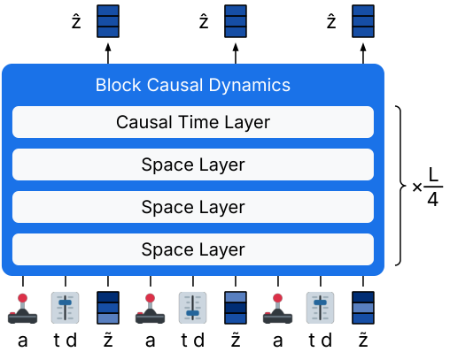
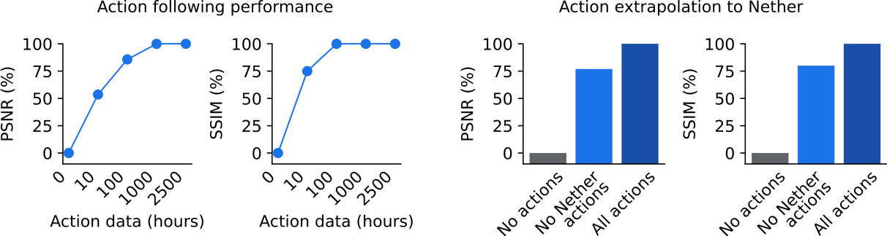
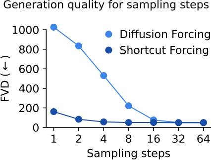

# W3. Training Agents Inside of Scalable World Models

## 0. 읽기 전 약어 및 핵심 용어

이 문서를 읽기 전에 아래 약어와 용어를 먼저 정리한다. 이후 본문에서는 괄호 안의 약어를 사용한다.

- Artificial Intelligence (AI): 사람의 지각, 추론, 학습, 의사결정 능력을 기계가 수행하도록 만드는 인공지능 분야를 뜻한다.
- Vision-Language-Action (VLA): 시각 관측과 언어 명령을 함께 받아 로봇 action까지 생성하는 모델 또는 학습 패러다임이다.
- Behavior Cloning (BC): expert demonstration의 observation-action pair를 supervised learning으로 모방하는 imitation learning 방법이다.
- Reinforcement Learning (RL): agent가 reward를 최대화하도록 environment와 상호작용하며 policy를 학습하는 방법이다.
- Kullback-Leibler divergence (KL): 두 확률분포 사이의 차이를 측정하는 information-theoretic divergence이다.
- Mean Squared Error (MSE): 예측값과 정답의 차이를 제곱해 평균한 regression loss이다.
- Frames Per Second (FPS): video나 control loop가 1초에 처리하는 frame 수를 나타내는 속도 단위다.
- Fréchet Video Distance (FVD): generated video와 real video의 distribution 차이를 video feature space에서 측정하는 metric이다.
- Peak Signal-to-Noise Ratio (PSNR): image/video reconstruction quality를 pixel error 기반으로 측정하는 metric이다.
- Structural Similarity Index Measure (SSIM): image의 구조적 유사도를 luminance, contrast, structure 관점에서 측정하는 metric이다.
- Learned Perceptual Image Patch Similarity (LPIPS): deep feature space에서 image perceptual similarity를 측정하는 metric이다.
- Graph Question Answering / GQA benchmark (GQA): scene graph 기반 compositional visual question answering benchmark 또는 그 계열 task를 뜻한다.
- Physical Artificial Intelligence (Physical AI): 디지털 공간의 예측을 넘어 물리 세계에서 지각, 예측, 계획, 행동, 안전 검사를 수행하는 AI 시스템을 뜻한다.

## 1. Metadata

| Field | 내용 |
|---|---|
| ID | `W3` |
| Title | Training Agents Inside of Scalable World Models |
| Authors | Danijar Hafner, Wilson Yan, Timothy Lillicrap |
| Affiliation / Team | Google DeepMind |
| Venue / Status | arXiv |
| Date | 2025-09-29 |
| Link | https://arxiv.org/abs/2509.24527 |
| Website | https://danijar.com/dreamer4 |
| Local source | `paper_corpus/sources/W3` |
| Source figures | `paper_corpus/figures_source/W3/manifest.md` |

## 2. 핵심 요약

이 논문은 Dreamer 4를 제안한다. Dreamer 3가 robust world-model RL의 기준점이었다면, Dreamer 4는 훨씬 더 큰 transformer world model 안에서 agent를 offline으로 훈련시키는 방향으로 확장한다. 핵심 주장은 "agent가 실제 environment와 interaction하지 않고도, offline video/action dataset으로 학습한 scalable world model 안에서 reinforcement learning을 수행해 Minecraft diamond task를 달성할 수 있다"는 것이다.

가장 중요한 결과는 Dreamer 4가 VPT contractor dataset 2.5K hours만 사용하고 online environment interaction 없이 Minecraft에서 diamond를 획득한다는 점이다. 저자들은 이를 robotics처럼 partially trained agent를 실제로 굴리는 것이 위험하고 느린 분야를 향한 proxy challenge로 설정한다.

## 3. 왜 중요한가?

- World model을 policy 학습의 보조 도구가 아니라, offline RL이 수행되는 simulator 자체로 사용한다.
- Diffusion/flow 기반 scalable video world model을 real-time interactive inference가 가능한 control model로 바꾸려 한다.
- Shortcut forcing objective로 4 forward passes per frame 수준의 빠른 generation을 목표로 한다.
- Unlabeled videos에서 대부분의 world knowledge를 얻고, 소량의 action-paired data로 action conditioning을 배울 수 있음을 보인다.
- Physical AI 관점에서는 "real robot을 덜 망가뜨리고, world model 안에서 더 많이 연습한다"는 방향의 최신 레시피다.

## 4. Imagination Training Inside the World Model

  

<em>Figure 1. Dreamer 4 learns by reinforcement learning inside its world model. Decoded imagined training sequences show low-level mouse/keyboard actions causing block breaking, tool use, crafting-table interaction, and diamond mining. Source figure: <code>figures/imag/imag.pdf</code>.</em>

논문의 thesis는 이 그림 하나로 요약된다. agent는 Minecraft world에 직접 들어가 trial-and-error를 하지 않는다. 대신 offline dataset으로 배운 world model이 Minecraft mechanics를 simulate하고, policy는 그 model 안에서 task reward를 최적화한다.

| Phase | 내용 |
|---|---|
| Phase 1: World Model Pretraining | tokenizer를 video reconstruction으로 학습하고, dynamics model을 tokenized videos와 optional actions로 학습 |
| Phase 2: Agent Finetuning | task token, policy head, reward head를 world model에 넣고 behavior cloning/reward modeling 수행 |
| Phase 3: Imagination Training | world model과 policy head가 생성한 imagined trajectory에서 policy/value head를 RL로 개선 |

## 5. World Model Design

  

<em>Figure 2a. Causal Tokenizer. Image patch와 latent token을 block-causal transformer로 처리하고, low-dimensional projection과 decoder를 통해 video representation을 학습한다. Source figure: <code>figures/method/tok.pdf</code>.</em>

  

<em>Figure 2b. Interactive Dynamics. Action, shortcut noise level, step size, tokenizer representation을 interleaved sequence로 넣고 shortcut forcing objective로 representation을 denoise한다. Source figure: <code>figures/method/dyn.pdf</code>.</em>

Dreamer 4의 world model은 두 부분으로 나뉜다.

| Module | 역할 | 설계 포인트 |
|---|---|---|
| Causal tokenizer | raw video frame을 continuous representation으로 압축 | causal attention으로 temporal compression과 frame-by-frame decoding을 양립 |
| Interactive dynamics | action-conditioned future representation을 생성 | shortcut forcing objective와 efficient transformer로 real-time generation 목표 |

Tokenizer는 masked autoencoding 방식으로 학습한다.

$$
\mathcal{L}_{\mathrm{tok}}(\theta)=\mathcal{L}_{\mathrm{MSE}}(\theta)+0.2\mathcal{L}_{\mathrm{LPIPS}}(\theta)
$$

| Notation | 의미 |
|---|---|
| $\mathcal{L}_{\mathrm{tok}}$ | tokenizer reconstruction loss |
| $\mathcal{L}_{\mathrm{MSE}}$ | pixel-level mean squared error |
| $\mathcal{L}_{\mathrm{LPIPS}}$ | perceptual similarity loss |
| $\theta$ | tokenizer parameter |

Patch dropout probability는 image마다 $p\sim U(0,0.9)$로 sampling한다. 이 masked autoencoding은 dynamics model이 생성하는 video의 spatial consistency를 높이는 역할을 한다.

## 6. Flow Matching Background

Dreamer 4의 dynamics는 diffusion/flow 계열 모델 위에 있다. Flow matching에서는 clean data $x_1$와 noise $x_0$ 사이의 중간 상태를 만들고, network가 clean data 방향의 velocity를 예측한다.

$$
x_{\tau}=(1-\tau)x_0+\tau x_1
$$

$$
x_0\sim\mathcal{N}(0,\mathbf{I})
$$

$$
x_1\sim\mathcal{D}
$$

$$
\mathcal{L}_{\mathrm{flow}}(\theta)=\|f_{\theta}(x_{\tau},\tau)-(x_1-x_0)\|^2
$$

| Notation | 의미 |
|---|---|
| $x_0$ | pure noise sample |
| $x_1$ | clean data sample |
| $x_{\tau}$ | signal level $\tau$에서의 corrupted sample |
| $\tau$ | signal level. 0이면 noise, 1이면 clean data |
| $f_{\theta}$ | velocity predictor |
| $\mathcal{D}$ | data distribution |

Inference에서는 작은 step을 반복해 noise를 clean data로 이동시킨다.

$$
x_{\tau+d}=x_{\tau}+f_{\theta}(x_{\tau},\tau)d
$$

| Notation | 의미 |
|---|---|
| $d$ | sampling step size |
| $K$ | sampling step 수. 일반적으로 $d=1/K$ |

## 7. Shortcut Forcing Objective

Shortcut model은 signal level뿐 아니라 requested step size $d$도 conditioning한다. 그래서 inference 때 원하는 step 수, 예를 들어 $K=4$, 로 빠르게 generation할 수 있다.

두 개의 half step을 distill하는 bootstrap target은 다음과 같이 만든다.

$$
b'=f_{\theta}(x_{\tau},\tau,d/2)
$$

$$
x'=x_{\tau}+b'd/2
$$

$$
b''=f_{\theta}(x',\tau+d/2,d/2)
$$

$$
v_{\mathrm{target}}=\mathrm{sg}(b'+b'')/2
$$

| Notation | 의미 |
|---|---|
| $b'$ | 첫 번째 half step velocity prediction |
| $b''$ | 두 번째 half step velocity prediction |
| $x'$ | 첫 번째 half step 후의 intermediate state |
| $v_{\mathrm{target}}$ | 큰 step을 학습하기 위한 bootstrap target |
| $\mathrm{sg}$ | stop-gradient operator |

Dreamer 4는 이를 sequential representation generation으로 확장한다. Dynamics model은 corrupted representation, signal level, step size, action sequence를 입력으로 받아 clean representation을 예측한다.

$$
\tilde{z}=(1-\tau)z_0+\tau z_1
$$

$$
\hat{z}_1=f_{\theta}(\tilde{z},\tau,d,a)
$$

| Notation | 의미 |
|---|---|
| $z_0$ | representation space의 noise |
| $z_1$ | tokenizer가 만든 clean video representation |
| $\tilde{z}$ | corrupted representation |
| $a$ | interleaved mouse/keyboard action sequence |
| $\hat{z}_1$ | dynamics model이 예측한 clean representation |

저자들은 velocity를 직접 예측하는 v-prediction보다 clean representation을 예측하는 x-prediction이 long rollout에서 error accumulation을 줄인다고 설명한다. 또한 low signal level에는 learning signal이 적으므로 ramp weight를 둔다.

$$
w(\tau)=0.9\tau+0.1
$$

| Notation | 의미 |
|---|---|
| $w(\tau)$ | signal level별 loss weight |
| $\tau=0$ | full noise, learning signal이 약한 구간 |
| $\tau=1$ | clean data에 가까운 구간 |

## 8. Behavior Cloning, Reward Model, Imagination RL

Agent finetuning 단계에서는 task-conditioned policy head와 reward head를 world model에 삽입한다. Action과 reward는 multi-token prediction으로 학습한다.

$$
\mathcal{L}_{\mathrm{BC/RM}}(\theta)
=-\sum_{n=0}^{L}\log p_{\theta}(a_{t+n}\mid h_t)
-\sum_{n=0}^{L}\log p_{\theta}(r_{t+n}\mid h_t)
$$

| Notation | 의미 |
|---|---|
| $L$ | multi-token prediction length. 논문은 $L=8$ 사용 |
| $h_t$ | task output embedding |
| $a_{t+n}$ | future action target |
| $r_{t+n}$ | future reward target |
| $p_{\theta}$ | policy 또는 reward head distribution |

이후 policy를 imagined rollout에서 reinforcement learning으로 개선한다. Value head는 lambda return을 예측한다.

$$
R_t^{\lambda}=r_t+\gamma c_t((1-\lambda)v_t+\lambda R_{t+1}^{\lambda})
$$

$$
R_T^{\lambda}=v_T
$$

$$
\mathcal{L}_{\mathrm{value}}(\theta)=-\sum_{t=1}^{T}\log p_{\theta}(R_t^{\lambda}\mid s_t)
$$

| Notation | 의미 |
|---|---|
| $R_t^{\lambda}$ | imagined reward와 value bootstrap으로 만든 lambda return |
| $r_t$ | reward head가 예측한 reward |
| $\gamma$ | discount factor. 논문은 0.997 사용 |
| $c_t$ | non-terminal indicator |
| $v_t$ | value head prediction |
| $s_t$ | imagined state |

Policy는 PMPO objective를 사용한다. Advantage의 크기보다 부호를 사용해 task별 return scale 차이에 덜 민감하게 만든다.

$$
A_t=R_t^{\lambda}-v_t
$$

$$
\mathcal{D}^{+}=\{s_i\mid A_i\geq 0\}
$$

$$
\mathcal{D}^{-}=\{s_i\mid A_i<0\}
$$

$$
\mathcal{L}_{\mathrm{policy}}(\theta)
=\frac{1-\alpha}{|\mathcal{D}^{-}|}\sum_{i\in\mathcal{D}^{-}}\log\pi_{\theta}(a_i\mid s_i)
-\frac{\alpha}{|\mathcal{D}^{+}|}\sum_{i\in\mathcal{D}^{+}}\log\pi_{\theta}(a_i\mid s_i)
+\frac{\beta}{N}\sum_{i=1}^{N}D_{\mathrm{KL}}(\pi_{\theta}(\cdot\mid s_i)\parallel\pi_{\mathrm{prior}})
$$

| Notation | 의미 |
|---|---|
| $A_t$ | advantage |
| $\mathcal{D}^{+}$ | non-negative advantage를 가진 imagined states |
| $\mathcal{D}^{-}$ | negative advantage를 가진 imagined states |
| $\pi_{\theta}$ | trainable policy head |
| $\pi_{\mathrm{prior}}$ | frozen behavioral prior policy |
| $\alpha$ | positive/negative set balance. 논문은 0.5 사용 |
| $\beta$ | behavioral prior KL scale. 논문은 0.3 사용 |

## 9. Offline Minecraft Diamond Challenge

  

<em>Figure. Agent performance in Minecraft without environment interaction. Dreamer 4 is the only compared offline agent that reaches diamond, and imagination training improves more strongly on harder milestones. Source figure: <code>figures/rl/rl.pdf</code>.</em>

논문은 Minecraft diamond task를 offline setting으로 재정의한다.

| 항목 | 설정 |
|---|---|
| Dataset | VPT contractor dataset 2.5K hours |
| Input | raw pixels, 360x640 |
| Action | low-level keyboard and mouse |
| Online interaction | 없음 |
| Episode | 60 minutes, empty inventory, random Minecraft world |
| Task difficulty | human experienced player 평균 20 minutes, 약 24,000 low-level actions |

주요 성공률은 다음과 같다.

| Milestone | Dreamer 4 success |
|---|---:|
| Log | 99.1% |
| Crafting table | 98.5% |
| Wooden pickaxe | 96.6% |
| Stone pickaxe | 90.1% |
| Iron ore | 66.7% |
| Furnace | 58.1% |
| Iron ingot | 39.5% |
| Iron pickaxe | 29.0% |
| Diamond | 0.7% |

0.7% diamond success는 숫자만 보면 작아 보이지만, offline data만으로 Minecraft diamond까지 도달한 첫 결과라는 점이 핵심이다. 특히 VPT finetuned와 BC 계열은 diamond를 얻지 못한다.

## 10. Human Interaction Evaluation

  

<em>Figure. Human interaction. Human player interacts with world models in real time via mouse and keyboard. Dreamer 4 keeps object interactions and game mechanics coherent, while prior Minecraft world models often hallucinate structures or change held items. Source figure: <code>figures/wmtask/wmtask.pdf</code>.</em>

World model이 agent training에 쓸 만하려면 video quality만 좋아서는 안 된다. 사람이 mouse/keyboard로 counterfactual interaction을 했을 때, placing blocks, breaking blocks, crafting, inventory interaction 같은 game mechanics가 유지되어야 한다.

| Model | Params | Resolution | Context | FPS on H100 | Interaction task success |
|---|---:|---|---:|---:|---:|
| MineWorld | 1.2B | 384x224 | 0.8s | 2 | not evaluated |
| Lucid-v1 | 1.1B | 640x360 | 1.0s | 44 | 0/16 |
| Oasis small | 500M | 640x360 | 1.6s | 20 | 0/16 |
| Oasis large | unknown | 360x360 | 1.6s | about 5 | 5/16 |
| Dreamer 4 | 2B | 640x360 | 9.6s | 21 | 14/16 |

Dreamer 4는 20 FPS Minecraft tick rate를 넘기는 real-time inference를 단일 H100에서 달성한다. 동시에 context length가 9.6초로 기존 모델보다 길어, 더 긴 interaction consistency를 유지한다.

## 11. Action Generalization from Few Actions

  

<em>Figure. Action generalization. Dreamer 4 learns most world knowledge from unlabeled video and needs relatively little action-paired video for action conditioning. It also transfers action conditioning to Nether and End scenes that had no action labels. Source figure: <code>figures/actgen/actgen.pdf</code>.</em>

저자들은 2,541 hours VPT video 중 일부에만 action을 제공하는 실험을 한다.

| Action-paired video | 결과 요지 |
|---|---|
| 0 hours | action conditioning 없이 broad future distribution만 학습 |
| 10 hours | full-action model 대비 53% PSNR, 75% SSIM |
| 100 hours | full-action model 대비 85% PSNR, 100% SSIM |
| Overworld actions only | Nether/End에서도 76% PSNR, 80% SSIM |

이 결과는 Physical AI에 매우 중요하다. 로봇 video는 많지만 action label이 적은 상황에서, world model이 general visual/physical knowledge는 unlabeled video에서 배우고, embodiment grounding만 소량의 action-paired data로 배울 가능성을 보여주기 때문이다.

## 12. Model Design and Speed-Quality Trade-off

  

<em>Figure. Generation quality of shortcut forcing compared to diffusion forcing. Shortcut forcing is designed to retain quality with fewer sampling steps. Source figure: <code>figures/nfe/nfe.pdf</code>.</em>

설계 ablation은 Dreamer 4가 단순히 transformer를 키운 결과가 아니라, generation speed와 quality를 동시에 맞추기 위한 누적 설계임을 보여준다.

| Design step | Inference FPS | FVD |
|---|---:|---:|
| Diffusion Forcing Transformer | 0.8 | 306 |
| Fewer sampling steps, K=4 | 9.1 | 875 |
| Shortcut model | 9.1 | 329 |
| X-Loss | 9.1 | 151 |
| Ramp weight | 9.1 | 102 |
| Long context every 4 layers | 18.9 | 70 |
| GQA | 23.2 | 71 |
| 256 spatial tokens | 21.4 | 57 |

핵심 trade-off는 명확하다. 단순히 diffusion step을 줄이면 빠르지만 quality가 무너진다. Shortcut forcing, x-prediction/x-loss, ramp weight, efficient transformer architecture를 결합해야 실시간성과 interaction fidelity가 함께 나온다.

## 13. Robotics와 Physical AI 연결

논문은 SOAR robotics dataset에도 world model을 학습해 real-world object interaction의 counterfactual prediction 가능성을 보여준다. 본문은 이를 Minecraft만의 결과가 아니라 real video physical interaction으로 확장 가능한 방향의 evidence로 제시한다.

Physical AI 관점에서 Dreamer 4의 메시지는 세 가지다.

| 관점 | 의미 |
|---|---|
| Safety | partially trained robot을 실제로 움직이지 않고 world model 안에서 학습할 수 있다. |
| Data | action label이 적어도 unlabeled video가 많으면 world knowledge pretraining에 활용할 수 있다. |
| Control | VLA보다 낮은 수준의 action sequence와 physical dynamics를 직접 simulate하는 방향이다. |

VLA 연구가 language instruction과 semantic generalization을 강하게 다룬다면, Dreamer 4는 low-level action-conditioned world simulation과 offline imagination RL에 강하다. 향후 로봇 연구에서는 VLA의 semantic task understanding과 Dreamer식 scalable world model을 결합하는 방향이 자연스럽다.

## 14. 한계와 주의점

- Diamond success가 0.7%이므로, offline-only Minecraft diamond가 완전히 해결된 것은 아니다.
- World model은 full game clone이 아니며, 논문도 short memory와 imprecise inventory prediction을 한계로 언급한다.
- Minecraft는 robotics보다 reset/evaluation이 쉬우며, real robot contact, deformation, sensor noise, safety constraint는 별도 난제다.
- 2B parameter model과 H100 기준 실시간 inference는 연구적으로 의미 있지만, 실제 산업 배포 비용은 따로 검토해야 한다.
- Offline data의 coverage 밖으로 policy가 나가면 model exploitation 문제가 생길 수 있어, small corrective online data나 uncertainty-aware control이 필요할 수 있다.

## 15. 발표 구성 제안

1. DreamerV3에서 Dreamer4로 이어지는 문제의식을 먼저 설명한다.
2. Figure 1로 "world model 안에서 RL을 한다"는 큰 그림을 잡는다.
3. Figure 2a/2b로 causal tokenizer와 interactive dynamics 구조를 설명한다.
4. Flow matching과 shortcut forcing 수식을 통해 왜 빠른 generation이 가능한지 설명한다.
5. Minecraft offline diamond setting과 Fig. RL 결과를 보여준다.
6. Human interaction 결과로 world model quality가 단순 FVD가 아니라 mechanics fidelity임을 강조한다.
7. Action generalization 결과를 Physical AI의 unlabeled video pretraining 문제와 연결한다.

## 16. 토론 질문

- Robot learning에서도 Minecraft처럼 "offline-only long-horizon task" benchmark를 만들 수 있을까?
- World model inside RL에서 model exploitation을 어떻게 감지하고 줄일 수 있을까?
- VLA가 high-level instruction을 담당하고 Dreamer 4식 world model이 low-level imagination을 담당하는 hybrid system은 어떤 interface가 필요할까?

## 17. 한 줄 정리

Dreamer 4는 scalable action-conditioned world model을 real-time simulator로 만들고, 그 안에서 offline imagination RL을 수행해 agent를 훈련시키는 최신 world-model agent의 강한 사례다.
