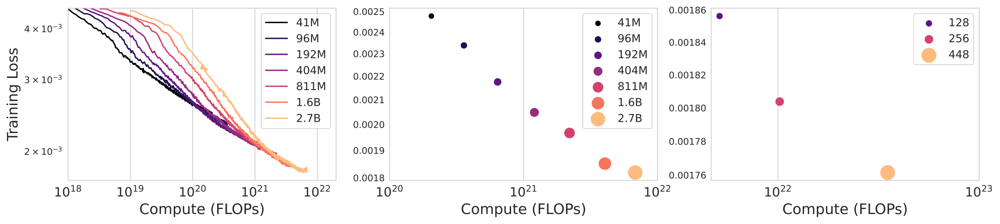
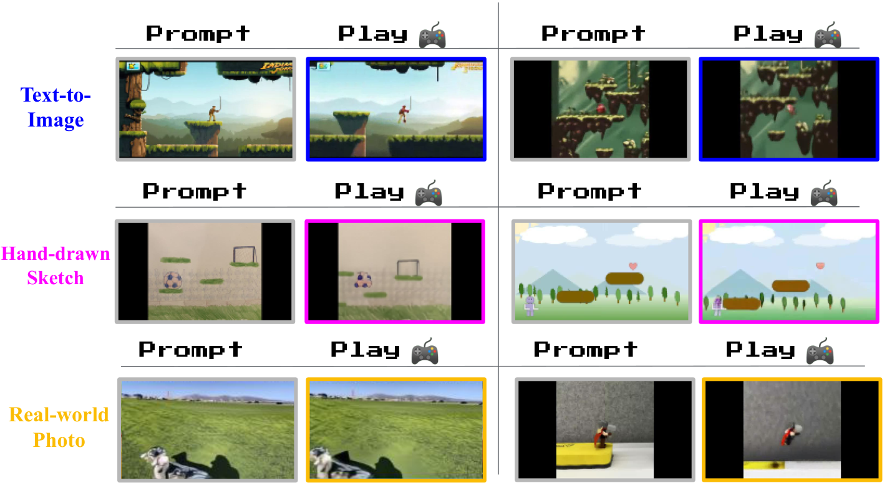
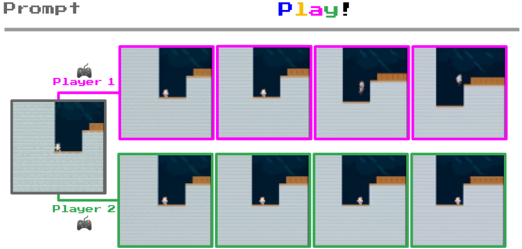

# W4. Genie: Generative Interactive Environments

## 0. 읽기 전 약어 및 핵심 용어

이 문서를 읽기 전에 아래 약어와 용어를 먼저 정리한다. 이후 본문에서는 괄호 안의 약어를 사용한다.

- Artificial Intelligence (AI): 사람의 지각, 추론, 학습, 의사결정 능력을 기계가 수행하도록 만드는 인공지능 분야를 뜻한다.
- Vision-Language-Action (VLA): 시각 관측과 언어 명령을 함께 받아 로봇 action까지 생성하는 모델 또는 학습 패러다임이다.
- Out-of-Distribution (OOD): 학습 데이터 분포와 다른 object, scene, task, embodiment, environment 조건을 뜻한다.
- Behavior Cloning (BC): expert demonstration의 observation-action pair를 supervised learning으로 모방하는 imitation learning 방법이다.
- Reinforcement Learning (RL): agent가 reward를 최대화하도록 environment와 상호작용하며 policy를 학습하는 방법이다.
- Variational Autoencoder (VAE): latent variable의 확률분포를 학습해 data를 생성하거나 압축하는 generative model이다.
- Vector Quantization (VQ): continuous representation을 discrete codebook vector로 양자화하는 방법이다.
- Vector-Quantized Variational Autoencoder (VQ-VAE): latent를 discrete codebook으로 양자화하는 variational autoencoder 계열 generative model이다.
- Robotics Transformer (RT): robot observation을 입력받아 action을 예측하는 transformer 기반 robot policy 계열을 뜻한다.
- Robotics Transformer 1 (RT-1): Google의 실제 로봇 demonstration data로 학습한 transformer 기반 robot control policy이다.
- Latent Action Model (LAM): observed video transition을 설명하는 hidden action code를 학습하는 model이다.
- Frames Per Second (FPS): video나 control loop가 1초에 처리하는 frame 수를 나타내는 속도 단위다.
- Fréchet Video Distance (FVD): generated video와 real video의 distribution 차이를 video feature space에서 측정하는 metric이다.
- Peak Signal-to-Noise Ratio (PSNR): image/video reconstruction quality를 pixel error 기반으로 측정하는 metric이다.
- Physical Artificial Intelligence (Physical AI): 디지털 공간의 예측을 넘어 물리 세계에서 지각, 예측, 계획, 행동, 안전 검사를 수행하는 AI 시스템을 뜻한다.

## 1. Metadata

| Field | 내용 |
|---|---|
| ID | `W4` |
| Title | Genie: Generative Interactive Environments |
| Authors | Jake Bruce, Michael Dennis, Ashley Edwards, Jack Parker-Holder, Yuge Shi, Edward Hughes, Matthew Lai, Aditi Mavalankar, Richie Steigerwald, Chris Apps, Yusuf Aytar, Sarah Bechtle, Feryal Behbahani, Stephanie Chan, Nicolas Heess, Lucy Gonzalez, Simon Osindero, Sherjil Ozair, Scott Reed, Jingwei Zhang, Konrad Zolna, Jeff Clune, Nando de Freitas, Satinder Singh, Tim Rocktaschel |
| Affiliation / Team | Google DeepMind |
| Venue / Status | ICML 2024 / arXiv |
| Date | 2024-02-23 |
| Link | https://arxiv.org/abs/2402.15391 |
| DeepMind page | https://deepmind.google/research/publications/genie-generative-interactive-environments/ |
| Project page | https://sites.google.com/view/genie-2024/home |
| Local source | `paper_corpus/sources/W4` |
| Source figures | `paper_corpus/figures_source/W4/manifest.md` |

## 2. 핵심 요약

Genie는 action label 없이 Internet video만으로 학습한 generative interactive environment다. 사용자는 image, sketch, text-to-image model이 만든 이미지, 또는 photo를 prompt로 넣고, 학습된 discrete latent action을 눌러 frame-by-frame으로 playable trajectory를 생성할 수 있다.

핵심은 "world model을 만들기 위해 반드시 environment action label이 필요한가?"라는 질문에 대해, Genie가 "아니다. video-only data에서도 latent action space를 unsupervised로 학습하면 controllable world model을 만들 수 있다"는 방향을 제시했다는 점이다. 11B parameter 규모의 model을 30k hours platformer video로 학습해 foundation world model이라는 표현을 사용한다.

## 3. 왜 중요한가?

- Action label 없이도 controllable world model을 학습할 수 있음을 대규모로 보여준다.
- Video tokenizer, latent action model, autoregressive dynamics model이라는 이후 world model 연구의 기본 구성을 선명하게 만든다.
- 2D platformer에서 시작했지만 robotics video에도 같은 아이디어를 적용해 latent action이 robot arm movement 의미를 갖는다는 qualitative evidence를 제시한다.
- "생성형 video model"과 "agent가 조작 가능한 environment" 사이의 차이를 명확히 만든다.
- Dreamer 4 같은 후속 연구가 scalable world model 안에서 agent를 훈련하는 방향으로 나아가게 만든 중요한 전 단계다.

## 4. Generative Interactive Environment

  

<em>Figure 1. Diverse trajectories. Genie can be prompted with generated images or hand-drawn sketches and then controlled through latent actions to produce interactive trajectories. Source figure: <code>figures/platformer_trajectories.png</code>.</em>

Genie가 기존 video generation과 다른 점은 "한 번에 비디오를 생성한다"가 아니라 "사용자가 매 time step마다 action을 넣어 다음 frame을 바꿀 수 있다"는 것이다. 이때 action은 ground-truth game action이 아니라 video-only data에서 학습된 latent action이다.

| 기존 video model | Genie |
|---|---|
| prompt에서 video를 생성 | prompt에서 playable environment를 생성 |
| text/image/first frame condition | first frame + latent action condition |
| action label이 없으면 control이 어려움 | action label 없이 latent action을 학습 |
| generation quality 중심 | fidelity와 controllability를 함께 평가 |

## 5. Overall Architecture

  

<em>Figure 2. Genie model training. Video tokenizer가 frames를 discrete tokens로 바꾸고, latent action model이 frame 사이의 latent action을 추론하며, dynamics model이 token과 latent action으로 next frame tokens를 예측한다. Source figure: <code>figures/genie_architecture.png</code>.</em>

Genie는 세 구성요소로 이루어진다.

| Component | Input | Output | 역할 |
|---|---|---|---|
| Video tokenizer | video frames | discrete video tokens $z_t$ | raw pixels를 discrete latent token으로 압축 |
| Latent Action Model | previous frames and next frame | latent action $\tilde{a}_t$ | frame transition을 설명하는 discrete action code 학습 |
| Dynamics model | past video tokens and latent actions | next frame tokens $\hat{z}_t$ | action-conditioned next-frame generation |

학습은 두 단계로 진행된다. 먼저 video tokenizer를 학습하고, 그 tokenizer를 고정한 뒤 latent action model과 dynamics model을 함께 학습한다.

## 6. ST-Transformer

  

<em>Figure 3. ST-transformer architecture. Spatial layer는 같은 time step의 spatial tokens를 보고, temporal layer는 같은 spatial location의 time sequence를 본다. Source figure: <code>figures/sttransformer.png</code>.</em>

Genie의 모든 component는 spatiotemporal transformer를 사용한다. 일반 transformer처럼 모든 token이 모든 token을 보는 대신, spatial attention과 temporal attention을 분리한다.

| Layer | Attention 대상 | 이유 |
|---|---|---|
| Spatial layer | 한 time step 내부의 $H\times W$ tokens | frame 내부 spatial structure 처리 |
| Temporal layer | 같은 spatial location의 $T$ time steps | time dynamics 처리 |
| Feed-forward layer | token-wise transformation | representation mixing |

이 구조는 full space-time attention보다 video sequence 길이에 더 효율적으로 scale한다. 특히 temporal layer에는 causal mask가 들어가므로, interactive generation에서 과거 frame만 보고 미래 frame을 생성할 수 있다.

## 7. Latent Action Model

  

<em>Figure 4. Latent action model. Previous frames와 next frame을 보고 transition을 설명하는 discrete latent action을 학습한다. Source figure: <code>figures/LAM_architecture.png</code>.</em>

Latent Action Model, 또는 LAM은 action label이 없는 video에서 frame transition을 설명하는 discrete code를 찾는다. Encoder는 previous frames와 next frame을 보고 continuous latent action을 만들고, VQ codebook이 이를 small discrete vocabulary로 quantize한다.

$$
\tilde{a}_{1:t}=\mathrm{LAM}_{\theta}(x_{1:t},x_{t+1})
$$

| Notation | 의미 |
|---|---|
| $x_{1:t}$ | time $1$부터 $t$까지의 previous frames |
| $x_{t+1}$ | transition 이후 next frame |
| $\tilde{a}_{1:t}$ | inferred latent actions |
| $\mathrm{LAM}_{\theta}$ | latent action model |

논문은 latent action vocabulary size를 작게 제한한다. Platformers 실험에서는 $|A|=8$을 사용한다.

$$
a_t\in\{0,1,\ldots,|A|-1\}
$$

| Notation | 의미 |
|---|---|
| $a_t$ | user나 LAM이 선택하는 discrete latent action |
| $|A|$ | latent action codebook size |

작은 action set은 human playability를 위해 중요하다. 사용자가 8개 버튼 정도를 실험하면서 "이 버튼은 오른쪽, 저 버튼은 점프"처럼 의미를 파악할 수 있어야 interactive environment가 된다.

## 8. Video Tokenizer and Dynamics Model

  

<em>Figure 5. Video tokenizer. ST-transformer VQ-VAE가 video frames를 discrete token sequence로 압축한다. Source figure: <code>figures/tokenizer_architecture.png</code>.</em>

Video tokenizer는 $T$ frames video를 discrete tokens로 바꾼다.

$$
x_{1:T}\in\mathbb{R}^{T\times H\times W\times C}
$$

$$
z_{1:T}\in\mathbb{I}^{T\times D}
$$

| Notation | 의미 |
|---|---|
| $x_{1:T}$ | input video frames |
| $T$ | number of frames |
| $H,W,C$ | height, width, channel |
| $z_{1:T}$ | discrete token sequence |
| $D$ | discrete latent space size |

Genie의 tokenizer는 spatial-only tokenizer가 아니라 temporal information을 encoding하는 ST-ViViT 구조를 쓴다. Appendix ablation에서 ST-ViViT는 ViT와 C-ViViT보다 FVD와 controllability metric에서 더 좋은 trade-off를 보인다.

  

<em>Figure 6. Dynamics model. Past video tokens and action embeddings are used to predict masked future video tokens. Source figure: <code>figures/dynamics_architecture.png</code>.</em>

Dynamics model은 decoder-only MaskGIT transformer다. Past frame tokens와 latent actions를 입력으로 받아 next frame tokens를 예측한다.

$$
\hat{z}_{t}=p_{\theta}(z_t\mid z_{1:t-1},\tilde{a}_{1:t-1})
$$

| Notation | 의미 |
|---|---|
| $\hat{z}_t$ | predicted next frame tokens |
| $z_{1:t-1}$ | past frame tokens |
| $\tilde{a}_{1:t-1}$ | past latent actions |
| $p_{\theta}$ | dynamics model |

Dynamics model은 predicted tokens와 ground-truth tokens 사이의 cross-entropy로 학습된다.

$$
\mathcal{L}_{\mathrm{dyn}}(\theta)
=-\sum_{t=2}^{T}\log p_{\theta}(z_t\mid z_{1:t-1},\tilde{a}_{1:t-1})
$$

| Notation | 의미 |
|---|---|
| $\mathcal{L}_{\mathrm{dyn}}$ | autoregressive dynamics loss |
| $z_t$ | ground-truth video tokens at time $t$ |
| $T$ | sequence length |

## 9. Inference

  

<em>Figure 7. Genie inference. Prompt frame is tokenized, combined with a user-selected latent action, passed through dynamics model, and decoded back to image space. Source figure: <code>figures/genie_inference.png</code>.</em>

Inference는 다음 순서로 진행된다.

1. 사용자가 initial frame $x_1$을 prompt로 제공한다.
2. Video tokenizer encoder가 $x_1$을 token $z_1$으로 바꾼다.
3. 사용자가 discrete latent action $a_1$을 선택한다.
4. Dynamics model이 $z_1$과 action embedding을 보고 $z_2$를 예측한다.
5. Tokenizer decoder가 $z_2$를 image frame $\hat{x}_2$로 복원한다.
6. 이 과정을 반복해 playable trajectory를 만든다.

이때 사용자는 처음에는 latent action의 의미를 모른다. 하지만 논문은 action semantics가 prompt가 달라져도 비교적 consistent하게 유지되기 때문에, 새 게임 controller의 버튼을 익히듯이 사용할 수 있다고 설명한다.

## 10. Dataset, Scaling, and Metrics

  

<em>Figure 8. Scaling results. Larger dynamics models and larger batch sizes reduce training loss, motivating the final 10.7B parameter Genie model. Source figure: <code>figures/scaling_all.pdf</code>.</em>

주요 training setup은 다음과 같다.

| 항목 | 내용 |
|---|---|
| Platformers raw crawl | 55M clips, 16s, 10 FPS, 160x90 |
| Curated Platformers dataset | 6.8M clips, 30k hours |
| Main model | 10.7B total parameters |
| Dynamics model | 10.1B parameters |
| Tokenizer | 200M parameters, patch size 4, 1024 unique codes |
| Latent action model | 300M parameters, patch size 16, 8 latent actions |
| Sequence | 16 frames at 10 FPS |
| Inference | 25 MaskGIT steps per frame, temperature 2 |

Fidelity는 FVD로 평가하고, controllability는 action이 generation에 얼마나 영향을 미치는지를 PSNR 차이로 측정한다.

$$
\mathrm{PSNR}_{\mathrm{diff}}
=\mathrm{PSNR}(x_t,\hat{x}_t)-\mathrm{PSNR}(x_t,\hat{x}'_t)
$$

| Notation | 의미 |
|---|---|
| $x_t$ | ground-truth frame |
| $\hat{x}_t$ | ground-truth frame에서 inferred latent actions를 사용해 생성한 frame |
| $\hat{x}'_t$ | random latent actions를 사용해 생성한 frame |
| $\mathrm{PSNR}_{\mathrm{diff}}$ | latent action이 generation에 주는 영향의 proxy metric |

값이 클수록 random action generation이 ground truth에서 더 멀어지고, inferred action generation은 더 가까워진다. 즉 latent action이 video dynamics를 실질적으로 control한다는 뜻이다.

## 11. Results: Prompted Worlds and Robotics

  

<em>Figure 9. Playing from image prompts. Genie can animate and control images generated by text-to-image models, hand-drawn sketches, and real-world photos using repeated latent actions. Source figure: <code>figures/actions_emergent.pdf</code>.</em>

Genie는 platformer training data와 visually 다른 OOD image prompt에서도 game-like movement를 만든다. 이 부분이 Genie가 단순 imitation model이 아니라 promptable interactive environment라는 주장을 뒷받침한다.

  

<em>Figure 10. Controllable, consistent latent actions in Robotics. Action-free robot videos에서 down, up, left와 같은 의미를 갖는 latent actions가 나타난다. Source figure: <code>figures/action_grid_robotics.png</code>.</em>

Robotics model은 RT-1 관련 dataset, simulation data, QT-Opt real robot episodes를 action 없이 video로만 사용한다. 2.5B parameter model이 Robotics test split에서 FVD 82.7을 기록하며, latent action이 robot arm movement와 object interaction을 일정하게 제어하는 qualitative result를 보인다.

## 12. Training Agents with Latent Actions

  

<em>Figure 11. Playing from RL environments. Genie can generate trajectories from unseen RL environment starting frames. Source figure: <code>figures/coinrun_traj.pdf</code>.</em>

  

<em>Figure 12. BC results. A policy trained on Genie latent actions reaches oracle behavioral cloning performance with as few as 200 expert samples for latent-to-real action adaptation. Source figure: <code>figures/bc_border.pdf</code>.</em>

Genie는 frozen LAM을 이용해 unseen expert videos에 latent action labels를 붙이고, policy가 observation에서 latent action을 예측하도록 학습한다. 이후 작은 expert action dataset으로 latent action을 real action에 매핑한다. CoinRun 실험에서는 200 expert samples만으로 oracle BC와 같은 수준의 score를 달성한다.

이 결과는 "Internet video에서 학습한 latent actions가 agent training data로 쓰일 수 있는가?"에 대한 초기 evidence다.

## 13. Ablations

LAM은 tokenized image보다 raw pixel input을 사용할 때 controllability가 좋다.

| LAM input | Dataset | Params | FVD | PSNR diff |
|---|---|---:|---:|---:|
| Token-input | Platformers | 2.3B | 38.8 | 1.33 |
| Pixel-input Genie | Platformers | 2.5B | 40.1 | 1.91 |
| Token-input | Robotics | 1B | 257.8 | 1.65 |
| Pixel-input Genie | Robotics | 1B | 136.4 | 2.07 |

Tokenizer ablation에서는 ST-ViViT가 가장 좋은 결과를 보인다.

| Tokenizer | Params | Memory | FVD | PSNR diff |
|---|---:|---:|---:|---:|
| ViT | 230M | 0.3GB | 114.5 | 1.39 |
| C-ViViT | 225M | 1.6GB | 272.7 | 1.37 |
| ST-ViViT | 205M | 0.9GB | 81.4 | 1.66 |

Dataset curation도 중요하다. 55M original videos보다 curated 6.8M videos가 FVD 61.4에서 54.8로 더 좋다. 즉 data quantity만이 아니라 playable/action-like dynamics가 드러나는 high-quality video selection이 중요하다.

## 14. Physical AI와의 연결

Genie는 robotics policy를 직접 학습하는 논문은 아니지만, Physical AI에서 매우 중요한 질문을 던진다.

| 질문 | Genie가 주는 힌트 |
|---|---|
| Action label이 없는 robot video를 쓸 수 있는가? | LAM으로 frame transition의 latent action을 학습할 수 있다. |
| Simulation을 사람이 설계하지 않고 만들 수 있는가? | video-only generative interactive environment가 가능하다. |
| VLA와 어떻게 다를까? | VLA는 language-conditioned action policy이고, Genie는 promptable action-controllable world generator다. |
| Agent training으로 이어질까? | CoinRun latent BC와 Dreamer 4의 후속 흐름이 그 방향을 보여준다. |

운영/현장 적용 관점에서는 Genie를 "digital twin을 hand-engineering하지 않고 video data에서 learned simulator를 만드는 시도"로 읽을 수 있다. 다만 현재 Genie는 2D platformer와 qualitative robotics result 중심이므로, 실제 공정/물류/제조 로봇에 쓰려면 metric, safety, long-horizon consistency, real action grounding이 더 필요하다.

## 15. 한계와 주의점

- Main model은 2D platformer video 중심으로 학습되어, general physical world model이라고 보기에는 범위가 제한적이다.
- Latent action은 user가 눌러볼 수 있지만 real robot action과 바로 같지는 않다.
- Inference가 interactive하더라도 25 MaskGIT steps per frame이 필요해 real-time robotics control에는 아직 무겁다.
- Long-horizon consistency와 precise object permanence는 후속 연구 과제로 남는다.
- 평가가 qualitative result와 proxy metric 중심이라, agent training environment로서의 reliability는 제한적으로 검증됐다.

## 16. 발표 구성 제안

1. "Video generation과 playable world generation은 무엇이 다른가?"로 시작한다.
2. Figure 1로 image/sketch prompt에서 interactive trajectory가 나오는 모습을 보여준다.
3. Figure 2로 Genie의 세 component를 설명한다.
4. Latent action model 수식과 $|A|=8$의 의미를 설명한다.
5. Video tokenizer와 dynamics model이 next token prediction을 수행하는 방식을 설명한다.
6. Scaling, dataset, PSNR diff metric을 정리한다.
7. Robotics와 CoinRun agent training 결과를 Physical AI로 연결한다.

## 17. 토론 질문

- Robot video에서 latent action을 배우면 실제 robot control action으로 어떻게 grounding할 수 있을까?
- Learned simulator가 digital twin을 대체하려면 어떤 fidelity metric이 필요할까?
- Genie식 latent action world model과 VLA policy를 결합하면 language instruction을 playable latent actions로 바꿀 수 있을까?

## 18. 한 줄 정리

Genie는 action label 없는 video-only data에서 latent actions와 dynamics를 함께 학습해, promptable하고 controllable한 foundation world model의 가능성을 보여준 대표 연구다.