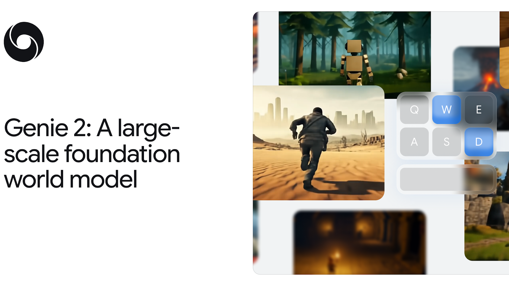
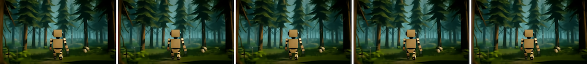
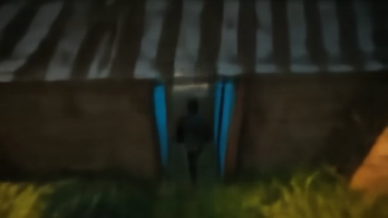

# W5. Genie 2: A large-scale foundation world model

## 0. 읽기 전 약어 및 핵심 용어

이 문서를 읽기 전에 아래 약어와 용어를 먼저 정리한다. 이후 본문에서는 괄호 안의 약어를 사용한다.

- Artificial Intelligence (AI): 사람의 지각, 추론, 학습, 의사결정 능력을 기계가 수행하도록 만드는 인공지능 분야를 뜻한다.
- Reinforcement Learning (RL): agent가 reward를 최대화하도록 environment와 상호작용하며 policy를 학습하는 방법이다.
- IRIS world model baseline (IRIS): discrete latent representation과 transformer를 이용하는 world model/RL baseline으로 쓰이는 모델명이다.
- A Generative World Model for Autonomous Driving (GAIA-1): video, text, action condition을 이용해 driving scene의 미래를 생성하는 Wayve의 world model이다.
- Physical Artificial Intelligence (Physical AI): 디지털 공간의 예측을 넘어 물리 세계에서 지각, 예측, 계획, 행동, 안전 검사를 수행하는 AI 시스템을 뜻한다.

## 1. Metadata

| Field | 내용 |
|---|---|
| ID | `W5` |
| Title | Genie 2: A large-scale foundation world model |
| Authors | Jack Parker-Holder, Philip Ball, Jake Bruce, Vibhavari Dasagi, Kristian Holsheimer, Christos Kaplanis, Alexandre Moufarek, Guy Scully, Jeremy Shar, Jimmy Shi, Stephen Spencer, Jessica Yung, Michael Dennis, Sultan Kenjeyev, Shangbang Long, Vlad Mnih, Harris Chan, Maxime Gazeau, Bonnie Li, Fabio Pardo, Luyu Wang, Lei Zhang, Frederic Besse, Tim Harley, Anna Mitenkova, Jane Wang, Jeff Clune, Demis Hassabis, Raia Hadsell, Adrian Bolton, Satinder Singh, Tim Rocktaschel |
| Affiliation / Team | Google DeepMind |
| Venue / Status | Technical blog / research demo |
| Date | 2024-12-04 |
| Link | https://deepmind.google/discover/blog/genie-2-a-large-scale-foundation-world-model/ |
| Local text | `paper_corpus/texts/W5.html.txt` |
| Source media | `paper_corpus/figures_source/W5/manifest.md` |

## 2. 핵심 요약

Genie 2는 single prompt image에서 action-controllable, playable 3D environment를 생성하는 Google DeepMind의 foundation world model이다. 사용자는 keyboard와 mouse action을 넣고, 모델은 매 step마다 다음 observation을 생성한다. 즉, "비디오를 보는 모델"이 아니라 "agent가 들어가서 행동할 수 있는 세계를 생성하는 모델"에 가깝다.

Genie 1이 2D platformer 중심의 generative interactive environment를 보여줬다면, Genie 2는 rich 3D world, long-horizon consistency, object interaction, character animation, lighting, reflection, gravity, water/smoke effects, NPC behavior까지 포괄하는 방향으로 확장된다. 논문 형식의 세부 학습 objective나 정량 benchmark는 공개되어 있지 않지만, Physical AI 관점에서는 "world model이 embodied agent의 training/evaluation environment 자체가 될 수 있다"는 전환점으로 읽는 것이 중요하다.

## 3. 왜 중요한가?

- Embodied agent 학습의 병목인 "충분히 다양하고 안전한 environment 부족"을 generative world model로 풀겠다는 방향을 선명하게 보여준다.
- Single image prompt에서 3D playable environment를 만들기 때문에, text-to-image model, video model, agent training이 하나의 loop로 연결된다.
- Same initial frame에서 action sequence만 바꿔 counterfactual trajectory를 만들 수 있어 offline RL, model-based planning, policy evaluation의 synthetic rollout 도구가 될 수 있다.
- SIMA agent가 Genie 2 world 안에서 natural-language instruction을 수행하는 예시는 "agent policy + learned simulator" 조합의 가능성을 보여준다.
- 단순히 realistic video를 만드는 것이 아니라 action controllability, memory, object affordance, physical effect가 world model의 핵심 평가 축이 되어야 함을 드러낸다.

## 4. From Genie 1 to Genie 2

  

<em>Figure 1. Genie 2 official hero image. Genie 2 is presented as a large-scale foundation world model for action-controllable 3D environments. Source: Google DeepMind official blog.</em>

Genie 1의 핵심 질문은 "action label 없이도 video-only data에서 controllable world model을 만들 수 있는가?"였다. Genie 2는 여기서 한 걸음 더 나아가 "prompt image 하나로 3D interactive world를 만들고, human 또는 AI agent가 keyboard/mouse로 그 세계를 조작할 수 있는가?"를 보여준다.

| 구분 | Genie 1 | Genie 2 |
|---|---|---|
| 주요 환경 | 2D platformer 중심 | rich 3D environments |
| 입력 | image/sketch/generated image | single prompt image, often generated by Imagen 3 |
| 제어 | learned latent action | keyboard/mouse actions |
| 핵심 메시지 | video-only data에서 controllability 학습 | generated world를 agent training/evaluation environment로 사용 |
| 공개 형태 | ICML paper / arXiv | official research blog/demo |

이 차이는 world model 연구의 관심이 "latent dynamics를 잘 예측하는가"에서 "agent가 들어가서 쓸 만큼 세계가 일관되고 조작 가능한가"로 이동하고 있음을 보여준다.

## 5. Action-Controllable World Generation

  

<em>Figure 2. Action-control examples. Genie 2 identifies the controllable character and responds to keyboard/mouse inputs rather than moving irrelevant background objects. Source media: <code>W5_action_controls.mp4</code>.</em>

공식 설명에 따르면 Genie 2는 각 step에서 human 또는 AI agent의 keyboard/mouse action을 받고 다음 observation을 simulate한다. 예를 들어 arrow key가 들어왔을 때 나무나 구름이 아니라 controllable character가 움직여야 한다. 이것은 video generation 문제가 아니라 action-conditioned dynamics modeling 문제다.

스터디 관점에서는 다음의 개념식으로 구조를 이해할 수 있다. 이 식은 공식 블로그에 제시된 수식이 아니라, blog의 autoregressive latent diffusion 설명을 정리한 study formulation이다.

$$
\mathbf{z}_{1:T}=\mathrm{Enc}(\mathbf{x}_{1:T})
$$

| Notation | 의미 |
|---|---|
| $\mathbf{x}_{1:T}$ | time $1$부터 $T$까지의 video observations |
| $\mathbf{z}_{1:T}$ | autoencoder가 만든 latent frames |
| $\mathrm{Enc}$ | video autoencoder encoder |
| $T$ | sequence length |

관측 frame을 latent frame으로 압축한 뒤, dynamics model은 과거 latent frame과 action history를 조건으로 다음 latent frame을 생성한다.

$$
\mathbf{z}_{t+1}\sim p_{\theta}(\mathbf{z}_{t+1}\mid \mathbf{z}_{\leq t},\mathbf{a}_{\leq t})
$$

| Notation | 의미 |
|---|---|
| $\mathbf{z}_{t+1}$ | 생성해야 하는 next latent frame |
| $\mathbf{z}_{\leq t}$ | 현재까지의 latent frame history |
| $\mathbf{a}_{\leq t}$ | 현재까지의 keyboard/mouse action history |
| $p_{\theta}$ | autoregressive latent diffusion dynamics model |
| $\theta$ | model parameters |

마지막으로 latent frame은 다시 image observation으로 복원된다.

$$
\hat{\mathbf{x}}_{t+1}=\mathrm{Dec}(\mathbf{z}_{t+1})
$$

| Notation | 의미 |
|---|---|
| $\hat{\mathbf{x}}_{t+1}$ | generated next observation |
| $\mathrm{Dec}$ | autoencoder decoder |
| $\mathbf{z}_{t+1}$ | sampled latent frame |

## 6. Counterfactual Trajectories

  

<em>Figure 3. Counterfactual trajectories. The same starting frame can lead to different generated futures depending on the human action sequence. Source media: <code>W5_counterfactuals.mp4</code>.</em>

Counterfactual generation은 world model을 agent 연구에 연결하는 중요한 지점이다. 같은 initial state에서 action만 다르게 넣어 여러 rollout을 만들 수 있으면, agent는 실제 환경을 반복적으로 실행하지 않고도 "다른 행동을 했으면 어떤 일이 일어났을까?"를 학습할 수 있다.

Physical AI에서 이것은 다음 연구 질문으로 이어진다.

| 질문 | 의미 |
|---|---|
| 같은 시작 상태에서 action intervention을 얼마나 안정적으로 반영하는가? | controllability 평가 |
| 카메라 밖으로 사라진 객체를 다시 볼 때 일관되게 복원하는가? | spatial memory 평가 |
| action이 장기적으로 world state에 누적되는가? | long-horizon dynamics 평가 |
| 시각적으로 그럴듯하지만 물리적으로 틀린 rollout을 어떻게 감지하는가? | simulator reliability 평가 |

## 7. Emergent Capabilities

공식 블로그는 Genie 2가 scale을 통해 다양한 emergent capability를 보인다고 설명한다. 여기서 중요한 것은 능력 자체보다, world model 평가 기준이 점점 "시각 품질"에서 "agent가 사용할 수 있는 world consistency"로 바뀐다는 점이다.

| Capability | 공식 예시 | Physical AI 관점의 의미 |
|---|---|---|
| Long horizon memory | 안 보이던 world part를 다시 볼 때 rendering | partial observability와 map-like memory |
| Object affordances | door opening, bursting balloons, explosive barrels | object-action consequence modeling |
| Physics | water, smoke, gravity | physical effect approximation |
| Lighting/reflection | point/directional lighting, bloom, colored lighting | view-consistent rendering |
| Character animation | 다양한 avatar motion | embodiment-specific kinematics |
| NPC behavior | other agents and interactions | multi-agent world modeling |
| Real image prompts | grass, river from real-world photos | out-of-distribution prompt grounding |

## 8. SIMA Agent Inside Genie 2

  

<em>Figure 4. SIMA inside Genie 2. A SIMA agent follows a natural-language instruction while Genie 2 generates the game frames. Source media: <code>W5_sima_blue_door.mp4</code>.</em>

Genie 2의 가장 중요한 데모 중 하나는 SIMA agent가 Genie 2가 만든 unseen environment 안에서 instruction을 수행하는 것이다. 예시는 "Open the blue door", "Open the red door", "Turn around", "Go behind the house", "Go up the stairs", "Go where the plants are", "Go to the middle door"처럼 natural-language instruction과 keyboard/mouse control이 결합된 형태다.

이 데모는 다음 loop를 보여준다.

| 단계 | 역할 |
|---|---|
| Prompt image generation | Imagen 3 등으로 새로운 environment seed 생성 |
| World simulation | Genie 2가 action-conditioned observations 생성 |
| Agent control | SIMA가 language instruction에 따라 keyboard/mouse action 선택 |
| Evaluation | unseen generated world에서 instruction following 능력 평가 |

즉, world model은 단순한 background simulator가 아니라 agent capability를 훈련하고 평가하는 "curriculum generator"가 된다.

## 9. Architecture Reading

공식 블로그의 architecture 설명은 간결하다.

| Component | 설명 |
|---|---|
| Autoencoder | video를 latent frames로 압축 |
| Large transformer dynamics model | latent frame sequence를 causal mask로 처리 |
| Autoregressive sampling | past latent frames와 individual actions를 사용해 frame-by-frame generation |
| Latent diffusion | next latent frame을 diffusion 방식으로 생성 |
| Classifier-free guidance | action controllability 향상 |
| Distillation | real-time playable version을 만들 수 있지만 output quality가 낮아짐 |

이 구조는 video foundation model과 model-based RL world model 사이의 중간 지대에 있다. Dreamer 계열은 compact latent state에서 reward/value/policy learning을 강조하고, Genie 2는 high-dimensional visual world 자체를 interactive하게 생성하는 쪽에 가깝다.

## 10. 한계와 주의점

Genie 2는 강력한 방향성을 보여주지만, blog/demo 형태이기 때문에 연구적으로는 조심해서 읽어야 한다.

| 항목 | 주의점 |
|---|---|
| 정량 benchmark | 공개 논문 수준의 detailed benchmark가 부족하다. |
| reproducibility | model, dataset, training recipe가 공개되어 있지 않다. |
| physical fidelity | visual plausibility가 real-world physics correctness를 보장하지 않는다. |
| long-horizon consistency | up to a minute consistency를 보이나, 대부분 예시는 10-20초 수준이다. |
| robotics transfer | game-like keyboard/mouse action과 real robot continuous control 사이에는 gap이 있다. |
| evaluation bias | selected demos는 실패 case의 전체 분포를 보여주지 않는다. |

스터디에서는 Genie 2를 "완성된 simulator"로 보기보다, physical AI에서 world model이 어떤 역할을 맡게 될지 보여주는 frontier demo로 읽는 것이 안전하다.

## 11. 발표 구성 제안

1. Genie 1에서 Genie 2로 넘어오며 무엇이 달라졌는지 설명한다.
2. Action-controllable 3D world generation이 video generation과 왜 다른지 Figure 2로 보여준다.
3. Counterfactual trajectory가 agent training/evaluation에 왜 중요한지 Figure 3으로 연결한다.
4. SIMA demo를 통해 "agent inside learned world"라는 핵심 개념을 설명한다.
5. Architecture는 autoencoder, causal transformer dynamics, autoregressive latent diffusion, classifier-free guidance 순서로 간단히 정리한다.
6. 마지막에는 reproducibility와 physical fidelity 한계를 짚고, 후속 논문인 Pandora, IRIS, GAIA-1, DreamGen과 연결한다.

## 12. 토론 질문

- Genie 2 같은 world model이 실제 robot policy 학습에 쓰이려면 어떤 action/state interface가 필요할까?
- Visual plausibility와 physical correctness를 구분해서 평가하려면 어떤 benchmark가 필요할까?
- Generated environment에서 훈련한 agent가 real-world environment로 transfer되려면 무엇을 보정해야 할까?
- World model이 curriculum generator가 될 때, environment diversity와 task controllability 사이의 trade-off는 어떻게 관리해야 할까?

## 13. 한 줄 정리

Genie 2는 "비디오 생성 모델"이 아니라 "agent가 행동하며 학습하고 평가될 수 있는 3D interactive world를 생성하는 foundation world model"이라는 방향을 대규모 데모로 보여준다.
