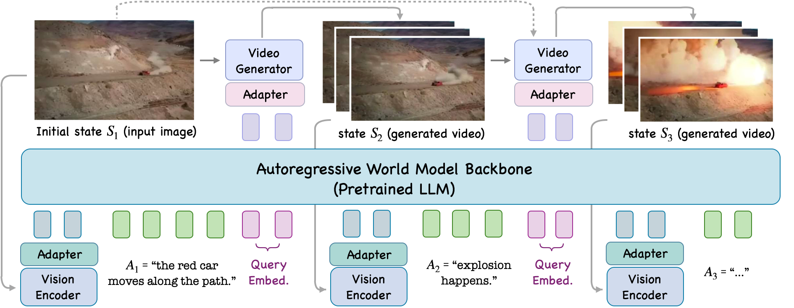
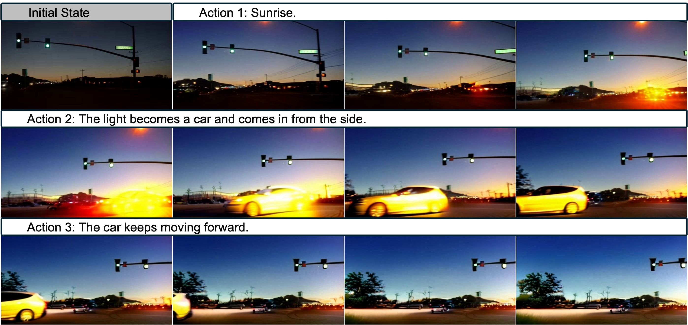
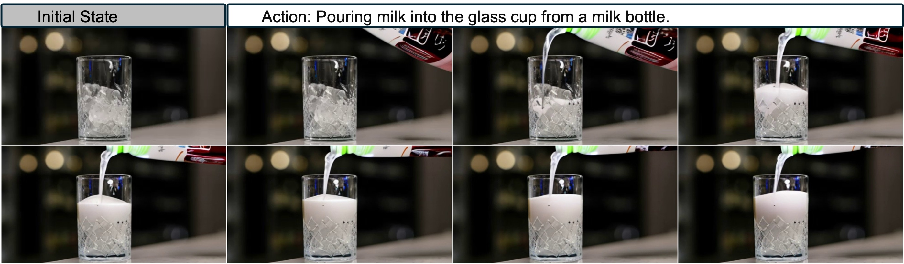
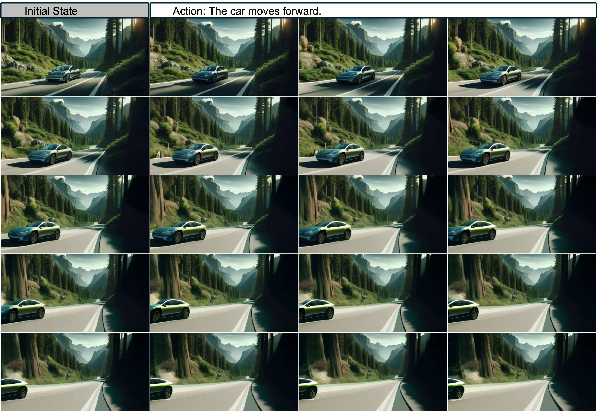

# W6. Pandora: Towards General World Model with Natural Language Actions and Video States

## 0. 읽기 전 약어 및 핵심 용어

이 문서를 읽기 전에 아래 약어와 용어를 먼저 정리한다. 이후 본문에서는 괄호 안의 약어를 사용한다.

- Large Language Model (LLM): 대규모 텍스트 데이터로 학습되어 언어 이해, 생성, 추론, 계획에 쓰이는 foundation model이다.
- Habitat-Matterport 3D dataset (HM3D): embodied navigation과 3D scene understanding에 쓰이는 실내 3D environment dataset이다.
- Matterport3D (MP3D): 실내 3D scene reconstruction과 embodied AI benchmark에 쓰이는 Matterport3D dataset이다.
- Car Learning to Act simulator (CARLA): autonomous driving 연구에 쓰이는 open-source urban driving simulator이다.
- Mohamed bin Zayed University of Artificial Intelligence (MBZUAI): 아랍에미리트의 인공지능 전문 대학원대학교다.

## 1. Metadata

| Field | 내용 |
|---|---|
| ID | `W6` |
| Title | Pandora: Towards General World Model with Natural Language Actions and Video States |
| Authors | Jiannan Xiang, Guangyi Liu, Yi Gu, Qiyue Gao, Yuting Ning, Yuheng Zha, Zeyu Feng, Tianhua Tao, Shibo Hao, Yemin Shi, Zhengzhong Liu, Eric P. Xing, Zhiting Hu |
| Affiliation / Team | Maitrix.org, UC San Diego, MBZUAI |
| Venue / Status | arXiv |
| Date | 2024-06-12 |
| Link | https://arxiv.org/abs/2406.09455 |
| Project page | https://world-model.ai |
| Local source | `paper_corpus/sources/W6` |
| Source figures | `paper_corpus/figures_source/W6/manifest.md` |

## 2. 핵심 요약

Pandora는 자연어 action과 video state를 입력/출력으로 사용하는 general world model을 목표로 한다. 이전 video generation model은 처음 prompt를 넣고 video를 생성하는 데 강했지만, 생성 중간에 사용자가 arbitrary text action을 넣어 future state를 조작하기 어렵다. Pandora는 이 문제를 autoregressive backbone과 diffusion video generator를 결합해 해결하려 한다.

핵심 아이디어는 pretrained LLM과 pretrained video model을 처음부터 다시 학습하지 않고, 두 모델 사이를 adapter와 query embedding으로 연결한 뒤 staged training을 수행하는 것이다. LLM은 action text와 state history를 순차적으로 처리하고, video generator는 그 representation을 받아 다음 video clip을 생성한다. 결과적으로 Pandora는 indoor/outdoor, human/robot, 2D/3D game, driving, physical phenomenon 등 다양한 domain에서 자연어 action 기반 on-the-fly control을 보여준다.

## 3. 왜 중요한가?

- World model의 action space를 fixed discrete action이나 robot-specific command가 아니라 free-form natural language로 확장한다.
- LLM의 sequential reasoning 구조와 diffusion video model의 visual generation 능력을 연결해 "language-conditioned simulator" 방향을 제시한다.
- Genie가 latent/user action 기반 interactive environment를 강조했다면, Pandora는 action interface를 자연어로 바꿔 generality를 키운다.
- Robot, driving, indoor navigation, game, human activity 데이터를 한 instruction-tuning mixture에 넣어 cross-domain action controllability transfer를 관찰한다.
- 정량 benchmark는 부족하지만, "general world model을 어떻게 cheaply bootstrap할 것인가"라는 engineering recipe가 분명하다.

## 4. Problem Setting

  

<em>Figure 1. Pandora examples. The model simulates future video states under natural-language action control across driving, human activity, and game-like domains. Source figure: <code>figures/figure1_v8.pdf</code>.</em>

Pandora가 풀고 싶은 문제는 다음과 같다. 현재 state가 image 또는 video clip으로 주어지고, action은 자연어 문장으로 주어진다. 모델은 그 action이 적용된 다음 world state를 video clip으로 생성해야 한다.

$$
P(S_t\mid S_{t-1},A_{t-1},\ldots,S_1,A_1)
$$

| Notation | 의미 |
|---|---|
| $S_t$ | time step $t$의 world state, 즉 image 또는 video clip |
| $A_t$ | time step $t$의 natural-language action |
| $P(S_t\mid\cdot)$ | state-action history가 주어졌을 때 next state를 생성하는 transition distribution |
| $t$ | autoregressive world-simulation step |

논문은 각 state와 action을 다음처럼 둔다.

$$
S_i=(s_1,\ldots,s_N)
$$

$$
A_i=(x_1,\ldots,x_M)
$$

| Notation | 의미 |
|---|---|
| $s_j$ | state $S_i$를 구성하는 frame |
| $N$ | state clip 안의 frame 수 |
| $x_j$ | action sentence를 구성하는 text token |
| $M$ | action token sequence length |

첫 state $S_1$은 single image이고, 이후 $S_2,\ldots,S_N$은 video clip이다. 따라서 Pandora는 image-to-video generation을 반복해 long-horizon video state sequence를 만든다.

## 5. Architecture

  

<em>Figure 2. Pandora model architecture. A pretrained multimodal LLM processes previous video state, action text, and query embeddings; a Q-Former adapter maps the LLM output to a pretrained video generator. Source figure: <code>figures/architecture_v2.pdf</code>.</em>

Pandora의 구성은 크게 네 부분이다.

| Component | 논문에서의 역할 |
|---|---|
| Vision encoder | previous state $S_{t-1}$를 visual embedding으로 변환 |
| Autoregressive backbone | Chat-UniVi / Vicuna-7B-v1.5 기반 LLM이 visual embedding, action token, query embedding을 순차 처리 |
| Adapter / Q-Former | LLM output embedding을 video generator가 이해할 수 있는 embedding으로 변환 |
| Video generator | DynamiCrafter 기반 diffusion model이 다음 video clip $S_t$ 생성 |

각 time step에서 LLM backbone은 세 종류의 embedding을 받는다.

| 입력 embedding | 의미 |
|---|---|
| Visual embedding | vision encoder와 Q-Former가 previous world state를 encoding |
| Text token embedding | natural-language action $A_{t-1}$ |
| Query embedding | video generation을 유도하는 learnable embedding |

Video generator는 consistency를 높이기 위해 이전 clip의 마지막 4 frames도 함께 입력받는다. 첫 step에서는 $S_1$이 single image이므로 그 image를 사용한다. 논문 구현에서는 DynamiCrafter가 한 번에 16 frames를 생성한다.

## 6. Staged Training

Pandora의 training recipe는 LLM 학습의 pretraining/instruction tuning 구조를 world model에 가져온 것이다.

| Stage | 목적 | 학습 대상 |
|---|---|---|
| Pretraining / alignment | LLM output embedding과 video generator text embedding의 representation space 연결 | adapter와 query embeddings 중심 |
| Instruction tuning | natural-language action을 따르는 real-time controllability 학습 | video generator와 query embeddings finetuning |

Pretraining에서는 WebVid-10M의 video-caption pair를 사용한다. 첫 frame과 caption을 LLM+vision encoder에 넣어 LLM output embedding을 얻고, 같은 caption을 video generator의 text encoder에 넣어 caption embedding을 얻는다. 두 embedding을 가깝게 만드는 L2 loss로 adapter를 학습한다.

$$
\mathcal{L}_{\mathrm{align}}
=\left\|\mathbf{h}_{\mathrm{LLM}}-\mathbf{h}_{\mathrm{video}}\right\|_2^2
$$

| Notation | 의미 |
|---|---|
| $\mathcal{L}_{\mathrm{align}}$ | LLM-video representation alignment loss |
| $\mathbf{h}_{\mathrm{LLM}}$ | image와 caption을 받은 LLM backbone의 output embedding |
| $\mathbf{h}_{\mathrm{video}}$ | video generator text encoder가 만든 caption embedding |
| $\|\cdot\|_2^2$ | squared L2 distance |

Instruction tuning에서는 dynamics를 잘 설명하는 action caption이 붙은 video dataset으로 diffusion loss를 최소화한다. 이 단계에서 중요한 것은 caption이 단순한 scene description이 아니라 "무슨 변화가 일어나는지"를 설명해야 한다는 점이다.

## 7. Instruction-Tuning Data

Pandora는 1.2M video 규모의 instruction tuning data를 사용한다.

| Dataset | Category | #Videos |
|---|---:|---:|
| Panda-70M | YouTube | 500k |
| Something-Something | Human Activity | 188k |
| BridgeData V2 | Robot Arm | 33k |
| HM3D | Indoor | 152k |
| MP3D | Indoor | 70k |
| StreetLearn | Street view | 146k |
| CARLA | Driving | 75k |
| Coinrun | 2D Game | 30k |
| EPIC-KITCHENS | Kitchen | 39k |
| Total | - | 1.2M |

Public video data는 aesthetic score, optical flow magnitude, cut detection, static video detection, clip length filtering을 거친다. 이후 GPT-4 Turbo로 4개 frame을 보고 dynamics 중심 caption을 재작성한다. Simulation data는 CARLA, MP3D, StreetLearn, HM3D, Coinrun을 사용해 더 정확한 action-state pair를 만든다.

## 8. On-The-Fly Control across Domains

  

<em>Figure 3. Indoor/outdoor and cinematic examples. Pandora generates videos in broad domains rather than a single simulator. Source figure: <code>exp_figures/multi_lightcar.jpeg</code>.</em>

  

<em>Figure 4. Robotics example. Pandora includes robot-arm domains through BridgeData V2 and related action-state data. Source figure: <code>exp_figures/multi_arm.jpeg</code>.</em>

Pandora의 qualitative result는 domain breadth를 강조한다. Indoor/outdoor, natural/urban, robot/human, 2D/3D games, driving scenario가 모두 하나의 model interface로 다뤄진다. 특히 world model 관점에서 중요한 것은 text action이 video generation 중간에 들어갈 수 있다는 점이다. 기존 text-to-video model의 prompt는 대부분 시작점에만 들어가지만, Pandora는 각 simulation step마다 action을 넣을 수 있다.

## 9. Physical Phenomena and Transfer

  

<em>Figure 5. Physical phenomenon example. The paper shows qualitative examples such as liquid flow and viscous liquid flow. Source figure: <code>exp_figures/physics_milk.jpeg</code>.</em>

  

<em>Figure 6. Action-controllability transfer. Pandora transfers indoor simulator action ability to unseen domains. Source figure: <code>exp_figures/transfer_room.jpeg</code>.</em>

논문은 wind, liquid flow, viscous liquid flow 같은 common physical phenomena를 qualitative example로 보여준다. 다만 이것은 "물리 법칙을 정확히 학습했다"는 증명이라기보다, video distribution 안에서 physical-looking dynamics를 생성할 수 있다는 evidence에 가깝다.

더 흥미로운 결과는 action controllability transfer다. Coinrun에서 학습한 2D game control이 unseen 2D game에 적용되고, HM3D에서 학습한 3D indoor simulator control이 magic scene이나 colorful nature scene에 적용된다. 이는 action text가 domain-specific label이 아니라 transferable control abstraction으로 작동할 가능성을 보여준다.

## 10. Longer Video Generation

  

<em>Figure 7. Longer autoregressive video generation. Pandora is trained on up to 5-second clips but demonstrates 8-second generation by autoregressive extension. Source figure: <code>exp_figures/long_car.jpeg</code>.</em>

Diffusion video model은 보통 fixed-length clip 생성에 강하지만, 긴 interactive rollout에는 약하다. Pandora는 LLM-style autoregressive backbone을 통해 state-action-state sequence를 이어 붙인다. 논문은 최대 5초, 40-frame video로 학습했지만 8초, 64-frame video 생성 예시를 보여준다.

이 지점은 Dreamer/Genie 계열과 연결된다. Agent training에 world model을 쓰려면 single clip quality보다 long-horizon rollout stability가 중요하다. Pandora는 이를 autoregressive state transition으로 풀지만, error accumulation과 consistency drift 문제는 여전히 남아 있다.

## 11. Limitations

  

<em>Figure 8. Failure cases. The paper reports failures in consistency, complex scenario simulation, commonsense/physical-law understanding, and instruction following. Source figure: <code>exp_figures/failure_train.jpeg</code>.</em>

Pandora의 한계는 논문도 직접 인정한다.

| 한계 | 설명 |
|---|---|
| Quantitative evaluation 부족 | 대부분 qualitative examples이며, benchmark score가 충분하지 않다. |
| Data caption noise | public video의 GPT-4 Turbo re-captioning이 noisy하면 controllability가 떨어진다. |
| Physical correctness 불명확 | wind/liquid 예시는 있지만 정밀 물리 검증은 아니다. |
| Long-horizon drift | autoregressive extension은 error accumulation에 취약하다. |
| Model dependence | Vicuna-7B와 DynamiCrafter 품질에 크게 의존한다. |
| Real robot interface gap | natural-language action과 continuous robot control 사이의 grounding 문제가 남아 있다. |

논문은 scaling compute를 늘리면 "the woman turns her head left" 같은 action-following 품질이 좋아지는 예시를 제시한다. 이는 data quality와 scale이 controllability에 직접 영향을 준다는 신호로 읽을 수 있다.

## 12. Genie 2와 비교해서 읽기

| 관점 | Genie 2 | Pandora |
|---|---|---|
| Action interface | keyboard/mouse action | natural-language action |
| 공개 형태 | official demo/blog | arXiv paper |
| World state | playable 3D generated environment | video clip state |
| Architecture 공개 | high-level description | LLM + diffusion video model + Q-Former adapters |
| 강점 | interactive 3D demo, agent-in-world evaluation | reusable pretrained models, arbitrary text action |
| 약점 | reproducibility 부족 | qualitative evaluation 중심 |

둘을 함께 읽으면, world model 연구가 두 축으로 가고 있음을 볼 수 있다. 하나는 agent가 직접 조작할 수 있는 playable environment이고, 다른 하나는 language-level action으로 future video state를 시뮬레이션하는 general simulator다.

## 13. 발표 구성 제안

1. 기존 LLM과 video model이 왜 general world model로 부족한지 문제 제기한다.
2. Figure 1로 natural-language action + video state라는 interface를 설명한다.
3. Figure 2로 LLM backbone, vision encoder, Q-Former, video generator의 연결 구조를 설명한다.
4. State transition distribution 수식으로 Pandora가 autoregressive world model임을 정리한다.
5. 1.2M instruction tuning data table을 통해 controllability가 어디서 오는지 설명한다.
6. Robotics, physics, transfer, long video figure를 차례로 보여주며 qualitative capability를 소개한다.
7. 마지막에는 benchmark 부족, caption noise, physical correctness 한계를 Genie 2와 비교해 토론한다.

## 14. 토론 질문

- Natural-language action은 robot policy 학습에서 충분히 grounded한 action interface가 될 수 있을까?
- Video state를 생성하는 world model과 latent state를 학습하는 Dreamer-style world model은 어떤 목적에서 달라지는가?
- Pandora의 qualitative physical phenomena를 quantitative benchmark로 바꾸려면 어떤 task가 필요할까?
- Pretrained LLM과 pretrained video model을 stitching하는 방식은 general world model의 지속 가능한 recipe일까?

## 15. 한 줄 정리

Pandora는 pretrained LLM과 pretrained video diffusion model을 연결해, 자연어 action으로 video state를 실시간 조작하는 general world model의 초기 형태를 제시한 연구다.