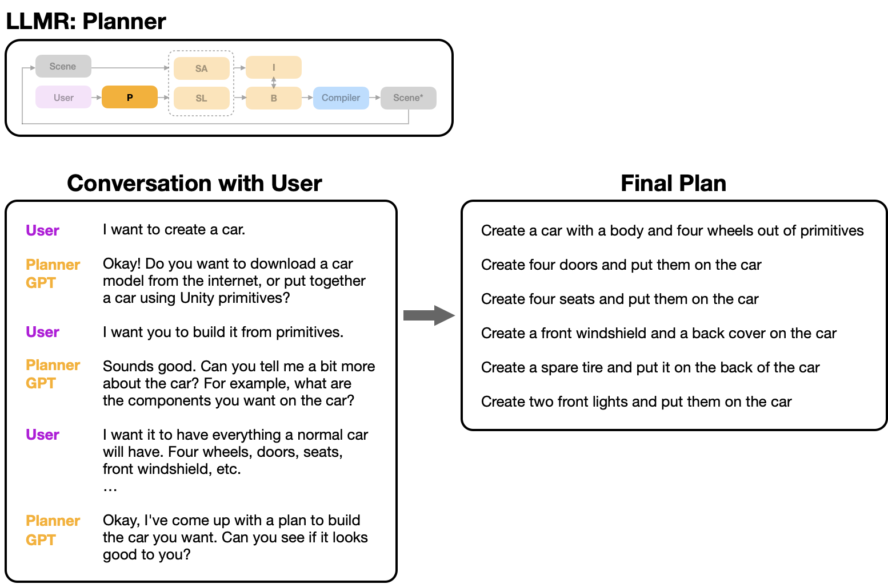
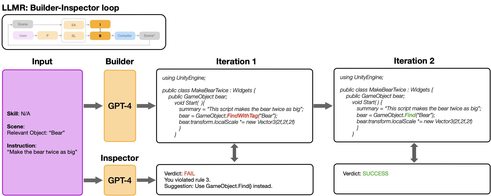
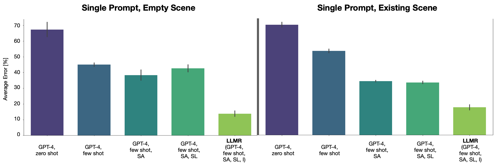
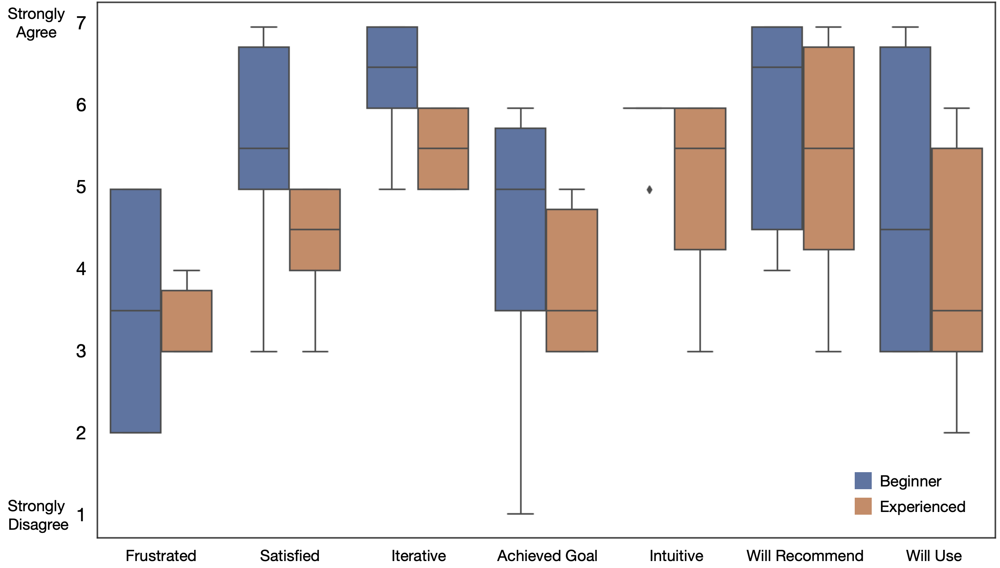

# W7. LLMR: Real-time Prompting of Interactive Worlds using Large Language Models

## 0. 읽기 전 약어 및 핵심 용어

이 문서를 읽기 전에 아래 약어와 용어를 먼저 정리한다. 이후 본문에서는 괄호 안의 약어를 사용한다.

- Artificial Intelligence (AI): 사람의 지각, 추론, 학습, 의사결정 능력을 기계가 수행하도록 만드는 인공지능 분야를 뜻한다.
- Application Programming Interface (API): 소프트웨어 모듈이나 robot primitive를 외부에서 호출하기 위한 함수/규약 interface이다.
- JavaScript Object Notation (JSON): 구조화된 데이터를 key-value 형태로 표현하는 lightweight data format이다.
- Virtual Reality (VR): 사용자가 가상 환경 안에 들어간 것처럼 상호작용하는 immersive interface 기술이다.
- Mixed Reality Toolkit (MRTK): mixed reality application 개발을 돕는 Microsoft 기반 toolkit이다.
- Large Language Model (LLM): 대규모 텍스트 데이터로 학습되어 언어 이해, 생성, 추론, 계획에 쓰이는 foundation model이다.
- Digital Object Identifier (DOI): 논문이나 dataset 같은 digital object를 영구적으로 식별하기 위한 identifier이다.
- Large Language Model for Mixed Reality (LLMR): large language model로 interactive mixed-reality world를 실시간 생성하고 수정하는 system이다.
- Physical Artificial Intelligence (Physical AI): 디지털 공간의 예측을 넘어 물리 세계에서 지각, 예측, 계획, 행동, 안전 검사를 수행하는 AI 시스템을 뜻한다.

## 1. Metadata

| Field | 내용 |
|---|---|
| ID | `W7` |
| Title | LLMR: Real-time Prompting of Interactive Worlds using Large Language Models |
| Authors | Fernanda De La Torre, Cathy Mengying Fang, Han Huang, Andrzej Banburski-Fahey, Judith Amores Fernandez, Jaron Lanier |
| Affiliation / Team | Massachusetts Institute of Technology, MIT Media Lab, Rensselaer Polytechnic Institute, Microsoft |
| Venue / Status | CHI 2024 / arXiv |
| Date | 2023-09-21 arXiv, 2024 CHI |
| Link | https://arxiv.org/abs/2309.12276 |
| DOI | https://doi.org/10.1145/3613904.3642579 |
| Local source | `paper_corpus/sources/W7` |
| Source figures | `paper_corpus/figures_source/W7/manifest.md` |

## 2. 핵심 요약

LLMR은 LLM을 사용해 Unity 기반 mixed reality scene을 실시간으로 생성하고 수정하는 framework다. Genie나 Pandora처럼 future video state를 직접 생성하는 world model은 아니지만, interactive world를 자연어로 만들고 편집하고 기능을 부여한다는 점에서 world model 연구의 user-facing interface와 tooling 측면을 잘 보여준다.

핵심은 하나의 GPT-4 call로 Unity code를 생성하는 것이 아니라, Planner, Scene Analyzer, Skill Library, Builder, Inspector 같은 specialized GPT modules를 orchestration하는 것이다. 이 구조는 user prompt를 scene-aware plan으로 바꾸고, Unity C# code를 생성하고, compilation/runtime error를 사전에 검사한 뒤, Unity engine에서 실행한다. 논문은 LLMR이 standard GPT-4 대비 average error rate를 4배 낮추고, 150개 prompt 기반 numerical study와 11명 user study에서 실시간 interactive world authoring 가능성을 보여준다고 보고한다.

## 3. 왜 중요한가?

- World model 스터디에서 "세계를 생성한다"는 개념을 video/pixel generation뿐 아니라 editable, executable 3D scene generation으로 확장한다.
- LLM이 physical/spatial world를 다루기 위해 scene hierarchy, object properties, tool affordance 같은 structured context가 필요하다는 점을 잘 보여준다.
- Builder-Inspector loop는 generated world가 실제 실행 가능한지 확인하는 self-debugging pattern으로, agentic tool-use 연구와도 연결된다.
- Mixed reality와 Unity를 기반으로 하므로, generated environment를 human-in-the-loop prototyping, training, accessibility, remote assistance에 연결할 수 있다.
- Physical AI 관점에서는 "learned simulator"보다 "interactive environment authoring tool"에 가깝지만, embodied agent evaluation environment를 빠르게 만드는 도구로 읽을 수 있다.

## 4. Use Cases

  

<em>Figure 1. LLMR use cases. The framework supports scene creation, multimodal object prompting, external asset loading, scene editing, instructional guide generation, and cross-platform/sensor integration. Source figure: <code>Figures/Final/teaser.png</code>.</em>

LLMR의 예시는 kitchen scene 생성, 손으로 그리거나 지시한 object 생성, Sketchfab asset loading, VR scene 색상 변경, scene에 대한 question answering, sensor data integration 등이다. 이 논문에서 "world"는 latent dynamics model이 아니라 Unity에서 실행되는 object, script, behavior, interaction의 집합이다.

| 기능 | 의미 |
|---|---|
| Scene creation | Unity primitive나 external asset으로 3D scene 생성 |
| Scene modification | 기존 scene의 object, color, size, behavior 수정 |
| Interactive tools | color changer, animation, grabbable object 같은 기능 script 생성 |
| Scene Q&A | 현재 scene hierarchy와 object 정보를 요약하고 질문에 답변 |
| Cross-platform support | mixed reality device나 external sensor와 연동 가능 |

## 5. LLMR Architecture

  

<em>Figure 2. LLMR architecture. A user prompt and current 3D scene are processed by Planner and Scene Analyzer, combined with Skill Library knowledge, passed to Builder, checked by Inspector, and executed in Unity. Source figure: <code>Figures/Final/llmr_overview.png</code>.</em>

LLMR은 specialized GPT ensemble이다.

| Module | 역할 |
|---|---|
| Planner | 큰 user request를 작은 subtasks로 분해 |
| Scene Analyzer | 현재 Unity scene hierarchy와 object properties를 요약 |
| Skill Library | 필요한 API, external plugin, reusable skill을 선택 |
| Builder | Unity C# code를 생성해 scene/object/tool을 구현 |
| Inspector | generated code의 compilation/runtime error 가능성을 사전 점검 |
| Compiler / Unity Engine | Roslyn compiler로 code를 compile하고 Unity scene에서 실행 |

논문은 interactive 3D scene generation을 code sampling 문제로 형식화한다.

$$
x\sim\mathcal{P}(x\mid u,\Omega)
$$

| Notation | 의미 |
|---|---|
| $x$ | Unity에서 실행할 syntactically valid code snippet |
| $u$ | user request 또는 prompt |
| $\Omega$ | 현재 3D world / scene 상태 |
| $\mathcal{P}$ | request를 만족하는 code distribution |

즉, LLMR은 pixel/video를 직접 예측하는 대신, engine에서 실행 가능한 code를 생성해 world를 바꾼다. 이 점이 Genie/Pandora와 가장 큰 차이다.

## 6. Planner

  

<em>Figure 3. Planner module. The Planner decomposes a high-level request into scoped subtasks before the Builder generates code for each step. Source figure: <code>Figures/Final/planner.png</code>.</em>

LLMR은 "Create a city and all its denizens"처럼 큰 prompt를 한 번에 code로 만들면 실패가 많다고 본다. Planner는 user와 대화해 request의 scope와 granularity를 정하고, 작은 sub-prompts로 나눈다.

$$
P:u\mapsto(u_1,u_2,\ldots,u_N)
$$

| Notation | 의미 |
|---|---|
| $P$ | Planner module |
| $u$ | original high-level user prompt |
| $u_i$ | decomposed sub-prompt |
| $N$ | number of subtasks |

각 subtask는 Builder가 순차적으로 code를 생성할 수 있는 단위가 된다.

$$
(u_1,u_2,\ldots,u_N)\rightarrow(x_1,x_2,\ldots,x_N)
$$

| Notation | 의미 |
|---|---|
| $u_i$ | $i$번째 sub-prompt |
| $x_i$ | $i$번째 sub-prompt를 구현하는 generated code |
| $\rightarrow$ | planning 이후 code generation으로 이어지는 절차 |

Physical AI 연구 관점에서는 Planner가 task decomposition을 담당하고, Unity world가 execution substrate가 된다는 점이 중요하다. 이는 embodied task planning에서 LLM이 high-level plan을 만들고 low-level controller가 실행하는 구조와 닮아 있다.

## 7. Scene Analyzer and Skill Library

  

<em>Figure 4. Scene Analyzer. The current virtual scene is parsed into a JSON-like hierarchy so that the LLM can refer to objects, sizes, colors, and prior tool functionalities. Source figure: <code>Figures/Final/analyzer.png</code>.</em>

Scene Analyzer는 LLM에게 "현재 세계에 무엇이 있는가"를 알려준다. 기존 scene을 수정하려면 단순 prompt만으로는 부족하다. 예를 들어 "make that object red"에서 "that object"가 무엇인지, 혹은 "change the door behavior"에서 door script가 어디에 붙어 있는지 알아야 한다.

Skill Library는 Builder가 task를 수행하는 데 필요한 external API, plugin, reusable skill을 제공한다. 예시는 Sketchfab에서 model을 가져오거나, MRTK namespace를 사용해 object를 grabbable하게 만드는 skill이다.

| Module | LLM이 얻는 추가 context |
|---|---|
| Scene Analyzer | scene hierarchy, object names, object properties, script summaries |
| Skill Library | plugin usage, API pattern, reusable capability |
| Memory management | 이전 prompt와 generated code를 token budget 안에서 재사용 |

## 8. Builder-Inspector Loop

  

<em>Figure 5. Builder and Inspector. The Builder generates Unity code; the Inspector checks for likely compilation and runtime errors before execution. Source figure: <code>Figures/Final/builderInspector.png</code>.</em>

Builder는 Unity C# code를 생성하고, Inspector는 그 code를 미리 검사한다. 이 loop가 중요한 이유는 3D world generation의 실패가 "이미지가 조금 이상하다"가 아니라 "code가 compile되지 않거나 runtime에서 scene을 망가뜨리는 것"으로 나타나기 때문이다.

| Failure type | Inspector가 줄이려는 문제 |
|---|---|
| Syntax error | C# 문법 오류 |
| Missing reference | object, namespace, component reference 누락 |
| Runtime exception | null reference, invalid object manipulation |
| Task mismatch | prompt와 code behavior의 불일치 |

이 구조는 Physical AI agent에서도 그대로 중요한 패턴이다. Agent가 tool을 호출하거나 simulator를 수정할 때, 실행 전 validation layer가 있어야 실제 환경이나 실험 세팅을 덜 망가뜨린다.

## 9. Evaluation

  

<em>Figure 6. Ablation study. LLMR evaluates module combinations on creation and modification prompts, showing large reductions in generated-code error rate relative to off-the-shelf GPT-4. Source figure: <code>Figures/Final/ablation.png</code>.</em>

논문은 empty scene과 existing bathroom scene에서 각각 150개 prompt를 사용해 numerical study를 수행한다. 핵심 결과는 full framework 또는 Scene Analyzer + Inspector 조합이 off-the-shelf GPT-4보다 error rate를 크게 낮춘다는 것이다.

| Setting | Error rate / time의 핵심 경향 |
|---|---|
| GPT-4 zero-shot | 가장 높은 error rate |
| GPT-4 few-shot | zero-shot보다 개선되지만 여전히 불안정 |
| GPT-4 + Scene Analyzer | existing scene editing에서 context 이해 개선 |
| GPT-4 + Inspector | error rate를 크게 낮추지만 generation time 증가 |
| LLMR full | robust code generation과 약 1분 수준 completion time의 trade-off |

Appendix table 기준으로 empty scene에서 GPT-4 zero-shot error rate는 약 0.660, GPT-4 + SA + I는 약 0.131이다. Bathroom scene에서는 GPT-4 zero-shot이 약 0.848, GPT-4 + SA + I가 약 0.215이다. 논문 본문은 이를 평균 error rate 4x 감소로 요약한다.

## 10. User Study

  

<em>Figure 7. User study. Participants generally found LLMR satisfactory, iterative, intuitive, and worth recommending, with beginner Unity users often rating it more positively. Source figure: <code>Figures/Final/userstudy.png</code>.</em>

사용자 연구는 12명 중 1명 pilot을 제외한 11명을 대상으로 진행했다. 참가자는 Unity 경험이 다양한 software engineers, product managers, researchers였고, 약 2시간 session에서 LLMR을 사용해 prompt 기반 scene creation/editing을 수행했다.

주요 관찰은 다음과 같다.

| 관찰 | 의미 |
|---|---|
| Prompt specificity 중요 | object name, exact change, parameter를 구체화해야 성공률이 높다. |
| Step-by-step prompting 선호 | 작은 구성요소부터 만들고 점진적으로 복잡도를 올리는 방식이 효과적이다. |
| Beginner에게 더 큰 효용 | Unity 학습 곡선을 낮춰주는 도구로 평가된다. |
| Unpredictability 존재 | stochastic generation 때문에 precise control이 필요한 상황에는 부족하다. |

## 11. World Model 스터디에서의 위치

LLMR은 엄밀히 말해 latent/video dynamics를 학습하는 world model 논문은 아니다. 하지만 다음 이유로 Physical AI & World Model 스터디에 넣을 가치가 있다.

| 연결점 | 설명 |
|---|---|
| Interactive world authoring | agent training/evaluation용 3D environment를 빠르게 만들 수 있다. |
| Scene grounding | LLM이 spatial scene을 이해하려면 structured scene representation이 필요하다. |
| Tool-use loop | Builder, Inspector, Compiler는 agentic coding/execution loop의 실제 예시다. |
| Human-in-the-loop | world generation이 연구자/사용자의 iterative prompting과 결합된다. |
| Executable simulation | 생성 결과가 image가 아니라 Unity에서 실행되는 scene/code다. |

Genie/Pandora가 learned generative dynamics를 보여준다면, LLMR은 symbolic/code-based world editing interface를 보여준다. 둘을 함께 보면 "world model"은 pixel predictor, latent simulator, executable environment authoring tool까지 넓은 spectrum을 갖는다.

## 12. Limitations

| 한계 | 설명 |
|---|---|
| Unity dependency | 현재 구현은 Unity와 C# code generation에 강하게 의존한다. |
| Precise control 부족 | stochastic LLM output 때문에 정밀한 industrial design이나 safety-critical setting에는 부족하다. |
| Memory / traceability | token limit 때문에 이전 prompt나 script detail을 완전히 추적하기 어렵다. |
| World feedback 부족 | generated world 실행 결과를 충분히 perception feedback으로 닫지 못한다. |
| Human skill library 필요 | 새로운 skill은 주로 사람이 만들어 넣어야 한다. |

논문은 향후 generated code를 직접 수정할 수 있게 하거나, virtual world feedback과 user feedback을 더 강하게 통합하고, automatic skill generation을 도입하는 방향을 제안한다.

## 13. 발표 구성 제안

1. LLMR은 video world model이 아니라 executable interactive world authoring framework라는 점을 먼저 명확히 한다.
2. Figure 1로 사용자가 어떤 방식으로 3D world를 만들고 수정하는지 직관을 준다.
3. Figure 2로 Planner, Scene Analyzer, Skill Library, Builder, Inspector의 전체 loop를 설명한다.
4. Code sampling 수식과 Planner 수식으로 world editing을 formalize한다.
5. Ablation figure로 왜 단일 GPT-4가 아니라 modular orchestration이 필요한지 보여준다.
6. User study 결과를 통해 real-time interactive authoring의 실제 사용성을 정리한다.
7. 마지막에는 Genie/Pandora와 대비해 learned dynamics vs executable scene editing의 차이를 토론한다.

## 14. 토론 질문

- Physical AI 연구에서 generated Unity scene은 실제 robot training environment로 얼마나 유용할까?
- Learned world model과 code-generated simulator는 서로 대체 관계일까, 아니면 보완 관계일까?
- Scene Analyzer처럼 structured scene state를 LLM에게 제공하는 방식은 embodied agent에도 필수일까?
- Builder-Inspector loop를 robot action generation의 safety validator로 확장할 수 있을까?

## 15. 한 줄 정리

LLMR은 LLM ensemble을 사용해 Unity 기반 interactive 3D world를 실시간으로 만들고 고치는 framework로, world model 연구에서 executable environment authoring과 human-in-the-loop scene grounding의 중요성을 보여준다.
