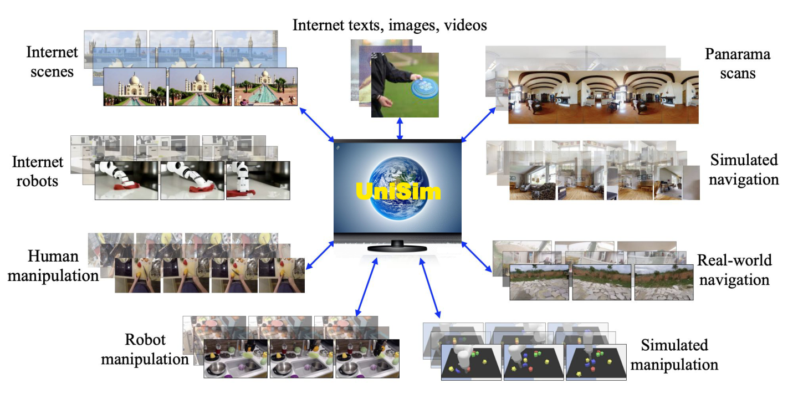
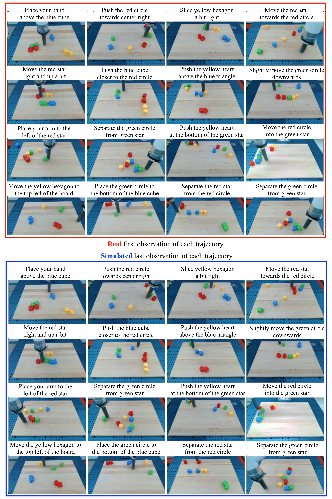
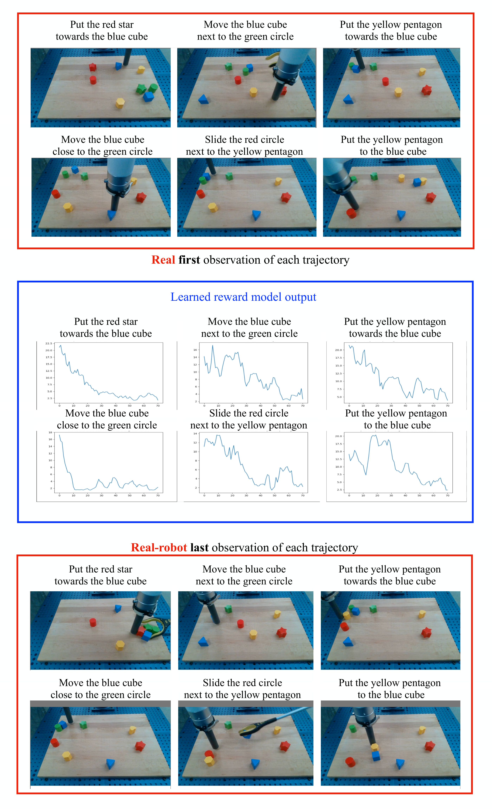

# W8. Learning Interactive Real-World Simulators

## 0. 읽기 전 약어 및 핵심 용어

이 문서를 읽기 전에 아래 약어와 용어를 먼저 정리한다. 이후 본문에서는 괄호 안의 약어를 사용한다.

- Artificial Intelligence (AI): 사람의 지각, 추론, 학습, 의사결정 능력을 기계가 수행하도록 만드는 인공지능 분야를 뜻한다.
- Large Language Model (LLM): 대규모 텍스트 데이터로 학습되어 언어 이해, 생성, 추론, 계획에 쓰이는 foundation model이다.
- Vision-Language Model (VLM): 이미지와 텍스트를 함께 입력받아 시각-언어 이해나 생성 작업을 수행하는 모델이다.
- Vision-Language-Action (VLA): 시각 관측과 언어 명령을 함께 받아 로봇 action까지 생성하는 모델 또는 학습 패러다임이다.
- Out-of-Distribution (OOD): 학습 데이터 분포와 다른 object, scene, task, embodiment, environment 조건을 뜻한다.
- Behavior Cloning (BC): expert demonstration의 observation-action pair를 supervised learning으로 모방하는 imitation learning 방법이다.
- Reinforcement Learning (RL): agent가 reward를 최대화하도록 environment와 상호작용하며 policy를 학습하는 방법이다.
- Mean Squared Error (MSE): 예측값과 정답의 차이를 제곱해 평균한 regression loss이다.
- Fréchet Inception Distance (FID): generated image distribution과 real image distribution의 차이를 feature space에서 측정하는 metric이다.
- Fréchet Video Distance (FVD): generated video와 real video의 distribution 차이를 video feature space에서 측정하는 metric이다.
- Inception Score (IS): generated sample의 다양성과 classifiability를 함께 보는 image generation metric이다.
- Tensor Processing Unit (TPU): machine learning 연산을 가속하기 위해 설계된 Google의 accelerator이다.
- Physical Artificial Intelligence (Physical AI): 디지털 공간의 예측을 넘어 물리 세계에서 지각, 예측, 계획, 행동, 안전 검사를 수행하는 AI 시스템을 뜻한다.

## 1. Metadata

| Field | 내용 |
|---|---|
| ID | `W8` |
| Title | Learning Interactive Real-World Simulators |
| Authors | Sherry Yang, Yilun Du, Seyed Kamyar Seyed Ghasemipour, Jonathan Tompson, Leslie Kaelbling, Dale Schuurmans, Pieter Abbeel |
| Affiliation / Team | UC Berkeley, Google DeepMind, MIT, University of Alberta |
| Venue / Status | ICLR 2024 |
| Date | 2023-10-09 arXiv, 2024 ICLR |
| Link | https://arxiv.org/abs/2310.06114 |
| Project page | https://universal-simulator.github.io |
| Local source | `paper_corpus/sources/W8` |
| Source figures | `paper_corpus/figures_source/W8/manifest.md` |

## 2. 핵심 요약

UniSim은 real-world interaction을 action-in-video-out 형태로 학습하는 universal simulator를 목표로 한다. 입력은 현재 observation history와 action이고, 출력은 action의 시각적 결과를 담은 다음 video observation이다. action은 자연어 instruction, robot control, camera motion, navigation action 등 여러 형식일 수 있으며, 논문은 이를 T5 language embedding과 discretized control value로 통합한다.

핵심은 다양한 dataset이 서로 다른 정보를 가진다는 관찰이다. Internet image-text data는 object와 scene이 풍부하지만 motion이 부족하고, robotics data는 action이 풍부하지만 scale이 작고, human activity video는 high-level action이 있지만 robot control과 다르며, panorama scan은 static하지만 navigation action을 만들 수 있다. UniSim은 이 조각들을 하나의 conditional video diffusion model에 넣어 real-world-like simulator로 통합한다.

## 3. 왜 중요한가?

- World model을 "latent planning module"이 아니라 "robot과 agent가 훈련할 수 있는 photorealistic simulator"로 직접 연결한다.
- 다양한 action modality를 하나의 action embedding space로 통합해 language instruction과 low-level robot control을 모두 다룬다.
- Simulator rollout으로 high-level VLM policy, low-level RL policy, video captioning model을 학습시키고 real-world transfer를 보여준다.
- Genie/Pandora가 interactive world generation의 가능성을 보여준다면, UniSim은 "simulator-generated experience로 real robot policy를 학습할 수 있는가"를 더 직접적으로 검증한다.
- 한계도 명확하다. visual-only simulation, hallucination, limited memory, OOD robot morphology 문제가 그대로 남아 있다.

## 4. Universal Simulator Concept

  

<em>Figure 1. UniSim framework. The simulator learns from broad data with diverse information: objects, scenes, human activities, navigation/manipulation motions, panorama scans, and renderings. Source figure: <code>figs/framework.pdf</code>.</em>

UniSim이 말하는 "universal"은 모든 물리 현상을 완벽히 시뮬레이션한다는 뜻이 아니다. 논문 footnote가 명시하듯, action과 video라는 unified interface를 통해 여러 domain의 interaction을 다룬다는 의미다. sound나 tactile signal은 포함하지 않는다.

| Dataset type | 제공하는 정보 | UniSim에서의 역할 |
|---|---|---|
| Internet text-image | 다양한 object와 scene | single-frame video와 caption action |
| Human activity video | human high-level actions | action-rich manipulation/navigation |
| Real robot data | robot execution and task description | high-level robot action과 일부 low-level control |
| Simulation/rendering | dense action labels | accurate action-state pair |
| Panorama scans | static 3D scene | turn/move 같은 navigation action 합성 |

## 5. Observation Prediction Model

  

<em>Figure 2. Training and inference of UniSim. UniSim predicts the next observation frames given recent observation history and action, then rolls out autoregressively for long-horizon interactions. Source figure: <code>figs/method.pdf</code>.</em>

UniSim은 simulator를 observation prediction model로 정의한다.

$$
p(o_t\mid h_{t-1},a_{t-1})
$$

| Notation | 의미 |
|---|---|
| $o_t$ | 다음 interaction step에서 관측되는 video frames |
| $h_{t-1}$ | 이전 observation history, 실제 구현에서는 주로 최근 frames |
| $a_{t-1}$ | temporally extended action, 예: language instruction, robot control, camera motion |
| $p(o_t\mid h_{t-1},a_{t-1})$ | action과 history가 주어졌을 때 next observation을 생성하는 simulator |

긴 interaction은 이 모델을 반복적으로 sampling해서 만든다.

$$
o_t\sim p(o_t\mid h_{t-1},a_{t-1})
$$

$$
h_t=\mathrm{Update}(h_{t-1},o_t)
$$

| Notation | 의미 |
|---|---|
| $o_t$ | simulator가 생성한 다음 video segment |
| $h_t$ | 새 observation을 반영한 history |
| $\mathrm{Update}$ | 최근 frames를 유지하거나 history stack을 갱신하는 절차 |

중요한 단순화는 전체 과거를 recurrent state로 모두 조건화하지 않고, 최근 몇 frame만 조건으로 쓰는 것이다. Ego4D ablation에서는 1 frame보다 4 recent frames가 더 좋은 FID/FVD/IS/CLIP을 보인다.

## 6. Diffusion Parameterization

UniSim은 video U-Net 기반 diffusion model로 observation prediction을 구현한다. Reverse process는 다음 denoising model을 학습한다.

$$
\epsilon_{\theta}(o_t^{(k)},k\mid h_{t-1},a_{t-1})
$$

| Notation | 의미 |
|---|---|
| $\epsilon_{\theta}$ | noise prediction / denoising model |
| $o_t^{(k)}$ | diffusion step $k$에서의 noisy observation sample |
| $k$ | denoising step index |
| $h_{t-1}$ | history conditioning frames |
| $a_{t-1}$ | action conditioning input |

Action conditioning strength는 classifier-free guidance로 조절한다.

$$
\bar{\epsilon}_{\theta}
=(1+\eta)\epsilon_{\theta}(o_t^{(k)},k\mid h_{t-1},a_{t-1})
-\eta\epsilon_{\theta}(o_t^{(k)},k\mid h_{t-1})
$$

| Notation | 의미 |
|---|---|
| $\bar{\epsilon}_{\theta}$ | guidance가 적용된 noise prediction |
| $\eta$ | action conditioning strength |
| $\epsilon_{\theta}(o_t^{(k)},k\mid h_{t-1},a_{t-1})$ | action-conditioned prediction |
| $\epsilon_{\theta}(o_t^{(k)},k\mid h_{t-1})$ | action을 drop한 unconditional/history-only prediction |

Training objective는 diffusion MSE loss다.

$$
\mathcal{L}_{\mathrm{MSE}}
=
\left\|
\epsilon
-
\epsilon_{\theta}
(
\sqrt{1-\beta^{(k)}}o_t+\sqrt{\beta^{(k)}}\epsilon,
k
\mid h_{t-1},a_{t-1}
)
\right\|^2
$$

| Notation | 의미 |
|---|---|
| $\mathcal{L}_{\mathrm{MSE}}$ | diffusion noise prediction loss |
| $\epsilon$ | Gaussian noise sample, $\epsilon\sim\mathcal{N}(0,I)$ |
| $\beta^{(k)}$ | diffusion noise level at step $k$ |
| $o_t$ | clean target observation frames |
| $\epsilon_{\theta}$ | noisy sample에서 noise를 예측하는 model |

Sampling은 Gaussian noise에서 시작해 denoising step을 반복한다.

$$
o_t^{(k-1)}
=
\alpha^{(k)}
(
o_t^{(k)}
-
\gamma^{(k)}
\epsilon_{\theta}(o_t^{(k)},k\mid h_{t-1},a_{t-1})
)
\xi
$$

$$
\xi\sim\mathcal{N}(0,\sigma_k^2I)
$$

| Notation | 의미 |
|---|---|
| $o_t^{(k-1)}$ | 한 step denoising한 sample |
| $\alpha^{(k)}$ | current denoised sample에 대한 decay coefficient |
| $\gamma^{(k)}$ | denoising step size |
| $\xi$ | sampling noise |
| $\sigma_k$ | time-varying noise scale |

## 7. Architecture and Training Scale

| 항목 | 내용 |
|---|---|
| Base architecture | Video U-Net with interleaved temporal/spatial attention and convolution |
| Base video model resolution | temporal/spatial resolution $[16,24,40]$ |
| Super-resolution models | $[24,40]\rightarrow[48,80]$, $[48,80]\rightarrow[192,320]$ |
| History conditioning | previous 4 frames concatenated channelwise to noise input |
| Model size | 5.6B parameters |
| Training hardware | 512 TPU-v3 chips |
| Training duration | 20 days |
| Sampling timesteps | 256 |

이 규모는 UniSim이 단순 robotics dynamics model이 아니라 large-scale video foundation simulator에 가까운 시도임을 보여준다.

## 8. Action-Rich and Long-Horizon Simulation

  

<em>Figure 3. Action-rich simulation. UniSim supports manipulation actions such as washing hands, picking up a bowl, drying hands, and cutting carrots from the same initial frame. Source figure: <code>figs/kitchen.pdf</code>.</em>

  

<em>Figure 4. Long-horizon simulation. UniSim sequentially simulates 8 interactions and preserves previously manipulated objects across rollouts. Source figure: <code>figs/fractal_drawer.pdf</code>.</em>

UniSim은 같은 initial observation에서 "wash hands", "pick up bowl", "cut carrots" 같은 language action에 따라 다른 future video를 생성한다. 또한 8 sequential interactions를 autoregressive하게 수행하며, drawer 안에 넣은 orange나 counter 위의 can 같은 object를 일정 정도 유지한다.

이 결과는 Physical AI에서 중요하다. Agent가 long-horizon task를 학습하려면 single-step next frame보다, action consequences가 누적된 상태를 유지하는 simulator가 필요하기 때문이다.

## 9. Policy Learning with Simulated Experience

  

<em>Figure 5. Long-horizon VLM policy training. A VLM policy generates language actions, UniSim simulates the result, and the generated video trajectory is converted to robot actions for real-world execution. Source figure: <code>figs/langtable.pdf</code>.</em>

UniSim은 simulator-generated trajectories로 VLM policy를 학습한다. Language Table task에서 simulator rollout을 3-5회 연결해 10k long-horizon trajectories를 만들고, final frame을 goal image로, scripted language instruction을 supervision으로 사용한다.

논문의 reduction in distance to goal metric은 다음과 같다.

$$
\mathrm{RDG}
=
\frac{
\|s_0-s_{\mathrm{goal}}\|_2
-
\|s_T-s_{\mathrm{goal}}\|_2
}{
\|s_0-s_{\mathrm{goal}}\|_2
}
$$

| Notation | 의미 |
|---|---|
| $\mathrm{RDG}$ | reduction in distance to goal |
| $s_0$ | initial block locations |
| $s_T$ | policy execution 후 final block locations |
| $s_{\mathrm{goal}}$ | goal block locations |
| $\|\cdot\|_2$ | Euclidean distance |

결과적으로 Simulator-Hindsight는 VLM-BC보다 long-horizon goal-conditioned task에서 3-4배 높은 RDG를 보인다. Table 2 기준으로 VLM-BC의 RDG는 moved blocks 0.11, all blocks 0.07이고, Simulator-Hindsight는 둘 다 0.34다.

## 10. RL in the Simulator

  

<em>Figure 6. Low-level control simulation. UniSim supports low-level controls such as endpoint movement in Language Table. Source figure: <code>figs/rl_sim.pdf</code>.</em>

  

<em>Figure 7. Real-robot execution. An RL policy trained in UniSim transfers zero-shot to real Language Table execution. Source figure: <code>figs/rl_real.pdf</code>.</em>

Low-level control에서는 PaLI 3B 기반 VLA policy를 behavior cloning으로 학습한 뒤, UniSim 안에서 model-based rollout을 수행하고 REINFORCE로 finetuning한다. Reward는 remaining steps-to-success predictor를 이용해 정의한다.

$$
r(o_t,a_t,o_{t+1},g)
=
-
\left[
d(o_{t+1},g)-d(o_t,g)
\right]\mathcal{C}
$$

| Notation | 의미 |
|---|---|
| $r(o_t,a_t,o_{t+1},g)$ | transition reward |
| $d(o,g)$ | observation $o$에서 goal $g$까지 남은 timestep predictor |
| $\mathcal{C}$ | reward scale constant, 논문에서는 $5e-2$ |
| $g$ | goal instruction or goal state |

Policy gradient는 다음 형태다.

$$
\nabla_{\pi}\mathcal{L}(o_t,a_t,g)
=
\nabla_{\pi}\log\pi(a_t\mid o_t,g)
\sum_{i=t}^{T}
\gamma^{i-t}
r(o_i,a_i,o_{i+1},g)
$$

| Notation | 의미 |
|---|---|
| $\pi(a_t\mid o_t,g)$ | observation과 goal이 주어졌을 때 action을 내는 VLA policy |
| $\gamma$ | discount factor |
| $T$ | episode horizon |
| $\nabla_{\pi}$ | policy parameter에 대한 gradient |

Table 3에서 Simulator-RL은 simulated rollout success rate를 VLA-BC 대비 크게 높인다. 전체 task success는 0.58에서 0.81로, pointing task success는 0.12에서 0.71로 증가한다.

## 11. Broader VLM Training

UniSim은 robot policy뿐 아니라 video captioning model에도 synthetic video data를 제공한다. PaLI-X 55B를 UniSim-generated ActivityNet-style videos로 finetuning했을 때, ActivityNet CIDEr는 no finetune 15.2에서 46.23으로 증가한다. 실제 ActivityNet으로 finetune한 54.90보다는 낮지만, MSR-VTT, VATEX, SMIT 같은 transfer benchmark에서는 generated data finetuning이 실제 ActivityNet finetuning보다 더 좋은 결과를 보인다.

이 결과는 simulator가 "policy training environment"를 넘어 "rare or expensive visual experience generator"로 쓰일 수 있음을 보여준다.

## 12. Limitations

| 한계 | 설명 |
|---|---|
| Hallucination | scene에 맞지 않는 action이 주어지면 불가능함을 감지하지 않고 sink를 만들어내는 식의 hallucination이 생긴다. |
| Limited memory | 최근 몇 frame만 조건화하므로 오래전 drawer에 넣은 apple 같은 정보를 잊을 수 있다. |
| OOD generalization | 훈련에 없는 robot morphology나 domain으로의 일반화가 제한된다. |
| Visual simulation only | force, tactile, sound처럼 시각 변화가 적은 interaction은 다루기 어렵다. |
| Compute cost | 5.6B model, 512 TPU-v3, 20일 학습은 쉽게 재현하기 어렵다. |

UniSim의 강점은 real-world-like visual rollout이지만, 물리적으로 정확한 full simulator는 아니다. 따라서 policy training에 사용할 때 hallucinated success와 real-world transfer gap을 계속 검증해야 한다.

## 13. Pandora / Genie와 비교해서 읽기

| 관점 | UniSim | Pandora | Genie 2 |
|---|---|---|---|
| 입력 action | language, robot control, camera motion | natural language action | keyboard/mouse action |
| 출력 state | video observation segment | video state | playable 3D observation |
| 목적 | simulator-generated experience로 policy/VLM 학습 | general text-action world simulation | generated playable environment |
| 강점 | downstream real-robot policy transfer 실험 | LLM + video model stitching | large-scale interactive 3D demo |
| 한계 | visual-only, memory, hallucination | qualitative 중심 | reproducibility 부족 |

UniSim은 world model을 agent learning pipeline에 가장 직접적으로 연결한다는 점에서, W5-W8 묶음 중 Physical AI 연구실 관점의 핵심 논문으로 볼 수 있다.

## 14. 발표 구성 제안

1. 다양한 dataset이 서로 다른 축의 world information을 가진다는 문제로 시작한다.
2. Figure 1로 UniSim이 broad data를 하나의 simulator로 통합한다는 그림을 보여준다.
3. Figure 2와 observation prediction 수식으로 action-in-video-out interface를 설명한다.
4. Diffusion loss와 classifier-free guidance 수식을 통해 model training을 정리한다.
5. Kitchen/drawer figures로 action-rich, long-horizon simulation을 보여준다.
6. Language Table VLM policy와 RL policy 실험을 통해 simulator가 downstream policy learning에 쓰이는 방식을 설명한다.
7. 마지막에는 hallucination, memory, visual-only limitation을 짚고 Genie/Pandora와 비교한다.

## 15. 토론 질문

- Real robot policy 학습에서 visual realism과 physical correctness 중 어느 쪽이 더 중요한가?
- UniSim이 hallucination 대신 "이 action은 불가능하다"고 말하려면 어떤 uncertainty 또는 feasibility model이 필요할까?
- 최근 4 frames history conditioning은 manipulation에는 충분할 수 있지만 navigation에는 부족할 수 있다. 어떤 memory 구조가 적절할까?
- Synthetic simulator data가 실제 data보다 transfer benchmark에서 더 잘 작동한 이유는 무엇일까?

## 16. 한 줄 정리

UniSim은 다양한 real-world/video/robot/simulation 데이터를 action-in-video-out diffusion simulator로 통합하고, 그 simulated experience로 real-world policy와 VLM을 학습할 수 있음을 보여준 핵심 Physical AI world model 연구다.
