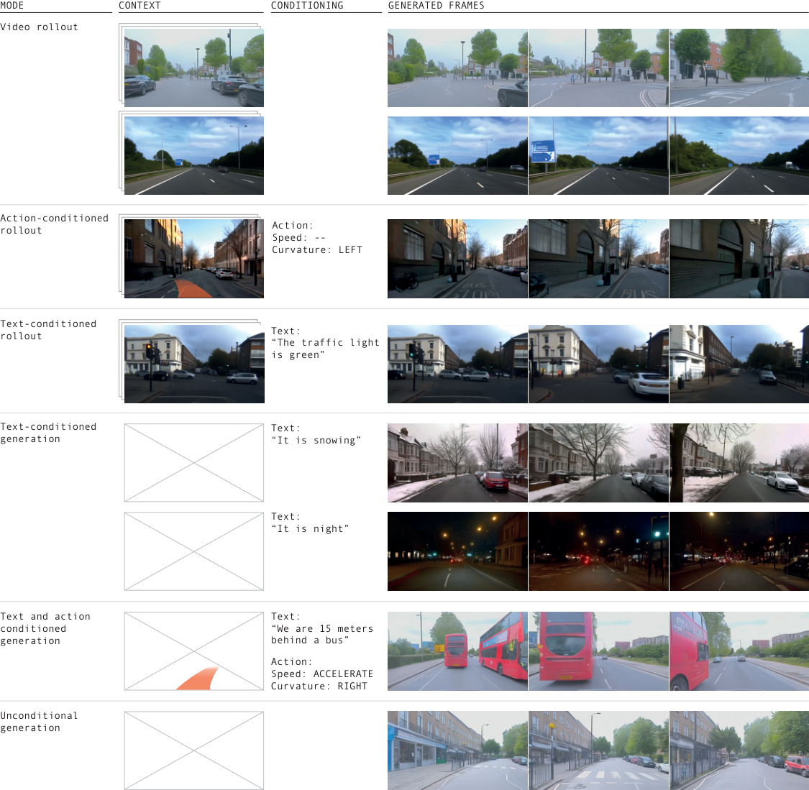
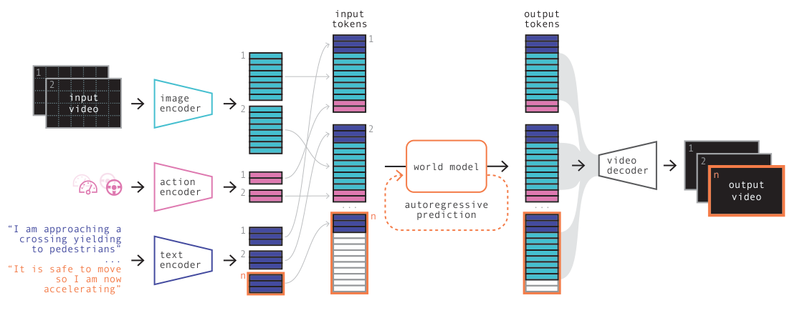
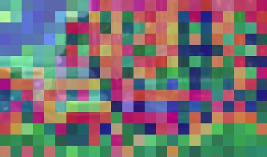
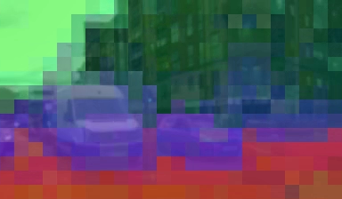
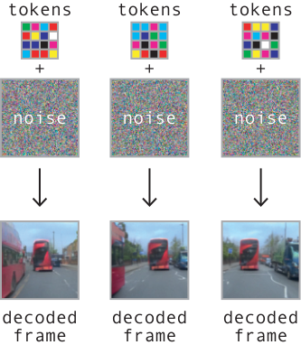
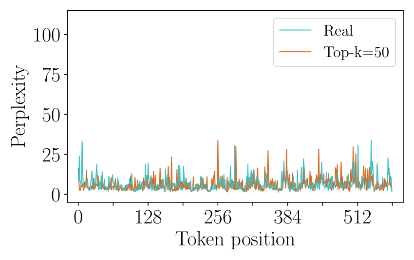
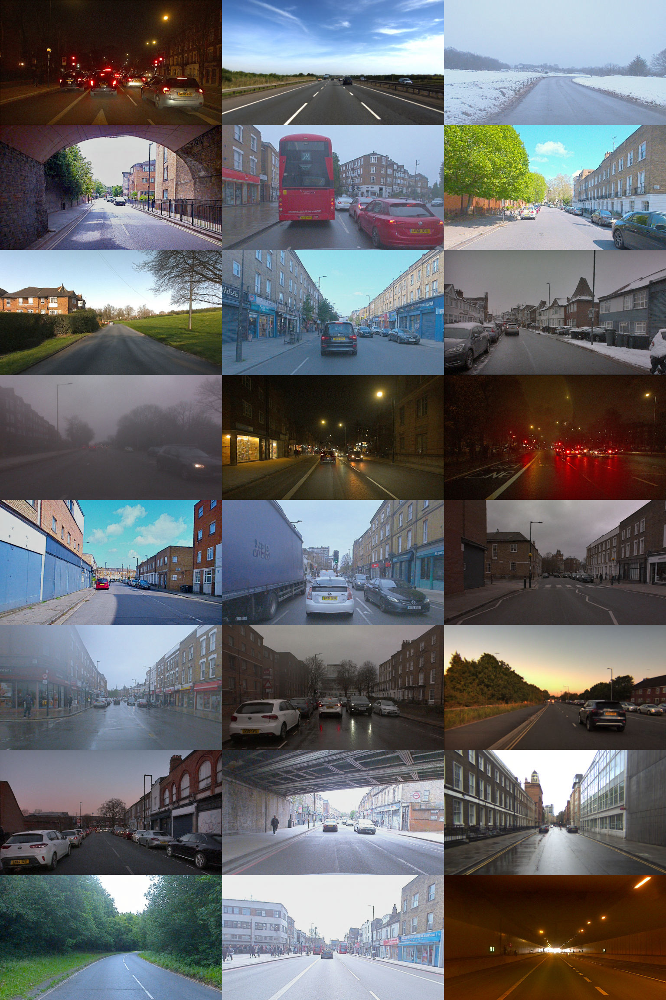

# W9. GAIA-1: A Generative World Model for Autonomous Driving

## 0. 읽기 전 약어 및 핵심 용어

이 문서를 읽기 전에 아래 약어와 용어를 먼저 정리한다. 이후 본문에서는 괄호 안의 약어를 사용한다.

- Large Language Model (LLM): 대규모 텍스트 데이터로 학습되어 언어 이해, 생성, 추론, 계획에 쓰이는 foundation model이다.
- Vision-Language Model (VLM): 이미지와 텍스트를 함께 입력받아 시각-언어 이해나 생성 작업을 수행하는 모델이다.
- Reinforcement Learning (RL): agent가 reward를 최대화하도록 environment와 상호작용하며 policy를 학습하는 방법이다.
- Vector Quantization (VQ): continuous representation을 discrete codebook vector로 양자화하는 방법이다.
- Autoregressive (AR): 이전 token이나 frame을 조건으로 다음 token/frame을 순차적으로 생성하는 modeling 방식이다.
- Generative Adversarial Network (GAN): generator와 discriminator를 경쟁적으로 학습시키는 generative model이다.
- Vector-Quantized Generative Adversarial Network (VQ-GAN): VQ representation과 adversarial training을 결합한 image/video generative model이다.
- A Generative World Model for Autonomous Driving (GAIA-1): video, text, action condition을 이용해 driving scene의 미래를 생성하는 Wayve의 world model이다.

## 1. Metadata

| Field | 내용 |
|---|---|
| ID | `W9` |
| Title | GAIA-1: A Generative World Model for Autonomous Driving |
| Authors | Anthony Hu, Lloyd Russell, Hudson Yeo, Zak Murez, George Fedoseev, Alex Kendall, Jamie Shotton, Gianluca Corrado |
| Affiliation / Team | Wayve |
| Venue / Status | Technical report / arXiv |
| Date | 2023-09-29 |
| Link | https://arxiv.org/abs/2309.17080 |
| Local source | `paper_corpus/sources/W9` |
| Source figures | `paper_corpus/figures_source/W9/manifest.md` |

## 2. 핵심 요약

GAIA-1은 autonomous driving을 위한 generative world model이다. Video, text, action을 모두 discrete/continuous token sequence로 바꾸고, autoregressive transformer가 다음 image token을 예측하며, video diffusion decoder가 예측된 token을 고품질 driving video로 복원한다.

핵심은 driving world modeling을 language modeling처럼 next-token prediction으로 바꾼 것이다. Image tokenizer는 각 frame을 576 discrete tokens로 압축하고, text는 T5-large로 32 tokens, action은 speed와 curvature 2개 scalar token으로 표현한다. World model은 이 token sequence를 causal transformer로 모델링하고, decoder는 temporal consistency와 high-resolution rendering을 담당한다.

## 3. 왜 중요한가?

- Autonomous driving에서 world model의 역할을 "미래를 예측하고 여러 plausible futures를 샘플링하는 generative simulator"로 확장한다.
- Text/action/video conditioning을 한 모델에 넣어, scene feature와 ego-vehicle behavior를 동시에 제어한다.
- Discrete image token + autoregressive transformer + diffusion decoder 조합은 이후 video/world model 연구의 강력한 template가 된다.
- Driving domain 특성상 safety-critical counterfactual, rare event generation, behavior planning과 직접 연결된다.
- 4,700 hours, 420M images 규모의 real-world UK urban driving data로 학습해 real-world scale을 보여준다.

## 4. Multimodal Generation

  

<em>Figure 1. GAIA-1 multimodal video generation. The model supports video rollout, text-conditioned rollout, action-conditioned rollout, text-conditioned generation, text-and-action-conditioned generation, and unconditional generation. Source figure: <code>Figures/Introduction/prediction_tasks.pdf</code>.</em>

GAIA-1은 다양한 mode로 driving video를 생성한다.

| Mode | 입력 | 생성되는 것 |
|---|---|---|
| Video rollout | past video | plausible future driving scene |
| Text-conditioned rollout | video + text | scene feature가 바뀐 future, 예: green traffic light, night, snow |
| Action-conditioned rollout | video + speed/curvature | ego-vehicle behavior가 바뀐 future |
| Text generation | text only | prompt에서 상상한 driving scene |
| Text + action generation | text + future action | scene condition과 ego behavior를 함께 반영 |
| Unconditional generation | no prompt | learned prior에서 driving video 생성 |

Driving world model에서 중요한 것은 하나의 future만 맞히는 것이 아니라, uncertainty와 multi-modality를 반영해 여러 plausible futures를 만들 수 있어야 한다는 점이다.

## 5. Architecture

  

<em>Figure 2. GAIA-1 architecture. Video, text, and action are encoded as tokens; an autoregressive transformer predicts next image tokens; a video diffusion decoder maps tokens back to pixel-space video. Source figure: <code>Figures/Introduction/gaia_schematic.pdf</code>.</em>

GAIA-1은 세 trainable component로 구성된다.

| Component | 역할 |
|---|---|
| Image tokenizer | raw frame을 discrete image tokens로 변환 |
| World model | text, image, action token history를 보고 다음 image token 예측 |
| Video diffusion decoder | predicted image tokens를 temporally consistent video로 복원 |

Token 구성은 다음과 같다.

$$
\mathbf{x}_{1:T}=(\mathbf{x}_1,\ldots,\mathbf{x}_T)
$$

$$
\mathbf{z}_t=(z_{t,1},\ldots,z_{t,n})
$$

| Notation | 의미 |
|---|---|
| $\mathbf{x}_t$ | time $t$의 input image frame |
| $\mathbf{x}_{1:T}$ | $T$개 image frame sequence |
| $\mathbf{z}_t$ | image tokenizer가 만든 frame $t$의 discrete token sequence |
| $n$ | frame당 image token 수, GAIA-1에서는 $576$ |

각 image의 token 수는 spatial downsampling으로 결정된다.

$$
n=\frac{H}{D}\times\frac{W}{D}
$$

| Notation | 의미 |
|---|---|
| $H,W$ | input image height and width |
| $D$ | image tokenizer downsampling factor, GAIA-1에서는 $16$ |
| $n$ | downsampled grid의 token 수 |

Text와 action도 같은 time step의 token으로 끼워 넣는다.

$$
\mathbf{c}_t=(\mathbf{c}_{t,1},\ldots,\mathbf{c}_{t,m})
$$

$$
\mathbf{a}_t=(\mathbf{a}_{t,1},\ldots,\mathbf{a}_{t,l})
$$

| Notation | 의미 |
|---|---|
| $\mathbf{c}_t$ | T5-large가 encoding한 text token sequence |
| $m$ | text token 수, GAIA-1에서는 $32$ |
| $\mathbf{a}_t$ | action token sequence |
| $l$ | action scalar 수, speed와 curvature로 $2$ |

최종 sequence는 time step마다 text-image-action 순서로 interleaving된다.

$$
(\mathbf{c}_1,\mathbf{z}_1,\mathbf{a}_1,\ldots,\mathbf{c}_T,\mathbf{z}_T,\mathbf{a}_T)
$$

| Notation | 의미 |
|---|---|
| $\mathbf{c}_t$ | time $t$의 text representation |
| $\mathbf{z}_t$ | time $t$의 image tokens |
| $\mathbf{a}_t$ | time $t$의 action representation |
| $T$ | world model context의 frame/time length |

## 6. Image Tokenizer

  
  
  

<em>Figure 3. Image tokenization. DINO-distilled tokens contain more semantic structure than base VQ-GAN tokens, grouping road, sky, and vehicles more coherently. Source figures: <code>Figures/Tokenizer/frame1_*.png</code>.</em>

Tokenizer의 목적은 raw pixels를 sequence modeling 가능한 discrete tokens로 줄이는 것이다. 하지만 driving에서 단순 compression만 하면 high-frequency texture에 치우칠 수 있다. GAIA-1은 DINO feature distillation을 추가해 token이 semantic class, 예를 들어 road, sky, vehicle을 더 잘 반영하도록 유도한다.

| Loss | 역할 |
|---|---|
| Image reconstruction loss | $L_1$, $L_2$, perceptual, GAN loss로 pixel reconstruction 품질 확보 |
| Quantization loss | embedding/codebook 사용 학습 |
| DINO inductive bias loss | token feature가 semantic representation을 담도록 유도 |

Tokenizer training setup은 288x512 images, downsampling $D=16$, 576 tokens, vocabulary size 8192, 0.3B parameters다.

## 7. World Model Objective

World model은 causal transformer로, 과거 image tokens, 현재까지의 text tokens, 과거 action tokens를 조건으로 다음 image token을 예측한다.

$$
L_{\mathrm{world}}
=
-
\sum_{t=1}^{T}
\sum_{i=1}^{n}
\log p(
z_{t,i}
\mid
\mathbf{z}_{<t},
z_{t,j<i},
\mathbf{c}_{\leq t},
\mathbf{a}_{<t}
)
$$

| Notation | 의미 |
|---|---|
| $L_{\mathrm{world}}$ | autoregressive next image-token prediction loss |
| $z_{t,i}$ | time $t$, spatial/token position $i$의 target image token |
| $\mathbf{z}_{<t}$ | 이전 frames의 image tokens |
| $z_{t,j<i}$ | 현재 frame에서 이미 생성된 previous image tokens |
| $\mathbf{c}_{\leq t}$ | 현재 time까지의 text condition tokens |
| $\mathbf{a}_{<t}$ | 이전 time까지의 action condition tokens |

Training 중 conditioning token을 random dropout해 unconditional, action-conditioned, text-conditioned generation을 모두 가능하게 한다. Driving videos는 25Hz에서 6.25Hz로 temporal subsampling하여 world model이 더 긴 temporal range를 볼 수 있게 한다.

## 8. Video Decoder

  
  

<em>Figure 4. Video decoder tasks. The diffusion decoder is trained for image generation, video generation, autoregressive video generation, and frame interpolation. Source figures: <code>Figures/Video_Decoder/*.pdf</code>.</em>

Autoregressive world model은 low-frequency token sequence를 만들고, diffusion decoder는 이를 temporally consistent high-quality video로 복원한다. Decoder는 3D U-Net에 factorized spatial/temporal attention을 사용하며, image/video generation을 multi-task로 함께 학습한다.

Video decoder loss는 noise prediction objective다.

$$
L_{\mathrm{video}}
=
\mathbb{E}_{\epsilon,t'}
\left[
\left\|
\epsilon_{\theta}(\mathbf{x}^{t'},t',\mathbf{z},\mathbf{m})
-
\epsilon
\right\|_2^2
\right]
$$

| Notation | 의미 |
|---|---|
| $L_{\mathrm{video}}$ | video diffusion decoder loss |
| $\epsilon_{\theta}$ | denoising video model |
| $\epsilon$ | denoising target, 논문은 v-parameterization 사용 |
| $t'$ | sampled diffusion time |
| $\mathbf{x}^{t'}$ | noised video |
| $\mathbf{z}$ | conditioning image token sequence |
| $\mathbf{m}$ | task-specific image mask sequence |

Decoder inference는 6.25Hz token sequence를 복원한 뒤 12.5Hz, 25Hz로 temporal upsampling한다. Autoregressive decoding에서는 2 overlapping past frames를 context로 사용한다.

## 9. Data and Training Scale

| Component | Scale / setup |
|---|---|
| Driving data | 4,700 hours, 25Hz, London UK, 2019-2023 |
| Unique images | 약 420M |
| Validation | 400 hours from held-out runs and geofenced areas |
| Image tokenizer | 0.3B parameters, 200k steps, 32 A100 80GB, 4 days |
| World model | 6.5B parameters, 100k steps, 64 A100 80GB, 15 days |
| Video decoder | 2.6B parameters, 300k steps, 32 A100 80GB, 15 days |

Data sampling은 latitude, longitude, weather, steering behavior, speed behavior를 기준으로 balancing한다. Autonomous driving에서는 특정 route/weather/action distribution에 치우치면 rare scenario와 generalization이 약해지기 때문에, data balancing이 단순한 전처리가 아니라 world model 품질에 직접 영향을 준다.

## 10. Inference and Guidance

  

<em>Figure 5. Top-k sampling. GAIA-1 uses top-k sampling to avoid argmax repetition and unreliable-tail sampling. Source figure: <code>Figures/Inference/Perplexity/perplexity_topk.pdf</code>.</em>

Argmax sampling은 future가 반복 loop에 빠지는 문제가 있고, full sampling은 unreliable tail에서 이상한 token을 뽑아 out-of-distribution으로 밀릴 수 있다. GAIA-1은 top-k sampling을 사용해 diversity와 realism의 균형을 맞춘다.

Text conditioning은 classifier-free guidance로 강화한다.

$$
\ell_{\mathrm{final}}
=
(1+s)\ell_{\mathrm{conditioned}}
-
s\ell_{\mathrm{unconditioned}}
$$

| Notation | 의미 |
|---|---|
| $\ell_{\mathrm{final}}$ | sampling에 사용할 final logits |
| $\ell_{\mathrm{conditioned}}$ | text-conditioned logits |
| $\ell_{\mathrm{unconditioned}}$ | unconditional logits |
| $s$ | guidance scale factor |

논문 원문은 scale 변수를 $t$로 표기하지만, diffusion time $t'$와 헷갈리지 않도록 이 note에서는 $s$로 쓴다. GAIA-1은 guidance scale을 token과 frame에 따라 schedule한다. 이렇게 해야 prompt adherence와 sample diversity, 그리고 long rollout consistency 사이의 균형을 맞출 수 있다.

## 11. Scaling

  

<em>Figure 6. Scaling prediction. The final validation cross-entropy of GAIA-1 can be predicted from smaller models trained with less compute. Source figure: <code>Figures/Scaling/predict_performance.pdf</code>.</em>

GAIA-1은 LLM처럼 next-token prediction objective를 사용하기 때문에 scaling law 관찰이 가능하다. 논문은 0.65M부터 650M까지 작은 모델을 사용해 final 6.5B world model의 validation cross-entropy를 예측한다.

Compute는 parameter count $N$에 대해 다음 식으로 근사한다.

$$
C=6N
$$

| Notation | 의미 |
|---|---|
| $C$ | single token forward-backward pass의 FLOPs 근사 |
| $N$ | embedding layer를 제외한 parameter count |
| $6N$ | transformer training compute의 표준적인 근사 |

이 결과는 driving world model에서도 scale이 예측 가능한 개선을 만든다는 점을 시사한다. 다만 scale이 곧 safety-valid planning을 보장하는 것은 아니다.

## 12. Emerging Properties

  

<em>Figure 7. Diverse generated driving scenes. GAIA-1 generates varied driving scenes from learned priors and prompts. Source figure: <code>Figures/Examples/montage.png</code>.</em>

  

<em>Figure 8. Action-conditioned generation. Controlling speed and curvature changes ego-vehicle behavior and can elicit reactions from other road users. Source figure: <code>Figures/Emergent_Behaviours/actions.pdf</code>.</em>

논문은 다음 emergent properties를 강조한다.

| Property | 예시 | 의미 |
|---|---|---|
| High-level structure | road layout, traffic lights, road rules | scene 구성과 road semantics 학습 |
| Multiple plausible futures | same context에서 다른 traffic density, route, road-user behavior | uncertainty-aware future generation |
| Contextual awareness | speed bumps에 따른 pitch/roll, road-user response | 3D geometry와 interaction dynamics |
| Fine-grained ego control | steering left/right, accelerating | action-conditioned counterfactual rollout |
| Text-controlled scene | night, snow, bus ahead, traffic light color | language-conditioned scenario generation |

Autonomous driving에서 특히 중요한 것은 ego action이 바뀌면 다른 road users가 reactive하게 변할 수 있다는 점이다. 이는 "내 행동이 세계에 어떤 영향을 주는가"를 모델링하는 closed-loop planning의 핵심이다.

## 13. Limitations

| 한계 | 설명 |
|---|---|
| Domain specificity | London urban driving data 중심이라 다른 국가/도로 문화/센서 구성으로 일반화는 별도 검증 필요 |
| Visual plausibility vs safety correctness | realistic video가 safety-critical prediction correctness를 보장하지 않는다 |
| No explicit state/reward | planning에 바로 쓰려면 occupancy, risk, reward, uncertainty와 연결이 필요하다 |
| Closed-loop validation 부족 | action-conditioned rollout은 강력하지만 실제 driving policy와의 closed-loop 평가가 제한적이다 |
| Proprietary data/model | 재현성과 공개 benchmark 비교가 어렵다 |

GAIA-1은 "driving video generator"보다 한 단계 더 나아가지만, 실제 autonomous driving stack의 safety module이 되려면 uncertainty calibration과 downstream decision evaluation이 필수다.

## 14. UniSim / Pandora와 비교해서 읽기

| 관점 | GAIA-1 | UniSim | Pandora |
|---|---|---|---|
| Domain | autonomous driving | broad real-world interaction | broad video world states |
| Action | speed, curvature | language, robot control, camera motion | natural-language action |
| Core model | discrete token AR transformer + diffusion decoder | action-conditioned video diffusion | LLM + video diffusion stitching |
| Downstream | autonomy training/validation potential | VLM/RL policy learning experiments | qualitative world simulation |
| Strength | driving-specific scale and control | policy learning link | text action generality |

GAIA-1은 domain-specific이지만 control과 scale이 강하고, UniSim은 더 general하지만 visual simulator로 policy transfer를 검증한다. 두 논문을 함께 읽으면 "general world model"과 "domain-specialized world model"의 trade-off가 보인다.

## 15. 발표 구성 제안

1. Autonomous driving에서 왜 multiple future prediction과 controllable simulation이 중요한지 문제 제기한다.
2. Figure 1로 GAIA-1의 multimodal generation modes를 보여준다.
3. Figure 2로 tokenizer, autoregressive world model, diffusion decoder의 분리 구조를 설명한다.
4. World model loss와 decoder loss를 통해 next-token world modeling과 video rendering을 구분한다.
5. Data/training scale과 balancing 전략을 정리한다.
6. Top-k sampling, classifier-free guidance, scaling law를 inference/scaling 관점에서 설명한다.
7. Emerging properties와 한계를 safety-critical autonomous driving 관점에서 토론한다.

## 16. 토론 질문

- Driving world model에서 pixel video fidelity와 planning-relevant state accuracy 중 무엇을 우선해야 할까?
- GAIA-1의 action-conditioned rollout을 실제 planner training에 쓰려면 어떤 uncertainty metric이 필요할까?
- Domain-specific driving world model과 general-purpose UniSim/Genie 계열 모델은 장기적으로 합쳐질까?
- Text prompt로 rare weather나 traffic light condition을 만드는 방식은 validation data generation에 충분히 신뢰할 수 있을까?

## 17. 한 줄 정리

GAIA-1은 autonomous driving을 video/text/action token sequence의 next-token prediction 문제로 바꾸고, diffusion decoder로 realistic rollout을 복원하는 대규모 driving world model이다.
